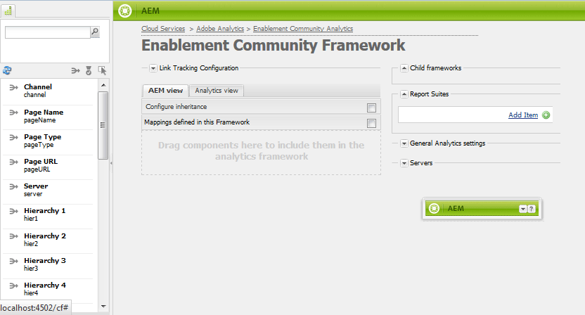
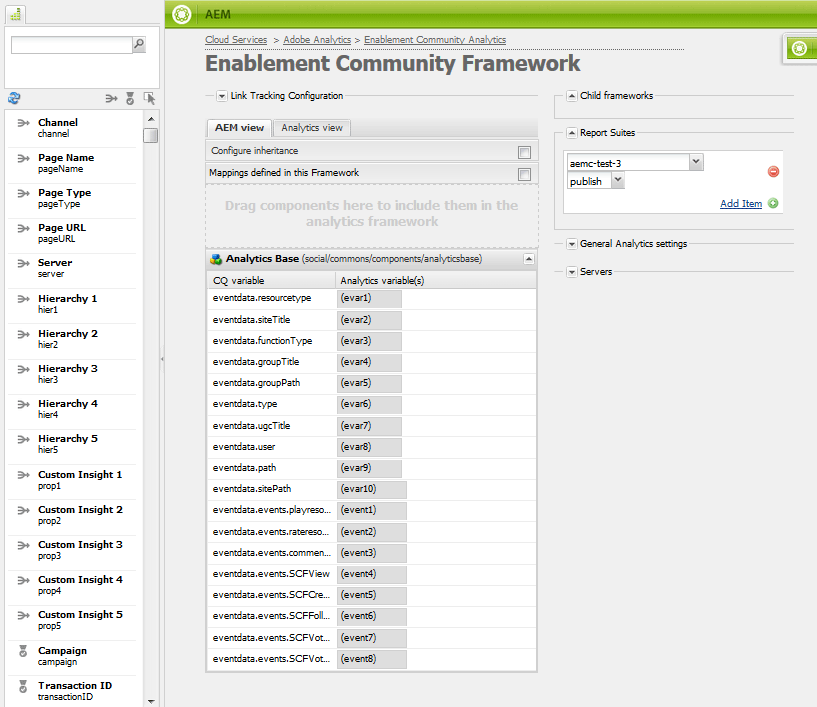
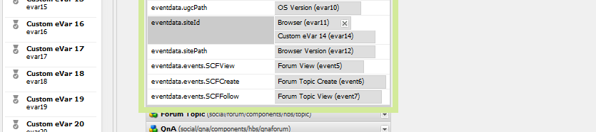

# 社群功能的Analytics設定 {#analytics-configuration-for-communities-features}

## 概觀 {#overview}

Adobe Analytics和Adobe Experience Manager (AEM)都是Adobe Experience Cloud的解決方案。

Adobe Analytics可針對AEM Communities進行設定，以便在成員與支援的Communities功能互動時，事件會傳送至Adobe Analytics，以便產生報表。

例如，管理員可從社群網站檢視有關視訊播放的各種報表。

此外，以下作業還需要分析：

* 在Publish環境中：

   * 社群[趨勢](/help/communities/trends.md)的報告
   * 允許網站訪客依「檢視次數最多」、「最活躍」、「最喜歡」排序
   * 檢視UGC （使用者產生的內容）清單上的計數

* 在作者環境中：

   * 在[成員管理主控台](/help/communities/members.md)中顯示參與率資料（檢視、貼文、追蹤、贊）
   * 啟用資源[報告的趨勢摘要、視訊活動訊號和視訊裝置](/help/communities/reports.md)

支援的Communities功能包括：

* [論壇](/help/communities/forum.md)
* [QnA](/help/communities/working-with-qna.md)
* [部落格](/help/communities/blog-feature.md)
* [檔案庫](/help/communities/file-library.md)
* [日曆](/help/communities/calendar.md)

本檔案本節說明如何連結Analytics報表套裝與Communities功能。 基本步驟為：

1. [復寫加密金鑰](#replicate-the-crypto-key)，以便確保所有AEM執行個體上都能正確進行加密/解密
1. 準備Adobe Analytics [報告套裝](#adobe-analytics-report-suite-for-video-reporting)
1. 建立AEM Analytics [雲端服務](#aem-analytics-cloud-service-configuration)和[架構](#aem-analytics-framework-configuration)

1. 為社群網站[啟用Analytics](#enable-analytics-for-a-community-site)
1. [**驗證**](#verify-analytics-to-aem-variable-mapping) Analytics與AEM變數的對應
1. 識別[主要發行者](#primary-publisher)
1. [Publish](#publish-community-site-and-analytics-cloud-service)社群網站
1. 設定[將報告資料](#obtaining-reports-from-analytics)從Adobe Analytics匯入至社群網站

## 先決條件 {#prerequisites}

若要設定Analytics for Communities功能，您必須與帳戶代表合作，以設定Adobe Analytics帳戶和[報表套裝](#adobe-analytics-report-suite-for-video-reporting)。 建立後，應會提供下列資訊：

* **公司名稱**

  與Adobe Analytics帳戶關聯的公司。

* **使用者名稱**

  有權管理Analytics帳戶之使用者的登入使用者名稱
（應該包含Web服務存取許可權）。

* **密碼**

  授權使用者的登入密碼。

* **Analytics資料中心**

  帳戶的Analytics資料中心URL。

* **報告套裝**

  要使用的Analytics報表套裝名稱。

## 適用於視訊報表的Adobe Analytics報表套裝 {#adobe-analytics-report-suite-for-video-reporting}

使用Adobe Experience Cloud的[報表套裝管理員](https://experienceleague.adobe.com/docs/analytics/admin/admin-tools/manage-report-suites/c-new-report-suite/new-report-suite.html)，可以設定Analytics報表套裝，以便啟用社群網站來提供Communities功能的報告。

使用[公司名稱和使用者名稱](/help/communities/analytics.md#prerequisites)登入[Adobe Experience Cloud](https://experienceleague.adobe.com/docs/analytics/analyze/analysis-workspace/home.html)後，即可設定新的或現有的報表套裝：

* [11個轉換變數](https://experienceleague.adobe.com/docs/analytics/admin/admin-tools/manage-report-suites/edit-report-suite/conversion-variables/conversion-var-admin.html) (eVar)

   * **`evar1`**&#x200B;到&#x200B;**`evar11`**&#x200B;已啟用

   * 可以重新利用（重新命名）現有的eVar，或建立要用於Communities功能的專案

* [7個成功事件](https://experienceleague.adobe.com/docs/analytics/admin/admin-tools/manage-report-suites/edit-report-suite/conversion-variables/success-events/success-event.html) （個事件）

   * **`event1`**&#x200B;到&#x200B;**`event7`**&#x200B;已啟用

   * 型別&#x200B;**`Counter`**

      * 不是&#x200B;**`Counter (no subrelations)`**

   * 可以重新利用（重新命名）現有事件，或建立用於Communities功能的事件

* [視訊管理](https://experienceleague.adobe.com/docs/media-analytics/using/media-overview.html)

   * 視訊報表主控台

      * 啟用`Video Core`
      * 選取儲存

   * 視訊核心測量主控台

      * 選取`Use Solution Variables`
      * 選取儲存

如果使用&#x200B;**新報表套裝**，則新報表套裝可能只有4個evar和6個事件變數，而Communities則需要11個evar和7個事件變數。

如果使用&#x200B;**現有的報表套裝**，在啟用社群網站的Analytics架構之前，可能需要[修改變數對應](#modifying-analytics-variable-mapping)。

如有關於社群專用變數的疑慮，請聯絡您的客戶代表。

>[!CAUTION]
>
>**如果使用已在**&#x200B;內使用變數的現有報表套裝
>
>* **`evar1`**&#x200B;透過&#x200B;**`evar11`**
>
>* **`event1`**&#x200B;透過&#x200B;**`event7`**
>
>**在發佈社群網站之前，**&#x200B;請務必移動在社群網站啟用Analytics時自動對應至Analytics變數的AEM變數，以還原預先存在的對應。
>
>若要還原先前存在的對應，並將AEM變數移至其他Analytics變數，請參閱[修改Analytics變數對應](#modifying-analytics-variable-mapping)一節。
>
>若未這麼做，可能會導致無法復原的資料遺失。

### 影片心率分析 {#video-heartbeat-analytics}

在授權Video Heartbeat Analytics時，會指派`Marketing Cloud Org Id`。

若要在[為視訊報表設定Analytics報表套裝](#adobe-analytics-report-suite-for-video-reporting)後啟用視訊心率報表：

* 建立[Analytics Cloud服務](#aem-analytics-cloud-service-configuration)
* 為社群網站](#enable-analytics-for-a-community-site)啟用[分析
* 將`Marketing Cloud Org Id`與社群網站建立關聯

[修改](/help/communities/sites-console.md#modifying-site-properties)社群網站屬性，可在[社群網站建立](/help/communities/sites-console.md)或更新版本時輸入`Marketing Cloud Org Id`。


啟用視訊心率Analytics時，視訊播放器的JavaScript (JS)程式碼會例項化視訊心率程式庫程式碼（同樣在JS中）。 程式碼會處理每10秒將視訊狀態更新傳送至Analytics視訊追蹤伺服器的所有邏輯（無法設定）。 最後，影片會將視訊工作階段的累積報表傳送至主要Analytics伺服器。

若未啟用，視訊心率程式碼永遠不會例項化，而且只有視訊進度和恢復位置追蹤會儲存至SRP以供報告。

## AEM Analytics Cloud服務設定 {#aem-analytics-cloud-service-configuration}

若要建立Analytics整合，即使用作者例項上的標準UI，將Adobe Analytics與AEM社群網站整合：

* 從全域導覽： **[!UICONTROL 工具]** > **[!UICONTROL 部署]** > **[!UICONTROL Cloud Service]**
* 向下捲動至&#x200B;**[!UICONTROL Adobe Analytics]**
* 選取&#x200B;**[!UICONTROL 立即設定]**&#x200B;或&#x200B;**[!UICONTROL 顯示設定]**


### 建立設定對話方塊 {#create-configuration-dialog}

* 選取&#x200B;**[!UICONTROL 可用組態]**&#x200B;旁的`[+]`圖示，以便您建立組態。

在「建立組態」對話方塊中，要輸入的值可識別組態。


* **標題**

  （必要）設定的顯示標題。
例如，輸入*社群分析*

* **名稱**

  （選擇性）如果未指定，則名稱會預設為從標題衍生的有效節點名稱。
例如，輸入*communities*

* **範本**

  選取`Adobe Analytics Configuration`

* 選取&#x200B;**建立**

   * 啟動設定頁面並開啟`Analytics Settings`對話方塊

### Analytics設定對話方塊 {#analytics-settings-dialog}

首次建立新的Analytics設定後，系統會顯示設定並顯示Analytics設定專案的新對話方塊。 此對話方塊需要從帳戶代表取得的[必要帳戶資訊](#prerequisites)。


* **公司**

  與Adobe Analytics帳戶關聯的公司。

* **使用者名稱**

  有權管理Analytics帳戶之使用者的登入使用者名稱。

* **密碼**

  授權使用者的登入密碼。

* **資料中心**

  選取託管報表套裝的Analytics資料中心。

* **不要新增追蹤標籤至頁面**

  保留為預設值（取消選取）。

* **使用AppMeasurement**

  保留為預設值（取消選取）。

* **不要每晚匯入頁面印象（作者）**

  保留為預設值（取消選取）。

* **不要每晚匯入頁面印象（發佈）**

  保留為預設值（取消選取）。

若要儲存設定：

* 選取&#x200B;**連線至Analytics**

   * 如果未成功，

      * 確認專案不包含前置空格。
      * 嘗試不同的資料中心。

* 選取&#x200B;**確定**。

  

### 建立框架 {#create-framework}

成功設定Adobe Analytics的基本連線後，需要建立或編輯社群網站的架構。 此架構的目的是將Communities功能(AEM)變數對應至Analytics （報表套裝）變數。

* 選取&#x200B;**[!UICONTROL 可用架構]**&#x200B;旁的`[+]`圖示，以便您建立架構。

  

* **標題**

  （必要）框架的顯示標題
例如，輸入*社群架構*。

* **名稱**

  （選擇性）如果未指定，則名稱會預設為從標題衍生的有效節點名稱。
例如，輸入*communities*。

* *範本*

  選取`Adobe Analytics Framework`。

* 選取「**建立**」。

建立Analytics框架會開啟框架以進行設定。

## AEM Analytics框架設定 {#aem-analytics-framework-configuration}

此架構的目的是將AEM變數對應至Analytics變數（eVar和事件）。 可用於對應的Analytics變數是[在報表套裝](#adobe-analytics-report-suite-for-video-reporting)中定義。



### 選取報表套裝 {#select-report-suite}

選取已針對視訊報表設定的報表套裝。

如果報表套裝尚未建立或設定不正確，請參閱上一節：
[用於視訊報表的Adobe Analytics報表套裝](#adobe-analytics-report-suite-for-video-reporting)

Sidekick不是必要專案，且可以最小化，這樣就不會阻礙報表套裝設定的存取。

#### 選取「新增專案」之前和之後的報表套裝對話方塊 {#report-suites-dialog-before-and-after-selecting-add-item}


1. 選取&#x200B;**新增專案+**。

   兩個下拉式方塊隨即顯示。

1. 選擇`Report suite.`

   與公司帳戶相關聯的報表套裝可供選取。

1. 在開啟的對話方塊中選取&#x200B;**是**：

   ```
   Load default server settings?
    Do you want to load the default server settings and overwrite current values in the Server section?
   ```

1. 選擇`Run Mode`。

1. 選取「**發佈**」。


Analytics雲端服務與架構現已完成。 在啟用此Analytics服務的情況下建立社群網站後，就會定義對應。

## 為社群網站啟用Analytics {#enable-analytics-for-a-community-site}

### 為新社群網站啟用 {#enable-for-new-community-site}

若要在[建立社群網站](/help/communities/sites-console.md)時新增Analytics Cloud服務：

* 在步驟3的[ANALYTICS標籤](/help/communities/sites-console.md#analytics)下：
   * 選取&#x200B;**啟用Analytics**&#x200B;核取方塊。
   * 從下拉式方塊中選取架構。

* 或者返回Analytics框架設定以調整變數對應。

### 為現有的社群網站啟用 {#enable-for-existing-community-site}

若要將Analytics Cloud服務新增至[現有的社群網站](/help/communities/sites-console.md#modifying-site-properties)：

* 導覽至&#x200B;**社群>網站**&#x200B;主控台。
* 選取社群網站的「編輯網站」圖示。
* 選取「設定」。
* 在Analytics區段中：
   * 選取&#x200B;**啟用Analytics**&#x200B;核取方塊。
   * 從下拉式方塊中選擇架構。

* 或者返回Analytics框架設定以調整變數對應。

### 為自訂網站啟用 {#enable-for-customized-sites}

若要讓Analytics追蹤和匯入功能在社群網站中正常運作，必須存在具有`scf-js-site-title`類別和href屬性的頁面元素。 頁面上只能有一個這樣的元素，例如它會在社群網站未修改的`sitepage.hbs`指令碼中。 `siteUrl`的值已擷取並傳送至Adobe Analytics做為&#x200B;*網站路徑*。

```xml
# present in default sitepage.hbs
# only one scf-js-site-title class should be included
# this example sets it to be hidden as it serves no visual purpose
<div
    class="navbar-brand scf-js-site-title"
    href="{{siteUrl}}.html"
    style="visibility: hidden;"
>
</div>
```

對於覆蓋`sitepage.hbs`指令碼的&#x200B;**自訂社群網站**，請確定元素存在。 `siteUrl`變數是在伺服器上轉譯時設定，然後才提供給使用者端。

對於包含Communities元件但不是使用[網站建立精靈](/help/communities/sites-console.md)建立的&#x200B;**一般AEM網站**，必須新增元素。 href的值應為網站的路徑。 例如，如果網站路徑為`/content/my/company/en`，則使用：

```xml
<div
    class="navbar-brand scf-js-site-title"
    href="/content/my/company/en.html"
    style="visibility: hidden;"
>
</div>
```

## Analytics for Communities功能 {#analytics-for-communities-features}

Analytics會自動用於數個Communities功能。

作者環境的[OSGi設定](/help/sites-deploying/configuring-osgi.md) `AEM Communities Analytics Component Configuration`提供已針對Analytics檢測的元件清單。 變數的自動對應是由列出的元件所決定。

如果建立了針對Analytics檢測的新自訂元件，應將其新增到此已設定元件清單中。

### 元件組態 {#component-configuration}


>[!NOTE]
>
>日誌元件可用來實作部落格功能。

### 將Analytics對應至AEM變數 {#mapped-analytics-to-aem-variables}

社群網站儲存後，在啟用Analytics並選取雲端設定架構的情況下，AEM變數會自動對應至Analytics eVar和事件。 它分別從evar1和event1開始，並增加1。

如果使用對evar1到evar11以及event1到event7的任何變數的現有報表套裝，則必須[重新對應AEM變數](#modifying-analytics-variable-mapping)並還原原始對應。

以下是預設對應的範例：



#### 隨每個事件傳送的eVar地圖 {#map-of-evars-sent-with-each-event}

<table>
 <tbody>
  <tr>
   <td><strong> </strong></td>
   <td><strong>啟用<br />資源<br />型別</strong></td>
   <td><strong>網站<br />標題</strong></td>
   <td><strong>函式<br />型別</strong></td>
   <td><strong>群組<br />標題</strong></td>
   <td><strong>群組<br />路徑</strong></td>
   <td><strong>UGC<br />型別</strong></td>
   <td><strong>UGC<br />標題</strong></td>
   <td><strong>使用者<br /> （成員）</strong></td>
   <td><strong>UGC<br />路徑</strong></td>
   <td><strong>網站<br />路徑</strong></td>
  </tr>
  <tr>
   <td><strong> </strong></td>
   <td><strong>EVAR1</strong></td>
   <td><strong>EVAR2</strong></td>
   <td><strong>EVAR3</strong></td>
   <td><strong>EVAR4</strong></td>
   <td><strong>EVAR5</strong></td>
   <td><strong>EVAR6</strong></td>
   <td><strong>EVAR7</strong></td>
   <td><strong>EVAR8</strong></td>
   <td><strong>EVAR9</strong></td>
   <td><strong>eVar10</strong></td>
  </tr>
  <tr>
   <td><strong>event1<br />資源播放</strong></td>
   <td><em>(a)</em></td>
   <td><em>-</em></td>
   <td><em>-</em></td>
   <td><em>-</em></td>
   <td><em>-</em></td>
   <td><em>-</em></td>
   <td><em>-</em></td>
   <td><em>-</em></td>
   <td><em>(i)</em></td>
   <td><em>-</em></td>
  </tr>
  <tr>
   <td><strong>事件2<br /> SCFView</strong></td>
   <td><em>(a)</em></td>
   <td><em>(b)</em></td>
   <td><em>(c)</em></td>
   <td><em>(d)</em></td>
   <td><em>(e)</em></td>
   <td><em>(f)</em></td>
   <td><em>(g)</em></td>
   <td><em>(h)</em></td>
   <td><em>(i)</em></td>
   <td><em>(j)</em></td>
  </tr>
  <tr>
   <td><strong>事件3<br /> SCFCreate (Post)</strong></td>
   <td><em>-</em></td>
   <td><em>(b)</em></td>
   <td><em>(c)</em></td>
   <td><em>(d)</em></td>
   <td><em>(e)</em></td>
   <td><em>(f)</em></td>
   <td><em>(g)</em></td>
   <td><em>(h)</em></td>
   <td><em>(i)</em></td>
   <td><em>(j)</em></td>
  </tr>
  <tr>
   <td><strong>事件4<br /> SCFFollow</strong></td>
   <td><em>-</em></td>
   <td><em>(b)</em></td>
   <td><em>(c)</em></td>
   <td><em>(d)</em></td>
   <td><em>(e)</em></td>
   <td><em>(f)</em></td>
   <td><em>(g)</em></td>
   <td><em>(h)</em></td>
   <td><em>(i)</em></td>
   <td><em>(j)</em></td>
  </tr>
  <tr>
   <td><strong>event5<br /> SCFVoteUp</strong></td>
   <td><em>-</em></td>
   <td><em>(b)</em></td>
   <td><em>(c)</em></td>
   <td><em>(d)</em></td>
   <td><em>(e)</em></td>
   <td><em>(f)</em></td>
   <td><em>(g)</em></td>
   <td><em>(h)</em></td>
   <td><em>(i)</em></td>
   <td><em>(j)</em></td>
  </tr>
  <tr>
   <td><strong>event6<br /> SCFVoteDown</strong></td>
   <td><em>-</em></td>
   <td><em>(b)</em></td>
   <td><em>(c)</em></td>
   <td><em>(d)</em></td>
   <td><em>(e)</em></td>
   <td><em>(f)</em></td>
   <td><em>(g)</em></td>
   <td><em>(h)</em></td>
   <td><em>(i)</em></td>
   <td><em>(j)</em></td>
  </tr>
  <tr>
   <td><strong>事件7<br /> SCFRate</strong></td>
   <td><em>-</em></td>
   <td><em>(b)</em></td>
   <td><em>(c)</em></td>
   <td><em>(d)</em></td>
   <td><em>(e)</em></td>
   <td><em>(f)</em></td>
   <td><em>(g)</em></td>
   <td><em>(h)</em></td>
   <td><em>(i)</em></td>
   <td><em>(j)</em></td>
  </tr>
 </tbody>
</table>

eVar值的&#x200B;**範例：**

* *[MIME型別](https://www.iana.org/assignments/media-types/media-types.xhtml)*： video/mp4
* *[社群網站標題](/help/communities/sites-console.md#step13asitetemplate)*：Geometrixx社群
* *[社群功能名稱](/help/communities/functions.md)*：論壇
* *[社群群組名稱](/help/communities/creating-groups.md#creating-a-new-group)*：健行
* *社群群組內容的路徑*： `/content/sites/<site name>/en/groups/hiking`
* *[UGC元件resourceType](/help/communities/essentials.md)*： `social/forum/components/hbs/topic`
* *UGC元件標題*：健行主題
* *登入(authorizableId)*： `aaron.mcdonald@mailinator.com`
* *UGC的SRP路徑*： `/content/usergenerated/asi/.../forum/jmtz-topic3`
或*要追蹤的元件路徑*： `/content/sites/<site name>/en/jcr:content/content/primary/forum`

* *社群網站內容的路徑*： `/content/sites/<site name>/en`

### 修改Analytics變數對映 {#modifying-analytics-variable-mapping}

為社群網站啟用Analytics後，可從框架設定中看見Analytics eVar和事件到AEM變數的對應。

啟用Analytics之後以及發佈社群網站之前，可能會在框架中變更對應。 只要從左側邊欄拖曳所需的Analytics Evar或事件，並將它拖曳至對應表格中的相關列。

若要避免重複的對應，請務必從列移除取代的Analytics變數或事件，方法是暫留在該列上，並選取顯示在Analytics變數元素右側的「X」。

如果Communities eVar和事件覆寫報表套裝中預先存在的對應，則為避免資料遺失，請將Communities功能的AEM變數指派給其他Analytics eVar或事件，並還原原始對應。

>[!CAUTION]
>
>在社群網站為[已發佈](#publishing-the-community-site)且已啟用Analytics之前，請務必重新對應，否則會有資料遺失的風險。

#### 範例步驟1：將Analytics evar14拖曳至對應表格 {#example-step-dragging-analytics-evar-into-mapping-table}


#### 範例步驟2：選取「x」以移除取代的evar11 {#example-step-selecting-x-to-remove-replaced-evar}



#### 範例步驟3：將AEM var eventdata.siteId重新對應至Analytics evar14 {#example-step-aem-var-eventdata-siteid-remapped-to-analytics-evar}


## 發佈社群網站 {#publishing-the-community-site}

### 驗證Analytics與AEM變數的對應 {#verify-analytics-to-aem-variable-mapping}

明智的做法是在發佈社群網站(也會發佈Analytics Cloud服務和架構)之前驗證變數對應。

請參閱以下小節：

* [將Analytics對應至AEM變數](#mapped-analytics-to-aem-variables)
* [修改Analytics變數對映](#modifying-analytics-variable-mapping)

>[!CAUTION]
>
>**如果使用已在**&#x200B;內使用變數的現有報表套裝
>
>* **`evar1`**&#x200B;透過&#x200B;**`evar11`**
>
>* **`event1`**&#x200B;透過&#x200B;**`event7`**
>
>**在發佈社群網站之前，**&#x200B;請先還原現有的對應。 將自動對應的Communities AEM變數（社群網站啟用Analytics時）移至其他Analytics變數。 所有Communities元件之間均應一致進行此重新對應。
>
>若未這麼做，可能會導致無法復原的資料遺失。

### 主要發行者 {#primary-publisher}

當選擇的部署是[發佈伺服器陣列](/help/communities/topologies.md#tarmk-publish-farm)時，必須將一個AEM發佈執行個體識別為輪詢Adobe Analytics以寫入至[SRP](/help/communities/working-with-srp.md)的報告資料的主要發佈者。

根據預設，`AEM Communities Publisher Configuration` OSGi設定會將其發佈執行個體識別為主要發佈者，這樣發佈伺服器陣列中的所有發佈執行個體都會自行識別為主要發佈者。

因此，必須編輯所有次要發佈執行個體的組態，以取消選取&#x200B;**主要發佈者**&#x200B;核取方塊。

如需特定指示，請參閱[部署社群](/help/communities/deploy-communities.md#primary-publisher)的主要發行者區段。

>[!CAUTION]
>
>請務必設定主要發佈程式，以防止從多個發佈執行個體進行輪詢。

### 復寫加密金鑰 {#replicate-the-crypto-key}

Adobe Analytics憑證已加密。 為了便於作者和發佈者之間複製或傳輸加密的分析憑證，所有AEM執行個體都必須共用相同的主要加密金鑰。

若要這樣做，請依照[復寫加密金鑰](/help/communities/deploy-communities.md#replicate-the-crypto-key)中的指示進行。

### Publish社群網站與Analytics Cloud服務 {#publish-community-site-and-analytics-cloud-service}

為社群網站啟用Analytics Cloud服務，並在必要時調整Analytics至AEM變數的[對應後](#mapped-analytics-to-aem-variables)，透過[（重新發佈社群網站](/help/communities/sites-console.md#publishing-the-site)）將設定復寫至發佈環境。

## 從Analytics取得報表 {#obtaining-reports-from-analytics}

### 報告管理 {#report-management}

作者和主要發行者的[OSGi設定](/help/sites-deploying/configuring-osgi.md) `AEM Communities Analytics Report Management`是用來查詢Analytics。

對於作者，查詢用於即時報表。

在主要發佈者上，會使用查詢來提供資訊，以準備Report Importer的分析資料匯入。

查詢間隔預設為10秒。

### 報告匯入工具 {#report-importer}

啟用Analytics的社群網站發佈後，主要發行者的[OSGi設定](/help/sites-deploying/configuring-osgi.md) `AEM Communities Analytics Report Importer`可能會設定為在CRXDE中未個別設定的這些設定設定設定預設輪詢間隔。

輪詢間隔會控制向Adobe Analytics請求提取資料並儲存至[SRP](/help/communities/working-with-srp.md)的頻率。

當資料可能被分類為「巨量資料」時，更頻繁的輪詢可能會對社群網站造成大量負載。

預設輪詢&#x200B;**匯入間隔**&#x200B;設定為12小時。


### 元件報表自訂 {#component-report-customization}

目前，為了自訂要追蹤的量度，在存放庫中建立節點，定義要產生該量度報表的時間期間。

論壇主題是目前此自訂的唯一範例：

* 在主要發行者上，以管理許可權登入。
* 瀏覽至[CRXDE Lite](/help/sites-developing/developing-with-crxde-lite.md)。 例如，[https://localhost:4503/crx/de](https://localhost:4503/crx/de)。

* 在語言根目錄的`jcr:content`節點下（例如`/content/sites/engage/en/jcr:content`），導覽至為Analytics報表設定的元件。
例如 **`analytics/reportConfigs/social_forum_components_hbs_topic`**

* 請注意已建立的時間週期：

   * `last30Days`
   * `last90Days`
   * `thisYear`

* 注意`total`節點。

   * 修改&#x200B;**`interval`**&#x200B;屬性會覆寫Report Importer間隔。
   * 該值以秒為單位，並設為四小時(14400秒)。


## 在Analytics中管理使用者資料 {#manage-user-data-in-analytics}

Adobe Analytics提供的API可讓您存取、匯出和刪除使用者資料。 如需詳細資訊，請參閱[提交存取及刪除要求](https://experienceleague.adobe.com/docs/analytics/admin/admin-tools/data-governance/an-gdpr-workflow.html)。

## 資源 {#resources}

* Adobe Experience Cloud： [Analytics說明和參考](https://experienceleague.adobe.com/docs/analytics.html)
* AEM： [與Adobe Analytics整合](/help/sites-administering/adobeanalytics.md)
* AEM： [Analytics與外部提供者](/help/sites-administering/external-providers.md)
