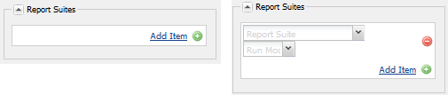

# 社區功能的分析配置 {#analytics-configuration-for-communities-features}

## 概觀 {#overview}

Adobe Analytics和Adobe Experience ManagerAEM()都是Adobe Marketing Cloud的解決辦法。

Adobe Analytics可以為AEM Communities配置，這樣，當成員與支援的社區功能交互時，事件將發送到Adobe Analytics，從那裡生成報告。

例如，從社區站點，管理員可以查看有關視頻播放的各種報告。

此外，分析對於：

* 在發佈環境中：

   * 社區報告 [趨勢](/help/communities/trends.md)
   * 允許網站訪問者按「最常見」、「最活躍」和「最喜歡」排序
   * 查看UGC清單上的計數

* 在作者的環境中：

   * 顯示中的參與資料 [成員管理控制台](/help/communities/members.md) (視圖、帖子、跟蹤、贊
   * 用於啟用資源的趨勢摘要、視頻心跳和視頻設備 [報告](/help/communities/reports.md)

支援的社區功能包括：

* [論壇](/help/communities/forum.md)
* [QnA](/help/communities/working-with-qna.md)
* [部落格](/help/communities/blog-feature.md)
* [檔案庫](/help/communities/file-library.md)
* [日曆](/help/communities/calendar.md)

文檔的本節介紹如何將分析報告套件與社區功能連接。 基本步驟是：

1. [複製加密密鑰](#replicate-the-crypto-key) 確保在所有實例上正確執行加密/解AEM密
1. 準備Adobe Analytics [報告套件](#adobe-analytics-report-suite-for-video-reporting)
1. 建立分AEM析 [雲服務](#aem-analytics-cloud-service-configuration) 和 [框架](#aem-analytics-framework-configuration)

1. [啟用分析](#enable-analytics-for-a-community-site) 社區網站
1. [**驗證**](#verify-analytics-to-aem-variable-mapping) 分析到變AEM量映射
1. 識別 [主發佈者](#primary-publisher)
1. [發佈](#publish-community-site-and-analytics-cloud-service) 社區網站
1. 配置 [導入報表資料](#obtaining-reports-from-analytics) 從Adobe Analytics到社區

## 必備條件 {#prerequisites}

要配置社區分析功能，必須與您的客戶代表合作以設定Adobe Analytics帳戶， [報告套件](#adobe-analytics-report-suite-for-video-reporting)。 建立後，應提供以下資訊：

* **公司名稱**

   與Adobe Analytics帳戶關聯的公司。

* **使用者名稱**

   有權管理分析帳戶的用戶的登錄用戶名（應包括Web服務訪問權限）。

* **密碼**

   授權用戶的登錄密碼。

* **分析資料中心**

   帳戶的分析資料中心的URL。

* **報表套裝**

   要使用的分析報告套件的名稱。

## Adobe Analytics視頻報告套件 {#adobe-analytics-report-suite-for-video-reporting}

使用Adobe Marketing Cloud [報表套件管理器](https://experienceleague.adobe.com/docs/analytics/admin/manage-report-suites/new-report-suite/new-report-suite.html)，可以配置分析報告套件，以便允許社區站點為社區功能提供報告。

登錄到 [Adobe Experience Cloud](https://experienceleague.adobe.com/docs/analytics/analyze/analysis-workspace/home.html) 與 [公司名稱和用戶名](/help/communities/analytics.md#prerequisites)，可以將新的或現有的報告套件配置為：

* [11轉換變數](https://experienceleague.adobe.com/docs/analytics/admin/admin-tools/conversion-variables/conversion-var-admin.html) (eVars)

   * **`evar1`** 通 **`evar11`** 啟用

   * 可以重新調整（更名）現有的eVar或建立新的eVar以用於社區功能

* [7個成功事件](https://experienceleague.adobe.com/docs/analytics/admin/admin-tools/success-events/success-event.html) （事件）

   * **`event1`** 通 **`event7`** 啟用

   * 類型 **`Counter`**

      * 非 **`Counter (no subrelations)`**
   * 可以重新調整（更名）現有事件的用途或建立新事件以用於社區功能


* [視頻管理](https://experienceleague.adobe.com/docs/media-analytics/using/media-overview.html)

   * 視頻報告控制台

      * 啟用 `Video Core`
      * 選擇保存
   * 視頻核心測量控制台

      * 選取 `Use Solution Variables`
      * 選擇保存


如果使用 **新報告套件**，請注意，新的報告套件可能只有4個evars和6個事件變數，而社區需要11個evars和7個事件變數。

如果使用 **現有報表套件**&#x200B;可能需要 [修改變數映射](#modifying-analytics-variable-mapping) 在激活社區站點的分析框架之前。

有關社區專用變數的任何問題，請與客戶代表聯繫。

>[!CAUTION]
>
>**如果使用的現有報告套件已在**
>
>* **`evar1`** 通 **`evar11`**
>
>* **`event1`** 通 **`event7`**
>
>**在社區網站發佈之前，** 在為社區站點啟用Analytics時，通過移動自AEM動映射到Analytics變數的變數來恢復預先存在的映射非常重要。
>
>要恢復先前存在的映射並將變AEM量移動到其他分析變數，請參見上的 [修改分析變數映射](#modifying-analytics-variable-mapping)。
>
>如果不這樣做，可能會導致無法恢復的資料丟失。

### 視頻心跳分析 {#video-heartbeat-analytics}

當視頻心跳分析獲得許可時， `Marketing Cloud Org Id` 已分配。

在以下時間後啟用視頻心跳報告 [為視頻報告配置分析報告套件](#adobe-analytics-report-suite-for-video-reporting):

* 建立 [分析雲服務](#aem-analytics-cloud-service-configuration)
* 啟用 [社區站點的分析](#enable-analytics-for-a-community-site)
* 關聯 `Marketing Cloud Org Id` 和社區網站

的 `Marketing Cloud Org Id` 可在 [社區網站建立](/help/communities/sites-console.md) 或 [修改](/help/communities/sites-console.md#modifying-site-properties) 社區站點屬性。


啟用視頻心跳分析後，視頻播放器的JavaScript(JS)代碼實例化視頻心跳庫代碼（也在JS中），該代碼處理每10秒向Analytics視頻跟蹤伺服器發送視頻狀態更新的所有邏輯，並最終向主分析伺服器發送視頻會話的累積報告。

如果未啟用，則從不實例化視頻心跳代碼，並且只將視頻進度和恢復位置跟蹤保留到SRP以進行報告。

## AEMAnalytics Cloud服務配置 {#aem-analytics-cloud-service-configuration}

要使用作者實例上的標準UI建立新的分析集AEM成，該整合將Adobe Analytics與社區站點整合：

* 從全局導航： **[!UICONTROL 工具]** > **[!UICONTROL 部署]** > **[!UICONTROL Cloud Services]**
* 向下滾動到 **[!UICONTROL Adobe Analytics]**
* 選擇 **[!UICONTROL 立即配置]** 或 **[!UICONTROL 顯示配置]**


### 「建立配置」對話框 {#create-configuration-dialog}

* 選擇 `[+]` 表徵圖 **[!UICONTROL 可用配置]** 建立新配置

在「建立配置」對話框中，要輸入的值標識配置。


* **標題**

   （必需）配置的顯示標題。
例如，輸入 *社區分析*

* **名稱**

   （可選）如果未指定，則名稱將預設為從標題派生的有效節點名稱。
例如，輸入 *社區*

* **範本**

   選取 `Adobe Analytics Configuration`

* 選擇 **建立**

   * 啟動配置頁面並開啟 `Analytics Settings` 對話

### 分析設定對話框 {#analytics-settings-dialog}

初始建立新的Analytics配置會顯示配置，並顯示新對話框以輸入Analytics設定。 此對話框要求 [必備帳戶資訊](#prerequisites) 從客戶代表那裡得到。


* **公司**

   與Adobe Analytics帳戶關聯的公司。

* **使用者名稱**

   有權管理分析帳戶的用戶的登錄用戶名。

* **密碼**

   授權用戶的登錄密碼。

* **資料中心**

   選擇承載報告套件的分析資料中心。

* **不要新增追蹤標記至頁面**

   保留為預設（取消選定）。

* **使用 AppMeasurement**

   保留為預設（取消選定）。

* **不要每晚匯入頁面印象 (作者)**

   保留為預設（取消選定）。

* **不要每晚匯入頁面印象 (發佈)**

   保留為預設（取消選定）。

要保存設定：

* 選擇 **連接到分析**

   * 如果不成功，

      * 驗證條目是否不包含前導空格。
      * 嘗試其他資料中心。

* 選擇 **確定**。

   

### 建立框架 {#create-framework}

成功配置到Adobe Analytics的基本連接後，必須為社區站點建立或編輯框架。 該框架的目的是將社區功能(AEM)變數映射到分析（報表套件）變數。

* 選擇 `[+]` 表徵圖 **[!UICONTROL 可用框架]** 建立新框架

   

* **標題**

   （必需）框架的顯示標題例如，輸入 *社區框架*。

* **名稱**

   （可選）如果未指定，則名稱將預設為從標題派生的有效節點名稱。
例如，輸入 *社區*。

* *範本*

   選取 `Adobe Analytics Framework`.

* 選擇 **建立**。

建立分析框架將開啟用於配置的框架。

## 分AEM析框架配置 {#aem-analytics-framework-configuration}

該框架的目的是將變AEM量映射到分析變數（變數和事件）。 可用於映射的分析變數包括 [在報表套件中定義](#adobe-analytics-report-suite-for-video-reporting)。


### 選擇報告套件 {#select-report-suite}

選擇已為視頻報告設定的報告套件。

如果尚未建立或未正確設定報告套件，請參閱上一節：
[Adobe Analytics視頻報告套件](#adobe-analytics-report-suite-for-video-reporting)

不需要Sidekick，可以將其最小化，以便它不會妨礙對「報告套件」設定的訪問。

#### 選擇「添加項」前後的「報表套件」對話框 {#report-suites-dialog-before-and-after-selecting-add-item}



1. 選擇 **添加項目+**。

   出現兩個下拉框。

1. 選擇 `Report suite.`

   與公司帳戶關聯的報表套件可供選擇。

1. 選擇 **是** 對話框中的

   ```
   Load default server settings?
    Do you want to load the default server settings and overwrite current values in the Server section?
   ```

1. 選擇 `Run Mode`。

1. 選擇 **發佈**。


分析雲服務和框架現已完成。 啟用此分析服務後，將在建立社區站點後定義映射。

## 為社區站點啟用分析 {#enable-analytics-for-a-community-site}

### 啟用新社區站點 {#enable-for-new-community-site}

在添加Analytics雲服務時 [建立新社區網站](/help/communities/sites-console.md):

* 在步驟3中，在 [「分析」頁籤](/help/communities/sites-console.md#analytics):
   * 選擇 **啟用分析** 的子菜單。
   * 從下拉框中選擇框架。

* （可選）返回分析框架配置以調整變數映射。

### 為現有社區站點啟用 {#enable-for-existing-community-site}

將分析雲服務添加到 [現有社區站點](/help/communities/sites-console.md#modifying-site-properties):

* 導航到 **社區>站點** 控制台。
* 選擇社區網站的「編輯網站」表徵圖。
* 選擇「設定」。
* 在「分析」部分：
   * 選擇 **啟用分析** 的子菜單。
   * 從下拉框中選擇框架。

* （可選）返回分析框架配置以調整變數映射。

### 啟用自定義站點 {#enable-for-customized-sites}

為了使分析跟蹤和導入能夠正確工作於社區站點，使用 `scf-js-site-title` 類和href屬性必須存在。 該頁上只應存在一個此類元素，如未修改的 `sitepage.hbs` 社區站點的指令碼。 值 `siteUrl` 被提取併發送到Adobe Analytics *站點路徑*。

```xml
# present in default sitepage.hbs
# only one scf-js-site-title class should be included
# this example sets it to be hidden as it serves no visual purpose
<div
    class="navbar-brand scf-js-site-title"
    href="{{siteUrl}}.html"
    style="visibility: hidden;"
>
</div>
```

對於 **自定義社區站點** 它覆蓋了 `sitepage.hbs` 指令碼，確保元素存在。 的 `siteUrl` 變數將在伺服器上呈現後設定，然後再提供給客戶端。

對於 **通用站點** 包含社區元件，但未使用 [站點建立嚮導](/help/communities/sites-console.md)，則需要添加元素。 href的值應為站點的路徑。 例如，如果站點路徑為 `/content/my/company/en`，然後使用：

```xml
<div
    class="navbar-brand scf-js-site-title"
    href="/content/my/company/en.html"
    style="visibility: hidden;"
>
</div>
```

## 社區功能分析 {#analytics-for-communities-features}

分析自動用於多個社區功能。

作者環境 [OSGi配置](/help/sites-deploying/configuring-osgi.md)。 `AEM Communities Analytics Component Configuration`，提供了已用於分析的元件清單。 變數的自動映射由列出的元件確定。

如果建立了用於分析的新自定義元件，則應將它們添加到此已配置元件清單中。

### 元件配置 {#component-configuration}


>[!NOTE]
>
>日誌元件用於實現日誌功能。

### 將分析映射到變AEM量 {#mapped-analytics-to-aem-variables}

在啟用分析並選擇雲配置框架後保存社區站點AEM，變數將自動映射到分析eVars和分別以evar1和event1開始並以1遞增的事件。

如果使用映射evar1到evar11以及event1到event7中任何變數的現有報告套件，則需要 [重新映射變AEM量](#modifying-analytics-variable-mapping) 並恢復原始映射。

以下是預設映射的示例：


#### 與每個事件一起發送的eVars映射 {#map-of-evars-sent-with-each-event}

<table>
 <tbody>
  <tr>
   <td><strong> </strong></td>
   <td><strong>支援<br /> 資源<br /> 類型</strong></td>
   <td><strong>站點<br /> 標題</strong></td>
   <td><strong>函式<br /> 類型</strong></td>
   <td><strong>組<br /> 標題</strong></td>
   <td><strong>組<br /> 路徑</strong></td>
   <td><strong>UGC<br /> 類型</strong></td>
   <td><strong>UGC<br /> 標題</strong></td>
   <td><strong>用戶<br /> （成員）</strong></td>
   <td><strong>UGC<br /> 路徑</strong></td>
   <td><strong>站點<br /> 路徑</strong></td>
  </tr>
  <tr>
   <td><strong> </strong></td>
   <td><strong>eVar1</strong></td>
   <td><strong>eVar2</strong></td>
   <td><strong>eVar3</strong></td>
   <td><strong>eVar4</strong></td>
   <td><strong>eVar5</strong></td>
   <td><strong>eVar6</strong></td>
   <td><strong>eVar7</strong></td>
   <td><strong>eVar8</strong></td>
   <td><strong>eVar9</strong></td>
   <td><strong>eVar10</strong></td>
  </tr>
  <tr>
   <td><strong>事件1<br /> 資源播放</strong></td>
   <td><em>(a)</em></td>
   <td><em>-</em></td>
   <td><em>-</em></td>
   <td><em>-</em></td>
   <td><em>-</em></td>
   <td><em>-</em></td>
   <td><em>-</em></td>
   <td><em>-</em></td>
   <td><em>(i)</em></td>
   <td><em>-</em></td>
  </tr>
  <tr>
   <td><strong>事件2<br /> SCFView</strong></td>
   <td><em>(a)</em></td>
   <td><em>(b)</em></td>
   <td><em>(c)</em></td>
   <td><em>(d)</em></td>
   <td><em>(e)</em></td>
   <td><em>(f)</em></td>
   <td><em>(g)</em></td>
   <td><em>(h)</em></td>
   <td><em>(i)</em></td>
   <td><em>(j)</em></td>
  </tr>
  <tr>
   <td><strong>事件3<br /> SCFCreate（發佈）</strong></td>
   <td><em>-</em></td>
   <td><em>(b)</em></td>
   <td><em>(c)</em></td>
   <td><em>(d)</em></td>
   <td><em>(e)</em></td>
   <td><em>(f)</em></td>
   <td><em>(g)</em></td>
   <td><em>(h)</em></td>
   <td><em>(i)</em></td>
   <td><em>(j)</em></td>
  </tr>
  <tr>
   <td><strong>事件4<br /> SCFFollow</strong></td>
   <td><em>-</em></td>
   <td><em>(b)</em></td>
   <td><em>(c)</em></td>
   <td><em>(d)</em></td>
   <td><em>(e)</em></td>
   <td><em>(f)</em></td>
   <td><em>(g)</em></td>
   <td><em>(h)</em></td>
   <td><em>(i)</em></td>
   <td><em>(j)</em></td>
  </tr>
  <tr>
   <td><strong>事件5<br /> SCFVoteUp</strong></td>
   <td><em>-</em></td>
   <td><em>(b)</em></td>
   <td><em>(c)</em></td>
   <td><em>(d)</em></td>
   <td><em>(e)</em></td>
   <td><em>(f)</em></td>
   <td><em>(g)</em></td>
   <td><em>(h)</em></td>
   <td><em>(i)</em></td>
   <td><em>(j)</em></td>
  </tr>
  <tr>
   <td><strong>事件6<br /> SCFVoteDown</strong></td>
   <td><em>-</em></td>
   <td><em>(b)</em></td>
   <td><em>(c)</em></td>
   <td><em>(d)</em></td>
   <td><em>(e)</em></td>
   <td><em>(f)</em></td>
   <td><em>(g)</em></td>
   <td><em>(h)</em></td>
   <td><em>(i)</em></td>
   <td><em>(j)</em></td>
  </tr>
  <tr>
   <td><strong>事件7<br /> SCFRate</strong></td>
   <td><em>-</em></td>
   <td><em>(b)</em></td>
   <td><em>(c)</em></td>
   <td><em>(d)</em></td>
   <td><em>(e)</em></td>
   <td><em>(f)</em></td>
   <td><em>(g)</em></td>
   <td><em>(h)</em></td>
   <td><em>(i)</em></td>
   <td><em>(j)</em></td>
  </tr>
 </tbody>
</table>

**eVar值示例：**

* *[MIME類型](https://www.iana.org/assignments/media-types)*:視頻/mp4
* *[社區網站標題](/help/communities/sites-console.md#step13asitetemplate)*:Geometrixx社區
* *[社區函式名稱](/help/communities/functions.md)*:論壇
* *[社區組名稱](/help/communities/creating-groups.md#creating-a-new-group)*:遠足
* *社區組內容路徑*: `/content/sites/<site name>/en/groups/hiking`
* *[UGC元件resourceType](/help/communities/essentials.md)*: `social/forum/components/hbs/topic`
* *UGC元件標題*:徒步旅行主題
* *登錄（可授權ID）*: `aaron.mcdonald@mailinator.com`
* *SRP到UGC的路徑*: `/content/usergenerated/asi/.../forum/jmtz-topic3`
或 
*要跟隨的元件路徑*: `/content/sites/<site name>/en/jcr:content/content/primary/forum`

* *社區站點內容路徑*: `/content/sites/<site name>/en`

### 修改分析變數映射 {#modifying-analytics-variable-mapping}

在為社區站點啟用Analytics後AEM，可以從框架配置中看到Analytics Vars和事件到變數的映射。

啟用分析後，在發佈社區站點之前，可以通過將所需的分析事件拖動到左側導軌並將其拖放到映射表中的相關行，在框架中更改映射。

要避免重複映射，請確保通過懸停在行上並選擇Analytics變數元素右側的「X」，從行中刪除替換的Analytics事件或事件。

如果社區變數和事件覆蓋了報告套件中預先存在的映射，則為避免資料丟失，請將社區功能的變數分配給AEM其他分析變數或事件，並恢復原始映射。

>[!CAUTION]
>
>在社區站點之前重新映射非常重要 [出版](#publishing-the-community-site) 啟用分析後，就會有資料丟失的風險。

#### 示例步驟1:將Analytics evar14拖入映射表 {#example-step-dragging-analytics-evar-into-mapping-table}


#### 示例步驟2:選擇「x」以刪除已替換evar11 {#example-step-selecting-x-to-remove-replaced-evar}


#### 示例步驟3:AEMvar eventdata.siteId重新映射到Analytics evar14 {#example-step-aem-var-eventdata-siteid-remapped-to-analytics-evar}


## 發佈社區網站 {#publishing-the-community-site}

### 驗證分析AEM到變數映射 {#verify-analytics-to-aem-variable-mapping}

最好在發佈社區網站之前驗證變數映射，該網站還發佈分析雲服務和框架。

請參閱以下各節：

* [將分析映射到變AEM量](#mapped-analytics-to-aem-variables)
* [修改分析變數映射](#modifying-analytics-variable-mapping)

>[!CAUTION]
>
>**如果使用的現有報告套件已在**
>
>* **`evar1`** 通 **`evar11`**
>
>* **`event1`** 通 **`event7`**
>
>**在社區網站發佈之前，** 恢復預先存在的映射，並將自動映射的社區變數(AEM當為社區站點啟用分析時)移動到其他分析變數，這一點非常重要。 此重新映射應在所有社區元件中保持一致。
>
>如果不這樣做，可能會導致無法恢復的資料丟失。

### 主發佈伺服器 {#primary-publisher}

當選擇的部署是 [發佈場](/help/communities/topologies.md#tarmk-publish-farm)，則必須AEM將一個發佈實例標識為輪詢Adobe Analytics以將報告資料寫入的主發佈者 [SRP](/help/communities/working-with-srp.md)。

預設情況下， `AEM Communities Publisher Configuration` OSGi配置將其發佈實例標識為主發佈者，這樣發佈場中的所有發佈實例都將自標識為主發佈者。

因此，必須編輯所有輔助發佈實例上的配置以取消選擇 **主發佈伺服器** 的子菜單。

有關具體說明，請參閱的主要發佈者部分 [部署社區](/help/communities/deploy-communities.md#primary-publisher)。

>[!CAUTION]
>
>配置主發佈伺服器以阻止從多個發佈實例進行輪詢非常重要。

### 複製加密密鑰 {#replicate-the-crypto-key}

Adobe Analytics憑據已加密。 為便於在作者和發佈者之間複製或傳輸加密的分析憑據，所AEM有實例必須共用相同的主加密密鑰。

要執行此操作，請按照以下命令執行 [複製加密密鑰](/help/communities/deploy-communities.md#replicate-the-crypto-key)。

### 發佈社區網站和Analytics Cloud服務 {#publish-community-site-and-analytics-cloud-service}

一旦為社區站點啟用了分析雲服務，並且如有必要， [已調整分析AEM到變數的映射](#mapped-analytics-to-aem-variables)，需要將配置複製到發佈環境中 [(re)發佈社區網站](/help/communities/sites-console.md#publishing-the-site)。

## 從分析獲取報告 {#obtaining-reports-from-analytics}

### 報表管理 {#report-management}

作者和主發行商 [OSGi配置](/help/sites-deploying/configuring-osgi.md)。 `AEM Communities Analytics Report Management`，用於查詢分析。

作者認為，這些查詢是即時報告。

在主發佈伺服器上，查詢用於提供資訊，以準備報表導入程式的分析資料導入。

查詢間隔預設為10秒。

### 報表導入程式 {#report-importer}

啟用分析的社區網站發佈後，主發佈者的 [OSGi配置](/help/sites-deploying/configuring-osgi.md)。 `AEM Communities Analytics Report Importer`，可以配置為為CRXDE中未單獨配置的配置設定預設輪詢間隔。

輪詢間隔控制向Adobe Analytics請求將資料拉入並保存到 [SRP](/help/communities/working-with-srp.md)。

當資料可以被歸類為「大資料」時，更頻繁的輪詢可能會給社區站點帶來大負載。

預設輪詢 **導入間隔** 被設為12小時。


### 元件報表自定義 {#component-report-customization}

目前，為了自定義要跟蹤的度量，在儲存庫中建立節點，這些節點定義了要為該度量生成報告的時間段。

論壇主題目前是此自定義的唯一示例：

* 在主發佈伺服器上，使用管理權限登錄。
* 導航到 [CRXDE Lite](/help/sites-developing/developing-with-crxde-lite.md)。 比如說， [https://localhost:4503/crx/de](https://localhost:4503/crx/de)。

* 在語言根的jcr:content節點下(例如 `/content/sites/engage/en/jcr:content),`導航到為Analytics報告配置的元件。
例如 **`analytics/reportConfigs/social_forum_components_hbs_topic`**

* 請注意建立的期間：

   * `last30Days`
   * `last90Days`
   * `thisYear`

* 注意 `total`的下界。

   * 修改 **`interval`** 屬性將覆蓋「報告導入程式」間隔。
   * 該值以秒為單位，並設定為4小時（14400秒）。


## 在分析中管理用戶資料 {#manage-user-data-in-analytics}

Adobe Analytics提供API，允許您訪問、導出和刪除用戶資料。 有關詳細資訊，請參見 [提交訪問和刪除請求](https://experienceleague.adobe.com/docs/analytics/admin/data-governance/gdpr-submit-access-delete.html)。

## 資源 {#resources}

* Adobe Experience Cloud: [分析幫助和參考](https://experienceleague.adobe.com/docs/analytics.html)
* AEM: [與Adobe Analytics整合](/help/sites-administering/adobeanalytics.md)
* AEM: [使用外部提供程式進行分析](/help/sites-administering/external-providers.md)
