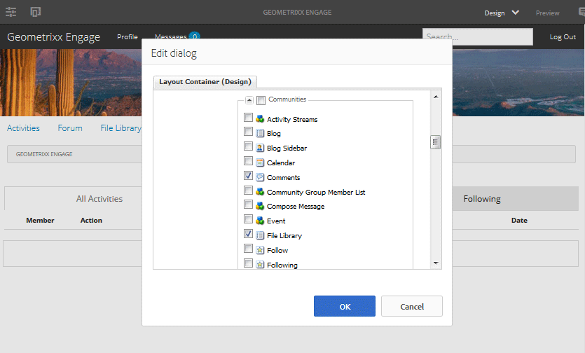
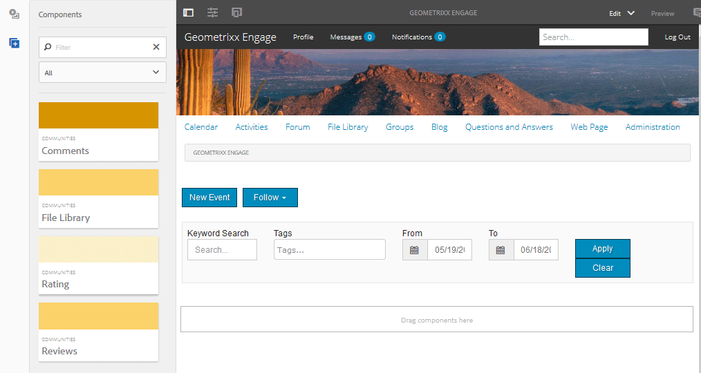

# Communities元件基本知識 {#communities-components-basics}

## 總覽 {#overview}

本檔案的製作區段說明如何以作者編輯模式將Communities功能新增至AEM網站，並說明元件設定。

您可使用AEM例項和互動式來探索元件 [社群元件指南](components-guide.md).

## 訪問Communities元件 {#accessing-communities-components}

編寫頁面內容時，如果基礎範本允許對頁面設計進行變更，則可以啟用元件瀏覽器中尚未提供的元件作為網站設計的一部分。

將列出可用的Communities元件 [此處](author-communities.md#available-communities-components).

>[!NOTE]
>
>如需一般編寫資訊，請檢視 [製作頁面的快速指南](../../help/sites-authoring/qg-page-authoring.md).
>
>如果不熟悉AEM，請在 [基本處理](../../help/sites-authoring/basic-handling.md).

### 進入設計模式 {#entering-design-mode}

若 **社群** 在元件瀏覽器(sidekick)中找不到元件，則需要輸入 `Design Mode` 添加其他Communities元件。 [必要的用戶端程式庫](#required-clientlibs) (clientlibs)也可能需要新增。

如需詳細資訊，請參閱 [在設計模式中配置元件](../../help/sites-authoring/default-components-designmode.md).

以下是選取幾個Communities元件並在元件瀏覽器中檢視的影像：

所選元件現在可在元件瀏覽器中使用：

## 必要的Clientlib {#required-clientlibs}

[用戶端程式庫](../../help/sites-developing/clientlibs.md) (clientlibs)是元件正常運作(JavaScript)和樣式(CSS)的必要項目。

將Communities元件新增至頁面時，如果結果為錯誤或非預期的外觀，首先要嘗試為Communities元件新增所需的clientlibs。 如需詳細資訊，請參閱 [Communities元件的Clientlibs](clientlibs.md).

### 範例：最初置於審核中時沒有客戶端庫…… {#example-initially-placed-reviews-without-client-libraries}

### ...使用用戶端程式庫 {#and-with-client-libraries}

## 標記 {#tagging}

許多Communities功能可經過設定，以允許成員標籤在發佈環境中輸入（發佈）的內容。

如果允許進行標籤，社群網站的設定可設為限制發佈環境中成員呈現的命名空間。 請參閱 [社群網站主控台](sites-console.md#tagging).

允許標籤的功能： [部落格](blog-feature.md), [日曆](calendar.md), [檔案庫](file-library.md), [論壇](forum.md)

使用標籤的功能： [目錄](catalog.md), [搜尋](search.md), [社交標籤雲](tagcloud.md)

如需製作資訊：

* [使用標記](../../help/sites-authoring/tags.md)

管理資訊：

* 建立標籤命名空間（分類法）: [管理標籤](../../help/sites-administering/tags.md)
* 社區站點配置：請參閱 [標籤](sites-console.md#tagging)
* [標籤使用者產生的內容](../../help/sites-authoring/tags.md)
* [標籤啟用資源](tag-resources.md)

如需開發人員資訊：

* [AEM標籤架構](../../help/sites-developing/framework.md)
* [標籤要點](tag.md)
