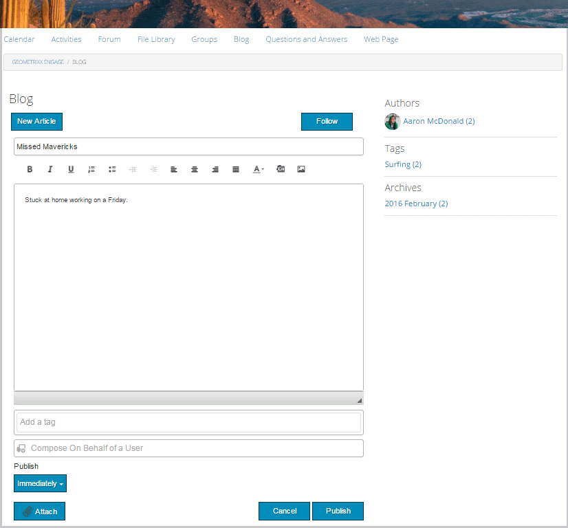

# 部落格功能 {#blog-feature}

## 簡介 {#introduction}

AEM Communities的部落格功能已從製作活動轉變為在Publish環境中發生的真實社群活動。

部落格功能支援以日誌格式提供社群資訊。 部落格專案是由授權成員（已註冊、已登入的使用者）在Publish環境中建立。

部落格功能提供：

* 在Publish端建立部落格和評論
* RTF編輯
* 內嵌影像（支援拖放）
* 內嵌式社交網路內容（[o內嵌支援](/help/communities/blog-developer-basics.md#allowing-rich-media)）
* 草稿模式
* 排程發佈
* 代表撰寫（[有特殊許可權的成員](/help/communities/users.md#privileged-members-group)可以代表其他社群成員建立內容）
* [內部內容與大量稽核](/help/communities/moderate-ugc.md)部落格與評論

本檔案的這一節將說明：

* 將部落格功能新增至AEM網站
* 部落格元件的組態設定

>[!NOTE]
>
>元件`Journal`和`Journal Sidebar`的標題分別為`Blog`和`Blog Sidebar`。
>
>AEM 6.0及舊版中的部落格功能現已移除。 它是以範本為基礎，僅允許作者在作者環境中建立內容。

## 新增部落格元件至頁面 {#adding-blog-components-to-a-page}

如果想要在作者模式中將部落格新增到頁面，請使用元件瀏覽器來找到

* `Communities / Blog`
* `Communities / Blog Sidebar`

並將它們拖曳至部落格應出現的頁面上。

如需必要資訊，請造訪[社群元件基本知識](/help/communities/basics.md)。

當包含[必要的使用者端資料庫](/help/communities/blog-developer-basics.md#essentials-for-client-side)時，`Blog`元件會顯示如下：

### 設定部落格 {#configuring-blog}

選取置入的`Blog`元件，以便您可以存取並選取開啟編輯對話方塊的`Configure`圖示。

#### 設定標籤 {#settings-tab}

在&#x200B;**設定**&#x200B;標籤下，指定部落格的基本功能：

* **允許附件縮圖**

  如果勾選，則會建立附加影像的縮圖。

* **附加縮圖大小上限**

  附件縮圖影像的最大尺寸（畫素）。 預設值為800 x 800。

* 縮圖的最小影像大小&#x200B;**分鐘**

  產生內嵌影像縮圖的最小影像大小（單位為位元組）。 預設值為100000位元組(100 kb)。

* **最大縮圖尺寸**

  內嵌影像的最大縮圖影像大小（畫素）。 預設值為800 x 800。

* **允許有特殊許可權的成員**

  如果勾選，則僅允許擁有特殊許可權的成員建立內容。

* **允許的有特殊許可權的成員**

  新增允許建立內容的特殊許可權成員。

* **在作者編輯模式下封鎖使用者產生的內容**

  如果啟用，在作者模式下編輯時會封鎖使用者產生的內容。

* **日誌標題**

  要顯示在頁面上的部落格標題。

>[!NOTE]
>
>日誌標題用於自動建立部落格的URL。
>
>從您在此指定的日誌標題使用最多50個字元（額外的5個字元代表唯一性）來建立部落格的URL。

* **日誌描述**

  部落格說明。

* 每頁&#x200B;**個主題**

  定義每個頁面顯示的部落格專案/評論數。 預設值為10。

* **已稽核**

  如果勾選，則必須先核准部落格專案的張貼和評論，才能將其顯示在已發佈的網站上。 預設為未勾選。

* **已關閉**

  如果勾選，部落格將針對新的部落格條目和評論關閉。 預設為未勾選。

* **RTF編輯器**

  如果勾選，則可使用標示輸入部落格專案和評論。 預設為已核取。

* **允許標籤**

  如果勾選，則允許成員將標籤新增至他們的貼文（請參閱&#x200B;**標籤欄位**&#x200B;標籤）。 預設為未勾選。

* **允許檔案上傳**

  如果勾選，允許將檔案附件新增至部落格專案或評論。 預設為未勾選。

* **檔案大小上限**

  只有在勾選`Allow File Uploads`時才相關。 此欄位會限制已上傳檔案的大小（以位元組為單位）。 預設值為104857600 (10 Mb)。

* **允許的檔案型別**

  只有在勾選`Allow File Uploads`時才相關。 以「點」分隔符號的副檔名清單（以逗號分隔）。 例如： .jpg、.jpeg、.png、.doc、.docx、.pdf。 如果指定了任何檔案型別，則無法上傳那些未指定的檔案型別。 預設為「無」，因此允許所有檔案型別。

* **附加影像檔案大小上限**

  只有在勾選「允許檔案上傳」時才相關。 已上傳影像檔案的最大位元組數。 預設值為2097152 (2 Mb)。

* **允許回覆**

  如果勾選，允許回覆貼至部落格專案的評論。 預設為未勾選。

* **允許投票**

  如果勾選，請將「投票」功能與部落格專案一併納入。 預設為未勾選。

* **允許使用者刪除評論和主題**

  如果勾選，則允許成員刪除他們張貼的評論和部落格專案。 預設為未勾選。

* **允許關注**

  如果勾選，請在部落格中加入下列功能，讓會員收到[新文章的通知](/help/communities/notifications.md)。 預設為未勾選。

* **允許電子郵件訂閱**

  如果勾選，允許成員透過電子郵件（[訂閱](/help/communities/subscriptions.md)）接收新貼文的通知。 需要檢查`Allow Following`，並設定[電子郵件](/help/communities/email.md)。 預設為未勾選。

* **顯示徽章**

  如果勾選，則顯示已取得及指派的[徽章](/help/communities/implementing-scoring.md)與成員的部落格專案。 預設為未勾選。

* **清單頁面上未收到回覆**

* **允許主要內容**

  如果勾選，則將該創意識別為[精選內容](/help/communities/featured.md)。 預設為未勾選。

* **啟用提及功能**

  啟用後，可讓註冊社群使用者識別其他註冊成員（使用名字、姓氏、使用者名稱），並使用一般的@user-name語法標籤這些成員。 標籤的使用者會收到他們自己提及的通知。

* **最大提及次數**

  限制貼文中允許提及的最大數量。 預設值為10。

* **UI提及模式**

  指定允許的模式字串，以在貼文中標籤(@mention)已註冊的使用者。 例如，`~{{familyName}}{{givenName}}`。

#### 「使用者稽核」標籤 {#user-moderation-tab}

在「**使用者調節**」標籤下，指定調節設定：

* **拒絕貼文**

  如果勾選，則允許受信任的成員版主拒絕貼文，並阻止貼文出現在公開論壇上。 預設為未勾選。

* **關閉/重新開啟主題**

  如果勾選，受信任的成員版主可能會關閉主題以進一步編輯和註釋，也可能重新開啟主題。 預設為未勾選。

* **標幟貼文**

  如果勾選，則允許成員將其他人的主題或評論標籤為不適當。 預設為未勾選。

* **標幟原因清單**

  如果勾選，則允許成員從下拉式清單中選擇標幟主題或評論為不適當的原因。 預設為未勾選。

* **自訂標幟原因**

  如果勾選，則允許成員輸入將主題或評論標幟為不適當的原因。 預設為未勾選。

* **稽核閾值**

  輸入在通知版主前，主題或評論必須由成員標幟的次數。 預設值為1 （一次）。

* **標幟限制**

  輸入主題或註解在隱藏於公眾檢視之前必須加上標籤的次數。 如果設為–1，則標幟的主題或註解絕不會從公開檢視中隱藏。 否則，此數字必須大於或等於「稽核臨界值」。 預設值為5。

#### 標籤欄位索引標籤 {#tag-field-tab}

在&#x200B;**標籤欄位**&#x200B;標籤下方，指定若在&#x200B;**設定**&#x200B;標籤上勾選&#x200B;**允許標籤**，可套用哪些標籤：

* **允許的名稱空間**

  如果已在&#x200B;**設定**&#x200B;標籤下勾選`Allow Tagging`，則為相關。 可套用的標籤僅限於已核取之名稱空間類別中的那些標籤。 名稱空間清單包含「標準標籤」（預設名稱空間）和「包含所有標籤」。 預設為未勾選，這表示允許所有名稱空間。

* **建議限制**

  輸入要顯示為論壇成員張貼建議之標籤數目。 值–1表示沒有限制。 預設值為0。

### 設定部落格側欄 {#configuring-blog-sidebar}

按兩下`Blog Sidebar`元件時，會開啟編輯對話方塊。

在&#x200B;**日誌側邊欄設定**&#x200B;索引標籤下，指定封存的日期格式以及要在側邊欄中顯示的專案型別：

* **日期格式**

  用來顯示部落格專案封存的格式。 此格式會遵循Java™慣例使用預留位置。

   * yyyy ：全年，如「2015」
   * yy ：短年，如「15」
   * MMMMM ：整月，例如六月
   * MMM ：短月，如Jun
   * MM ：月份數字，如06

  預設值為&quot;yyyy MMMMM&quot;，會顯示&quot;2015 June&quot;

* **檢視型別**

  要顯示在側欄中的標題和部落格專案型別。 選項包括

   * 作者
   * 類別
   * 封存

* **部落格元件路徑**

  *（選擇性）*&#x200B;列出部落格的部落格資源位置。 如果保留為空白，它會使用出現在相同頁面上的resourceType `social/journal/components/hbs/journal`元件。

   * 例如 `/content/sites/engage/en/blog/jcr:content/content/primary/blog`

* **建議限制**

  要顯示的部落格數。 值–1表示沒有限制。 預設值為–1。

## 網站訪客體驗 {#site-visitor-experience}

在發佈環境中，部落格功能會依建立順序的降序顯示最近撰寫的部落格，後面接著較舊的部落格。 部落格側邊欄可讓網站訪客套用篩選器，以限制顯示的部落格選擇。

部落格後面會有一個連結，可讓您發表或檢視評論。

選取部落格時，會顯示部落格和註解（若已啟用）。

其他功能取決於網站訪客是版主、管理員、社群成員、有特殊許可權的成員或匿名。

### 使用文章 {#working-with-articles}

建立部落格時，您可以選擇執行以下操作：

1. 立即Publish
1. Publish a草稿
1. 在排程的日期和時間使用Publish

部落格會顯示在適當的索引標籤下（已發佈、草稿或已排程），以供成員在發佈時創作。

#### 版主和管理員 {#moderators-and-administrators}

當登入的使用者具有版主或管理員許可權時，他們便能夠對發佈至部落格的所有部落格和評論執行[版主任務](/help/communities/moderate-ugc.md) （由元件的設定所允許）。

#### 成員 {#members}

當登入的使用者為社群成員或[有特殊許可權的成員](/help/communities/users.md#privileged-members-group) （視組態而定）時，他們可以選取`New Article`來建立和張貼新的部落格。

具體而言，他們可能：

* 建立部落格
* Post代表其他成員撰寫的新部落格
* Post部落格的評論
* 編輯自己的部落格或評論
* 刪除他們自己的部落格或評論
* 標幟其他人的部落格或評論

#### 匿名 {#anonymous}

未登入的網站訪客只能讀取已發佈的部落格和評論（若有支援，請加以翻譯），但不得新增部落格或評論，也不得標示他人的文章或評論。

## 其他資訊 {#additional-information}

如需開發人員的[部落格要點](/help/communities/blog-developer-basics.md)頁面上的詳細資訊，請參閱。

如需協調部落格專案與評論，請參閱[協調使用者產生的內容](/help/communities/moderate-ugc.md)。

若要標籤部落格專案與評論，請參閱[標籤使用者產生的內容](/help/communities/tag-ugc.md)。

如需部落格專案與評論的翻譯，請參閱[翻譯使用者產生的內容](/help/communities/translate-ugc.md)。
