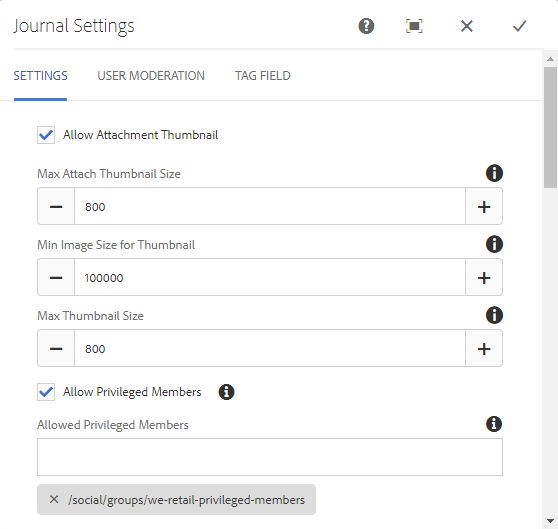
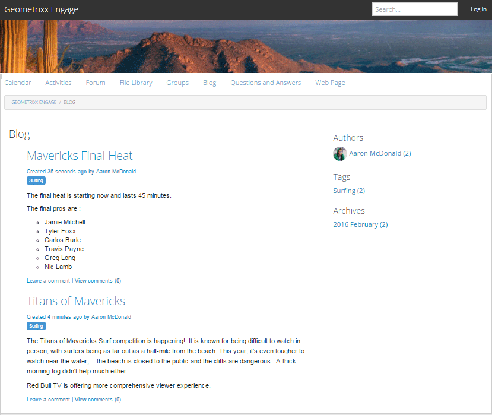

# 部落格功能 {#blog-feature}

## 簡介 {#introduction}

AEM Communities的部落格功能已從編寫活動轉換為在發佈環境中發生的真正社群活動。

部落格功能支援以日誌格式提供社群資訊。 部落格項目是由授權成員（註冊、登入使用者）在發佈環境中撰寫。

部落格功能提供：

* 發佈端建立部落格文章和評論
* RTF編輯
* 內嵌影像（支援拖放）
* 嵌入式社交網路內容([oEmbed支援](/help/communities/blog-developer-basics.md#allowing-rich-media))
* 草稿模式
* 排程發佈
* 代表撰寫(a [特權成員](/help/communities/users.md#privileged-members-group) 可以代表不同社群成員建立內容)
* [內容內容與大量協調](/help/communities/moderate-ugc.md) 部落格文章和評論

本檔案的本節說明：

* 將部落格功能新增至AEM網站
* 部落格元件的組態設定

>[!NOTE]
>
>元件 `Journal` 和 `Journal Sidebar` 標題 `Blog` 和 `Blog Sidebar`.
>
>AEM 6.0及舊版中的部落格功能現已移除。 此範本以範本為基礎，僅允許作者在製作環境中建立內容。

## 將部落格元件新增至頁面 {#adding-blog-components-to-a-page}

如果想要以作者模式將部落格新增至頁面，請使用元件瀏覽器來尋找

* `Communities / Blog`
* `Communities / Blog Sidebar`

並將它們拖曳到應該出現部落格的頁面上。

如需必要資訊，請造訪 [Communities元件基本知識](/help/communities/basics.md).

當 [必要的用戶端程式庫](/help/communities/blog-developer-basics.md#essentials-for-client-side) 包含在內，以下為方式 `Blog` 元件隨即出現：

### 配置部落格 {#configuring-blog}

選取已放置的 `Blog` 要存取的元件並選取 `Configure` 表徵圖，開啟「編輯」對話框。

#### 設定標籤 {#settings-tab}

在 **設定** 頁簽，指定部落格的基本功能：

* **允許附件縮圖**

   如果選中，則會建立附加影像的縮圖。

* **附加縮圖最大尺寸**

   附件縮圖影像的最大大小（像素）。 預設值為800 x 800。

* **最小縮圖影像大小**

   產生內嵌影像縮圖的影像最小大小（以位元組為單位）。 預設值為100000位元組(100kb)。

* **最大縮圖尺寸**

   內嵌影像縮圖影像的最大大小（像素）。 預設值為800 x 800。

* **允許有特殊權限的成員**

   若勾選此選項，則僅允許有權限的成員建立內容。

* **允許擁有特殊權限的成員**

   添加允許建立內容的特權成員。

* **封鎖使用者在作者編輯模式中產生的內容**

   如果已啟用，在「製作模式」中編輯時，會封鎖使用者產生的內容。

* **日誌標題**

   要顯示在頁面上的部落格標題。

>[!NOTE]
>
>日誌標題用於自動建立部落格的URL。
>
>您在此處指定的日誌標題最多使用50個字元（唯一性附加5個字元），以建立部落格的URL。

* **日誌說明**

   部落格說明。

* **每頁主題**

   定義每頁顯示的部落格項目/留言數。 預設為10。

* **已審核**

   如果選中此選項，則發佈部落格條目和評論必須獲得批准，才會顯示在發佈的站點上。 預設為未勾選。

* **已關閉**

   如果選中，則將關閉部落格，以查看新的部落格條目和評論。 預設為未勾選。

* **RTF 編輯器**

   如果選中，則可以使用標籤輸入部落格條目和注釋。 已勾選預設值。

* **允許標記**

   若勾選此選項，允許成員將標籤新增至其貼文(請參閱 **標籤欄位** 標籤)。 預設為未勾選。

* **允許檔案上傳**

   如果選中此選項，則允許將檔案附件添加到部落格條目或注釋中。 預設為未勾選。

* **最大檔案大小**

   只有在 `Allow File Uploads` 已勾選。 此欄位將限制上傳檔案的大小（以位元組為單位）。 預設為104857600(10 Mb)。

* **允許的檔案類型**

   只有在 `Allow File Uploads` 已勾選。 副檔名清單（以逗號分隔）以「點」分隔。 例如：.jpg、.jpeg、.png、.doc、.docx、.pdf。 如果指定了任何檔案類型，則不允許上載未指定的檔案類型。 未指定預設值，因此允許所有檔案類型。

* **附加影像檔案最大大小**

   僅在勾選「允許檔案上傳」時相關。 上傳的影像檔案可能具有的最大位元組數。 預設為2097152(2 Mb)。

* **允許回覆**

   如果選中，則允許對發佈到部落格條目的評論進行回覆。 預設為未勾選。

* **允許投票**

   如果勾選此選項，請加入包含部落格項目的投票功能。 預設為未勾選。

* **允許使用者刪除評論和主題**

   如果選中，則允許成員刪除他們發佈的評論和部落格條目。 預設為未勾選。

* **允許關注**

   若勾選此選項，請為部落格文章加入下列功能，以便讓成員 [通知](/help/communities/notifications.md) 新貼文。 預設為未勾選。

* **允許電子郵件訂閱**

   若勾選此選項，可允許成員透過電子郵件([訂閱](/help/communities/subscriptions.md))。 需要 `Allow Following` 要檢查和 [電子郵件已設定](/help/communities/email.md). 預設為未勾選。

* **顯示徽章**

   如果選中，則顯示已獲得和已分配 [徽章](/help/communities/implementing-scoring.md) 會員的部落格條目。 預設為未勾選。

* **不在清單頁面上取得回覆**

* **允許主要內容**

   若勾選，可將構想識別為 [精選內容](/help/communities/featured.md). 預設為未勾選。

* **啟用提及功能**

   如果啟用，則允許註冊的社區用戶標識其他註冊成員（使用名字、姓氏、用戶名），並使用通用@user-name語法對它們進行標籤。 標籤的使用者會收到其提及次數的通知。

* **最大提及數**

   限制貼文中允許的提及次數上限。 預設為10。

* **UI 提及模式**

   指定允許的模式字串，以標籤(@mention)貼文中已註冊的使用者。 例如 ~{{familyName}}{{givenName}}.

#### 使用者協調標籤 {#user-moderation-tab}

在 **使用者協調** ，指定協調設定：

* **拒絕貼文**

   若勾選此選項，信任的成員協調者將可拒絕貼文，並防止貼文出現在公開論壇上。 預設為未勾選。

* **關閉/重新開啟主題**

   如果選中，受信任的成員協調者可以關閉主題以進一步編輯和評論，也可以重新開啟主題。 預設為未勾選。

* **標幟貼文**

   如果選中，則允許成員將其他主題或評論標籤為不適當。 預設為未勾選。

* **標誌原因清單**

   如果選中，則允許成員從下拉清單中選擇其標籤主題或注釋為不適當的原因。 預設為未勾選。

* **自訂標幟原因**

   如果選中，則允許成員輸入自己的原因，將主題或評論標籤為不適當。 預設為未勾選。

* **協調臨界值**

   輸入在通知協調者之前，成員必須標籤主題或評論的次數。 預設為1（一次）。

* **標幟限制**

   輸入主題或留言在從公共視圖中隱藏之前必須標籤的次數。 如果設為–1，則標籤的主題或評論永遠不會在公共視圖中隱藏。 否則，此數字必須大於或等於協調臨界值。 預設為5。

#### 標籤欄位標籤 {#tag-field-tab}

在 **標籤欄位** ，指定在 **允許標籤** 是 **設定** 索引標籤：

* **允許的命名空間**

   若 `Allow Tagging` 在 **設定** 標籤。 可套用的標籤僅限於所檢查命名空間類別中的標籤。 命名空間清單包含「標準標籤」（預設命名空間）以及「包含所有標籤」。 預設值未勾選，這表示允許所有命名空間。

* **建議限制**

   輸入要作為建議顯示給論壇成員的標籤數。 值–1表示沒有限制。 預設為0。

### 配置部落格側欄 {#configuring-blog-sidebar}

當您連按兩下 `Blog Sidebar` 元件中，將開啟編輯對話框。

在 **日誌側欄設定** 頁簽，指定封存檔的日期格式以及要在側欄中顯示的條目類型：

* **日期格式**

   用於為部落格條目的存檔顯示的格式。 格式使用遵循Java慣例的預留位置。

   * yyyy :全年，就像』2015年
   * yy:短年，比如』15年
   * MMMMMM :整個月，像6月
   * MMM :像6月一樣
   * MM :月數，如06

   預設值為&quot;yyyy MMMM&quot;，會顯示例如&quot;2015年6月&quot;

* **視圖類型**

   要在側欄中顯示的部落格項目的標題和類型。 選擇是

   * 作者
   * 類別
   * 封存

* **Blopg元件路徑**

   *（可選）* 要列出部落格文章的部落格資源的位置。 若保留為空白，則使用resourceType的元件 `social/journal/components/hbs/journal` 顯示在相同頁面上。

   * 例如, `/content/sites/engage/en/blog/jcr:content/content/primary/blog`

* **建議限制**

   要顯示的部落格文章數。 值–1表示無限制。 預設為–1。

## 網站訪客體驗 {#site-visitor-experience}

在發佈環境中，部落格功能會依照建立的順序，顯示最新的部落格文章，之後會顯示較舊的部落格文章。 部落格側邊欄可讓網站訪客套用篩選器，以限制所顯示部落格文章的選取。

部落格文章後面會有貼文或檢視留言的連結。

選取部落格文章時，會顯示部落格文章和評論（如果已啟用）。

其他功能取決於網站訪客是版主、管理員、社群成員、有權限的成員還是匿名。

### 使用文章 {#working-with-articles}

建立新部落格文章時，可以選擇：

1. 立即發佈
1. 發佈草稿
1. 在排程日期和時間發佈

部落格文章會顯示在適當的標籤下（已發佈、草稿或已排程），供能夠在發佈時撰寫的成員使用。

#### 協調者與管理員 {#moderators-and-administrators}

當登入的使用者擁有版主或管理員權限時，就能執行 [協調任務](/help/communities/moderate-ugc.md) （經元件設定允許）張貼至部落格的所有部落格文章和評論。

#### 成員 {#members}

登入的使用者是社群成員或 [特權成員](/help/communities/users.md#privileged-members-group) （視設定而定），他們可以選取 `New Article` 建立並發佈新部落格文章。

具體而言，他們可以：

* 建立新部落格文章
* 代表其他成員發佈新的部落格文章
* 發佈評論到部落格文章
* 編輯自己的部落格文章或評論
* 刪除自己的部落格文章或評論
* 為他人的部落格文章或評論加上標籤

#### 匿名 {#anonymous}

未登錄的網站訪客只能閱讀已發佈的部落格文章和評論，如有支援，可以翻譯，但不得添加部落格文章或評論，也不得標籤他人的文章或評論。

## 其他資訊 {#additional-information}

如需詳細資訊，請參閱 [部落格要點](/help/communities/blog-developer-basics.md) 頁面。

有關管理部落格條目和留言的資訊，請參閱 [協調使用者產生的內容](/help/communities/moderate-ugc.md).

如需標籤部落格項目和評論，請參閱 [標籤使用者產生的內容](/help/communities/tag-ugc.md).

有關部落格條目和評論的翻譯，請參見 [轉譯使用者產生的內容](/help/communities/translate-ugc.md).
