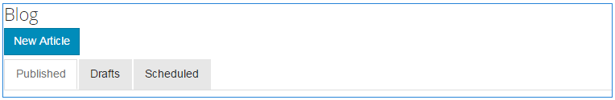

# 日曆功能{#calendar-feature}

## 簡介 {#introduction}

日曆功能支援以日曆格式為所有網站訪客或僅登入網站訪客（社群成員）提供社群事件資訊，而只有授權的成員可新增事件。

本節說明

* 新增日曆功能至AEM網站
* 元件的配置設 `Calendar`置

## 新增日曆至頁面 {#adding-a-calendar-to-a-page}

若要在作 `Calendar` 者模式中將元件新增至頁面，請使用元件瀏覽器來尋找

* `Communities / Calendar`

並將它拖曳至頁面上，例如與功能相對的位置，讓使用者檢視。

如需必要資訊，請造 [訪Communities Components Basics](/help/communities/basics.md)。

當包含 [所需的用戶端程式庫](/help/communities/calendar-basics-for-developers.md#essentials-for-client-side) ，元件的顯示方式 `Calendar` 就是這樣。

### 設定日曆 {#configuring-calendar}

選擇要訪問 `Calendar`的已放置元件，並選 `Configure` 擇開啟編輯對話框的表徵圖。

 

#### 「設定」頁籤 {#settings-tab}

在「**設定**」標籤下，指定是否允許將標籤套用至日曆項目。

* **每頁事件**&#x200B;定義每頁顯示的事件數。 預設值為10。

* **協調**：如果勾選，則必須先核准發佈日曆事件和留言，才能顯示在發佈網站上。 預設為未勾選。

* **Closed**&#x200B;如果勾選此選項，日曆將關閉至新事件條目和注釋。 預設為未勾選。

* **富格文本編輯**&#x200B;器如果選中此選項，則可以使用標籤輸入日曆事件和注釋。 已勾選預設值。

* **允許標籤**：如果勾選此選項，允許成員將標籤標籤新增至他們張貼的事件(請參 **閱標籤欄位** 標籤)。 已勾選預設值。

* **允許檔案上載**&#x200B;如果選中此選項，則允許將檔案附件添加到日曆事件或注釋中。 已勾選預設值。

* **允許跟蹤**：如果勾選此選項，允許成員跟隨張貼到日曆的事件。 已勾選預設值。

* **最大檔案大小**&#x200B;僅在勾選時 `Allow File Uploads` 相關。 此欄位將限制已上傳檔案的大小（以位元組為單位）。 預設值為104857600(10 Mb)。

* **允許的檔案類型**&#x200B;僅在選中時 `Allow File Uploads` 相關。 以逗號分隔的副檔名清單，並以&quot;dot&quot;分隔。 例如：.jpg、.jpeg、.png、.doc、.docx、.pdf。 如果指定任何檔案類型，則不允許上傳未指定的檔案類型。 未指定預設值，因此允許所有檔案類型。

* **僅當勾選「允許上傳檔案**」時，附加影像檔案大小的上限才相關。 上傳的影像檔案的位元組數上限。 預設值為2097152****(2 Mb)。

* **允許的封面影像類**&#x200B;型以逗號分隔的影像副檔名清單，並以&quot;dot&quot;分隔。 預設為 `.jpg,.jpeg,.png,.gif,.bmp`。

* **允許線程化回**&#x200B;覆如果勾選，允許回覆張貼至日曆事件的留言。 已勾選預設值。

* **允許使用者刪除留言和事件**&#x200B;如果勾選，允許成員刪除他們張貼的留言和日曆事件。 預設為** **勾選。

* **允許投票**&#x200B;如果勾選，請將「投票」功能與日曆事件一起加入。 已勾選預設值。

* **顯示Breadcrumbs**&#x200B;在事件頁面上顯示Breadcrumbs。 已勾選預設值。

* **日期範圍篩**&#x200B;選器定義新增至目前日期的天數，以計算日曆事件清單頁面篩選器的「至」值。 預設數字為30。

* **如果勾選**「允許特色內容」，即可將構想識別為 [特色內容](/help/communities/featured.md)。 預設為未勾選。

在「**使用者協調**」標籤下，指定如何管理已張貼的主題和回覆（使用者產生的內容）。 如需詳細資訊，請參閱 [協調使用者產生的內容](/help/communities/moderate-ugc.md)。

#### 使用者協調標籤 {#user-moderation-tab}

* **拒絕貼文**&#x200B;如果勾選，可信任的會員協調者將可拒絕貼文，並防止貼文出現在公開論壇。 已勾選預設值。

* **關閉／重新開啟事件**&#x200B;如果勾選，受信任的成員協調者可能會關閉事件以進一步編輯和留言，也可能會重新開啟事件。 已勾選預設值。

* **標幟貼文**&#x200B;如果勾選，允許成員標幟其他人的事件或留言，使其不適當。 已勾選預設值**.**

* **標幟原因清**&#x200B;單如果勾選，允許成員從下拉式清單中選擇其標籤事件或留言為不適當的理由。 預設為未勾選。

* **自訂標幟原**&#x200B;因如果勾選，允許成員輸入自己的原因來標籤事件或註解為不適當。 預設為未勾選**.**

* **協調臨**&#x200B;界值輸入成員在通知協調者之前必須標籤事件或留言的次數。 預設值為1（一次）。

* **標籤限**&#x200B;制輸入事件或留言在公開檢視中隱藏前必須標籤的次數。 如果設為-1，則標籤的主題或留言永遠不會隱藏在公開檢視中。 否則，此數字必須大於或等於「協調臨界值」。 預設值為5。

#### 「標籤」欄位頁籤 {#tag-field-tab}

在「標 **記」欄位** (Tag field)標籤下，可套用的標籤（如果允許）會根據選擇的名稱空間加以限制。

* **允許的名**&#x200B;稱空間相 `Allow Tagging` 關（如果已勾選「**設定**」標籤）。 可套用的標籤僅限於已勾選之命名空間類別中的標籤。 名稱空間清單包含「標準標籤」（預設命名空間）和「包含所有標籤」。 預設值未勾選，表示允許所有命名空間。

* **建議限**&#x200B;制輸入要作為建議顯示給發佈到論壇的成員的標籤數。 預設值為**-**1（無限制）。

>[!NOTE]
>
>請造 [訪管理標籤](/help/sites-administering/tags.md) ，瞭解如何新增標籤命名空間（分類）。

#### 翻譯標籤 {#translation-tab}

在**翻譯**頁籤下，如果為社區站點啟用了翻譯，則可以設定翻譯來翻譯整個線程（事件和注釋），而不是特定帖子。

* **Translate All**（全部翻譯）如果勾選，事件和注釋將翻譯為用戶的首選語言。 已勾選預設值。

## 網站訪客體驗 {#site-visitor-experience}

在發佈環境中，日曆功能將顯示具有預設日期範圍的搜尋欄位，以及任何落在該範圍內的日曆事件。

選擇日曆事件時，將顯示日曆事件詳細資訊、說明和注釋。

其他功能取決於網站訪客是協調者、管理員、社群成員、特權成員還是匿名。

### 協調者與管理員 {#moderators-and-administrators}

當登入的使用者具有協調者或管理員權限時，他們就可以對張貼至事件的所有日曆事件和留言執行協調 [任務](/help/communities/moderate-ugc.md) （依照元件的設定許可）。

#### 成員 {#members}

當登入使用者是社群成員或特權 [成員](/help/communities/users.md#privileged-members-group) （視設定而定）時，他們可以選擇 `New Event` 建立並張貼新的日曆事件。

具體而言，他們可能

* 建立新的日曆事件
* 將留言張貼至日曆事件
* 編輯自己的日曆事件或留言
* 刪除其自己的日曆事件或留言
* 標籤其他日曆事件或留言

 

#### 匿名 {#anonymous}

未登入的網站訪客只能閱讀已張貼的日曆事件、翻譯事件（如果支援），但不得新增事件或留言，也不得標籤其他人的事件或留言。

## 其他資訊 {#additional-information}

如需詳細資訊，請參閱開發人 [員的Calendar Essentials](/help/communities/calendar-basics-for-developers.md) （行事歷）頁面。

如需日曆事件和留言的協調，請參閱協 [調使用者產生的內容](/help/communities/moderate-ugc.md)。

如需標籤日曆事件和注釋，請參閱 [標籤使用者產生的內容](/help/communities/tag-ugc.md)。

有關日曆事件和注釋的翻譯，請參 [閱翻譯用戶生成的內容](/help/communities/translate-ugc.md)。
