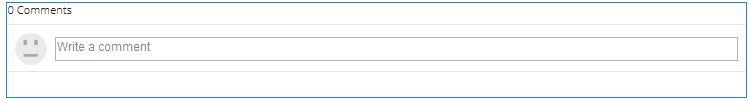

# 使用注釋 {#using-comments}

## 簡介 {#introduction}

評論功能用於允許登錄站點訪問者（成員）共用他們對站點上的內容的意見和知識。 此功能通常已在其他功能中出現，但可以添加到任何網站。

文檔描述：

* 添加 `Comments` 到頁面。
* 的配置設定 `Comments` 元件。

>[!NOTE]
>
>不支援匿名發佈注釋。 站點訪問者必須註冊（成為成員）並登錄以參與。

### 向頁面添加註釋 {#adding-comments-to-a-page}

添加 `Comments` 在作者模式下對頁面的元件，使用元件瀏覽器查找

* `Communities / Comments`

並將其拖到頁面上，例如相對於功能的位置供用戶注釋，或僅在頁面底部。

如需必要資訊，請訪問 [社區元件基礎](/help/communities/basics.md)。

當 [所需的客戶端庫](/help/communities/essentials-comments.md#essentials-for-client-side) 包括，這是 `Comments` 的下界。

>[!NOTE]
>
>只有一個 `Comments` 元件可能存在於頁面中。 請注意，幾個社區功能已包括注釋，如部落格、日曆、論壇、QnA和評論。

### 配置注釋 {#configuring-comments}

選取已放置的 `Comments` 要訪問和選擇的元件 `Configure` 表徵圖。

#### 「注釋」頁籤 {#comments-tab}

在 **注釋** 頁籤，指定訪問者如何輸入注釋。

* **允許回覆**

   如果選中，則允許成員回復現有注釋。 取消選擇預設值。

* **每頁的評論數**

   限制每頁顯示的注釋數和顯示的回複數。 預設值為10。

* **允許檔案上傳**

   如果選中，則會在文本輸入框中顯示上載檔案的選項。 取消選擇預設值。

* **最大檔案大小**

   僅當選中「允許檔案上載」時相關。 此值限制上載的檔案大小。 預設限制為10 MB。

* **訊息長度上限**

   可輸入到文本框中的最大字元數。 預設為4096個字元。

* **允許的檔案類型**

   僅當選中「允許檔案上載」時相關。 以逗號分隔的帶有&quot;dot&quot;分隔符的檔案名副檔名清單。 例如：.jpg、.jpeg、.png、.doc、.docx、.pdf。 如果指定了任何檔案類型，則不允許指定那些未指定的檔案類型。 未指定預設值，因此允許所有檔案類型。

* **RTF 編輯器**

   如果選中，則輸入注釋並帶有標籤。 取消選擇預設值。

* **允許投票**

   如果選中，則將顯示「上投」或「下投」選項，並顯示文本輸入框。 取消選擇預設值。

* **允許關注**

   如果選中，則允許成員跟蹤注釋。 取消選擇預設值。

* **顯示徽章**

   如果選中，則允許顯示已獲得和已授予的徽章。 取消選擇預設值。

#### 「用戶審核」頁籤 {#user-moderation-tab}

在 **用戶審核** 頁籤，指定如何管理已發佈的注釋。 有關詳細資訊，請參見 [調節用戶生成的內容](/help/communities/moderate-ugc.md)。

* **事先審核**

   如果選中，則必須在注釋出現在發佈站點之前批准它們。 取消選擇預設值。

* **刪除注釋**

   如果選中，則發佈注釋的成員將能夠刪除注釋。 取消選擇預設值。

* **拒絕注釋**

   如果選中，則允許審閱人拒絕評論。 取消選擇預設值。

* **關閉/重新開啟注釋**

   如果選中，允許審閱人關閉並重新開啟注釋。 取消選擇預設值。

* **標籤注釋**

   如果選中，允許成員將注釋標籤為不適當。 取消選擇預設值。

* **標誌原因清單**

   如果選中，則允許成員從下拉清單中選擇其標籤注釋為不恰當的原因。 取消選擇預設值。

* **自定義標誌原因**

   如果選中，允許成員輸入將注釋標籤為不適當的自己原因。 取消選擇預設值。

* **審核閾值**

   輸入成員在通知審閱人之前必須標籤注釋的次數。 預設值為一次(1)。

* **標籤限制**

   輸入注釋在公共視圖中隱藏之前必須標籤的次數。 此數字必須大於或等於 **審核閾值**。 預設值為5。

#### 「排序設定」頁籤 {#sort-settings-tab}

在 **排序設定** 頁籤，指定在顯示已過帳注釋時如何排序。

* **排序欄位**

   下拉以選擇其中一個 `Newest, Oldest, Last Updated, Most Viewed, Most Active, Most Followed`或 `Most Liked`。

* **排序順序**

   下拉以選擇其中一個 `Ascending` 或 `Descending`。

### 更改為自定義注釋類型 {#changing-to-a-custom-comment-type}

通過更改注釋資源類型，注釋系統不再使用預設值生成注釋實例，而是使用開發人員自定義（擴展）的注釋實例。

在已知自定義資源類型後，輸入 [設計模式](/help/sites-authoring/default-components-designmode.md) 並按兩下放置的 `Comments` 的子菜單。

在 **資源類型** 頁籤，為 `Comments or Voting` 元件：

* **評論資源類型**

   導航到擴展的resourceType `comment` /apps中的元件（單個注釋）。 例如 `/apps/social/commons/components/hbs/comments/comment`

   此資源標識訪問者發佈注釋時建立的UGC的resourceType。

* **投票資源類型**

   導航到擴展的resourceType `voting` /apps中的元件。 例如 `/apps/social/components/hbs/voting`

   此資源標識訪問者投票時建立的UGC的資源類型。

* **注釋系統資源類型**

   導航到擴展的resourceType `comments`/apps中的元件（注釋系統）。 除非頁面模板，否則保留為空 [動態包](/help/communities/scf.md#add-or-include-a-communities-component) 在基礎指令碼中添加註釋系統，而不是作為資源（注釋節點）添加到頁面。 通過閱讀 [{{include}} 幫助](/help/communities/handlebars-helpers.md#include)。

### 站點訪問者體驗 {#site-visitor-experience}

#### 審閱人和管理員 {#moderators-and-administrators}

當登錄用戶具有版主或管理員權限時，他們能夠執行元件配置允許的審核任務，而不管是誰建立了注釋。

#### 成員 {#members}

站點訪問者登錄時，根據配置的不同，他們可能

* 發佈新評論
* 編輯自己的評論
* 刪除其自己的注釋
* 標籤其他評論

#### 匿名 {#anonymous}

未登錄的網站訪問者只能閱讀已發佈的評論，如果支援，可翻譯這些評論，但不能添加評論或標籤其他評論。

### 其他資訊 {#additional-information}

有關 [注釋要點](/help/communities/essentials-comments.md) 頁面。

有關審核已發佈的注釋，請參閱 [調節用戶生成的內容](/help/communities/moderate-ugc.md)。

有關已發佈注釋的翻譯，請參閱 [翻譯用戶生成的內容](/help/communities/translate-ugc.md)。
