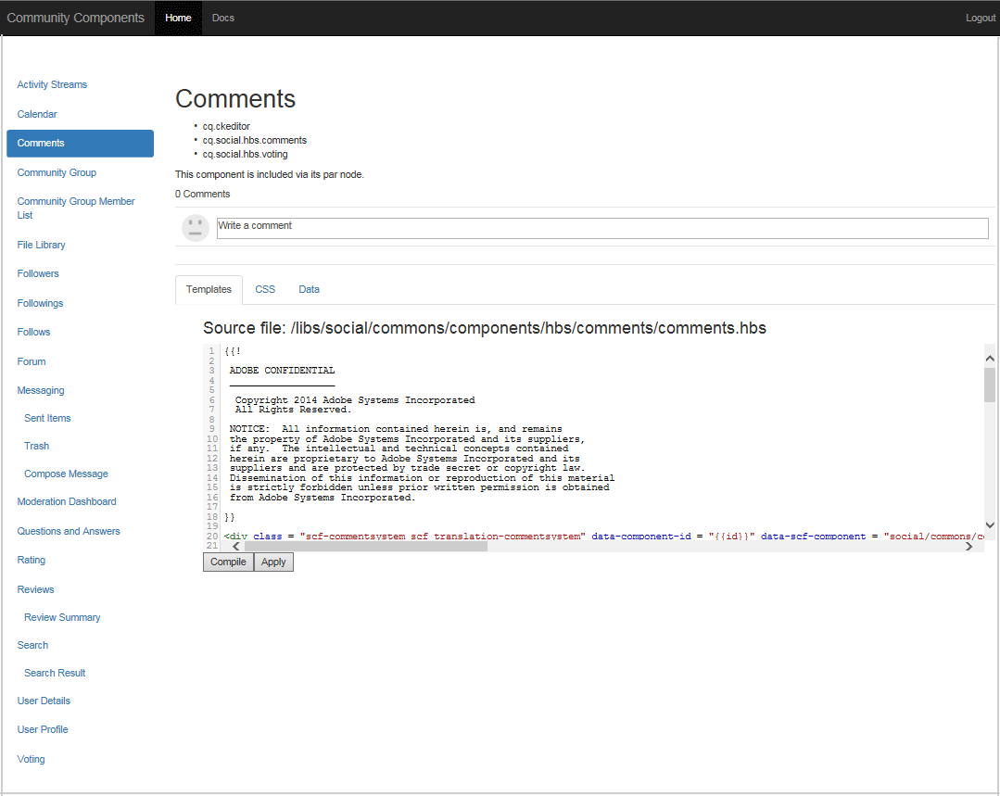

# 社群元件指南 {#community-components-guide}

社群元件指南是社交元件架構( [Social Components Framework,SCF)的互動式開發工具](scf.md)。 它提供可用的AEM Communities元件清單，或由多個元件建立的更複雜功能。

本指南除了每個元件的基本資訊外，還允許對SCF元件／功能的工作方式以及如何配置或定制它們進行實驗。

如需與每個元件相關的開發基本功能的詳細資訊，請 [參閱功能與元件基本功能](essentials.md)。

## 快速入門 {#getting-started}

本指南適用於作者(localhost:4502)和發佈(localhost:4503)例項的開發安裝。

瀏覽至

* [https://&lt;server>:&lt;port>/content/community-components/en.html](http://localhost:4502/content/community-components/en.html)

與Communities元件的互動會依下列各項而異：

* 伺服器（作者或發佈）
* 網站訪客是否登入
* 如果登入，則指派給成員的權限
* 是否使用預設SRP( [JSRP](jsrp.md))

在作者上，若要進入編輯模式，請插入 `editor.html` 或作為 `cf#` 伺服器名稱后的第一個路徑區段：

* 標準UI:

   [https://&lt;server>:&lt;port>/editor.html/content/community-components/en.html](http://localhost:4502/editor.html/content/community-components/en.html)

* 傳統 UI:

   [https://&lt;server>:&lt;port>/cf#/content/community-components/en.html](http://localhost:4502/cf#/content/community-components/en.html)

>[!NOTE]
>
>在「編輯」模式下的作者中，頁面上的連結不作用中。
>
>若要導覽至元件頁面，請先選取「預覽模式」以啟用連結。
>
>在瀏覽器中顯示元件頁面時，返回「編輯」模式以開啟元件的編輯對話框。
>
>如需一般製作資訊，請檢視 [製作頁面的快速指南](../../help/sites-authoring/qg-page-authoring.md)。
>
>如果不熟悉AEM，請檢視基本處理的 [檔案](../../help/sites-authoring/basic-handling.md)。

### 首頁 {#home-page}

本指南提供可在頁面左側預覽和建立原型的SCF元件清單。

在「編輯」模式中，在作者實例上檢視的「元件指南」:

## 元件頁 {#component-pages}

從頁面左側的清單中選取元件。

此時將顯示指南的主體：

1. 標題：所選元件的名稱
1. [用戶端程式庫](#client-side-libraries):一或多個必要類別的清單
1. [可包含](scf.md#add-or-include-a-communities-component):如果元件可以動態包含，則可在作者編輯模式中切換狀態：

   * 如果新增，顯示的文字為：&quot;此元件通過其par節點包含。&quot;
   * 如果包含，則顯示的文字為：&quot;此元件是動態包含的。&quot;
   * 如果不包含，則不顯示任何文字

1. 元件或功能範例：元件或特徵的活動實例。 如果元件，則可隨著對標籤區段中提供的範本、CSS和資料所做的變更而變更。

>[!NOTE]
>
>從左側進行選取後，當瀏覽器視窗太窄時，元件會出現在下方，而非旁邊的元件清單。

### 作者互動 {#author-interactions}

在作者實例上使用指南時，可以通過開啟元件對話框來體驗配置元件。 開發人員的資訊會列在檔案的「元件 [與功能基本工具](essentials.md) 」區段中，而對話方塊設定則會列在作者的「社群元件  」區段中。

在「社群元件」指南中，某些元件對話方塊設定會以「包含」切 [換狀態](scf.md#add-or-include-a-communities-component) 顯示。 要在使用現有資源或動態包含的資源之間切換，請在編輯模式下選擇元件和可包含文本，然後按兩下以開啟編輯對話框：

在「範本 **」標籤** 下：

* **包含 sling:include 的子元件**

   如果取消選中，「元件指南」將使用儲存庫中的現有資源（作為par節點子節點的jcr節點）。

   * 顯示的文字為：&quot;此元件通過其par節點包含。&quot;
   如果勾選，「元件指南」會使用sling來動態包含子節點resourceType（非現有資源）的元件。

   * 顯示的文字為：&quot;此元件是動態包含的。&quot;
   預設為未勾選。

### 發佈互動 {#publish-interactions}

在發佈例項上使用指南時，您可以以網站訪客（未登入）和登入時擁有各種權限的成員身分，來體驗元件和功能。

>[!NOTE]
>
>請注意，如果SRP預設為 [JSRP](jsrp.md)，則在發佈例項上輸入的UGC只會顯示在發佈上，而且*not *be viseble from the  moderation console on the author instance.

## 用戶端資源庫 {#client-side-libraries}

每個元件所列的用戶端程式庫(clientlibs)是當元 *件放在頁面上* 時需要參考的程式庫。 clientlibs提供管理和最佳化下載Javascript和CSS的方式，以在瀏覽器中呈現元件。

如需詳細資訊，請造 [訪Communities元件的Clientlibs](clientlibs.md)。

## 模擬 {#impersonation}

在作者實例（通常以管理員或開發人員的身分登入）上，為了體驗以其他使用者身分登入的元件，請使用「模擬」按鈕左側的文字方塊，輸入使用者名稱或從下拉式清單中選取，然後按一下按鈕。 **** 按一下「恢復」(Revert)以簽出並終止模擬。

發佈例項不需要模擬。 只需使用「登入／登出」連結，即可模擬各種使用者，例如 [示範使用者](tutorials.md#demo-users)。

## 自訂 {#customization}

啟用後，每個SCF元件都可以通過臨時修改元件的模板、CSS和資料來建立可能的定製原型。

### 啟用自訂 {#enabling-customization}

>[!NOTE]
>
>**此工具為唯讀**。 對範本、CSS或資料所做的編輯不會儲存到儲存庫。

若要快速實驗自訂， `scg:showIde`必須將屬性新增至元件頁面的內容JCR節點，並設為true。

以注釋元件為例，在作者或發佈實例上，以管理員權限登錄：

1. 瀏覽至 [CRXDE Lite](../../help/sites-developing/developing-with-crxde-lite.md)

   例如， [http://localhost:4503/crx/de](http://localhost:4503/crx/de)

1. 選擇元件的節 `jcr:content` 點

   例如， `/content/community-components/en/comments/jcr:content`

1. 新增屬性

   * **名稱**`scg:showIde`
   * **類型**`String`
   * **值**`true`

1. 選擇「 **[!UICONTROL 全部保存」]**
1. 重新載入指南中的「注釋」頁面

   [http://localhost:4503/content/community-components/en/comments.html](http://localhost:4503/content/community-components/en/comments.html)

1. 請注意，範本、CSS和資料現在有3個標籤。

 

### 範本標籤 {#templates-tab}

選擇模板頁籤可查看與元件關聯的模板。

模板編輯器允許編譯本地編輯並將其應用於頁面頂部的示例元件實例，而不影響儲存庫中的元件。

在本機編輯時執行編譯，會在欄距中放置點並將文字標示為紅色，以反白標示任何錯誤。

### CSS標籤 {#css-tab}

選取「CSS」標籤，以查看與元件相關聯的CSS。

如果元件是多個元件的組合，則某些CSS可能會列在其他元件之一下。

CSS編輯器允許修改CSS並將其應用於頁面頂部的示例元件實例。

您可以按一下欄距中規則旁的規則，選取規則來反白標示使用該規則的DOM部分。

### 資料標籤 {#data-tab}

選取「資料」標籤，以顯示。social.json端點資料。 此資料是可編輯的，並套用至範例元件例項。

語法錯誤可能會標籤在欄距中，並在編輯器中反白顯示。
