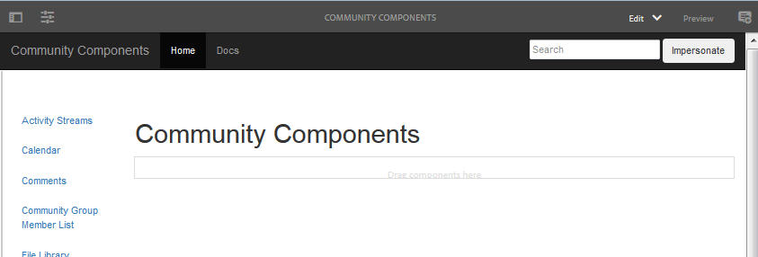

# 社群元件指南  {#community-components-guide}

社群元件指南是互動式開發工具，適用於 [社會構成框架](scf.md). 提供可用AEM Communities元件的清單，或由多個元件建立的更複雜功能。

除了每個元件的基本資訊外，該指南還允許試驗SCF元件/功能如何工作以及如何配置或定制它們。

如需與每個元件相關的開發要點相關資訊，請參閱 [功能和元件要點](essentials.md).

## 快速入門 {#getting-started}

本指南旨在用於製作(localhost:4502)和發佈(localhost:4503)執行個體的開發安裝。

瀏覽至

* [https://&lt;server>:&lt;port>/content/community-components/en.html](http://localhost:4502/content/community-components/en.html)

與Communities元件的互動會依下列各項而有所不同：

* 伺服器（製作或發佈）。
* 網站訪客是否已登入。
* 如果已登錄，則分配給成員的權限。
* 無論預設SRP是否為 [JSRP](jsrp.md)，正在使用中。

在作者上，若要進入編輯模式，請插入 `editor.html` 或 `cf#` 做為伺服器名稱之後的第一個路徑區段：

* 標準 UI:

   [https://&lt;server>:&lt;port>/editor.html/content/community-components/en.html](http://localhost:4502/editor.html/content/community-components/en.html)

* 傳統 UI:

   [https://&lt;server>:&lt;port>/cf#/content/community-components/en.html](http://localhost:4502/cf#/content/community-components/en.html)

>[!NOTE]
>
>在「編輯」模式中，頁面上的連結處於非作用中狀態。
>
>若要導覽至元件頁面，請先選取「預覽」模式以啟用連結。
>
>在瀏覽器中顯示元件頁面時，返回「編輯」模式以開啟元件的編輯對話框。
>
>如需一般編寫資訊，請檢視 [製作頁面的快速指南](../../help/sites-authoring/qg-page-authoring.md).
>
>如果不熟悉AEM，請在 [基本處理](../../help/sites-authoring/basic-handling.md).

### 首頁 {#home-page}

本指南提供了SCF元件清單，這些元件可用於沿著頁面左側進行預覽和建立原型。

以「編輯」模式在製作執行個體上檢視的元件指南：

## 元件頁面 {#component-pages}

從頁面左側的清單中選取元件。

指南的主體顯示：

1. 標題：所選元件的名稱
1. [用戶端程式庫](#client-side-libraries):一或多個必要類別的清單
1. [可包含](scf.md#add-or-include-a-communities-component):如果元件可以動態包含，則可在製作編輯模式中切換狀態：

   * 如果新增，則顯示的文字為：&quot;此元件通過其par節點包含。&quot;
   * 若包含，則顯示的文字為：&quot;此元件是動態包含的。&quot;
   * 如果不包含，則不會顯示任何文本

1. 元件或功能範例：元件或特徵的活動實例。 如果元件，則可能會隨著對標籤區段中提供的範本、CSS和資料所做的變更而變更。

>[!NOTE]
>
>從左側選取元件後，當瀏覽器視窗太窄時，元件會顯示在下方（而非旁邊），而非元件清單。

### 作者互動 {#author-interactions}

在製作例項上使用指南時，您可以開啟元件對話方塊來體驗設定元件。 開發人員的資訊位於 [元件和功能要點](essentials.md) ，而對話方塊設定則請參閱 [Communities元件](author-communities.md) 小節。

對於「社群元件」指南，部分元件對話方塊設定會以 [可包含](scf.md#add-or-include-a-communities-component) 切換狀態。 若要在使用現有資源或動態包含的資源之間切換，請在編輯模式中選取元件和可包含文字，然後按兩下以開啟編輯對話方塊：

在 **範本** 標籤：

* **包含 sling:include 的子元件**

   如果取消勾選此選項，「元件指南」將使用存放庫中的現有資源（jcr節點，是par節點的子節點）。

   * 顯示的文字如下：&quot;此元件通過其par節點包含。&quot;

   若勾選此選項，「元件指南」將使用sling來動態包含子節點resourceType（非現有資源）的元件。

   * 顯示的文字如下：&quot;此元件是動態包含的。&quot;

   預設為未勾選。

### 發佈互動 {#publish-interactions}

在發佈執行個體上使用指南時，您能以網站訪客（未登入）和登入時具有各種權限的成員身分，體驗元件和功能。

>[!NOTE]
>
>請注意，如果SRP預設為 [JSRP](jsrp.md)，則在發佈執行個體上輸入的UGC只會在發佈時顯示，而且 *not* 從 [審核](moderate-ugc.md) 製作例項上的主控台。

## 用戶端資源庫 {#client-side-libraries}

每個元件所列的用戶端程式庫(clientlibs)都是 *必填* 將元件放在頁面上時要參考的值。 clientlibs提供管理和最佳化下載Javascript和CSS的方法，這些CSS用於在瀏覽器中呈現元件。

如需詳細資訊，請造訪 [Communities元件的Clientlibs](clientlibs.md).

## 模擬 {#impersonation}

在作者例項上（其中一個常以管理員或開發人員身分登入），為了體驗以其他使用者身分登入的元件，請使用左側的文字方塊 **[!UICONTROL 模擬]** 按鈕，輸入用戶名或從下拉清單中選擇，然後按一下按鈕。 按一下還原以簽出並結束模擬。

發佈例項不需要模擬。 只需使用登入/登出連結來模擬各種使用者，例如 [示範使用者](tutorials.md#demo-users).

## 自訂 {#customization}

啟用後，每個SCF元件都可通過臨時修改元件的模板、CSS和資料來建立可能自定義的原型。

### 啟用自訂 {#enabling-customization}

>[!NOTE]
>
>**此工具為唯讀**. 對範本、CSS或資料所做的任何編輯都不會儲存至存放庫。

若要快速實驗自訂，請 `scg:showIde`屬性必須新增至元件頁面的內容JCR節點，並設為true。

以註解元件為例，在製作或發佈執行個體上以管理員權限登入：

1. 瀏覽至 [CRXDE Lite](../../help/sites-developing/developing-with-crxde-lite.md)

   例如， [http://localhost:4503/crx/de](http://localhost:4503/crx/de)

1. 選取元件的 `jcr:content` 節點

   例如， `/content/community-components/en/comments/jcr:content`

1. 新增屬性

   * **名稱** `scg:showIde`
   * **類型** `String`
   * **值** `true`

1. 選擇 **[!UICONTROL 全部儲存]**
1. 重新載入指南中的「注釋」頁面

   [http://localhost:4503/content/community-components/en/comments.html](http://localhost:4503/content/community-components/en/comments.html)

1. 請注意，範本、CSS和資料現在有3個索引標籤。

### 範本標籤 {#templates-tab}

選取範本索引標籤，查看與元件相關聯的範本。

範本編輯器可讓本機編輯內容編譯並套用至頁面頂端的範例元件例項，而不會影響存放庫中的元件。

在本機編輯上執行編譯，會在欄位中放置點並標示為紅色，借此反白顯示任何錯誤。

### CSS索引標籤 {#css-tab}

選取CSS索引標籤，以查看與元件相關聯的CSS。

如果元件是多個元件的複合，則某些CSS可能會列在其他元件之一下。

CSS編輯器可讓CSS修改並套用至頁面頂端的範例元件例項。

您可以按一下欄位中規則旁的，選取規則，以反白標示使用該規則的DOM部分。

### 資料標籤 {#data-tab}

選取「資料」標籤，以顯示.social.json端點資料。 此資料可編輯，並套用至範例元件例項。

語法錯誤可標示在欄位中，也可在編輯器中強調顯示。
