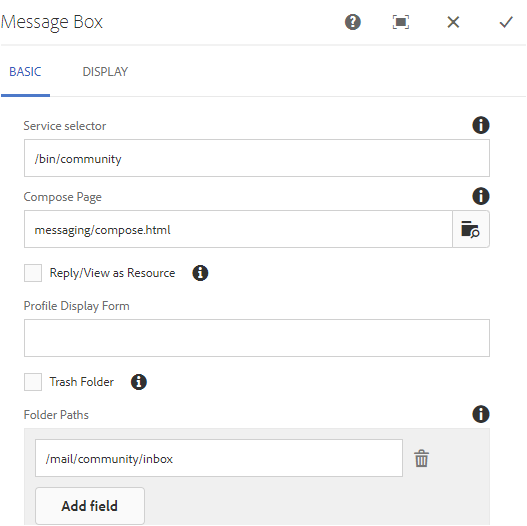

# 消息傳遞功能 {#messaging-feature}

除了在論壇和評論中發生的公開可見的互動外，AEM Communities的資訊傳遞功能還使社區成員能夠更私下地彼此互動。

當 [社區站點](/help/communities/overview.md#communitiessites) 的子菜單。

消息傳遞功能提供了以下功能：

**A**  — 向一個或多個社區成員發送消息

**B**  — 發送直接消息 [批量到社區成員組](/help/communities/messaging.md#group-messaging)

**C**  — 發送包含附件的郵件

**D**  — 轉發消息

**E**  — 回復消息

**F**  — 刪除消息

**G**  — 還原已刪除的消息

要啟用和修改消息傳遞功能，請參閱：

* [配置消息](/help/communities/messaging.md) 為管理員
* [消息傳送軟體包](/help/communities/essentials-messaging.md) 開發人員

>[!NOTE]
>
>不支援添加 `Compose Message, Message, or Message List` 元件(在 `Communities`元件組)到作者編輯模式下的頁面。

## 配置消息傳遞元件 {#configure-messaging-components}

為社區站點啟用消息傳遞後，將不必進行進一步配置來設定它。 如果需要更改預設配置，則提供該資訊。

### 配置消息清單（消息框） {#configure-message-list-message-box}

修改消息清單的配置 **收件箱**。 **已發送項**, **垃圾** 消息功能的頁面，在 [作者編輯模式](/help/communities/sites-console.md#authoring-site-content)。

1. 在 `Preview` 模式，選擇 **消息** 連結以開啟主消息頁面。 然後選擇 **收件箱**。 **已發送項** 或 **垃圾** 為該消息清單配置元件。

1. 在 `Edit` 模式，在頁面上選擇元件。
1. 要訪問配置對話框，請通過選擇 `link` 表徵圖
取消繼承後，可以選擇「配置」表徵圖以開啟「配置」對話框。

1. 配置完成後，必須通過選擇 `broken link` 表徵圖

#### 基本頁籤 {#basic-tab}

* **服務選擇器**

   (*必需*)將此值設定為屬性的值 **`serviceSelector.name`** 從 [AEM Communities消息服務](/help/communities/messaging.md#messaging-operations-service)。

* **合成頁**

   (*必需*)成員按一下 **`Reply`** 按鈕 目標頁面應包含 **撰寫郵件** 的雙曲餘切值。

* **答復/查看為資源**

   如果選中，「答復URL」和「查看URL」將引用資源，否則資料將作為URL中的查詢參數傳遞。

* **配置檔案顯示窗體**

   用於顯示發件人配置檔案的配置檔案窗體。

* **垃圾資料夾**

   如果選中，則此「消息清單」元件只顯示標籤為已刪除（垃圾）的消息。

* **資料夾路徑**

   (*必需*)引用為 **收件箱.path.name** 和 **sentitems.path.name** 的 [AEM Communities消息服務](/help/communities/messaging.md#messaging-operations-service)。 為 `Inbox`，使用 **收件箱.path.name**。 為 `Outbox`，使用 **sentitems.path.name**。 配置時 `Trash`，添加兩個同時具有這兩個值的條目。

#### 顯示頁籤 {#display-tab}

* **「標籤讀取」按鈕**

   如果選中，則顯示 `Read`按鈕。

* **標籤未讀按鈕**

   如果選中，則顯示 `Mark Unread` 按鈕。

* **刪除按鈕**

   如果選中，則顯示 `Delete` 按鈕。 如果 **`Message Options`** 的子菜單。

* **訊息選項**

   如果選中，則顯示 **`Reply`**。 **`Reply All`**。 **`Forward`** 和 **`Delete`** 按鈕，允許重新發送或刪除消息。 如果 **`Delete Button`** 的子菜單。

* **每頁的訊息**

   指定的編號是分頁方案中每頁顯示的最大消息數。 如果未指定數字（留空），則顯示所有消息，且沒有分頁。

* **時間戳記模式**

   提供一種或多種語言的時間戳模式。 預設值為en、de、fr、it、ja、zh_CN、ko_KR。

* **顯示使用者**

   選擇 **`Sender`** 或 **`Recipients`** 確定是顯示發件人還是收件人。

### 配置合成消息 {#configure-compose-message}

要修改合成消息頁的配置，請在 [作者編輯模式](/help/communities/sites-console.md#authoring-site-content)。

* 在 `Preview` 模式，選擇 **消息** 連結以開啟主消息頁面。 然後選擇「新建消息」按鈕以開啟 `Compose Message` 的子菜單。

* 在 `Edit` 模式，在包含消息正文的頁面上選擇主元件。
* 要訪問配置對話框，請通過選擇 `link` 表徵圖
取消繼承後，可以選擇「配置」表徵圖以開啟「配置」對話框。

* 配置完成後，必須通過選擇 `broken link` 表徵圖

#### 基本頁籤 {#basic-tab-1}

* **重定向URL**

   輸入消息發送後顯示的頁面的URL。 比如說， `../messaging.html`。

* **取消 URL**

   輸入發件人取消郵件時顯示的頁面的URL。 比如說， `../messaging.html`。

* **消息主題的最大長度**

   「主題」欄位中允許的最大字元數。 比如500 預設值為無限制。

* **消息正文的最大長度**

   「內容」欄位中允許的最大字元數。 比如10000 預設值為無限制。

* **服務選擇器**

   (*必需*)將此值設定為屬性的值 **`serviceSelector.name`** 從 [AEM Communities消息服務](/help/communities/messaging.md#messaging-operations-service)。

#### 顯示頁籤 {#display-tab-1}

* **顯示主題欄位**

   如果選中，則顯示 `Subject` 欄位並啟用向消息添加主題。 未選中預設值。

* **主題標籤**

   輸入要在 `Subject` 的子菜單。 預設值為 `Subject`。

* **顯示附加檔案欄位**

   如果選中，則顯示 `Attachment` 欄位，並啟用向郵件添加檔案附件。 未選中預設值。

* **附加檔案標籤**

   輸入要在 `Attachment` 的子菜單。 預設值為 **`Attach File`**。

* **顯示內容欄位**

   如果選中，則顯示 `Content` 欄位並啟用添加消息正文。 未選中預設值。

* **內容標籤**

   輸入要在 `Content` 的子菜單。 預設值為 **`Body`**。

* **具有 RTF 編輯器**

   如果選中，則表示使用自定義內容文本框及其富格文本編輯器。 未選中預設值。

* **時間戳記模式**

   提供一種或多種語言的時間戳模式。 預設值為en、de、fr、it、ja、zh_CN、ko_KR。
