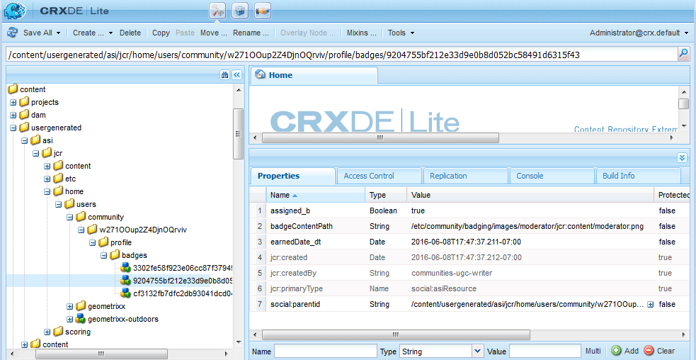

# 評分和徽章要點 {#scoring-and-badges-essentials}

AEM Communities評分和徽章功能可識別和獎勵社區成員。

有關設定功能的詳細資訊，請參閱

* [社區評分和徽章](/help/communities/implementing-scoring.md)

本頁包含其他技術詳細資訊：

* 如何 [顯示徽章](#displaying-badges) 作為影像或文本
* 如何開啟廣泛 [調試日誌](#debug-log-for-scoring-and-badging)
* 如何 [訪問UGC](#ugc-for-scoring-and-badging) 有關評分和標籤

>[!CAUTION]
>
>在CRXDE Lite中可見的實現結構可能會發生變化。

## 顯示徽章 {#displaying-badges}

在HBS模板的客戶端上，將標籤顯示為文本還是影像進行控制。

例如，搜索 `this.isAssigned` 在 `/libs/social/forum/components/hbs/topic/list-item.hbs`:

```
{{#each author.badges}}

  {{#if this.isAssigned}}

    <div class="scf-badge-text">

      {{this.title}}

    </div>

  {{/if}}

{{/each}}

{{#each author.badges}}

  {{#unless this.isAssigned}}

    

  {{/unless}}

{{/each}}
```

如果為true，則isAssigned表示已為角色分配了徽章，並且徽章應顯示為文本。

如果為false，則isAssigned表示已為已獲得的分數授予標籤，並且標籤應顯示為影像。

對此行為所做的任何更改都應在自定義指令碼中（覆蓋或覆蓋）。 請參閱 [客戶端自定義](/help/communities/client-customize.md)。

## 用於計分和標籤的調試日誌 {#debug-log-for-scoring-and-badging}

為幫助調試記分和標籤，可以設定自定義日誌檔案。 如果該功能出現問題，則可以將此日誌檔案的內容提供給客戶支援。

有關詳細說明，請訪問 [建立自定義日誌檔案](/help/sites-deploying/monitoring-and-maintaining.md#create-a-custom-log-file)。

要快速設定slinglog檔案：

1. 訪問 **Adobe Experience ManagerWeb控制台日誌支援**，例如

   * https://localhost:4502/system/console/slinglog

1. 選擇 **添加新記錄器**

   1. 選擇 `DEBUG` 為 **日誌級別**

   1. 輸入名稱 **日誌檔案**，例如

      * logs/scoring-debug.log
   1. 輸入2 **記錄器** (類條目(使用 `+` 表徵圖)

      * `com.adobe.cq.social.scoring`
      * `com.adobe.cq.social.badging`
   1. 選擇 **保存**


要查看日誌條目：

* 從Web控制台

   * 在 **狀態** 菜單
   * 選擇 **日誌檔案**
   * 搜索日誌檔案名，如 `scoring-debug`

* 在伺服器的本地磁碟上

   * 日誌檔案位於&lt;*伺服器安裝目錄*>/crx quickstart/logs/&lt;*日誌檔案名*>.log

   * 例如 `.../crx-quickstart/logs/scoring-debug.log`


## UGC用於評分和簽名 {#ugc-for-scoring-and-badging}

當所選SRP是JSRP或MSRP，而不是ASRP時，可以查看與評分和標籤相關的UGC。 (如果不熟悉這些術語，請參閱 [社區內容儲存](/help/communities/working-with-srp.md) 和 [儲存資源提供程式概述](/help/communities/srp.md)。)

訪問記分和標籤資料的說明使用JSRP，因為UGC可以使用 [CRXDE Lite](/help/sites-developing/developing-with-crxde-lite.md)。

**JSRP作者**:在作者環境中進行實驗會產生UGC，該UGC僅從作者環境中可見。

**發佈時的JSRP**:同樣，如果在發佈環境上進行測試，則有必要使用發佈實例的管理權限訪問CRXDE Lite。 如果發佈實例正在運行 [生產模式](/help/sites-administering/production-ready.md) (nosamplecontent runmode), [啟用CRXDE Lite](/help/sites-administering/enabling-crxde-lite.md)。

UGC在JSRP上的基位置是 `/content/usergenerated/asi/jcr/`。

### 評分和標籤API {#scoring-and-badging-apis}

以下API可用：

* [com.adobe.cq.social.scoring.api(6.3)](https://experienceleague.adobe.com/docs/experience-manager-release-information/aem-release-updates/previous-updates/aem-previous-versions.html)
* [com.adobe.cq.social.badging.api(6.3)](https://experienceleague.adobe.com/docs/experience-manager-release-information/aem-release-updates/previous-updates/aem-previous-versions.html)

已安裝功能包的最新Javadocs可從Adobe儲存庫向開發人員提供。 請參閱 [將Maven用於社區：賈瓦多克](/help/communities/maven.md#javadocs)。

**UGC在儲存庫中的位置和格式可能會發生更改，但不會發出警告**。

### 示例設定 {#example-setup}

儲存庫資料的螢幕快照來自為兩個不同站點上的論壇設定評分和標籤AEM:

1. 站AEM點 *與* 唯一id（使用嚮導建立的社區站點）:

   * 使用在 [入門教程](/help/communities/getting-started.md)
   * 查找論壇頁面節點

      `/content/sites/engage/en/forum/jcr:content`

   * 添加計分和標籤屬性

   ```
   scoringRules = [/libs/settings/community/scoring/rules/comments-scoring,
   /libs/settings/community/scoring/rules/forums-scoring]
   ```

   ```
   badgingRules =[/libs/settings/community/badging/rules/comments-scoring,
   /libs/settings/community/badging/rules/forums-scoring]
   ```

   * 查找論壇元件節點

      `/content/sites/engage/en/forum/jcr:content/content/primary/forum`
( `sling:resourceType = social/forum/components/hbs/forum`)

   * 要顯示徽章，請添加屬性

      `allowBadges = true`

   * 用戶登錄，建立論壇主題，並獲得銅牌


1. 站AEM點 *無* 唯一ID :

   * 使用 [社區元件指南](/help/communities/components-guide.md)
   * 查找論壇頁面節點

      `/content/community-components/en/forum/jcr:content`

   * 添加計分和標籤屬性

   ```
   scoringRules = [/libs/settings/community/scoring/rules/comments-scoring,
   /libs/settings/community/scoring/rules/forums-scoring]
   ```

   ```
   badgingRules =[/libs/settings/community/badging/rules/comments-badging,
   /libs/settings/community/badging/rules/forums-badging]
   ```

   * 查找論壇元件節點

      `/content/community-components/en/forum/jcr:content/content/forum`
( `sling:resourceType = social/forum/components/hbs/forum`)

   * 要顯示徽章，請添加屬性

      `allowBadges = true`

   * 用戶登錄，建立論壇主題，並獲得銅牌


1. 使用cURL為用戶分配版主徽章：

   ```shell
   curl -i -X POST -H "Accept:application/json" -u admin:admin -F ":operation=social:assignBadge" -F "badgeContentPath=/libs/settings/community/badging/images/moderator/jcr:content/moderator.png" https://localhost:4503/home/users/community/w271OOup2Z4DjnOQrviv/profile.social.json
   ```

   當用戶獲得兩枚銅製徽章並被授予版主徽章時，其論壇條目顯示如下：

   

>[!NOTE]
>
>此示例不遵循以下最佳做法：
>
>* 評分規則名稱應具有全局唯一性；他們不應該以同名結尾。
>
>  一個 *不* 執行：
>
>  /libs/settings/community/scoring/rules/site1/forums評分
>  /libs/settings/community/scoring/rules/site2/forums評分
>
>* 為不同站點建立唯一的標籤AEM影像


### 訪問計分UGC {#access-scoring-ugc}

使用 [API](#scoring-and-badging-apis) 。

為調查目的，在示例中使用JSRP時，包含分數的基資料夾

* `/content/usergenerated/asi/jcr/scoring`

的子節點 `scoring` 是評分規則名稱。 因此，最佳做法是，對伺服器上的規則名稱進行評分是全局唯一的。

對於GeometrixxEngage站點，用戶及其分數位於使用評分規則名稱、社區站點站點ID( `engage-ba81p`)，唯一ID和用戶ID:

* `.../scoring/forums-scoring/engage-ba81p/6d179715c0e93cb2b20886aa0434ca9b5a540401/riley`

對於社區元件指南站點，用戶及其分數位於使用評分規則名稱（預設ID）構建的路徑中( `default-site`)，唯一ID和用戶ID:

* `.../scoring/forums-scoring/default-site/b27a17cb4910a9b69fe81fb1b492ba672d2c086e/riley`

分數儲存在屬性中 `scoreValue_tl` 只能包含值或間接引用atomicCounter。


### 訪問標籤UGC {#access-badging-ugc}

使用 [API](#scoring-and-badging-apis) 。

為了調查目的，以JSRP為例，將包含有關已分配或已授予徽章的資訊的基本資料夾

* `/content/usergenerated/asi/jcr`

後跟用戶配置檔案的路徑，以徽章資料夾結尾，如：

* `/home/users/community/w271OOup2Z4DjnOQrviv/profile/badges`

#### 授予的徽章 {#awarded-badge}


#### 分配的徽章 {#assigned-badge}



## 其他資訊 {#additional-information}

要顯示基於點的已排序成員清單，請執行以下操作：

* [排行榜功能](/help/communities/functions.md#leaderboard-function) 包含在社區網站或組模板中。
* [排行榜元件](/help/communities/enabling-leaderboard.md)，排行榜功能的特色元件，用於頁面創作。
