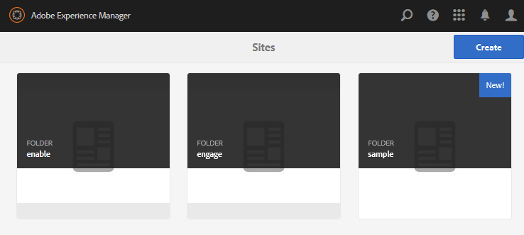

# 建立範例頁面 {#create-a-sample-page}

自AEM 6.1 Communities起，建立範例頁面的最簡單方式就是建立簡單的社群網站，由頁面函陣列成。

這包括Parsys元件，因此您可以 [啟用元件以供編寫](basics.md#accessing-communities-components).

探索範例元件的另一個選項是使用 [社群元件指南](components-guide.md).

## 建立社群網站 {#create-a-community-site}

這類似於建立中所述的網站 [AEM Communities快速入門](getting-started.md).

主要差異在於此教學課程會建立社群網站範本，其中僅包含 [Page函式](functions.md#page-function) 以建立簡單的社群網站。 這項功能不含其他功能（除了所有社群網站都具備的預先有線功能以外）。

### 建立新網站範本 {#create-new-site-template}

若要開始使用，請建立 [社群網站範本](sites.md).

在作者執行個體的全域導覽中，選取 **[!UICONTROL 工具]** > **[!UICONTROL Communities]** > **[!UICONTROL 網站範本]**.

* 選取 `Create button`
* 基本資訊

   * `Name`：單頁範本
   * `Description`：包含單一頁面函式的範本。
   * 選取 `Enabled`

* 結構

   * 拖曳 `Page` 函式至範本產生器
   * 如需組態功能詳細資訊，請輸入

      * `Title`：單頁
      * `URL`：頁面

* 選取 **`Save`** 針對設定
* 選取 **`Save`** 針對網站範本

### 建立新社群網站 {#create-new-community-site}

現在根據簡單的網站範本建立社群網站。

建立網站範本後，從全域導覽選取 **[!UICONTROL 社群>網站]**.

* 選取 **`Create`** 圖示

* 步驟 `1 - Site Template`

   * `Title`：簡單社群網站
   * `Description`：社群網站，由實驗用的單一頁面組成。
   * `Community Site Root: (leave blank)`
   * `Community Site Base Language: English`
   * `Name`：範例

      * url = http://localhost:4502/content/sites/sample

      * `Template`：選擇 `Single Page Template`

     

* 選取 `Next`
* 步驟 `2 - Design`

   * 選取任何設計

* 選取 `Next`
* 選取 `Next`

  （接受所有預設設定）

* 選取 `Create`

  

## 發佈網站 {#publish-the-site}

從 [社群網站主控台](sites-console.md)，選取發佈圖示以發佈網站，預設為http://localhost:4503。

## 在編輯模式下開啟作者網站 {#open-the-site-on-author-in-edit-mode}

選取開啟的網站圖示，以便您可以在編輯模式中檢視網站。

URL為 [http://localhost:4502/editor.html/content/sites/sample/en.html](http://localhost:4502/editor.html/content/sites/sample/en.html)

在簡單的首頁上，您可以透過社群功能和範本檢視預先佈線的內容，並嘗試新增和設定社群元件。

## 在發佈時檢視網站 {#view-site-on-publish}

發佈頁面後，請開啟 [發佈執行個體](http://localhost:4503/content/sites/sample/en.html) 以匿名網站訪客、登入成員或管理員身分來實驗這些功能。 除非管理員登入，否則在製作環境中可見的管理連結不會出現在發佈環境中。
