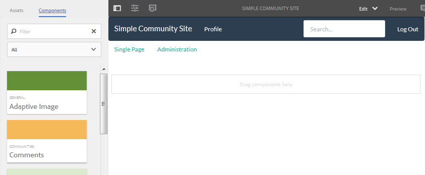

# 建立示例頁 {#create-a-sample-page}

截至AEM6.1社區，建立示例頁面的最簡單方法是建立簡單的社區站點，僅包含Page函式。

這將包括parsys元件，以便 [啟用創作元件](basics.md#accessing-communities-components)。

使用示例元件進行探索的另一個選項是使用 [社區元件指南](components-guide.md)。

## 建立社區網站 {#create-a-community-site}

這與建立新站點非常相似，如中所述 [AEM Communities入門](getting-started.md)。

主要區別是，本教程將建立一個僅包含 [頁函式](functions.md#page-function) 以建立一個簡單的社區站點，該站點沒有其他功能（除了所有社區站點的基本的預佈線功能外）。

### 建立新網站模板 {#create-new-site-template}

要開始，請建立一個 [社區網站模板](sites.md)。

從作者實例上的全局導航選擇 **[!UICONTROL 工具]** > **[!UICONTROL 社區]** > **[!UICONTROL 站點模板]**。

* 選取 `Create button`
* 基本資訊

   * `Name`:單頁模板
   * `Description`:由單個Page函陣列成的模板。
   * 選取 `Enabled`

* 結構

   * 拖動 `Page` 函式到模板生成器
   * 對於配置函式詳細資訊，請輸入

      * `Title`:單頁
      * `URL`: 頁面

* 選擇 **`Save`** 配置
* 選擇 **`Save`** 站點模板

### 新建社區網站 {#create-new-community-site}

現在，基於簡單站點模板建立新的社區站點。

建立網站模板後，從全局導航選擇 **[!UICONTROL 社區>站點]**。

* 選擇 **`Create`** 表徵圖

* 步驟 `1 - Site Template`

   * `Title`:簡單社區站點
   * `Description`:社區站點，包含單頁面進行實驗。
   * `Community Site Root: (leave blank)`
   * `Community Site Base Language: English`
   * `Name`:樣本

      * url = http://localhost:4502/content/sites/sample

      * `Template`:選擇 `Single Page Template`

      

* 選取 `Next`
* 步驟 `2 - Design`

   * 選擇任何設計

* 選取 `Next`
* 選取 `Next`

   （接受所有預設設定）

* 選取 `Create`

   

## 發佈網站 {#publish-the-site}

從 [社區站點控制台](sites-console.md)，選擇要發佈網站的發佈表徵圖，預設為http://localhost:4503。

## 在編輯模式下開啟作者網站 {#open-the-site-on-author-in-edit-mode}

選擇開啟的站點表徵圖以在編輯模式下查看站點。

URL將是 [http://localhost:4502/editor.html/content/sites/sample/en.html](http://localhost:4502/editor.html/content/sites/sample/en.html)

在簡單的首頁上，您可以查看通過社區功能和模板預先佈線的內容，並玩添加和配置社區元件的遊戲。

## 查看發佈時的網站 {#view-site-on-publish}

發佈頁面後，在 [發佈實例](http://localhost:4503/content/sites/sample/en.html) 以匿名站點訪問者、登錄成員或管理員身份對這些功能進行實驗。 除非管理員登錄，否則在作者環境中可見的「管理」(Administration)連結將不會顯示在發佈環境中。
