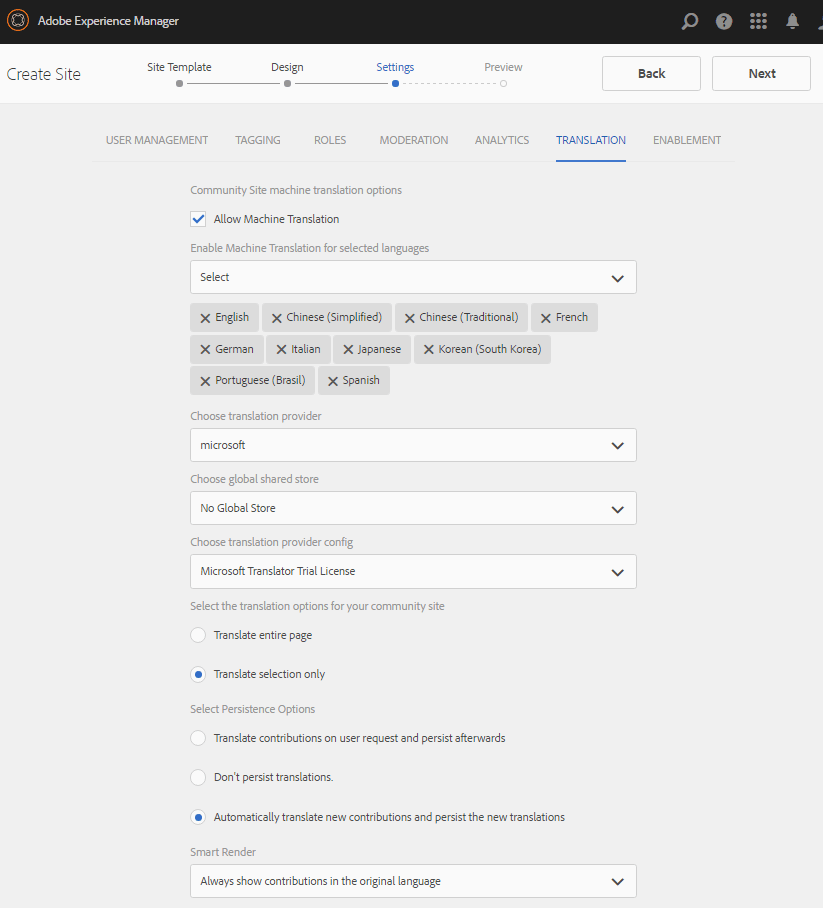

# 新建社區網站{#author-a-new-community-site}

## 建立社區網站 {#create-a-community-site}

使用作者實例建立社區網站。 在AEM作者實例上：

1. 使用管理員權限登錄。
1. 從全局導航，轉到 **[!UICONTROL 社區]** > **[!UICONTROL 站點]**。

「社區站點」控制台提供了嚮導，可指導用戶完成建立社區站點的步驟。 可以向 `Next` 步驟或 `Back` 在最後一步中提交站點之前，先執行上一步。

要開始建立新社區站點，請執行以下操作：

* 選擇 `Create` 按鈕

### 步驟1:站點模板 {#step-site-template}

在 [站點模板步驟](/help/communities/sites-console.md#step2013asitetemplate)，輸入標題、說明、URL名稱，然後選擇社區網站模板，例如：

* **社群網站標題**: `Getting Started Tutorial`
* **社群網站說明**: `A site for engaging with the community.`
* **社區站點根**:（留空）預設根 `/content/sites`)
* **雲配置**:（如果未指定雲配置，請保留空白）提供指定雲配置的路徑。
* **社區網站基語**:（對於單語言，保留原狀）英語)使用下拉清單選擇 *或* 基本語言 — 德語、義大利語、法語、日語、西班牙語、葡萄牙語（巴西）、中文（繁體）和簡體中文。 將為添加的每種語言建立一個社區站點，並且按照中介紹的最佳做法存在於同一站點資料夾中 [翻譯多語言站點的內容](/help/sites-administering/translation.md)。 每個站點的根頁將包含一個子頁，該子頁由所選語言之一的語言代碼命名，如英語的「en」或法語的「fr」。

* **社區站點名稱**:參與

   * 在建立站點後，由於名稱不易更改，請按兩下該名稱
   * 初始URL將顯示在社區網站名稱下
   * 對於有效的URL，請附加基本語言代碼+ &quot;。html&quot;
   * *例如* https://localhost:4502/content/sites/ `engage/en.html`

* **模板**:下拉選擇 `Reference Site`

* 選擇 **下一個**。

### 步驟2:設計 {#step-design}

「設計」步驟分兩節介紹，用於選擇主題和品牌標題：

#### 社區網站主題 {#community-site-theme}

選擇要應用於模板的所需樣式。 選中後，主題將用複選標籤重疊。

#### 社區網站品牌 {#community-site-branding}

（可選）上載橫幅影像以在網站頁面中顯示。 標語被固定在瀏覽器的左邊緣，位於社區站點標題和導航連結之間。 橫幅高度裁切為120像素。 沒有調整橫幅大小以適合瀏覽器的寬度和120像素高度。

選擇 **下一個**。

### 第3步：設定 {#step-settings}

在「設定」步驟中，選擇 `Next`請注意，有七個部分提供了對涉及用戶管理、標籤、審核、組管理、分析和翻譯的配置的訪問。

#### 使用者管理 {#user-management}

選中所有複選框 [用戶管理](/help/communities/sites-console.md#user-management)

* 允許站點訪問者自註冊
* 允許站點訪問者在不登錄的情況下查看站點
* 允許成員從其他社區成員發送和接收消息
* 允許登錄Facebook，而不是註冊和建立配置檔案
* 允許登錄Twitter，而不是註冊和建立配置檔案

>[!NOTE]
>
>對於生產環境，必須建立定製的Facebook和Twitter應用程式。 請參閱 [與Facebook和Twitter社會登錄](/help/communities/social-login.md)。

#### 標籤 {#tagging}

通過選擇先前通過以下方式定義的命名空間來控制可應AEM用於社區內容的標籤 [標籤控制台](/help/sites-administering/tags.md#tagging-console) (例如 [教程命名空間](/help/communities/setup.md#create-tutorial-tags))。

使用「提前類型搜索」可輕鬆查找命名空間。 例如，

* 類型 `tut`
* 選取 `Tutorial`

#### 角色 {#roles}

[社區成員角色](/help/communities/users.md) 通過「角色」部分中的設定進行分配。

要讓社區成員（或成員組）作為社區經理體驗該站點，請使用「提前鍵入」搜索，然後從下拉清單中選擇成員或組名稱。

例如，

* 類型 `q`
* 選擇奎恩·哈珀

>[!NOTE]
>
>[隧道服務](https://helpx.adobe.com/experience-manager/6-3/help/communities/deploy-communities.html#tunnel-service-on-author) 允許選擇僅存在於發佈環境中的成員和組。

#### 審核 {#moderation}

接受的預設全局設定 [調節](/help/communities/sites-console.md#moderation) 用戶生成的內容(UGC)。

#### 分析 {#analytics}

如果Adobe Analytics獲得許可，並且已配置了分析雲服務和框架，則可以啟用分析並選擇框架。

請參閱 [社區功能的分析配置](/help/communities/analytics.md)。

#### 翻譯 {#translation}

的 [翻譯設定](/help/communities/sites-console.md#translation) 指定站點的基本語言，以及UGC是否可以翻譯以及翻譯到哪種語言（如果可以）。

* 檢查 **允許機器翻譯**
* 保留預設機器翻譯服務為翻譯選擇的預設語言
* 保留預設翻譯提供程式和配置
* 由於沒有語言副本，因此不需要全局儲存
* 選擇 **翻譯整頁**
* 保留預設持久性選項

### 第4步：建立社區站點 {#step-create-communities-site}

選擇 **建立。**

進程完成後，新站點的資料夾將顯示在「社區 — 站點」控制台中。

## 發佈社區網站 {#publish-the-community-site}

建立的站點應從「社區」 — 「站點」控制台進行管理，該控制台與建立新站點的控制台相同。

選擇社區網站的資料夾以將其開啟後，將滑鼠懸停在網站表徵圖上，以便顯示四個操作表徵圖：

在選擇第四個橢圓表徵圖（更多操作）時，將顯示「導出站點」和「刪除站點」選項。

從左到右分別是：

* **開啟網站**

   選擇鉛筆表徵圖以在作者編輯模式下開啟社區網站，添加和/或配置頁面元件

* **編輯網站**

   選擇屬性表徵圖以開啟社區網站以修改屬性，如標題或更改主題

* **發佈網站**

   選擇「世界」表徵圖以發佈社區網站（例如，如果發佈伺服器在本地電腦上運行，則預設為localhost:4503）

* **匯出網站**

   選擇導出表徵圖以建立同時儲存在 [軟體包管理器](/help/sites-administering/package-manager.md) 下載。
請注意，UGC不包括在站點包中。

* **刪除網站**

   選擇刪除表徵圖以從中刪除社區站點 **[!UICONTROL 社區>站點控制台]**。 此操作將刪除與站點關聯的所有項，如UGC、用戶組、資產和資料庫記錄。

>[!NOTE]
>
>如果未使用發佈實例的預設埠4503，則編輯預設複製代理以將埠號設定為正確值。
>
>在作者實例上，從主菜單：
>
>1. 導航到 **[!UICONTROL 工具]** > **[!UICONTROL 操作]** > **[!UICONTROL 複製]** 的子菜單。
>1. 選擇 **[!UICONTROL 作者代理]**。
>1. 選擇 **[!UICONTROL 預設代理（發佈）]**。
>1. 旁邊 **[!UICONTROL 設定]**&#x200B;選中 **[!UICONTROL 編輯]**。
>1. 在代理設定的彈出對話框中，選擇 **[!UICONTROL 運輸]** 頁籤。
>1. 在URI中，將埠號4503更改為所需的埠號。 例如，要使用埠6103:https://localhost:6103/bin/receive?sling:authRequestLogin=1
>1. 選擇 **[!UICONTROL 確定]**。
>1. （可選）選擇 **[!UICONTROL 清除]** 或 **[!UICONTROL 強制重試]** 重置複製隊列。

### 選擇發佈 {#select-publish}

確保發佈伺服器正在運行後，選擇「世界」表徵圖以發佈社區網站。

成功發佈社區網站後，會短暫顯示一條消息「網站已發佈」。

### 新建社區用戶組 {#new-community-user-groups}

與新社區站點一起，建立新用戶組，這些用戶組具有為各種管理功能設定的適當權限。 有關詳細資訊，請訪問 [社區站點的用戶組](/help/communities/users.md#usergroupsforcommunitysites)。

對於此新社區站點，如果在步驟1中指定站點名稱「engage」，則可以從 [組控制台](/help/communities/members.md) （全局導航）社區、組):

* 社區參與社區經理
* 社區參與組管理員
* 社區參與成員
* 社區參與審查者
* 社區參與特權成員
* 社區參與網站內容管理器

請注意 [亞倫·麥克唐納](/help/communities/tutorials.md#demo-users) 是

* 社區參與社區經理
* 社區參與審查者
* 社區參與成員（間接作為審閱者組的成員）

#### https://localhost:4503/content/sites/engage/en.html {#http-localhost-content-sites-engage-en-html}

## 配置身份驗證錯誤 {#configure-for-authentication-error}

一旦已配置並推送站點進行發佈， [配置登錄映射](/help/communities/sites-console.md#configure-for-authentication-error) ( `Adobe Granite Login Selector Authentication Handler`)。 優點是，當未正確輸入登錄憑據時，驗證錯誤將重新顯示社區站點的登錄頁，並顯示錯誤消息。

添加 `Login Page Mapping` 如

* `/content/sites/engage/en/signin:/content/sites/engage/en`

## 可選步驟 {#optional-steps}

### 更改預設首頁 {#change-the-default-home-page}

使用發佈網站進行演示時，將預設首頁更改為新網站可能會非常有用。

要執行此操作，需要使用 [克爾克斯德](https://localhost:4503/crx/de) 簡化以編輯 [資源映射](/help/sites-deploying/resource-mapping.md) 的子菜單。

開始：

1. 在發佈實例上，使用管理員權限登錄。
1. 瀏覽到 [https://localhost:4503/crx/de](https://localhost:4503/crx/de)。
1. 在項目瀏覽器中，展開 `/etc/map.`
1. 選擇 `http` 節點：

   * 選擇 **建立節點：**

      * **名稱** localhost.4503(do) *不* 使用「：」)

      * **類型** [sling：映射](https://sling.apache.org/documentation/the-sling-engine/mappings-for-resource-resolution.html)

1. 使用新建立的 `localhost.4503` 選定的節點：

   * 新增屬性:

   * **名稱** 吊帶：匹配
      * **類型** 字串
      * **值** localhost.4503/$（必須以「$」字元結尾）
   * 新增屬性:

      * **名稱** sling:internal重定向
      * **類型** 字串
      * **值** /content/sites/engage/en.html

1. 選擇 **全部保存。**
1. （可選）刪除瀏覽歷史記錄。
1. 瀏覽https://localhost:4503/。

   * 請訪問https://localhost:4503/content/sites/engage/en.html

>[!NOTE]
>
>要禁用，只需在 `sling:match` 帶「x」的屬性值 —  `xlocalhost.4503/$`  — 和 **全部保存**。

#### 故障排除：保存映射時出錯 {#troubleshooting-error-saving-map}

如果無法保存更改，請確保節點名稱為 `localhost.4503`，帶「dot」分隔符，但 `localhost:4503` 帶有「冒號」分隔符，如 `localhost`不是有效的命名空間前置詞。

#### 故障排除：無法重定向 {#troubleshooting-fail-to-redirect}

&#39;**$**&#39;在規則運算式的末尾 `sling:match`弦很重要，所以 `https://localhost:4503/` 映射，否則重定向值將前置詞為URL中server:port之後可能存在的任何路徑。 因此，當AEM嘗試重定向到登錄頁時，失敗。

### 修改站點 {#modify-the-site}

站點最初建立後，作者可以使用 [「開啟網站」表徵圖](/help/communities/sites-console.md#authoring-site-content) 執行標準創AEM作活動。

此外，管理員可使用 [「編輯網站」表徵圖](/help/communities/sites-console.md#modifying-site-properties) 修改網站的屬性，如標題。

修改後，請記住 **保存** 和&#x200B;**發佈** 地址欄。

>[!NOTE]
>
>如果不熟悉AEM，請查看 [基本處理](/help/sites-authoring/basic-handling.md) 和 [創作頁面的快速指南](/help/sites-authoring/qg-page-authoring.md)。
