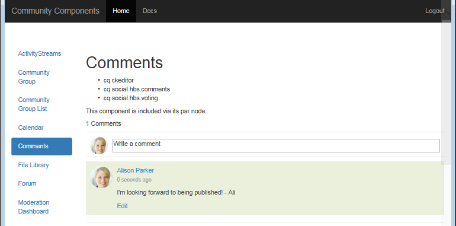

# 如何設定示範的MongoDB {#how-to-setup-mongodb-for-demo}

## 簡介 {#introduction}

此教學課程說明如何為&#x200B;*一個作者*&#x200B;執行個體和&#x200B;*一個發佈*&#x200B;執行個體設定[MSRP](msrp.md)。

透過此設定，社群內容可從製作和發佈環境存取，而無需轉送或反向復寫使用者產生的內容(UGC)。

此設定適用於&#x200B;*非生產*&#x200B;環境，例如開發和/或示範。

***生產*環境應該：**

* 使用復本集執行MongoDB
* 使用SolrCloud
* 包含多個發行者執行個體

## MongoDB {#mongodb}

### 安裝MongoDb {#install-mongodb}

* 從[https://www.mongodb.com/](https://www.mongodb.com/)下載MongoDB

   * 選擇作業系統：

      * Linux®
      * Mac 10.8
      * Windows 7

   * 版本選擇：

      * 至少使用2.6版

* 基本設定

   * 請依照MongoDB安裝指示操作。
   * 為單曲設定：

      * 不需要設定mongos或分片。

   * 已安裝的MongoDB資料夾稱為&lt;mongo-install>。
   * 定義的資料目錄路徑稱為&lt;mongo-dbpath>。

* MongoDB可在與AEM相同的主機上執行或遠端執行。

### 啟動MongoDB {#start-mongodb}

* &lt;mongo-install>/bin/mongod —dbpath &lt;mongo-dbpath>

這會使用預設連線埠27017啟動MongoDB伺服器。

* 若為Mac，請使用起始引號「ulimit -n 2048」來增加ulimit

>[!NOTE]
>
>如果MongoDB在&#x200B;*AEM之後*&#x200B;啟動，請&#x200B;**重新啟動**&#x200B;所有&#x200B;**AEM**&#x200B;執行個體，以便它們能夠正確連線到MongoDB。

### 示範生產選項：設定MongoDB復本集 {#demo-production-option-setup-mongodb-replica-set}

下列指令範例說明如何在localhost上設定具有3個節點的復本集：

* `bin/mongod --port 27017 --dbpath data --replSet rs0&`
* `bin/mongo`

   * `cfg = {"_id": "rs0","version": 1,"members": [{"_id": 0,"host": "127.0.0.1:27017"}]}`
   * `rs.initiate(cfg)`

* `bin/mongod --port 27018 --dbpath data1 --replSet rs0&`
* `bin/mongod --port 27019 --dbpath data2 --replSet rs0&`
* `bin/mongo`

   * `rs.add("127.0.0.1:27018")`
   * `rs.add("127.0.0.1:27019")`
   * `rs.status()`

## Solr {#solr}

### 安裝Solr {#install-solr}

* 從[Apache Lucene](https://archive.apache.org/dist/lucene/solr/)下載Solr：

   * 適用於任何作業系統。
   * Solr 7.0版。
   * Solr需要Java™ 1.7或更高版本。

* 基本設定

   * 遵循&#39;example&#39; Solr設定中的指示進行。
   * 不需要服務。
   * 已安裝的Solr資料夾稱為&lt;solr-install>。

### 為AEM Communities設定Solr {#configure-solr-for-aem-communities}

若要設定MSRP的Solr集合用於示範，有兩個需要決定的事項（請選取主要檔案的連結以取得詳細資訊）：

1. 以獨立或[SolrCloud模式](msrp.md#solrcloudmode)執行Solr。
1. 安裝[標準](msrp.md#installingstandardmls)或[進階](msrp.md#installingadvancedmls)多語言搜尋(MLS)。

### 獨立Solr {#standalone-solr}

執行Solr的方法可能會因安裝的版本和方式而異。 [Solr參考指南](https://archive.apache.org/dist/lucene/solr/ref-guide/)是權威檔案。

為簡化起見，以4.10版為例，以獨立模式啟動Solr：

* cd至&lt;solrinstall>/範例
* Java™ -jar start.jar

此程式會使用預設連線埠8983啟動Solr HTTP伺服器。 您可以瀏覽至Solr主控台，取得Solr主控台以進行測試。

* 預設Solr主控台： [http://localhost:8983/solr/](http://localhost:8983/solr/)

>[!NOTE]
>
>如果Solr Console無法使用，請檢查&lt;solrinstall>/example/logs底下的記錄。 檢視SOLR是否嘗試繫結至無法解析的特定主機名稱（例如「user-macbook-pro」）。
>
>若是如此，請使用此主機名稱的新專案（例如127.0.0.1 user-macbook-pro）更新`etc/hosts`檔案，以正確啟動Solr。

### SolrCloud {#solrcloud}

若要執行基本（非生產） solrCloud安裝程式，請啟動solr ，使用：

* `java -Dbootstrap_confdir=./solr/collection1/conf -Dbootstrap_conf=true -DzkRun -jar start.jar`

## 將MongoDB識別為通用存放區 {#identify-mongodb-as-common-store}

如有必要，啟動作者和發佈AEM例項。

如果AEM在MongoDB啟動之前執行，則必須重新啟動AEM執行個體。

依照主要檔案頁面上的指示進行： [MSRP - MongoDB公用存放區](msrp.md)

## 測試 {#test}

若要測試和驗證MongoDB公用存放區，請在發佈執行個體上張貼註解並在製作執行個體上檢視它，以及在MongoDB和Solr中檢視UGC：

1. 在發佈執行個體上，瀏覽至[社群元件指南](http://localhost:4503/content/community-components/en/comments.html)頁面，並選取Comments元件。
1. 登入以發表評論：
1. 在註解文字輸入方塊中輸入文字，然後按一下&#x200B;**[!UICONTROL Post]**

   

1. 只要檢視[作者執行個體](http://localhost:4502/content/community-components/en/comments.html)上的註解即可（可能仍以管理員/管理員身分登入）。

   

   注意：雖然在作者的&#x200B;*asipath*&#x200B;下有JCR節點，但這些節點適用於SCF架構。 實際的UGC不是JCR，而是在MongoDB。

1. 檢視mongodb **[!UICONTROL 社群]** > **[!UICONTROL 集合]** > **[!UICONTROL 內容]**&#x200B;中的UGC

   

1. 在Solr中檢視UGC：

   * 瀏覽至Solr儀表板： [http://localhost:8983/solr/](http://localhost:8983/solr/)。
   * 使用者`core selector`以選取`collection1`。
   * 選取`Query`。
   * 選取`Execute Query`。

   

## 疑難排解 {#troubleshooting}

### 未出現UGC {#no-ugc-appears}

1. 請確定MongoDB已安裝且正常執行。

1. 請確定MSRP已設定為預設提供者：

   * 在所有作者和發佈AEM執行個體上，重新造訪[儲存設定主控台](srp-config.md)，或檢查AEM存放庫：

   * 在JCR中，如果[/etc/socialconfig](http://localhost:4502/crx/de/index.jsp#/etc/socialconfig/)不包含[srpc](http://localhost:4502/crx/de/index.jsp#/etc/socialconfig/srpc)節點，表示儲存提供者為JSRP。
   * 如果srpc節點存在且包含節點[defaultconfiguration](http://localhost:4502/crx/de/index.jsp#/etc/socialconfig/srpc/defaultconfiguration)，則defaultconfiguration的屬性應該將MSRP定義為預設提供者。

1. 請確定在選取MSRP後重新啟動AEM。
