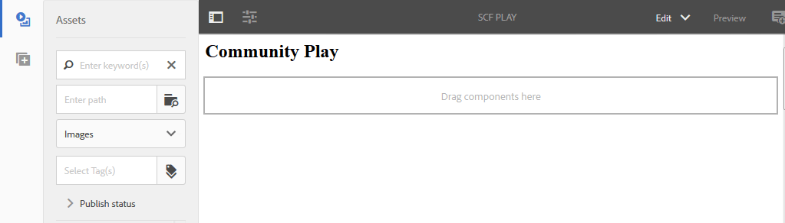

# 開發沙箱應用程式  {#develop-sandbox-application}

在本節中，範本已設定於 [初始應用](initial-app.md) 區段，以及 [初始內容](initial-content.md) 部分，可使用foundation指令碼開發應用程式，包括啟用Communities元件編寫的功能。 本節結束時，網站將可正常運作。

## 使用Foundation頁面指令碼 {#using-foundation-page-scripts}

新增呈現播放頁面範本的元件時建立的預設指令碼，會修改為包含基礎頁面的head.jsp和本機body.jsp。

### 超級資源類型 {#super-resource-type}

第一步是將資源超類型屬性添加到 `/apps/an-scf-sandbox/components/playpage` 節點，以便它繼承超類型的指令碼和屬性。

使用 CRXDE Lite:

1. 選擇節點 `/apps/an-scf-sandbox/components/playpage`.
1. 在「屬性」頁簽中，輸入新屬性，其值如下：

   名稱: `sling:resourceSuperType`

   類型: `String`

   值: `foundation/components/page`

1. 按一下綠色 **[!UICONTROL +添加]** 按鈕。
1. 按一下 **[!UICONTROL 全部儲存]**.

   

### 頭部和身體指令碼 {#head-and-body-scripts}

1. 在 **CRXDE Lite** 瀏覽器窗格，導航至 `/apps/an-scf-sandbox/components/playpage` 並按兩下檔案 `playpage.jsp` 以在編輯窗格中開啟它。

   `/apps/an-scf-sandbox/components/playpage/playpage.jsp`

   ```xml
   <%--
   
     An SCF Sandbox Play Component component.
   
     This is the component which renders content for An SCF Sandbox page.
   
   --%><%
   %><%@include file="/libs/foundation/global.jsp"%><%
   %><%@page session="false" %><%
   %><%
    // TODO add your code here
   %>
   ```

1. 請注意開啟/關閉指令碼標籤，請取代&quot; // TODO ...&quot; 包含用於的頭部和主體部分的指令碼 &lt;html>.

   超類型 `foundation/components/page`，此相同資料夾中未定義的任何指令碼將解析為 `/apps/foundation/components/page` 資料夾（如果存在），則與 `/libs/foundation/components/page` 檔案夾。

   `/apps/an-scf-sandbox/components/playpage/playpage.jsp`

   ```xml
   <%--
   
       An SCF Sandbox Play Component component: playpage.jsp
   
     This is the component which renders content for An SCF Sandbox page.
   
   --%><%
   %><%@include file="/libs/foundation/global.jsp"%><%
   %><%@page session="false" %>
   <html>
     <cq:include script="head.jsp"/>
     <cq:include script="body.jsp"/>
   </html>
   ```

1. 基礎指令碼 `head.jsp` 不需要重疊，但基礎劇本 `body.jsp` 空白。

   若要設定製作，請覆蓋 `body.jsp` 包含本機指令碼，並在內文中包含段落系統(parsys):

   1. 導覽至 `/apps/an-scf-sandbox/components`。
   1. 選取 `playpage` 節點。
   1. 按一下滑鼠右鍵並選取 `Create > Create File...`

      * 名稱： **body.jsp**
   1. 按一下 **[!UICONTROL 全部儲存]**.

   開啟 `/apps/an-scf-sandbox/components/playpage/body.jsp` 並貼入下列文字：

   ```xml
   <%--
   
       An SCF Sandbox Play Component component: body.jsp
   
     This is the component which renders content for An SCF Sandbox page.
   
   --%><%
   %><%@include file="/libs/foundation/global.jsp"%><%
   %><%@page session="false" %>
   <body>
       <h2>Community Play</h2>
       <cq:include path="par" resourceType="foundation/components/parsys" />
   </body>
   ```

1. 按一下 **[!UICONTROL 全部儲存]**.

**在編輯模式下，在瀏覽器中檢視頁面：**

* 標準 UI: `http://localhost:4502/editor.html/content/an-scf-sandbox/en/play.html`

您不應只看到標題 **社群播放**，也是編輯頁面內容的UI。

切換側面板時，會顯示「資產/元件」側面板，且視窗足夠寬，可同時顯示側邊內容和頁面內容。



* 傳統 UI: `http://localhost:4502/cf#/content/an-scf-sandbox/en/play.html`

以下是傳統UI中播放頁面的顯示方式，包括搭配內容尋找器(cf):


## Communities元件 {#communities-components}

要啟用Communities元件進行創作，請按照以下說明開始：

* [訪問Communities元件](basics.md#accessing-communities-components)

為了方便此沙箱，請從以下 **社群** 元件（勾選方塊即可啟用）:

* 評論
* 論壇
* 評等
* 評論
* 審核摘要 (顯示)
* 投票

此外，選擇 **[!UICONTROL 一般]** 元件，例如

* 影像
* 表格
* 文字
* 標題(Foundation)

>[!NOTE]
>
>為頁面分段啟用的元件會儲存在存放庫中，作為 `components` 屬性
>
>`/etc/designs/an-scf-sandbox/jcr:content/playpage/par` 節點。

## 登陸頁面 {#landing-page}

在多語言環境中，根頁面會包含指令碼，該指令碼會剖析來自用戶端的請求以判斷偏好的語言。

在這個簡單範例中，根頁面會靜態設定，以重新導向至英文頁面，日後可能開發為具有播放頁面連結的主要登陸頁面。

將瀏覽器URL變更為根頁面： `http://localhost:4502/editor.html/content/an-scf-sandbox.html`

* 選取頁面資訊圖示
* 選擇 **[!UICONTROL 開啟屬性]**
* 在「進階」標籤上

   * 對於重新導向項目，瀏覽至 **[!UICONTROL 網站]** > **[!UICONTROL SCF沙箱站點]** > **[!UICONTROL SCF沙箱]**
   * 按一下 **[!UICONTROL 確定]**

* 按一下 **[!UICONTROL 確定]**

發佈網站後，瀏覽至發佈執行個體上的根頁面會重新導向至英文頁面。

播放社區SCF元件之前的最後一個步驟是添加客戶端庫資料夾(clientlibs)。... [添加Clienlibs](add-clientlibs.md)
