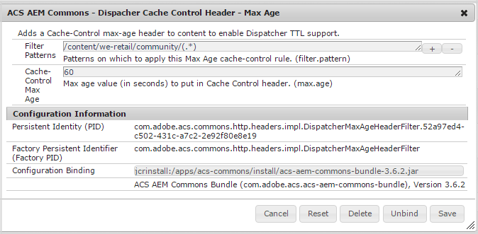

# 為社區配置調度程式 {#configuring-dispatcher-for-communities}

## AEM Communities {#aem-communities}

對於AEM Communities，必須配置調度程式，以確保 [社區站點](overview.md#community-sites)。 當包括社交登錄等功能時，需要進行其他配置。

瞭解特定部署和站點設計所需的內容

* 聯絡[客戶服務](https://helpx.adobe.com/tw/marketing-cloud/contact-support.html)

另請參閱主 [調度程式文檔](https://helpx.adobe.com/experience-manager/dispatcher/using/dispatcher.html)。

## 調度程式快取 {#dispatcher-caching}

### 概觀 {#overview}

Dispatcher caching forAEM Communities是調度程式為社區站點頁面的完全快取版本提供服務的能力。

目前，僅對匿名站點訪問者（如瀏覽社區站點或由於搜索而在社區頁面上著陸的用戶）以及索引頁面的搜索引擎提供支援。 其好處是匿名用戶和搜索引擎將體驗到改進的效能。

對於登錄成員，調度程式繞過快取，直接將請求中繼到發佈者，這樣所有頁面都可動態生成和傳送。

當配置為支援調度程式快取時，基於TTL的「最大時間」過期將添加到報頭，以確保調度程式快取頁是最新的。

### 要求 {#requirements}

* Dispatcher 4.1.2或更高版本(請參見 [正在安裝Dispatcher](https://helpx.adobe.com/experience-manager/dispatcher/using/dispatcher-install.html) )
* [ACS公AEM域包](https://adobe-consulting-services.github.io/acs-aem-commons/)

   * 3.3.2版或更高版本
   * `ACS AEM Commons - Dispatcher Cache Control Header - Max Age` OSGi配置

### 設定 {#configuration}

OSGi配置 **ACS公AEM域 — Dispatcher快取控制標頭 — 最大使用期** 設定在指定路徑下出現的快取頁的過期時間。

* 從 [Web控制台](../../help/sites-deploying/configuring-osgi.md)

   * 比如說， [http://localhost:4503/system/console/configMgr](http://localhost:4503/system/console/configMgr)

* 定位 `ACS AEM Commons - Dispatcher Cache Control Header - Max Age`
* 選擇「+」表徵圖以建立新連接配置

   

* **篩選模式**

   *（必需）* 一個或多個到社區頁的路徑。 比如說， `/content/sites/engage/(.*)`。

* **快取控制最大時間**

   *（必需）* 要添加到「快取控制」標頭的最大時間（以秒為單位）。 值必須大於零(0)。

## 調度程式篩選器 {#dispatcher-filters}

的/filter部分 `dispatcher.any` 檔案記錄在 [配置對內容的訪問 — /filter](https://helpx.adobe.com/tw/experience-manager/dispatcher/using/dispatcher-configuration.html#filter)。

本節介紹可能對社區功能正常運行所必需的條目。

篩選器屬性名稱遵循使用四位數字來指示應用篩選器模式的順序的慣例。 將多個篩選模式套用到一個請求時，最後一個套用的篩選模式會生效。因此，第一過濾模式通常用於拒絕所有內容，使得以下模式用於以受控方式恢復訪問。

以下示例使用屬性名稱，這些屬性名稱可能需要修改以適合任何特定的dispatcher.any檔案。

另請參閱:

* [調度程式安全核對表](https://helpx.adobe.com/tw/experience-manager/dispatcher/using/security-checklist.html)

>[!NOTE]
>
>**屬性名稱示例**
>顯示的所有屬性名稱，如 **/0050** 和 **/0170**，應調整以適合現有dispatcher.any配置檔案。

>[!CAUTION]
>
>請參閱 [Dispatcher 安全性檢查清單](https://experienceleague.adobe.com/docs/experience-manager-dispatcher/using/getting-started/security-checklist.html)，了解使用 Dispatcher 限制存取時的更多考量事項。另外，閱讀 [安AEM全檢查清單](https://helpx.adobe.com/experience-manager/6-3/sites/administering/using/security-checklist.html) 有關安裝的其他安全詳AEM細資訊。

應將以下條目添加到/filter節的末尾，特別是所有拒絕條目之後。

<!-- New code wrt CQDOC-16081, changed by Vishabh on 10 Dec 2020.
-->

```shell
# design and template assets
/0050 { /type "allow" /url "/etc/designs/*" }

# collected JS/CSS from the components and design
/0051 { /type "allow" /url "/etc/clientlibs/*" }

# foundation search component - write stats
/0052 { /type "allow" /url "/bin/statistics/tracker/*" }

# allow users to edit profile page
/0054 { /type "allow" /url "* /home/users/*/*/profile.form.html*" }

# all profile data
/0057 { /type "allow" /url "/home/users/*/profile/*" }

# required for social "Sign In" link.
/0059 { /type "allow" /url "/etc/clientcontext/*" }

# required for "Sign Out" operation
/0063 { /type "allow" /url "* /system/sling/logout*" }

# enable Facebook and Twitter signin
/0064 { /type "allow" /url "/etc/cloudservices/*" }

# enable personalization
/0062 { /type "allow" /url "/libs/cq/personalization/*" }

# Enable CSRF token otherwise nothings works.
/5001 { /type "allow" /url "/libs/granite/csrf/token.json *"}
# Allow SCF User Model to bootstrap as it depends on the granite user
/5002 { /type "allow" /url "/libs/granite/security/currentuser.json*" }

# Allow Communities Site Logout button work
/5003 { /type "allow" /url "/system/sling/logout.html*" }

# Allow i18n to load correctly
/5004 { /type "allow" /url "/libs/cq/i18n/dict.en.json *" }

# Allow social json get pattern.
/6002 { /type "allow" /url "*.social.*.json*" }

# Allow loading of templates
/6003 { /type "allow" /url "/services/social/templates*" }

# Allow SCF User model to check moderator rules
/6005 { /type "allow" /url "/services/social/getLoggedInUser?moderatorCheck=*" }

# Allow CKEditor to load which uses a query pattern.
/6006 { /type "allow" /url "/etc/clientlibs/social/thirdparty/ckeditor/*.js?t=*" }
/6007 { /type "allow" /url "/etc/clientlibs/social/thirdparty/ckeditor/*.css?t=*" }

# Allow Fonts from Communities to load
/6050 { /type "allow" /url "*.woff" }
/6051 { /type "allow" /url "*.ttf" }

# Enable CQ Security checkpoint for component guide.
/7001 { /type "allow" /url "/libs/cq/security/userinfo.json?cq_ck=*"
```


<!-- existing content as of Dec 10, wrt CQDOC-16081

```shell
# design and template assets
/0050 { /type "allow" /glob "GET /etc/designs/*" }

# collected JS/CSS from the components and design
/0051 { /type "allow" /glob "GET /etc/clientlibs/*" }

# foundation search component - write stats
/0052 { /type "allow" /glob "GET /bin/statistics/tracker/*" }

# allow users to edit profile page
/0054 { /type "allow" /glob "* /home/users/*/*/profile.form.html*" }

# all profile data
/0057 { /type "allow" /glob "GET /home/users/*/profile/*" }

# required for social "Sign In" link.
/0059 { /type "allow" /glob "GET /etc/clientcontext/*" }

# required for "Sign Out" operation
/0063 { /type "allow" /glob "* /system/sling/logout*" }

# enable Facebook and Twitter signin
/0064 { /type "allow" /glob "GET /etc/cloudservices/*" }

# enable personalization
/0062 { /type "allow" /url "/libs/cq/personalization/*" }

# Enable CSRF token otherwise nothings works.
/5001 { /type "allow" /glob "GET /libs/granite/csrf/token.json *"}
# Allow SCF User Model to bootstrap as it depends on the granite user
/5002 { /type "allow" /glob "GET /libs/granite/security/currentuser.json*" }

# Allow Communities Site Logout button work
/5003 { /type "allow" /glob "GET /system/sling/logout.html*" }

# Allow i18n to load correctly
/5004 { /type "allow" /glob "GET /libs/cq/i18n/dict.en.json *" }

# Allow social json get pattern.
/6002 { /type "allow" /glob "GET *.social.*.json*" }

# Allow loading of templates
/6003 { /type "allow" /glob "GET /services/social/templates*" }

# Allow SCF User model to check moderator rules
/6005 { /type "allow" /glob "GET /services/social/getLoggedInUser?moderatorCheck=*" }

# Allow CKEditor to load which uses a query pattern not sufficed by regular glob above.
/6006 { /type "allow" /glob "GET /etc/clientlibs/social/thirdparty/ckeditor/*.js?t=*" }
/6007 { /type "allow" /glob "GET /etc/clientlibs/social/thirdparty/ckeditor/*.css?t=*" }

# Allow Fonts from Communities to load
/6050 { /type "allow" /glob "GET *.woff *" }
/6051 { /type "allow" /glob "GET *.ttf *" }

# Enable CQ Security checkpoint for component guide.
/7001 { /type "allow" /glob "GET /libs/cq/security/userinfo.json?cq_ck=*"

```
-->

## 調度程式規則 {#dispatcher-rules}

的規則部分 `dispatcher.any` 定義應根據請求的URL快取哪些響應。 對於社區，規則部分用於定義不應快取的內容。

<!-- New code wrt CQDOC-16081, changed by Vishabh on 10 Dec 2020.
-->

```shell
# Never cache the client-side .social.json calls
/0001 { /type "deny" /url "*.social.json*" }

# Never cache the user-specific .json requests
/0002 { /type "deny" /url "/libs/granite/csrf/token.json*" }
/0003 { /type "deny" /url "/libs/granite/security/currentuser.json*" }
/0004 { /type "deny" /url "/libs/granite/security/userinfo.json*" }

# Never cache the private community groups pages in case - add your own deny rules in there
/0005 { /type "deny" /url "/content/*/groups/*" }

# Never cache the assignments page in case the Enablement feature is in use - add your own deny rules in there
/0006 { /type "deny" /url "/content/*/assignments/*" }

# Never cache user generated content
/0208 { /type "deny" /url "/content/usergenerated/*" }
```

<!-- existing content as of Dec 10, wrt CQDOC-16081

```shell
# Never cache the client-side .social.json calls
/0001 { /type "deny" /glob "*.social.json*" }

# Never cache the user-specific .json requests
/0002 { /type "deny" /glob "/libs/granite/csrf/token.json*" }
/0003 { /type "deny" /glob "/libs/granite/security/currentuser.json*" }
/0004 { /type "deny" /glob "/libs/granite/security/userinfo.json*" }

# Never cache the private community groups pages in case - add your own deny rules in there
/0005 { /type "deny" /glob "/content/*/groups/*" }

# Never cache the assignments page in case the Enablement feature is in use - add your own deny rules in there
/0006 { /type "deny" /glob "/content/*/assignments/*" }

# Never cache user generated content
/0208 { /type "deny" /glob "/content/usergenerated/*" }
```
-->

## 疑難排解 {#troubleshooting}

一個主要問題是插入篩選器規則而不注意對早期規則的影響，特別是在添加規則以拒絕訪問時。

第一個過濾器模式通常用於拒絕所有內容，以便後續過濾器以受控方式恢復訪問。 當多個篩選器應用於一個請求時，應用的最後一個篩選器是有效的篩選器。

## 調度程式示例.any {#sample-dispatcher-any}

以下是示例 `dispatcher.any` 包含社區/篩選器和/rules的檔案。

<!-- New code wrt CQDOC-16081, changed by Vishabh on 10 Dec 2020.
-->

```shell
# Each farm configures a set of load balanced renders (i.e. remote servers)
/farms
  {
  # First farm entry
  /website
    {
    # Request headers that should be forwarded to the remote server.
    /clientheaders
      {
      # Forward all request headers that are end-to-end. If you want
      # to forward a specific set of headers, you'll have to list
      # them here.
      "*"
      }

    # Hostname matching for farm selection (virtual domain addressing)
    /virtualhosts
      {
      # Entries will be compared against the "Host" request header
      # and an optional request URL prefix.
      #
      # Examples:
      #
      #   www.company.com
      #   intranet.*
      #   myhost:8888/mysite
      "*"
      }

    # The load will be balanced among these render instances
    /renders
      {
      /rend01
        {
        # Hostname or IP of the render
        /hostname "127.0.0.1"
        # Port of the render
        /port "4503"
        # Connect timeout in milliseconds, 0 to wait indefinitely
        # /timeout "0"
        }
      }

    # The filter section defines the requests that should be handled by the dispatcher.
    #
    # Entries can be either specified using urls, or elements of the request line:
    #
    # (1) urls will be compared against the entire request line, e.g.:
    #
    #     /0001 { /type "deny" /url "* /index.html *" }
    #
    #   matches request "GET /index.html HTTP/1.1" but not "GET /index.html?a=b HTTP/1.1".
    #
    # (2) method/url/query/protocol will be compared againts the respective elements of
    #   the request line, e.g.:
    #
    #     /0001 { /type "deny" /method "GET" /url "/index.html" }
    #
    #   matches both "GET /index.html" and "GET /index.html?a=b HTTP/1.1".
    #
    # Note: specifying elements of the request line is the preferred method.
    /filter
      {
      # Deny everything first and then allow specific entries
      /0001 { /type "deny" /url "*" }

      # Open consoles
#     /0011 { /type "allow" /url "/admin/*"  }  # allow servlet engine admin
#     /0012 { /type "allow" /url "/crx/*"    }  # allow content repository
#     /0013 { /type "allow" /url "/system/*" }  # allow OSGi console

      # Allow non-public content directories
#     /0021 { /type "allow" /url "/apps/*"   }  # allow apps access
#     /0022 { /type "allow" /url "/bin/*"    }
      /0023 { /type "allow" /url "/content*" }  # disable this rule to allow mapped content only

#     /0024 { /type "allow" /url "/libs/*"   }
#     /0025 { /type "deny"  /url "/libs/shindig/proxy*" } # if you enable /libs close access to proxy

#     /0026 { /type "allow" /url "/home/*"   }
#     /0027 { /type "allow" /url "/tmp/*"    }
#     /0028 { /type "allow" /url "/var/*"    }

      # Enable specific mime types in non-public content directories
      /0041 { /type "allow" /url "*.css"   }  # enable css
      /0042 { /type "allow" /url "*.gif"   }  # enable gifs
      /0043 { /type "allow" /url "*.ico"   }  # enable icos
      /0044 { /type "allow" /url "*.js"    }  # enable javascript
      /0045 { /type "allow" /url "*.png"   }  # enable png
      /0046 { /type "allow" /url "*.swf"   }  # enable flash
      /0047 { /type "allow" /url "*.jpg"   }  # enable jpg
      /0048 { /type "allow" /url "*.jpeg"  }  # enable jpeg

      # Deny content grabbing
      /0081 { /type "deny"  /url "*.infinity.json" }
      /0082 { /type "deny"  /url "*.tidy.json"     }
      /0083 { /type "deny"  /url "*.sysview.xml"   }
      /0084 { /type "deny"  /url "*.docview.json"  }
      /0085 { /type "deny"  /url "*.docview.xml"  }

      /0086 { /type "deny"  /url "*.*[0-9].json" }
#     /0087 { /type "allow" /method "GET" /url "*.1.json" }  # allow one-level json requests

      # Deny query
   /0090 { /type "deny"  /url "*.query.json" }

      #######################################
      ## BEGIN: AEM COMMUNITITES ADDITIONS
   #######################################
   /0050 { /type "allow" /url "/etc/designs/*" }
   /0051 { /type "allow" /url "/etc/clientlibs/*" }
   /0052 { /type "allow" /url "/bin/statistics/tracker/*" }
   /0054 { /type "allow" /url "* /home/users/*/*/profile.form.html*" }
   /0057 { /type "allow" /url "/home/users/*/profile/*" }
   /0059 { /type "allow" /url "/etc/clientcontext/*" }
   /0063 { /type "allow" /url "* /system/sling/logout*" }
   /0064 { /type "allow" /url "/etc/cloudservices/*" }
   /0062 { /type "allow" /url "/libs/cq/personalization/*"  }  # enable personalization

         # Enable CSRF token otherwise nothings works.
   /5001 { /type "allow" /url "/libs/granite/csrf/token.json *"}

   # Allow SCF User Model to bootstrap as it depends on the granite user
   /5002 { /type "allow" /url "/libs/granite/security/currentuser.json*" }

      # Allow Communities Site Logout button work
      /5003 { /type "allow" /url "/system/sling/logout.html*" }

   # Allow i18n to load correctly
   /5004 { /type "allow" /url "/libs/cq/i18n/dict.en.json *" }

   # Allow social json get pattern.
   /6002 { /type "allow" /url "*.social.*.json*" }

   # Allow loading of templates
   /6003 { /type "allow" /url "/services/social/templates*" }

   # Allow SCF User model to check moderator rules
   /6005 { /type "allow" /url "/services/social/getLoggedInUser?moderatorCheck=*" }

   # Allow CKEditor to load which uses a query pattern.
   /6006 { /type "allow" /url "/etc/clientlibs/social/thirdparty/ckeditor/*.js?t=*" }
   /6007 { /type "allow" /url "/etc/clientlibs/social/thirdparty/ckeditor/*.css?t=*" }

   # Allow Fonts from Communities to load
   /6050 { /type "allow" /url "*.woff" }
   /6051 { /type "allow" /url "*.ttf" }

      # Enable CQ Security checkpoint for component guide.
   /7001 { /type "allow" /url "/libs/cq/security/userinfo.json?cq_ck=*"}

      #######################################
      ## END: AEM COMMUNITITES ADDITIONS
   #######################################

      }

    # The cache section regulates what responses will be cached and where.
    /cache
      {
      # The docroot must be equal to the document root of the webserver. The
      # dispatcher will store files relative to this directory and subsequent
      # requests may be "declined" by the dispatcher, allowing the webserver
      # to deliver them just like static files.
      /docroot "/opt/dispatcher"

      # Sets the level upto which files named ".stat" will be created in the
      # document root of the webserver. When an activation request for some
      # page is received, only files within the same subtree are affected
      # by the invalidation.
      #/statfileslevel "0"

      # Flag indicating whether to cache responses to requests that contain
      # authorization information.
      /allowAuthorized "1"

      # Flag indicating whether the dispatcher should serve stale content if
      # no remote server is available.
      #/serveStaleOnError "0"

      # The rules section defines what responses should be cached based on
      # the requested URL. Please note that only the following requests can
      # lead to cacheable responses:
      #
      # - HTTP method is GET
      # - URL has an extension
      # - Request has no query string
      # - Request has no "Authorization" header (unless allowAuthorized is 1)
      /rules
        {
        /0000
          {
          # the matching pattern to be compared against the url
          # example: * -> everything
          #        : /foo/bar.* -> only the /foo/bar documents
          #        : /foo/bar/* -> all pages below /foo/bar
          #        : /foo/bar[./]* -> all pages below and /foo/bar itself
          #        : *.html        -> all .html files
          /url "*"
          /type "allow"
          }

      #######################################
      ## BEGIN: AEM COMMUNITITES ADDITIONS
     #######################################

   # Never cache the client-side .social.json calls
   /0001 { /type "deny" /url "*.social.json*" }

   # Never cache the user-specific .json requests
   /0002 { /type "deny" /url "/libs/granite/csrf/token.json*" }
   /0003 { /type "deny" /url "/libs/granite/security/currentuser.json*" }
   /0004 { /type "deny" /url "/libs/granite/security/userinfo.json*" }

   # Never cache the private community groups pages in case - add your own deny rules in there
   /0005 { /type "deny" /url "/content/*/groups/*" }

   # Never cache the assignments page in case the enablement feature is in use - add your own deny rules in there
   /0006 { /type "deny" /url "/content/*/assignments/*" }

      #######################################
      ## END: AEM COMMUNITITES ADDITIONS
      #######################################

        }

      # The invalidate section defines the pages that are "invalidated" after
      # any activation. Please note that the activated page itself and all
      # related documents are flushed on an modification. For example: if the
      # page /foo/bar is activated, all /foo/bar.* files are removed from the
      # cache.
      /invalidate
        {
        /0000
          {
          /url "*"
          /type "deny"
          }
        /0001
          {
          # Consider all HTML files stale after an activation.
          /url "*.html"
          /type "allow"
          }
        /0002
          {
          /url "/etc/segmentation.segment.js"
          /type "allow"
          }
        /0003
          {
          /url "*/analytics.sitecatalyst.js"
          /type "allow"
          }
        }

      # The allowedClients section restricts the client IP addresses that are
      # allowed to issue activation requests.
      /allowedClients
        {
        # Uncomment the following to restrict activation requests to originate
        # from "localhost" only.
        #
        #/0000
        #  {
        #  /url "*"
        #  /type "deny"
        #  }
        #/0001
        #  {
        #  /url "127.0.0.1"
        #  /type "allow"
        #  }
        }

      # The ignoreUrlParams section contains query string parameter names that
      # should be ignored when determining whether some request's output can be
      # cached or delivered from cache.
      #
      # In this example configuration, the "q" parameter will be ignored.
      #/ignoreUrlParams
      #  {
      #  /0001 { /url "*" /type "deny" }
      #  /0002 { /url "q" /type "allow" }
      #  }

    /enableTTL "1"

      }

    # The statistics sections dictates how the load should be balanced among the
    # renders according to the media-type.
    /statistics
      {
      /categories
        {
        /html
          {
          /url "*.html"
          }
        /others
          {
          /url "*"
          }
        }
      }
    }
  }
```

<!-- existing content as of Dec 10, wrt CQDOC-16081

```shell
# Each farm configures a set of load balanced renders (i.e. remote servers)
/farms
  {
  # First farm entry
  /website
    {
    # Request headers that should be forwarded to the remote server.
    /clientheaders
      {
      # Forward all request headers that are end-to-end. If you want
      # to forward a specific set of headers, you'll have to list
      # them here.
      "*"
      }

    # Hostname globbing for farm selection (virtual domain addressing)
    /virtualhosts
      {
      # Entries will be compared against the "Host" request header
      # and an optional request URL prefix.
      #
      # Examples:
      #
      #   www.company.com
      #   intranet.*
      #   myhost:8888/mysite
      "*"
      }

    # The load will be balanced among these render instances
    /renders
      {
      /rend01
        {
        # Hostname or IP of the render
        /hostname "127.0.0.1"
        # Port of the render
        /port "4503"
        # Connect timeout in milliseconds, 0 to wait indefinitely
        # /timeout "0"
        }
      }

    # The filter section defines the requests that should be handled by the dispatcher.
    #
    # Entries can be either specified using globs, or elements of the request line:
    #
    # (1) globs will be compared against the entire request line, e.g.:
    #
    #     /0001 { /type "deny" /glob "* /index.html *" }
    #
    #   matches request "GET /index.html HTTP/1.1" but not "GET /index.html?a=b HTTP/1.1".
    #
    # (2) method/url/query/protocol will be compared againts the respective elements of
    #   the request line, e.g.:
    #
    #     /0001 { /type "deny" /method "GET" /url "/index.html" }
    #
    #   matches both "GET /index.html" and "GET /index.html?a=b HTTP/1.1".
    #
    # Note: specifying elements of the request line is the preferred method.
    /filter
      {
      # Deny everything first and then allow specific entries
      /0001 { /type "deny" /glob "*" }

      # Open consoles
#     /0011 { /type "allow" /url "/admin/*"  }  # allow servlet engine admin
#     /0012 { /type "allow" /url "/crx/*"    }  # allow content repository
#     /0013 { /type "allow" /url "/system/*" }  # allow OSGi console

      # Allow non-public content directories
#     /0021 { /type "allow" /url "/apps/*"   }  # allow apps access
#     /0022 { /type "allow" /url "/bin/*"    }
      /0023 { /type "allow" /url "/content*" }  # disable this rule to allow mapped content only

#     /0024 { /type "allow" /url "/libs/*"   }
#     /0025 { /type "deny"  /url "/libs/shindig/proxy*" } # if you enable /libs close access to proxy

#     /0026 { /type "allow" /url "/home/*"   }
#     /0027 { /type "allow" /url "/tmp/*"    }
#     /0028 { /type "allow" /url "/var/*"    }

      # Enable specific mime types in non-public content directories
      /0041 { /type "allow" /url "*.css"   }  # enable css
      /0042 { /type "allow" /url "*.gif"   }  # enable gifs
      /0043 { /type "allow" /url "*.ico"   }  # enable icos
      /0044 { /type "allow" /url "*.js"    }  # enable javascript
      /0045 { /type "allow" /url "*.png"   }  # enable png
      /0046 { /type "allow" /url "*.swf"   }  # enable flash
      /0047 { /type "allow" /url "*.jpg"   }  # enable jpg
      /0048 { /type "allow" /url "*.jpeg"  }  # enable jpeg

      # Deny content grabbing
      /0081 { /type "deny"  /url "*.infinity.json" }
      /0082 { /type "deny"  /url "*.tidy.json"     }
      /0083 { /type "deny"  /url "*.sysview.xml"   }
      /0084 { /type "deny"  /url "*.docview.json"  }
      /0085 { /type "deny"  /url "*.docview.xml"  }

      /0086 { /type "deny"  /url "*.*[0-9].json" }
#     /0087 { /type "allow" /method "GET" /url "*.1.json" }  # allow one-level json requests

      # Deny query
   /0090 { /type "deny"  /url "*.query.json" }

      #######################################
      ## BEGIN: AEM COMMUNITITES ADDITIONS
   #######################################
   /0050 { /type "allow" /glob "GET /etc/designs/*" }
   /0051 { /type "allow" /glob "GET /etc/clientlibs/*" }
   /0052 { /type "allow" /glob "GET /bin/statistics/tracker/*" }
   /0054 { /type "allow" /glob "* /home/users/*/*/profile.form.html*" }
   /0057 { /type "allow" /glob "GET /home/users/*/profile/*" }
   /0059 { /type "allow" /glob "GET /etc/clientcontext/*" }
   /0063 { /type "allow" /glob "* /system/sling/logout*" }
   /0064 { /type "allow" /glob "GET /etc/cloudservices/*" }
   /0062 { /type "allow" /url "/libs/cq/personalization/*"  }  # enable personalization
   
      # Enable CSRF token otherwise nothings works.
   /5001 { /type "allow" /glob "GET /libs/granite/csrf/token.json *"}

   # Allow SCF User Model to bootstrap as it depends on the granite user
   /5002 { /type "allow" /glob "GET /libs/granite/security/currentuser.json*" }

      # Allow Communities Site Logout button work
      /5003 { /type "allow" /glob "GET /system/sling/logout.html*" }

   # Allow i18n to load correctly
   /5004 { /type "allow" /glob "GET /libs/cq/i18n/dict.en.json *" }

   # Allow social json get pattern.
   /6002 { /type "allow" /glob "GET *.social.*.json*" }

   # Allow loading of templates
   /6003 { /type "allow" /glob "GET /services/social/templates*" }

   # Allow SCF User model to check moderator rules
   /6005 { /type "allow" /glob "GET /services/social/getLoggedInUser?moderatorCheck=*" }

   # Allow CKEditor to load which uses a query pattern not sufficed by regular glob above.
   /6006 { /type "allow" /glob "GET /etc/clientlibs/social/thirdparty/ckeditor/*.js?t=*" }
   /6007 { /type "allow" /glob "GET /etc/clientlibs/social/thirdparty/ckeditor/*.css?t=*" }

   # Allow Fonts from Communities to load
   /6050 { /type "allow" /glob "GET *.woff *" }
   /6051 { /type "allow" /glob "GET *.ttf *" }

      # Enable CQ Security checkpoint for component guide.
   /7001 { /type "allow" /glob "GET /libs/cq/security/userinfo.json?cq_ck=*"}

      #######################################
      ## END: AEM COMMUNITITES ADDITIONS
   #######################################

      }

    # The cache section regulates what responses will be cached and where.
    /cache
      {
      # The docroot must be equal to the document root of the webserver. The
      # dispatcher will store files relative to this directory and subsequent
      # requests may be "declined" by the dispatcher, allowing the webserver
      # to deliver them just like static files.
      /docroot "/opt/dispatcher"

      # Sets the level upto which files named ".stat" will be created in the
      # document root of the webserver. When an activation request for some
      # page is received, only files within the same subtree are affected
      # by the invalidation.
      #/statfileslevel "0"

      # Flag indicating whether to cache responses to requests that contain
      # authorization information.
      /allowAuthorized "1"

      # Flag indicating whether the dispatcher should serve stale content if
      # no remote server is available.
      #/serveStaleOnError "0"

      # The rules section defines what responses should be cached based on
      # the requested URL. Please note that only the following requests can
      # lead to cacheable responses:
      #
      # - HTTP method is GET
      # - URL has an extension
      # - Request has no query string
      # - Request has no "Authorization" header (unless allowAuthorized is 1)
      /rules
        {
        /0000
          {
          # the globbing pattern to be compared against the url
          # example: * -> everything
          #        : /foo/bar.* -> only the /foo/bar documents
          #        : /foo/bar/* -> all pages below /foo/bar
          #        : /foo/bar[./]* -> all pages below and /foo/bar itself
          #        : *.html        -> all .html files
          /glob "*"
          /type "allow"
          }

      #######################################
      ## BEGIN: AEM COMMUNITITES ADDITIONS
     #######################################

   # Never cache the client-side .social.json calls
   /0001 { /type "deny" /glob "*.social.json*" }

   # Never cache the user-specific .json requests
   /0002 { /type "deny" /glob "/libs/granite/csrf/token.json*" }
   /0003 { /type "deny" /glob "/libs/granite/security/currentuser.json*" }
   /0004 { /type "deny" /glob "/libs/granite/security/userinfo.json*" }

   # Never cache the private community groups pages in case - add your own deny rules in there
   /0005 { /type "deny" /glob "/content/*/groups/*" }

   # Never cache the assignments page in case the enablement feature is in use - add your own deny rules in there
   /0006 { /type "deny" /glob "/content/*/assignments/*" }

      #######################################
      ## END: AEM COMMUNITITES ADDITIONS
      #######################################

        }

      # The invalidate section defines the pages that are "invalidated" after
      # any activation. Please note that the activated page itself and all
      # related documents are flushed on an modification. For example: if the
      # page /foo/bar is activated, all /foo/bar.* files are removed from the
      # cache.
      /invalidate
        {
        /0000
          {
          /glob "*"
          /type "deny"
          }
        /0001
          {
          # Consider all HTML files stale after an activation.
          /glob "*.html"
          /type "allow"
          }
        /0002
          {
          /glob "/etc/segmentation.segment.js"
          /type "allow"
          }
        /0003
          {
          /glob "*/analytics.sitecatalyst.js"
          /type "allow"
          }
        }

      # The allowedClients section restricts the client IP addresses that are
      # allowed to issue activation requests.
      /allowedClients
        {
        # Uncomment the following to restrict activation requests to originate
        # from "localhost" only.
        #
        #/0000
        #  {
        #  /glob "*"
        #  /type "deny"
        #  }
        #/0001
        #  {
        #  /glob "127.0.0.1"
        #  /type "allow"
        #  }
        }

      # The ignoreUrlParams section contains query string parameter names that
      # should be ignored when determining whether some request's output can be
      # cached or delivered from cache.
      #
      # In this example configuration, the "q" parameter will be ignored.
      #/ignoreUrlParams
      #  {
      #  /0001 { /glob "*" /type "deny" }
      #  /0002 { /glob "q" /type "allow" }
      #  }

    /enableTTL "1"

      }

    # The statistics sections dictates how the load should be balanced among the
    # renders according to the media-type.
    /statistics
      {
      /categories
        {
        /html
          {
          /glob "*.html"
          }
        /others
          {
          /glob "*"
          }
        }
      }
    }
  }

```

-->
