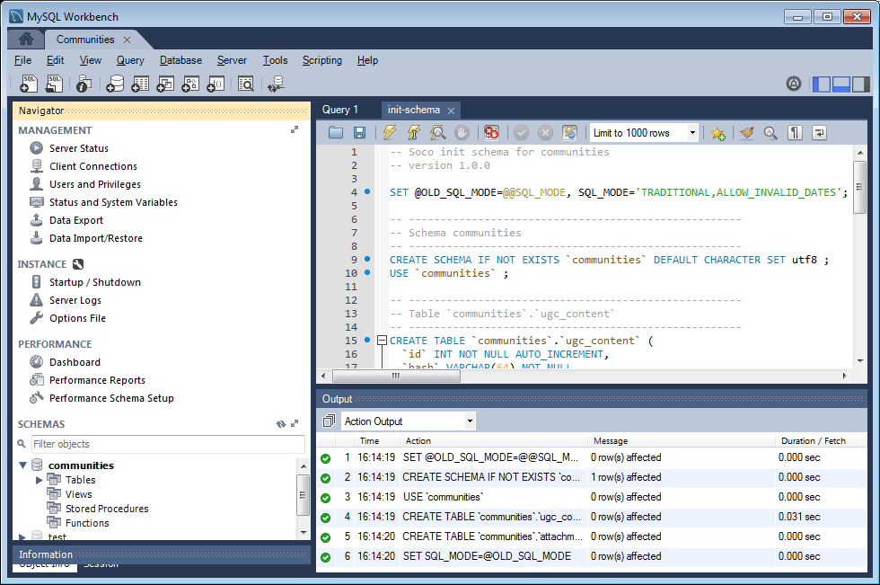

# DSRP {#mysql-configuration-for-dsrp}的MySQL配置

MySQL是關係型資料庫，可用來儲存使用者產生的內容(UGC)。

以下說明如何連接到MySQL伺服器並建立UGC資料庫。

## 要求{#requirements}

* [最新社群功能套件](deploy-communities.md#latestfeaturepack)
* [MySQL的JDBC驅動程式](deploy-communities.md#jdbc-driver-for-mysql)
* 關係資料庫：

   * [MySQL ](https://dev.mysql.com/downloads/mysql/) ServerCommunity Server 5.6版或更新版本

      * 可在與同一台主機上運行AEM或遠程運行
   * [MySQL工作台](https://dev.mysql.com/downloads/tools/workbench/)

## 安裝MySQL {#installing-mysql}

[MySQL](https://dev.mysql.com/downloads/mysql/) 應按照目標OS的說明下載並安裝。

### 小寫表名{#lower-case-table-names}

由於SQL不區分大小寫，因此對於區分大小寫的作業系統，必須包含將所有表名都小寫的設定。

例如，要在Linux OS上指定所有小寫表名：

* 編輯檔案`/etc/my.cnf`
* 在`[mysqld]`節中，添加以下行：

   `lower_case_table_names = 1`

### UTF8字元集{#utf-character-set}

為提供更佳的多語言支援，必須使用UTF8字元集。

將MySQL更改為以UTF8作為其字元集：

* mysql > SET NAMES &#39;utf8&#39;;

將MySQL資料庫變更為預設為UTF8:

* 編輯檔案`/etc/my.cnf`
* 在`[client]`節中，添加以下行：

   `default-character-set=utf8`

* 在`[mysqld]`節中，添加以下行：

   `character-set-server=utf8`

## 安裝MySQL Workbench {#installing-mysql-workbench}

MySQL Workbench提供了一個UI，用於執行安裝模式和初始資料的SQL指令碼。

MySQL Workbench應按照目標OS的說明下載並安裝。

## 社區連接{#communities-connection}

當MySQL工作台首次啟動時（除非已用於其他用途），它將不顯示任何連接：

### 新的連接設定{#new-connection-settings}

1. 選擇`MySQL Connections`右側的`+`表徵圖。
1. 在對話框`Setup New Connection`中，輸入適合您平台的值

   為了進行演示，在同一伺服器AEM上使用作者實例和MySQL :

   * 連接名稱：`Communities`
   * 連接方法：`Standard (TCP/IP)`
   * 主機名：`127.0.0.1`
   * 使用者名稱: `root`
   * 密碼: `no password by default`
   * 預設方案：`leave blank`

1. 選擇`Test Connection`以驗證到正在運行的MySQL服務的連接

**附註**:

* 預設埠為`3306`
* 在[JDBC OSGi configuration](#configurejdbcconnections)中輸入所選的連接名作為資料源名

#### 新建社區連接{#new-communities-connection}

## 資料庫設定{#database-setup}

開啟Communities連接以安裝資料庫。

### 獲取SQL指令碼{#obtain-the-sql-script}

SQL指令碼是從儲存庫中AEM獲取的：

1. 瀏覽至CRXDE Lite

   * 例如，[http://localhost:4502/crx/de](http://localhost:4502/crx/de)

1. 選擇/libs/social/config/datastore/dsrp/schema資料夾
1. 下載 `init-schema.sql`

   

下載架構的方法之一是：

* 為sql檔案選擇`jcr:content`節點
* 請注意，`jcr:data`屬性的值是檢視連結

* 選取檢視連結，將資料儲存至本機檔案

### 建立DSRP資料庫{#create-the-dsrp-database}

請遵循以下步驟安裝資料庫。 資料庫的預設名稱為`communities`。

如果指令碼中更改了資料庫名稱，請務必在[JDBC配置](#configurejdbcconnections)中更改它。

#### 步驟1:開啟SQL檔案{#step-open-sql-file}

在MySQL工作台中

* 從「檔案」下拉菜單中，選擇&#x200B;**[!UICONTROL 開啟SQL指令碼]**&#x200B;選項
* 選擇下載的`init_schema.sql`指令碼

#### 步驟2:執行SQL指令碼{#step-execute-sql-script}

在步驟1中開啟的檔案的「工作台」窗口中，選擇`lightening (flash) icon`以執行指令碼。

在以下映像中，`init_schema.sql`檔案已準備好執行：

#### 重新整理 {#refresh}

執行指令碼後，必須刷新`Navigator`的`SCHEMAS`部分，才能查看新資料庫。 使用「方案」右側的刷新表徵圖：

## 配置JDBC連接{#configure-jdbc-connection}

**Day Commons JDBC連接池**&#x200B;的OSGi配置配置MySQL JDBC驅動程式。

所有發佈和作AEM者實例都應指向相同的MySQL伺服器。

當MySQL在與不同的伺服器上運AEM行時，必須在JDBC連接器中指定伺服器主機名來取代&#39;localhost&#39;。

* 在每個作者和發佈例AEM項上。
* 以管理員權限登入。
* 訪問[Web控制台](../../help/sites-deploying/configuring-osgi.md)。

   * 例如，[http://localhost:4502/system/console/configMgr](http://localhost:4502/system/console/configMgr)

* 找到`Day Commons JDBC Connections Pool`
* 選擇`+`表徵圖以建立新的連接配置。

   

* 輸入下列值：

   * **[!UICONTROL JDBC驅動程式類]**:  `com.mysql.jdbc.Driver`
   * **[!UICONTROL JDBC連接URI]**:  `jdbc:mysql://localhost:3306/communities?characterEncoding=UTF-8`

      如果MySQL伺服器與&#39;this&#39; AEM server *communities*&#x200B;是預設資料庫（架構）名稱不同，請指定伺服器來取代localhost。

   * **[!UICONTROL 使用者名稱]**:  `root`

      或者，如果不是「root」，請輸入MySQL伺服器的配置用戶名。

   * **[!UICONTROL 密碼]**:

      如果沒有為MySQL設定口令，請清除此欄位，

      否則，請輸入MySQL用戶名的配置口令。

   * **[!UICONTROL 資料來源名稱]**:為 [MySQL連接輸入的名稱](#new-connection-settings)，例如&#39;communities&#39;。

* 選擇&#x200B;**[!UICONTROL 保存]**

