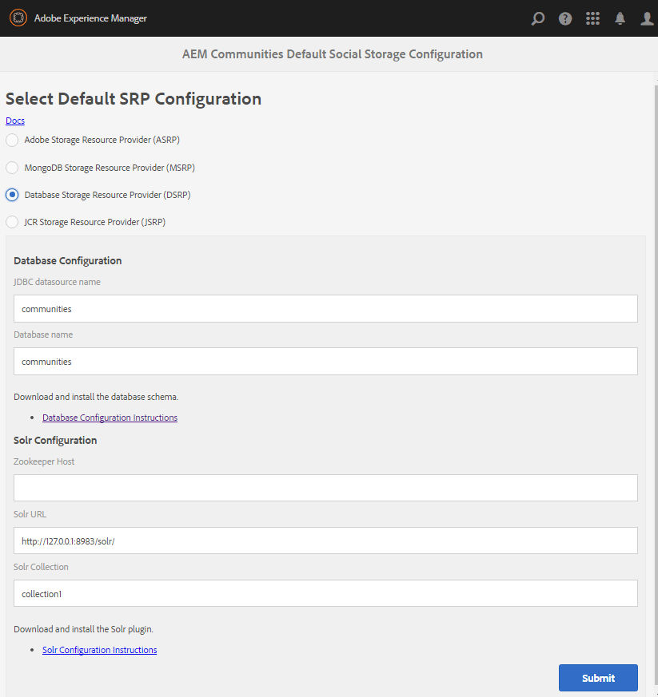

# DSRP — 關聯式資料庫儲存資源提供者 {#dsrp-relational-database-storage-resource-provider}

## 關於DSRP {#about-dsrp}

當AEM Communities設定為使用關聯式資料庫作為其通用存放區時，使用者產生的內容(UGC)可從所有製作和發佈執行個體存取，而不需要同步或復寫。

另請參閱[SRP選項的特性](working-with-srp.md#characteristics-of-srp-options)和[建議的拓撲](topologies.md)。

## 要求 {#requirements}

* [MySQL](#mysql-configuration)，關聯式資料庫。
* [Apache Solr](#solr-configuration)，搜尋平台。

>[!NOTE]
>
>預設儲存設定現在儲存在conf路徑(`/conf/global/settings/community/srpc/defaultconfiguration`)中，而非`etc`路徑(`/etc/socialconfig/srpc/defaultconfiguration`)。 建議您依照[移轉步驟](#zerodt-migration-steps)操作，讓defaultsrp如預期般運作。

## 關聯式資料庫組態 {#relational-database-configuration}

### MySQL設定 {#mysql-configuration}

MySQL安裝可以使用不同的資料庫（綱要）名稱以及不同的連線（伺服器：連線埠），在啟用功能與相同連線集區內的共用存放區(DSRP)之間共用。

如需安裝和組態詳細資訊，請參閱[DSRP的MySQL組態](dsrp-mysql.md)。

### Solr 設定 {#solr-configuration}

Solr安裝可透過使用不同的集合在節點存放區(Oak)與共用存放區(SRP)之間共用。

如果Oak和SRP集合皆密集使用，則可基於效能原因安裝第二個Solr。

對於生產環境，SolrCloud模式比獨立模式（單一本機Solr設定）提供更優異的效能。

如需安裝和組態詳細資訊，請參閱[SRP的Solr組態](solr.md)。

### 選取DSRP {#select-dsrp}

[儲存設定主控台](srp-config.md)允許選取預設儲存設定，以識別要使用哪個SRP實作。

在作者上，存取儲存設定主控台

* 使用管理員許可權登入
* 從&#x200B;**主功能表**

   * 選取&#x200B;**[!UICONTROL 工具]** （從左窗格）
   * 選取&#x200B;**[!UICONTROL 社群]**
   * 選取&#x200B;**[!UICONTROL 儲存設定]**

      * 例如，產生的位置為： [http://localhost:4502/communities/admin/defaultsrp](http://localhost:4502/communities/admin/defaultsrp)

     >[!NOTE]
     >
     >預設儲存設定現在儲存在conf路徑(`/conf/global/settings/community/srpc/defaultconfiguration`)中      而不是`etc`路徑(`/etc/socialconfig/srpc/defaultconfiguration`)。 建議您依照[移轉步驟](#zerodt-migration-steps)操作，讓defaultsrp如預期般運作。

  

* 選取&#x200B;**[!UICONTROL 資料庫儲存資源提供者(DSRP)]**
* **資料庫組態**

   * **[!UICONTROL JDBC資料來源名稱]**

     指定給MySQL連線的名稱必須與[JDBC OSGi組態](dsrp-mysql.md#configurejdbcconnections)中輸入的名稱相同

     *預設*： communities

   * **[!UICONTROL 資料庫名稱]**

     在[init_schema.sql](dsrp-mysql.md#obtain-the-sql-script)指令碼中指定給結構描述的名稱

     *預設*： communities

* **SolrConfiguration**

   * **[Zookeeper](https://solr.apache.org/guide/6_6/using-zookeeper-to-manage-configuration-files.html)主機**

     如果使用內部ZooKeeper執行Solr，則將此值保留空白。 否則，當使用外部ZooKeeper在[SolrCloud模式](solr.md#solrcloud-mode)中執行時，請將此值設定為ZooKeeper的URI，例如&#x200B;*my.server.com:80*

     *預設*： *&lt;blank>*

   * **[!UICONTROL Solr URL]**

     *預設*： https://127.0.0.1:8983/solr/

   * **[!UICONTROL Solr集合]**

     *預設*： collection1

* 選取&#x200B;**[!UICONTROL 提交]**。

### Defaultsrp的零停機移轉步驟 {#zerodt-migration-steps}

若要確保defaultsrp頁面[http://localhost:4502/communities/admin/defaultsrp](http://localhost:4502/communities/admin/defaultsrp)如預期般運作，請遵循下列步驟：

1. 將位於`/etc/socialconfig`的路徑重新命名為`/etc/socialconfig_old`，以便系統設定回覆為jsrp（預設）。
1. 移至defaultsrp頁面[http://localhost:4502/communities/admin/defaultsrp](http://localhost:4502/communities/admin/defaultsrp)，此頁面已設定jsrp。 按一下&#x200B;**[!UICONTROL 提交]**&#x200B;按鈕，以便在`/conf/global/settings/community/srpc`建立新的預設設定節點。
1. 刪除已建立的預設組態`/conf/global/settings/community/srpc/defaultconfiguration`。
1. 複製舊組態`/etc/socialconfig_old/srpc/defaultconfiguration`以取代上一步驟中刪除的節點(`/conf/global/settings/community/srpc/defaultconfiguration`)。
1. 刪除舊的`etc`節點`/etc/socialconfig_old`。

## 發佈設定 {#publishing-the-configuration}

DSRP必須識別為所有製作和發佈執行個體上的通用存放區。

若要在發佈環境中使用相同的設定：

* 作者：

   * 從主功能表瀏覽至&#x200B;**[!UICONTROL 工具]** > **[!UICONTROL 作業]** > **[!UICONTROL 復寫]**
   * 連按兩下&#x200B;**[!UICONTROL 啟動樹狀結構]**
   * **開始路徑**：

      * 瀏覽至`/etc/socialconfig/srpc/`

   * 確定未選取`Only Modified`。
   * 選取&#x200B;**[!UICONTROL 啟動]**。

## 管理使用者資料 {#managing-user-data}

如需&#x200B;*使用者*、*使用者設定檔*&#x200B;和&#x200B;*使用者群組*&#x200B;的相關資訊（通常已進入發佈環境），請造訪：

* [使用者同步](sync.md)
* [管理使用者和使用者群組](users.md)

## 為DSRP重新索引Solr {#reindexing-solr-for-dsrp}

若要重新索引DSRP Solr，請依照[重新索引MSRP](msrp.md#msrp-reindex-tool)的檔案操作，但在重新索引DSRP時，請改用此URL： **/services/social/datastore/rdb/reindex**

例如，重新索引DSRP的curl命令如下所示：

```shell
curl -u admin:password -X POST -F path=/ https://host:port/services/social/datastore/rdb/reindex
```
