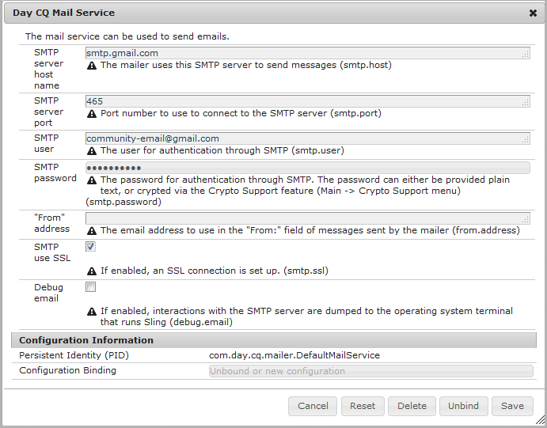

# 配置電子郵件{#configuring-email}

AEM Communities使用電子郵件：

* [社群通知](notifications.md)
* [Communities 訂閱](subscriptions.md)

預設情況下，電子郵件功能無法正常工作，因為它需要指定SMTP伺服器和SMTP用戶。

>[!CAUTION]
>
>通知和訂閱的電子郵件必須僅在[主要發行者](deploy-communities.md#primary-publisher)上設定。

## 預設郵件服務配置{#default-mail-service-configuration}

通知和訂閱都需要預設的郵件服務。

* 以管理員權限登錄主發佈者並訪問[Web控制台](../../help/sites-deploying/configuring-osgi.md):

   * 例如，[http://localhost:4503/system/console/configMgr](http://localhost:4503/system/console/configMgr)

* 找到`Day CQ Mail Service`。
* 選擇編輯表徵圖。

這是根據[設定電子郵件通知](../../help/sites-administering/notification.md)的說明檔案，但有一點不同，即`"From" address`欄位&#x200B;*不是必要的*，應保留為空白。

例如（填入值僅供說明之用）:

* **[!UICONTROL SMTP伺服器主機名]**

   *（必要）* 要使用的SMTP伺服器。

* **[!UICONTROL SMTP伺服器埠]**

   *（必要）* SMTP伺服器埠必須為25或更高。

* **[!UICONTROL SMTP用戶]**

   *（必要）* SMTP用戶。

* **[!UICONTROL SMTP密碼]**

   *（必要）* SMTP用戶的口令。

* **[!UICONTROL 「寄件者」地址]**

   留空
* **[!UICONTROL SMTP使用SSL]**

   如果勾選，將傳送安全的電子郵件。 確保埠設定為465或SMTP伺服器需要。
* **[!UICONTROL 除錯電子郵件]**

   如果選中此選項，則啟用SMTP伺服器交互的日誌記錄。

## AEM Communities電子郵件配置{#aem-communities-email-configuration}

配置[預設郵件服務](#default-mail-service-configuration)後，發行中包含的`AEM Communities Email Reply Configuration` OSGi配置的兩個現有實例將變為可用。

允許透過電子郵件回覆時，只需進一步設定訂閱的例項。

1. [電子](#configuration-for-notifications) 郵件實例：

   對於不支援回覆電子郵件且不應變更的通知。

1. [Subscriptions-](#configuration-for-subscriptions) emailinstance:

   需要設定才能完全啟用從回覆電子郵件建立貼文。

要訪問Communities電子郵件配置實例：

* 以管理員權限登錄主發佈者並訪問[Web控制台](../../help/sites-deploying/configuring-osgi.md)

   * 例如，[http://localhost:4503/system/console/configMgr](http://localhost:4503/system/console/configMgr)

* 找到`AEM Communities Email Reply Configuration`。

### 通知的配置{#configuration-for-notifications}

`AEM Communities Email Reply Configuration` OSGi config with the Name email is enformaties feature. 此功能不包含電子郵件回覆。

不應更改此配置。

* 找到`AEM Communities Email Reply Configuration`。
* 選擇編輯表徵圖。
* 驗證&#x200B;**名稱**&#x200B;是`email`。

* 驗證「從回覆電子郵件建立貼文」是否為`unchecked`。****

### 訂閱配置{#configuration-for-subscriptions}

對於社群訂閱，可以啟用或停用會員回覆電子郵件以張貼內容的功能。

* 找到`AEM Communities Email Reply Configuration`。
* 選擇編輯表徵圖。
* 驗證&#x200B;**名稱**&#x200B;是`subscriptions-email`。

   

* **[!UICONTROL 名稱]**

   *（必要）* `subscriptions-email`。請勿編輯。

* **[!UICONTROL 從回覆電子郵件建立貼文]**

   如果勾選，訂閱電子郵件的收件者可能會透過傳送回覆來張貼內容。 已勾選預設值。
* **[!UICONTROL 新增追蹤ID至標題]**

   預設值為`Reply-To`。

* **[!UICONTROL 主旨的長度上限]**

   如果追蹤器ID新增至主旨行，則此為主旨的最大長度（不包括追蹤ID），之後會加以修剪。 請注意，這應盡可能小，以免遺失追蹤的ID資訊。 預設值為200。

* **[!UICONTROL 「回覆」電子郵件地址]**

   用作「回覆」電子郵件地址的地址。 預設值為`no-reply@example.com`。

* **[!UICONTROL 回覆分隔字元]**

   如果追蹤器ID已新增至回覆標題，則會使用此分隔字元。 預設值為`+`（加號）。

* **[!UICONTROL 主旨中的追蹤器ID首碼]**

   如果追蹤器ID已新增至主旨行，則會使用此首碼。 預設值為`post#`。

* **[!UICONTROL 訊息內文中的追蹤器ID首碼]**

   如果將追蹤器ID新增至訊息內文，則會使用此首碼。 預設值為`Please do not remove this:`。

* **[!UICONTROL 以HTML形式傳送電子郵件]**:如果勾選，則電子郵件的「內容類型」會設為 `"text/html;charset=utf-8"`。已勾選預設值。

* **[!UICONTROL 預設用戶名]**

   此名稱將用於無名稱用戶。 預設值為`no-reply@example.com`。

* **[!UICONTROL 範本根路徑]**

   使用儲存於此根路徑之範本所建立的電子郵件. 預設值為`/etc/community/templates/subscriptions-email`。

## 配置輪詢導入程式{#configure-polling-importer}

要將電子郵件導入儲存庫，必須配置輪詢導入程式並手動配置其在儲存庫中的屬性。

### 新增Polling Importer {#add-new-polling-importer}

* 以管理員權限登入主發行者，並瀏覽至輪詢匯入工具主控台：

   例如，[http://localhost:4503/etc/importers/polling.html](http://localhost:4503/etc/importers/polling.html)

* 選擇&#x200B;**[!UICONTROL 添加]**

   

* **[!UICONTROL 類型]**

   *（必要）下* 拉以選取 `POP3 (over SSL)`。

* **[!UICONTROL URL]**

   *（必要）* 出站郵件伺服器。例如，`pop.gmail.com:995/INBOX?username=community-emailgmail.com&password=****`。

* **[!UICONTROL 匯入至Path]**&amp;ast;

   *（必要）瀏* 覽至資 `/content/usergenerated/mailFolder/postEmails`
料夾並選取「確 `postEmails`定」，設 **為**。

* **[!UICONTROL 以秒為單位的更新間隔]**

   *（可選）為* 預設郵件服務配置的郵件伺服器可能需要更新間隔值。例如，Gmail可能需要`300`的間隔。

* **[!UICONTROL 登入]**

   *(可選)*

* **[!UICONTROL 密碼]**

   *(可選)*

* 選擇&#x200B;**[!UICONTROL 確定]**。

### 調整新輪詢導入程式的協定{#adjust-protocol-for-new-polling-importer}

儲存新的輪詢設定後，必須進一步修改訂閱電子郵件匯入工具的屬性，才能將通訊協定從`POP3`變更為`emailreply`。

使用[CRXDE Lite](../../help/sites-developing/developing-with-crxde-lite.md):

* 以管理員權限登入主發行者，並瀏覽至[https://&lt;server>:&lt;port>/crx/de/index.jsp#/etc/importers/polling](http://localhost:4503/crx/de/index.jsp#/etc/importers/polling)。
* 選擇新建立的配置並修改以下屬性：

   * **feedType**:取代 `pop3s` 為  **`emailreply`**
   * **來源**:將源協定替換為 `pop3s://`   **`emailreply://`**

紅色三角形表示已修改的屬性。 請務必儲存變更：

* 選擇&#x200B;**[!UICONTROL 全部保存]**。

