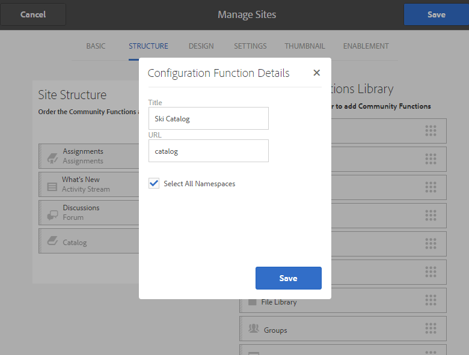

# 製作新的社群網站以啟用{#author-a-new-community-site-for-enablement}

## 建立社群網站 {#create-community-site}

[社群網](/help/communities/sites-console.md) 站建立採用精靈，可引導您完成建立社群網站的步驟。在最後步驟中提交站點之前，可以前移到`Next`步驟或`Back`到上一個步驟。

要開始建立新的社區站點，請執行以下操作：

使用[author instance](https://localhost:4502/)

* 以管理員權限登入並導覽至&#x200B;**[!UICONTROL Communities]** > **[!UICONTROL Sites]**。

* 選擇 **建立**。

### 步驟1:網站範本{#step-site-template}

在&#x200B;**網站範本**&#x200B;步驟中，輸入標題、說明、URL名稱，並選取社群網站範本，例如：

* **社群網站標題**: `Enablement Tutorial`.

* **社群網站說明**: `A site for enabling the community to learn.`

* **社群網站根**:(對於預設根，保留空白 `/content/sites`)

* **雲端設定**:（若未指定雲端設定，請留空）提供指定雲端設定的路徑。
* **社群網站基本語言**:(對於單一語言，請保持不變：英文)使用下拉式清單，從 ** 可用語言(德文、義大利文、法文、日文、西班牙文、葡萄牙文（巴西）、中文（繁體）和簡體中文)選擇一或多種基本語言。會針對新增的每種語言建立一個社群網站，並依照[多語言網站轉譯內容](/help/sites-administering/translation.md)中所述的最佳實務，存在於相同的網站資料夾中。 每個網站的根頁面將包含一個子頁面，該子頁面由其中一種語言的語言代碼命名，例如英文的&#39;en&#39;或法文的&#39;fr&#39;。

* **社群網站名稱**: `enable`

   * 初始URL將顯示在「社群網站名稱」下方
   * 若為有效的URL，請附加基本語言代碼+ &quot;。html&quot;
      *例如*,https://localhost:4502/content/sites/  `enable/en.html`

* **參考網站範本**:向下拉選擇  `Reference Structured Learning Site Template`

選擇&#x200B;**Next**。

### 步驟2:設計{#step-design}

「設計」步驟會分兩節顯示，供您選取主題和品牌橫幅：

#### 社群網站主題{#community-site-theme}

選擇要套用至範本的樣式。 選取後，主題將會以勾選標籤覆蓋。

#### 社群網站品牌{#community-site-branding}

（可選）上傳橫幅影像以顯示在網站頁面上。 橫幅會釘在瀏覽器的左邊，位於社群網站標題和功能表（導覽連結）之間。 橫幅高度會裁切為120像素。 橫幅的大小不會調整為適合瀏覽器寬度和120像素高度。

選擇&#x200B;**Next**。

### 步驟3:設定{#step-settings}

在「設定」步驟中，在選取`Next`之前，請注意有7個區段提供對配置的存取，這些設定包括使用者管理、標籤、角色、協調、分析、翻譯和啟用。

#### 用戶管理{#user-management}

建議[啟用社群](/help/communities/overview.md#enablement-community)為私用。

當匿名網站訪客被拒絕存取、無法自行註冊且不能使用社交登入時，社群網站是私密的。

確保[用戶管理](/help/communities/sites-console.md#user-management)的大多數複選框都已取消選中：

* 請勿允許網站訪客自行註冊。
* 請勿允許匿名網站訪客檢視網站。
* 是否允許社區成員之間傳送消息是可選的。
* 不允許使用Facebook登入。
* 不允許使用Twitter登入。

#### 標籤{#tagging}

可套用至社群內容的標籤，是透過選取先前透過[標籤控制台](/help/sites-administering/tags.md#tagging-console)（例如[教學課程名稱空間](/help/communities/enablement-setup.md#create-tutorial-tags)）定義的AEM名稱空間來控制。

此外，為社群網站選取「標籤名稱空間」會限制定義型錄和啟用資源時顯示的選擇。 如需重要資訊，請參閱[標籤啟用資源](/help/communities/tag-resources.md)。

使用預先輸入搜尋功能，尋找名稱空間十分簡單。 例如，

* 類型 `tut`
* 選取 `Tutorial`

### 角色{#roles}

[社群成](/help/communities/users.md) 員角色是通過「角色」部分中的設定分配的。

若要讓社群成員（或成員群組）以社群管理員的身分體驗網站，請使用預先輸入搜尋，並從下拉式清單的選項中選取成員或群組名稱。

例如，

* 類型 `q`
* 選擇[Quinn Harper](/help/communities/enablement-setup.md#publishcreateenablementmembers)

>[!NOTE]
>
>[隧道](/help/communities/deploy-communities.md#tunnel-service-on-author) 服務允許選擇僅存在於發佈環境中的成員和組。

#### 協調{#moderation}

接受[協調](/help/communities/sites-console.md#moderation)使用者產生的內容(UGC)的預設全域設定。

#### ANALYTICS {#analytics}

從下拉式清單中，選取為此社群網站設定的Analytics雲端服務架構。

螢幕擷取中顯示的選項`Communities`是[組態檔案的架構範例。](/help/communities/analytics.md#aem-analytics-framework-configuration)

#### TRANSLATION {#translation}

[翻譯設定](/help/communities/sites-console.md#translation)指定UGC是否可翻譯，如果可以，可以翻譯到哪種語言。

* 檢查&#x200B;**允許機器翻譯**
* 使用預設設定

#### 啟用{#enablement}

對於啟用社群，必須識別一或多個社群啟用管理員。

* **啟用管理員**
（必要） 
`Community Enablement Managers` 可選擇組以管理此社區站點。

   * 類型 `s`
   * 選取 `Sirius Nilson`

* **Marketing Cloud組織Id**
（選用）在啟用報表中包含視訊心率分析時，必 [要的](/help/communities/analytics.md#video-heartbeat-analytics) Adobe Analytics帳戶ID。

選擇&#x200B;**Next**。

### 步驟4:建立社區站點{#step-create-community-site}

選擇&#x200B;**建立。**

當程式完成時，新站點的資料夾將顯示在「社區」>「站點」控制台中。

### 發佈新社群網站{#publish-the-new-community-site}

建立的站點應從Communities - Sites控制台進行管理，該控制台與建立新站點的控制台相同。

選取社群網站的資料夾後，將滑鼠指標暫留在網站圖示上，以便顯示4個動作圖示：

在選取省略號圖示（「更多操作」圖示）時，會顯示「導出站點」和「刪除站點」選項。

從左到右依次為：

* **開啟網站**

   選取鉛筆圖示，以作者編輯模式開啟社群網站，以新增和／或設定頁面元件。

* **編輯網站**

   選擇屬性表徵圖以開啟社區站點以修改屬性，如標題或更改主題。

* **發佈網站**

   選取「全球」圖示以發佈社群網站（預設為localhost:4503）。

* **匯出網站**

   選擇導出表徵圖可建立同時儲存在[包管理器](/help/sites-administering/package-manager.md)和下載的社區站點的包。
請注意，網站套件中不包含UGC。

* **刪除網站**

   要刪除社區站點，請選擇「刪除站點」表徵圖，該表徵圖將滑鼠懸停在「社區站點控制台」中的站點上。 此動作會移除與網站相關的所有項目，例如UGC、使用者群組、資產和資料庫記錄。

   

#### 選擇「發佈{#select-publish}」

選取「全球」圖示以發佈社群網站。

會顯示網站已發佈。

## 社群使用者與使用者群組{#community-users-user-groups}

### 注意：新社群使用者群組{#notice-new-community-user-groups}

除了新社群網站外，還會建立新的使用者群組，其中已針對各種管理功能設定適當的權限。 如需詳細資訊，請造訪[社群網站的使用者群組](/help/communities/users.md#usergroupsforcommunitysites)。

對於此新社群網站，如果在步驟1中的網站名稱為&quot;enable&quot;，則可從[社群成員與群組主控台](/help/communities/members.md#groups-console)中查看發佈環境中存在的新使用者群組：

### 將成員分配給社區啟用成員組{#assign-members-to-community-enable-members-group}

在作者身上，啟用隧道服務後，可以將在初始設定期間建立的[用戶分配給新建立的社區站點的社區成員組。](/help/communities/enablement-setup.md#publishcreateenablementmembers)

使用社群群組主控台，可以個別新增成員，或透過群組的成員資格新增成員。

在此示例中，組`Community Ski Class`被添加為組`Community Enable Members`的成員以及成員`Quinn Harper`。

* 導覽至&#x200B;**社群、群組**&#x200B;主控台
* 選擇&#x200B;*社區啟用成員*&#x200B;組
* 在&#x200B;**將成員添加到組**&#x200B;搜索框中輸入&#39;ski&#39;
* 選擇&#x200B;*社區滑雪課*（學員群組）
* 在搜索框中輸入&#39;quinn&#39;
* 選擇&#x200B;*Quinn Harper*（啟用資源聯繫）

* 選擇&#x200B;**保存**

## 發佈{#configurations-on-publish}時的配置

`https://localhost:4503/content/sites/enable/en.html {#http-localhost-content-sites-enable-en-html}`

### 配置驗證錯誤{#configure-for-authentication-error}

在設定網站並推送至發佈後，[會在發佈例項上設定登入對應](/help/communities/sites-console.md#configure-for-authentication-error)(`Adobe Granite Login Selector Authentication Handler`)。 優點是，當未正確輸入登入憑證時，驗證錯誤會重新顯示社群網站的登入頁面，並顯示錯誤訊息。

將`Login Page Mapping`新增為：

* `/content/sites/enable/en/signin:/content/sites/enable/en`

### （可選）變更預設首頁{#optional-change-the-default-home-page}

使用發佈網站進行展示時，將預設首頁變更為新網站可能會很有用。

要執行此操作，需要使用[CRX|DE](https://localhost:4503/crx/de) Lite來編輯發佈時的[資源映射](/help/sites-deploying/resource-mapping.md)表。

若要開始：

1. 在發佈時，存取CRXDE並以管理員權限登入

   * 例如，瀏覽至[https://localhost:4503/crx/de](https://localhost:4503/crx/de)並使用`admin/admin`登入

1. 在項目瀏覽器中，展開`/etc/map`
1. 選擇`http`節點

   * 選擇&#x200B;**建立節點**

      * **** Namelocalhost.4503

         (do *not* use &#39;:&#39;)

      * **打** [字：映射](https://sling.apache.org/documentation/the-sling-engine/mappings-for-resource-resolution.html)

1. 已選擇新建立的`localhost.4503`節點

   * 新增屬性

      * **命** 名：匹配
      * **TypeString** 
      * **** Valuelocalhost.4503/$

   （必須以&#39;$&#39;字元結尾）

   * 新增屬性

      * **命名** 空間：internalRedirect
      * **TypeString** 
      * **值** /content/sites/enable/en.html

1. 選擇&#x200B;**全部保存**
1. （可選）刪除瀏覽歷史記錄
1. 瀏覽至https://localhost:4503/

   * 請造訪https://localhost:4503/content/sites/enable/en.html

>[!NOTE]
>
>若要停用，只需在`sling:match`屬性值前加上&#39;x&#39; - `xlocalhost.4503/$` —— 和&#x200B;**全部儲存**。

#### 疑難排解：保存映射{#troubleshooting-error-saving-map}時出錯

如果無法保存更改，請確保節點名稱為`localhost.4503`（帶有&#39;dot&#39;分隔符），而不是帶有&#39;冒號&#39;分隔符的`localhost:4503`（因為`localhost`不是有效的命名空間前置詞）。

#### 疑難排解：無法重新導向{#troubleshooting-fail-to-redirect}

規則運算式`sling:match`字串結尾的&#39;**$**&#39;至關重要，因此僅對應`https://localhost:4503/`，否則重新導向值會優先於URL中server:port之後可能存在的任何路徑。 因此，當AEM嘗試重新導向至登入頁面時，它會失敗。

## 修改社區站點{#modifying-the-community-site}

在初次建立網站後，作者可使用[「開啟網站」圖示](/help/communities/sites-console.md#authoring-site-content)來執行標準的AEM製作活動。

此外，管理員可使用[編輯網站圖示](/help/communities/sites-console.md#modifying-site-properties)來修改網站的屬性，例如標題。

在進行任何修改後，請記住&#x200B;**Save**&#x200B;和re-**Publish**&#x200B;網站。

>[!NOTE]
>
>如果不熟悉AEM，請檢視[基本處理](/help/sites-authoring/basic-handling.md)和[製作頁面快速指南的說明檔案](/help/sites-authoring/qg-page-authoring.md)。

### 添加目錄{#add-a-catalog}

為此社區站點選擇的社區站點模板應包含目錄功能。

如果不是，則可輕鬆新增目錄功能。 這可讓社群的其他成員（未指派至啟用資源或學習路徑）從目錄中選擇啟用資源。

如果網站結構已包含目錄功能，則可變更其標題。

要修改站點的結構，請導航至&#x200B;**[!UICONTROL Communities]** > **[!UICONTROL Sites]**&#x200B;控制台，開啟`enable`資料夾，然後選擇&#x200B;**編輯站點**&#x200B;表徵圖以訪問`Enablement Tutorial`的屬性。

選擇「結構」面板以添加目錄或修改現有目錄：

* **標題**: `Ski Catalog`

* **URL**:  `catalog`

* **選擇所有名稱空間**:保留為預設值。

* 選擇&#x200B;**保存**。

使用「位置」表徵圖將「目錄」功能移動到「分配」後的第二個位置。

選擇右上角的&#x200B;**Save**&#x200B;將更改保存到社區站點。

然後重新-**發佈**&#x200B;網站。

