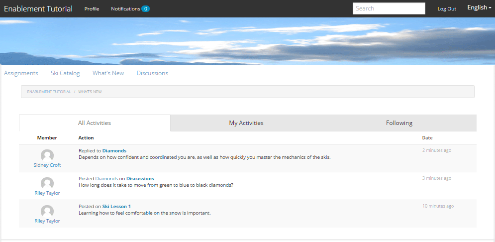

# 體驗已發佈的網站 {#experience-the-published-site}

**[⇐建立並指派啟用資源](resource.md)**

## 在發佈時瀏覽到新站點 {#browse-to-new-site-on-publish}

現在新建立的社群網站及其啟用資源和學習路徑已經發佈完畢，您就可以體驗啟用教學課程網站。

首先，瀏覽至建立網站時顯示的URL，然後在發佈伺服器上，例如

* 作者URL = [http://localhost:4502/content/sites/enable/en.html](http://localhost:4502/content/sites/enable/en.html)
* 發佈URL = [http://localhost:4503/content/sites/enable/en.html](http://localhost:4503/content/sites/enable/en.html)

若 [預設首頁已設定](enablement-create-site.md#changethedefaulthomepage)，然後只要瀏覽至 [http://localhost:4503/](http://localhost:4503/) 應該啟動網站。

首次到達已發佈的網站時，網站訪客通常尚未登入，且為匿名。

**http://localhost:4503/content/sites/enable/en.html**

## 匿名網站訪客 {#anonymous-site-visitor}

此私人啟用社群網站的登入頁面會立即顯示匿名網站訪客。 請注意，您無法自行註冊或登入Facebook或Twitter。

請注意，首頁顯示四個功能表項目： `Assignments, Ski Catalog, What's New` 和 `Discussions`，但若未登入，則無法取得任何內容。

>[!NOTE]
>
>可授予對啟用網站的匿名存取權，而不允許網站訪客自行註冊。
>
>如果啟用資源設為 `show in catalog` 和 `allow anonymous access`，則匿名網站訪客可以檢視目錄中的資源。

### 在JCR上防止匿名訪問 {#prevent-anonymous-access-on-jcr}

已知限制會透過jcr內容和json向匿名訪客公開社群網站內容，不過 **[!UICONTROL 允許匿名訪問]** 已針對網站內容停用。 不過，您可以使用Sling限制來控制此行為，作為因應措施。

若要保護您的社群網站內容，不讓匿名使用者透過jcr內容和json存取，請遵循下列步驟：

1. 在AEM製作例項上，前往https://&lt;host>:&lt;port>/editor.html/content/site/&lt;sitename>.html。

   >[!NOTE]
   >
   >請勿前往本地化網站。

1. 前往 **[!UICONTROL 頁面屬性]**.

   

1. 前往 **[!UICONTROL 進階]** 標籤。
1. 啟用 **[!UICONTROL 驗證需求]**.

   

1. 新增登入頁面的路徑。 例如， `/content/......./GetStarted`.
1. 發佈頁面。

## 已註冊成員 {#enrolled-member}

此體驗需仰賴使用者 `Riley Taylor` 和 `Sidney Croft` being [已建立](enablement-setup.md#publishcreateenablementmembers) 和 [已分配](resource.md#settings) 到 *滑雪課* 通過會員身份學習 *社區滑雪班* 群組。

登入方式

* `Username: riley`
* `Password: password`

如果不是通過自註冊建立用戶配置檔案，則在成員首次登錄時，將顯示其配置檔案頁，以便他們可以根據需要驗證和修改它。

下次成員登錄時，將顯示由第一個菜單項標識的首頁。

### 指定任務 {#assignments}

在「工作總攬」頁中，會顯示成員的所有學習路徑和專門分配給它們的啟用資源。

每個分配都提供以下基本資訊：

* 分配類型
* 是否為新分配
* 名稱
* 與分配類型相關的詳細資訊
* 工作聯繫人、專家和作者（如果提供）

「分配」類型由卡片左上角的表徵圖指示。 道路的影像用於包含啟用資源數的學習路徑。

選取 *滑雪課* 會顯示學習路徑所參考的兩個啟用資源。

選取 *滑雪課程1* 將開啟啟用資源的詳細資訊頁面。

從詳細資訊頁面，成員可以學習， [比率](rating.md) 課程和新增 [評論](comments.md). 任何成員活動都會反映在網站的「新增功能」區段中。

與啟用資源的互動會顯示在作者環境中可存取的「報表」區段中。

### 滑雪目錄 {#ski-catalog}

「滑雪目錄」頁面是使用 `Tutorial` 命名空間。 兩個 *滑雪課* 資源會加上標籤 `Skiing` 標籤，如果 `All` 或 `Tutorial: Sports / Skiing` 選取時，不會顯示任何內容。

如果未直接或通過學習路徑為成員分配啟用資源，則可以與目錄內的啟用資源交互，並通過注釋和評級提供反饋。

### 討論 {#discussions}

除了對啟用資源評分和加以註解([啟用時間](enablement-create-site.md#step33asettings))，此群體網站範本 `Enablement Tutorial` 已建立包含 [論壇功能](functions.md#forum-function) (標題為 `Discussions)`.

選取 `Discussions`連結並張貼主題。

登出並以Sidney Croft（西德尼/密碼）的身分登入並回覆問題，以及關注主題。

請注意，除了內嵌協調，還有其他選項可在社交媒體上共用主題或透過電子郵件傳送主題。

### 新增功能 {#what-s-new}

此 `What's New` 功能表項目是 [活動流函式](functions.md#activity-stream-function) 在此社區站點的結構中。

仍以Sidney的身分登入，請選取 `What's New` 連結以顯示活動。

## 受信任的社區成員 {#trusted-community-member}

此體驗假設 ` [Quinn Harper](enablement-setup.md#publishcreateenablementmembers)` 已指派 [版主](enablement-create-site.md#moderation) 和 [資源聯繫人](resource.md#settings).

登入方式

* `Username: quinn`
* `Password: password`

登入後，請注意有新的功能表項目， `Administration`，因為會員被賦予版主角色。

首頁由第一個菜單項「工作總攬」標識。 Quinn是版主和培訓資源聯繫人，未註冊到任何培訓資源或學習路徑中，因此沒有任何可顯示的內容。

### 管理 {#administration}

這是兩個學習者的活動， `Riley Taylor` 和 `Sidney Croft`. 選取 `Administration` 連結以存取「協調控制台」，Quinn就能使用 [大量協調控制台](moderation.md) 以協調其貼文。

選取側面板圖示，即可開啟用於搜尋社群內容的篩選器。

將游標暫留在留言卡上會顯示協調動作。

## 作者報告 {#reports-on-author}

存取學習者報告和培訓資源有兩種方式。

在作者上，導覽至 **社區， [資源主控台](resources.md)**，可管理啟用資源，並在選取社群網站後，為產生報表

* 所有啟用資源和學習路徑
* 一條特定的啟用資源或學習路徑

導覽至 **社區， [報表主控台](reports.md)**，並根據以下內容產生報表：

* 賦予啟用資源和學習路徑
* 在特定時段內張貼至社群網站
* 特定時段內社群網站的檢視（網站造訪）

* 貼文和檢視可能屬於所有內容，或特定內容：

   * 論壇
   * 論壇主題
   * QnA
   * QnA 問題
   * 部落格
   * 部落格文章
   * 日曆
   * 日曆事件

### 資源主控台 {#resources-console}

只要進行一些活動並在發佈時與資源互動，就能檢視作者的報表。

* 在作者上，以管理權限登入。
* 從主功能表導覽至 **[!UICONTROL 社群]** > **[!UICONTROL 資源]**.
* 選取 `Enablement Tutorial` 頁簽。
* 選取 `Report` 表徵圖，查看所有資源的摘要。
* 選取資源，然後 `Report` 圖示。

請注意，顯示Adobe Analytics資料可能為時過早，這可能需要1到12小時的時間才會顯示。 不過，基本的SCORM報表已可供使用。

#### 滑雪課資源報告 {#ski-lessons-resource-report}

#### 滑雪課程使用者報表 {#ski-lessons-user-report}

* 選擇 **[!UICONTROL 社群>資源]**

* 開卡 `Enablement Tutorial`
* 開卡 `Ski Lessons`
* 選取 `Report > User Report`

### 報表主控台 {#reports-console}

「報表」控制台可產生

* **分配** 任何啟用社群網站
* **檢視** 適用於任何社群網站
* **貼文** 適用於任何社群網站

對於分配報表：

* 在作者上，以管理權限登入。
* 導覽至 **[!UICONTROL 社群]** > **[!UICONTROL 報表]** > **[!UICONTROL 分配報告]**.
* 選取 **[!UICONTROL 網站]** 從下拉式功能表(選取 `Enablement Tutorial`)。

* 選擇 **[!UICONTROL 群組]** （選取） `Community Ski Class`)

* 選取 **[!UICONTROL 分配]** （選取） `Ski Lessons`)

* 選擇 **[!UICONTROL 產生]**

若是檢視報表：

* 在作者上，以管理權限登入。
* 導覽至 **[!UICONTROL 社群]** > **[!UICONTROL 報表]** > **[!UICONTROL 檢視報表]**.
* 選取 **網站** 從下拉式功能表(選取 `Enablement Tutorial`)。

* 選擇 **[!UICONTROL 內容類型]** （選取） `all`)。

* 選取 **[!UICONTROL 日期範圍]** （選取） `Last 7 days`)。

* 選擇 **[!UICONTROL 產生]**.

**[⇐建立並指派啟用資源](resource.md)**
