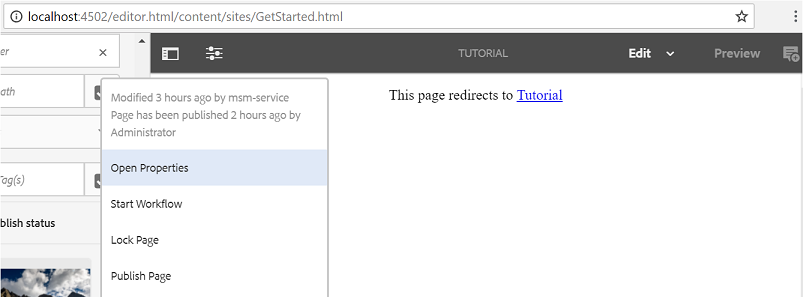
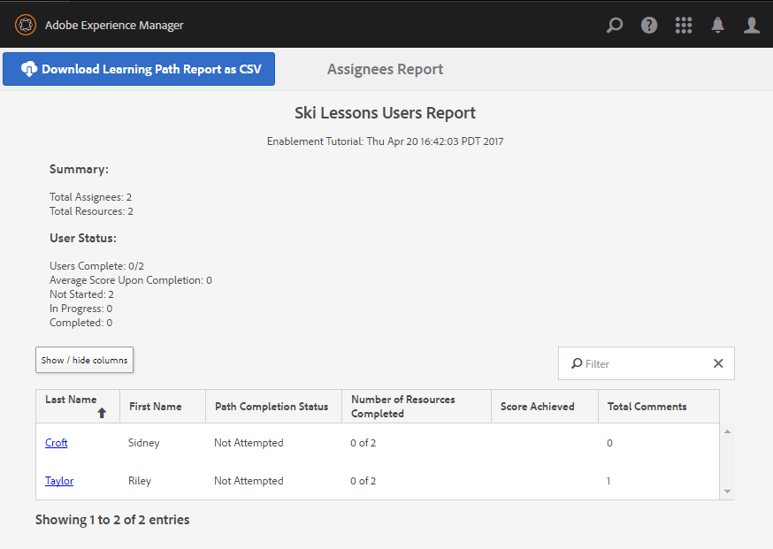

# 體驗發佈網站{#experience-the-published-site}

**[‹建立和分配啟用資源](resource.md)**

## 瀏覽至發佈時的新網站{#browse-to-new-site-on-publish}

現在，新建立的社群網站及其啟用資源和學習路徑已經發佈，您就可以體驗「啟用教學課程」網站。

首先，瀏覽至建立網站時顯示的URL，但是在發佈伺服器上，例如

* 作者URL = [http://localhost:4502/content/sites/enable/en.html](http://localhost:4502/content/sites/enable/en.html)
* 發佈URL = [http://localhost:4503/content/sites/enable/en.html](http://localhost:4503/content/sites/enable/en.html)

如果[預設首頁已設定為](enablement-create-site.md#changethedefaulthomepage)，則只要瀏覽至[http://localhost:4503/](http://localhost:4503/)，就應該啟動網站。

首次到達發佈網站時，網站訪客通常尚未登入，且是匿名的。

**http://localhost:4503/content/sites/enable/en.html**

## 匿名網站訪客{#anonymous-site-visitor}

匿名網站訪客會立即看到此私人啟用社群網站的登入頁面。 請注意，您沒有選擇自行註冊或登入Facebook或Twitter。

請注意，此首頁顯示四個功能表項目：`Assignments, Ski Catalog, What's New`和`Discussions`，但必須登入才能到達。

>[!NOTE]
>
>不允許網站訪客自行註冊，就可授予對啟用網站的匿名存取權。
>
>如果啟用資源設為`show in catalog`和`allow anonymous access`，匿名網站訪客將可檢視目錄中的資源。

### 防止對JCR {#prevent-anonymous-access-on-jcr}的匿名訪問

已知限制會透過jcr內容和json將社群網站內容公開給匿名訪客，但&#x200B;**[!UICONTROL 允許匿名存取]**&#x200B;會停用網站內容。 不過，這個行為可以使用Sling Restrictions做為因應措施加以控制。

若要保護您的社群網站內容不受匿名使用者透過jcr內容和json存取，請遵循下列步驟：

1. 在AEM作者例項上，請前往https://&lt;host>:&lt;port>/editor.html/content/site/&lt;sitename>.html。

   >[!NOTE]
   >
   >請勿前往本地化網站。

1. 前往&#x200B;**[!UICONTROL 頁面屬性]**。

   

1. 轉至「**[!UICONTROL 高級]**」頁籤。
1. 啟用&#x200B;**[!UICONTROL 驗證要求]**。

   

1. 新增登入頁面的路徑。 例如，`/content/......./GetStarted`。
1. 發佈頁面。

## 已註冊的成員{#enrolled-member}

此體驗取決於`Riley Taylor`和`Sidney Croft`是[created](enablement-setup.md#publishcreateenablementmembers)和[指派給&#x200B;*滑雪課程*&#x200B;學習路徑的用戶，他們通過其&#x200B;*社區滑雪課程*&#x200B;組的會員資格。](resource.md#settings)

使用

* `Username: riley`
* `Password: password`

如果用戶配置檔案不是通過自註冊建立的，則會在成員首次登錄時顯示其「配置檔案」頁，以便他們可以根據需要驗證和修改該配置檔案。

下次成員登入時，會顯示由第一個功能表項目所識別的首頁。

### 指定任務 {#assignments}

在「工作」頁面中，會顯示成員所有專門分配給他們的學習路徑和啟用資源。

每個分配都提供以下基本資訊：

* 指派類型
* 是否為新任務
* 名稱
* 與分配類型相關的詳細資訊
* 指派聯絡人、專家和作者（如果提供）

指派類型由卡片左上角的圖示指示。 道路的影像是用於學習路徑，其中包含的支援資源數量。

選擇&#x200B;*滑雪課程*&#x200B;將顯示學習路徑所參照的兩個啟用資源。

選擇&#x200B;*滑雪課程1*&#x200B;將開啟啟用資源的詳細資訊頁面。

在詳細資訊頁中，成員可以學習[rate](rating.md)本課並添加[注釋](comments.md)。 任何會員活動都會反映在網站的「新增功能」區段中。

與啟用資源的互動將記錄在作者環境中可存取的「報表」區段中。

### 滑雪目錄{#ski-catalog}

「滑雪目錄」頁面是使用`Tutorial`命名空間中的標籤標籤的啟用資源目錄。 兩個&#x200B;*滑雪課程*&#x200B;資源使用`Skiing`標籤進行標籤，如果選擇了`All`或`Tutorial: Sports / Skiing`以外的任何標籤，則不顯示任何內容。

如果沒有直接或通過學習路徑為成員分配啟用資源，則可以與位於目錄內的啟用資源交互，並通過注釋和分級提供反饋。

### 討論 {#discussions}

除了對啟用資源（[啟用時）評分和注釋外，建立`Enablement Tutorial`的社區站點模板還包括[論壇功能](functions.md#forum-function)(標題為`Discussions)`。](enablement-create-site.md#step33asettings)

選擇`Discussions`連結並張貼主題。

以Sidney Croft（sidney /密碼）的身分登出並登入並回覆問題，以及關注主題。

注意，除了內嵌協調外，還有選項可供您在社交媒體上分享主題或以電子郵件傳送主題。

### 新功能 {#what-s-new}

`What's New`功能表項目是此社群網站結構中指定[活動串流函式](functions.md#activity-stream-function)的標題。

仍以Sidney的身分登入，請選取`What's New`連結以顯示活動。

## 受信任的社區成員{#trusted-community-member}

本體驗假設` [Quinn Harper](enablement-setup.md#publishcreateenablementmembers)`被指派為[協調者](enablement-create-site.md#moderation)和[資源聯繫人](resource.md#settings)的角色。

使用

* `Username: quinn`
* `Password: password`

登入後，請注意會出現新的功能表項目`Administration`，因為會員被賦予協調者角色。

首頁由第一個菜單項「工作總攬」標識。 Quinn是協調者和啟用資源聯絡人，未註冊任何啟用資源或學習路徑，因此無需顯示任何內容。

### 管理 {#administration}

有的是，兩個學員的活動，`Riley Taylor`和`Sidney Croft`。 選取`Administration`連結以存取「協調控制台」,Quinn就可使用[大量協調控制台](moderation.md)來協調其貼文。

選取側面板圖示可切換開啟用於搜尋社群內容的篩選器。

將滑鼠指標暫留在留言卡上會顯示協調動作。

## 作者報告{#reports-on-author}

存取學員報告和啟用資源有兩種方式。

在作者上，導覽至&#x200B;**社群、[資源主控台](resources.md)**，其中管理啟用資源，在選取社群網站後，可產生報表

* 所有啟用資源和學習途徑
* 一種特定的啟用資源或學習途徑

導覽至&#x200B;**社群、[報表控制台](reports.md)**，並根據下列項目產生報表：

* 指派至啟用資源和學習路徑
* 在特定時段內張貼至社群網站
* 特定時段內社群網站的檢視（網站瀏覽）

* 貼文和檢視可能針對所有內容，或特定內容：

   * 論壇
   * 論壇主題
   * QnA
   * QnA 問題
   * 部落格
   * 部落格文章
   * 日曆
   * 日曆事件

### 資源控制台{#resources-console}

只要進行一些活動，並與發佈時的「資源」互動，檢視作者的報表就值得一看。

* 在作者上，以管理權限登入。
* 從主菜單導航到&#x200B;**[!UICONTROL Communities]** > **[!UICONTROL Resources]**。
* 選擇`Enablement Tutorial`站點。
* 選擇`Report`表徵圖以查看所有資源的摘要。
* 選擇資源，然後為該資源上的報告選擇`Report`表徵圖。

請注意，顯示Adobe Analytics的資料可能還為時太早，Adobe Analytics可能需要1到12小時才會顯示。 不過，基本的SCORM報表已可供使用。

#### 滑雪課程資源報告{#ski-lessons-resource-report}

#### 滑雪課用戶報告{#ski-lessons-user-report}

* 選擇&#x200B;**[!UICONTROL 社區>資源]**

* 開啟卡片`Enablement Tutorial`
* 開啟卡片`Ski Lessons`
* 選取 `Report > User Report`

### 報告控制台{#reports-console}

「報表控制台」可讓您在

* **任何** 啟用社群網站的指派
* **任何** 社群網站的檢視
* **適用於** 任何社群網站的貼文

對於分配報告：

* 在作者上，以管理權限登入。
* 導覽至「**[!UICONTROL 社群]** > **[!UICONTROL 報表]** > **[!UICONTROL 工作報表]**」。
* 從下拉菜單中選擇&#x200B;**[!UICONTROL 站點]**（選擇`Enablement Tutorial`）。

* 選擇&#x200B;**[!UICONTROL Group]**（選擇`Community Ski Class`）

* 選擇&#x200B;**[!UICONTROL Assignment]**（選擇`Ski Lessons`）

* 選擇&#x200B;**[!UICONTROL 生成]**

若是檢視報表：

* 在作者上，以管理權限登入。
* 導覽至「**[!UICONTROL Communities]** > **[!UICONTROL Reports]** > **[!UICONTROL Views Report]**」。
* 從下拉菜單中選擇&#x200B;**站點**（選擇`Enablement Tutorial`）。

* 選擇&#x200B;**[!UICONTROL 內容類型]**（選擇`all`）。

* 選擇&#x200B;**[!UICONTROL 日期範圍]**（選擇`Last 7 days`）。

* 選擇&#x200B;**[!UICONTROL 生成]**。

**[‹建立和分配啟用資源](resource.md)**
