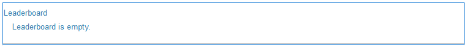

# 排行榜功能 {#leaderboard-feature}

## 簡介 {#introduction}

此 `Leaderboard` 元件可協助您根據獲得的點數（基本分數）或其專業知識（進階分數）來排名成員，以瞭解成員在社群內互動的方式。

在頁面上加入排行榜元件之前，必須先設定 [社群評分和預算](/help/communities/implementing-scoring.md).

本檔案的這一節將說明：

* 新增 `Leaderboard` 元件至 [社群網站](/help/communities/overview.md#community-sites).
* 的組態設定 `Leaderboard` 元件。

### 新增排行榜至頁面 {#adding-a-leaderboard-to-a-page}

若要新增 `Leaderboard` 元件至作者模式下的頁面，找到元件

* `Communities / Leaderboard`

並將其拖曳至頁面上的適當位置。

如需必要資訊，請造訪 [Communities元件基本知識](/help/communities/basics.md).

當元件首次置於社群網站頁面時，以下是元件的顯示方式：

### 設定排行榜 {#configuring-leaderboard}

選取已放置的 `Leaderboard` 元件供您存取及選取 `Configure` 圖示可開啟編輯對話方塊。

#### 設定標籤 {#settings-tab}

在 **[!UICONTROL 設定]** 標籤，指定與成員相關的顯示資訊：

* **顯示名稱**

  為展示板顯示的描述性名稱，反映為顯示徽章和分數而選取的規則。
預設為 `Leaderboard` 如果未輸入任何專案。

* **徽章**

  如果勾選，則排行榜會包含徽章圖示欄。
預設為未勾選。

* **徽章名稱**

  如果勾選，則排行榜會包含徽章名稱的欄。
預設為未勾選。

* **使用頭像**

  如果勾選，成員的頭像影像會包含在排行榜中，位於其名稱連結旁邊，指向其成員設定檔。
預設為未勾選。

#### 規則標籤 {#rules-tab}

在 **規則** 標籤、社群網站及其評分和徽章規則

* **規則位置**

  （必要）設定評分/徽章規則的位置。

* **評分規則**

  （必要）產生分數以顯示的特定規則。

* **徽章規則**

  （必要）產生要顯示之徽章的特定規則。

* **顯示限制**

  每頁顯示的成員數目。 預設值為10。

### 範例：參與者排行榜 {#example-participants-leaderboard}

此排行榜會報告套用基本評分規則的結果。

排行榜元件組態：

* 設定標籤：

   * 顯示名稱= `Participation Board`
   * `checked`：

      * 徽章
      * 徽章名稱
      * 使用頭像

* 規則標籤：

   * 規則位置= `/content/sites/<site name>/jcr:content`
   * 評分規則= `/libs/settings/community/scoring/rules/forums-scoring`
   * 徽章規則= `/libs/settings/community/badging/rules//reference-badging`
   * 顯示限制= `10`

### 範例：專家排行榜 {#example-experts-leaderboard}

此排行榜會報告套用進階評分規則的結果。

排行榜元件組態：

* 設定標籤：

   * 顯示名稱= `Expertise Board`
   * `checked`：

      * 徽章
      * 使用頭像

* 規則標籤：

   * 規則位置= `/content/sites/<site name>/jcr:content`
   * 評分規則= `/libs/settings/community/scoring/rules/adv-forums-scoring`
   * 徽章規則= `/libs/settings/community/badging/rules/adv-forums-badging`
   * 顯示限制= `10`

### 其他資訊 {#additional-information}

如需詳細資訊，請參閱 [排行榜要點](/help/communities/leaderboard.md) 開發人員頁面。

建立規則的指示請參閱 [社群評分和預算](/help/communities/implementing-scoring.md) 管理員頁面。
