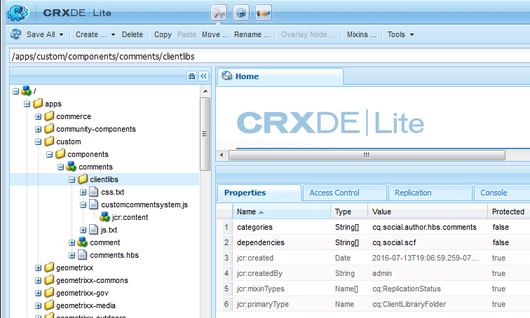

# 建立元件  {#create-the-components}

擴展元件的示例使用注釋系統，該系統實際上由兩個元件組成

* 注釋 — 包含注釋系統，該系統是放置在頁面上的元件。
* 注釋 — 捕獲已發佈注釋實例的元件。

兩個元件都需要安裝到位，尤其是在自定義已發佈注釋的外觀時。

>[!NOTE]
>
>每個站點頁只允許一個注釋系統。
>
>許多社區功能已經包括注釋系統，其resourceType可以修改以引用擴展注釋系統。

## 建立注釋元件 {#create-the-comments-component}

這些方向指定 **組** 值 `.hidden` 因此，該元件可從元件瀏覽器(sidekick)獲得。

刪除自動建立的JSP檔案是因為將使用預設的HBS檔案。

1. 瀏覽到 **CRXDE|Lite** ([http://localhost:4502/crx/de/index.jsp](http://localhost:4502/crx/de/index.jsp))

1. 為自定義應用程式建立位置：

   * 選擇 `/apps` 節點

      * **建立資料夾** 命名 **[!UICONTROL 自定義]**
   * 選擇 `/apps/custom` 節點

      * **建立資料夾** 命名 **[!UICONTROL 元件]**


1. 選擇 `/apps/custom/components` 節點

   * **[!UICONTROL 建立>元件……]**

      * **標籤**: *評論*
      * **標題**: *備選注釋*
      * **說明**: *備選注釋樣式*
      * **超類型**: *社交/公共/元件/hbs/評論*
      * **組**: *自定義*
   * 選擇 **[!UICONTROL 下一個]**
   * 選擇 **[!UICONTROL 下一個]**
   * 選擇 **[!UICONTROL 下一個]**
   * 選擇 **[!UICONTROL 確定]**


1. 展開剛建立的節點： `/apps/custom/components/comments`
1. 選擇 **[!UICONTROL 全部保存]**
1. 按一下右鍵 `comments.jsp`
1. 選擇 **[!UICONTROL 刪除]**
1. 選擇 **[!UICONTROL 全部保存]**


### 建立子注釋元件 {#create-the-child-comment-component}

這些方向集 **組** 至 `.hidden` 因為頁面中應僅包含父元件。

刪除自動建立的JSP檔案是因為將使用預設的HBS檔案。

1. 導航到 `/apps/custom/components/comments` 節點
1. 按一下右鍵節點

   * 選擇 **[!UICONTROL 建立]** > **[!UICONTROL 元件……]**

      * **標籤**: *注釋*
      * **標題**: *備用注釋*
      * **說明**: *備選注釋樣式*
      * **超類型**: *社交/公域/元件/hbs/評論/評論*
      * **組**: `*.hidden*`
   * 選擇 **[!UICONTROL 下一個]**
   * 選擇 **[!UICONTROL 下一個]**
   * 選擇 **[!UICONTROL 下一個]**
   * 選擇 **[!UICONTROL 確定]**


1. 展開剛建立的節點： `/apps/custom/components/comments/comment`
1. 選擇 **[!UICONTROL 全部保存]**
1. 按一下右鍵 `comment.jsp`
1. 選擇 **[!UICONTROL 刪除]**
1. 選擇 **[!UICONTROL 全部保存]**


### 複製和修改預設HBS指令碼 {#copy-and-modify-the-default-hbs-scripts}

使用 [CRXDE Lite](../../help/sites-developing/developing-with-crxde-lite.md):

* 複製 `comments.hbs`

   * 從 [/libs/social/commons/components/hbs/comments](http://localhost:4502/crx/de/index.jsp#/libs/social/commons/components/hbs/comments)
   * 至 [/apps/custom/components/comments/comments](http://localhost:4502/crx/de/index.jsp#/apps/custom/components/comments)

* 編輯 `comments.hbs` 至：

   * 更改 `data-scf-component` 屬性(~line 20):

      * 從 `social/commons/components/hbs/comments`
      * 至 `/apps/custom/components/comments`
   * 修改以包括自定義注釋元件（~第75行）:

      * 取代 `{{include this resourceType='social/commons/components/hbs/comments/comment'}}`
      * 與 `{{include this resourceType='/apps/custom/components/comments/comment'}}`


* 複製 `comment.hbs`

   * 從 [/libs/social/commons/components/hbs/comments/comments/comments/comments](http://localhost:4502/crx/de/index.jsp#/libs/social/commons/components/hbs/comments/comment)
   * 至 [/apps/custom/components/comments/comments/comments/comments](http://localhost:4502/crx/de/index.jsp#/apps/custom/components/comments/comment)

* 編輯 `comment.hbs` 至：

   * 更改data-scf-component屬性的值（~行19）

      * 從 `social/commons/components/hbs/comments/comment`
      * 至 `/apps/custom/components/comments/comment`

* 選擇 `/apps/custom` 節點
* 選擇 **[!UICONTROL 全部保存]**

## 建立客戶端庫資料夾 {#create-a-client-library-folder}

為避免必須明確包括此客戶端庫，可以使用預設注釋系統客戶端庫的類別值( `cq.social.author.hbs.comments`)，但此客戶端庫也將包含在預設元件的所有實例中。

使用 [CRXDE Lite](../../help/sites-developing/developing-with-crxde-lite.md):

* 選擇 `/apps/custom/components/comments` 節點
* 選擇 **[!UICONTROL 建立節點]**

   * **名稱**: `clientlibs`
   * **類型**: `cq:ClientLibraryFolder`
   * 添加到 **[!UICONTROL 屬性]** 頁籤：

      * **名稱** `categories` **類型** `String` **值** `cq.social.author.hbs.comments` `Multi`
      * **名稱** `dependencies` **類型** `String` **值** `cq.social.scf` `Multi`

* 選擇 **[!UICONTROL 全部保存]**
* 與 `/apps/custom/components/comments/clientlib`選中s節點，建立3個檔案：

   * **名稱**: `css.txt`
   * **名稱**: `js.txt`
   * **名稱**:customcommentsystem.js

* 輸入「customcommentsystem.js」作為 `js.txt`
* 選擇 **[!UICONTROL 全部保存]**



## 註冊SCF模型和視圖 {#register-the-scf-model-view}

在擴展（覆蓋）SCF元件時，resourceType不同（覆蓋使用相對搜索機制進行搜索） `/apps` 先 `/libs` 以便resourceType保持不變)。 因此，需要編寫JavaScript（在客戶端庫中）來註冊自定義resourceType的SCF JS模型和視圖。

輸入以下文本作為 `customcommentsystem.js`:

### customcommentsystem.js {#customcommentsystem-js}

```xml
(function($CQ, _, Backbone, SCF) {
    "use strict";

    var CustomComment = SCF.Components["social/commons/components/hbs/comments/comment"].Model;
    var CustomCommentView = SCF.Components["social/commons/components/hbs/comments/comment"].View;

    var CustomCommentSystem = SCF.Components["social/commons/components/hbs/comments"].Model;
    var CustomCommentSystemView = SCF.Components["social/commons/components/hbs/comments"].View;

    SCF.registerComponent('/apps/custom/components/comments/comment', CustomComment, CustomCommentView);
    SCF.registerComponent('/apps/custom/components/comments', CustomCommentSystem, CustomCommentSystemView);

})($CQ, _, Backbone, SCF);
```

* 選擇 **[!UICONTROL 全部保存]**

## 發佈應用 {#publish-the-app}

為了在發佈環境中體驗擴展元件，需要複製自定義元件。

一個方法是：

* 從全球導航，

   * 選擇 **[!UICONTROL 工具]** > **[!UICONTROL 部署]** > **[!UICONTROL 複製]**
   * 選擇 **[!UICONTROL 激活樹]**
   * 設定 `Start Path` 至 `/apps/custom`
   * 取消選中 **[!UICONTROL 僅修改]**
   * 選擇 **[!UICONTROL 激活]** 按鈕
