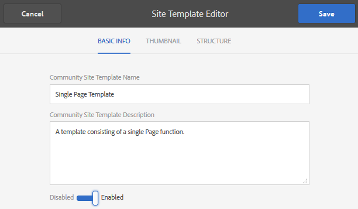

# 新增註解至範例頁面 {#add-comment-to-sample-page}

現在，自訂註解系統的元件已位於應用程式目錄(/apps)中，因此可以使用延伸元件。 要受影響的網站中的注釋系統實例必須將其resourceType設定為自定義注釋系統，並包含所有必要的客戶端庫。

## 識別所需的客戶端 {#identify-required-clientlibs}

延伸「注釋」的樣式和功能所需的用戶端程式庫也是必要的。

「社 [群元件指南](/help/communities/components-guide.md) 」可識別所需的用戶端程式庫。 瀏覽至「元件指南」並檢視「注釋」元件，例如：

[https://localhost:4502/content/community-components/en/comments.html](https://localhost:4502/content/community-components/en/comments.html)

請注意，「注釋」需要三個用戶端程式庫，才能正常顯示和運作。 這些內容必須包含在參考延伸注釋的位置，以及 [延伸注釋的用戶端程式庫](/help/communities/extend-create-components.md#create-a-client-library-folder) ( `apps.custom.comments`)。

### 新增自訂注釋至頁面 {#add-custom-comments-to-a-page}

由於每頁只能有一個注釋系統，因此建立範例頁面會比較簡單，如簡短的「建立範例頁 [面」教學課程所述](/help/communities/create-sample-page.md) 。

建立後，進入「設計」模式，並使「自訂」元件群組可供 `Alt Comments` 將元件新增至頁面。

為了使「注釋」能夠正常顯示和運作，必須將「注釋」的客戶端庫添加到該頁的clientlibs清單中(請參 [閱Clientlibs for Communities Components](/help/communities/clientlibs.md))。

#### 範例頁面上的注釋Clientlibs {#comments-clientlibs-on-sample-page}

#### 作者：範例頁面上的替代註解 {#author-alt-comment-on-sample-page}

#### 作者：範例頁面注釋節點 {#author-sample-page-comments-node}

通過查看示例頁的注釋節點屬性，可以在CRXDE中驗證resourceType `/content/sites/sample/en/jcr:content/content/primary/comments`。

#### 發佈範例頁面 {#publish-sample-page}

將自訂元件新增至頁面後，也必須（重新）發 [布頁面](/help/communities/sites-console.md#publishing-the-site)。

#### 發佈：範例頁面上的替代註解 {#publish-alt-comment-on-sample-page}

發佈自訂應用程式和範例頁面後，就可以輸入註解。 登入時，不論是與示範使 [用者](/help/communities/tutorials.md#demo-users) 或管理員登入，都可張貼意見。

以下是aaron.mcdonald@mailinator.com張貼意見：

 

現在看來擴展元件與預設外觀正常工作，是時候修改外觀了。