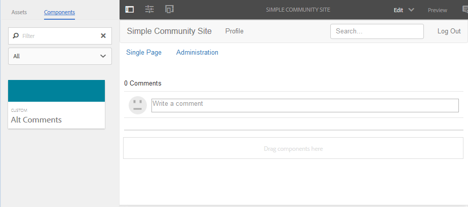
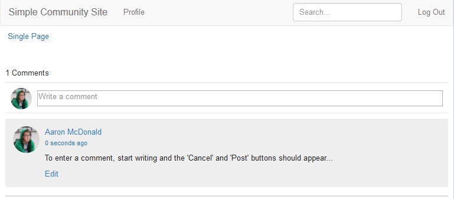

# 將注釋添加到示例頁{#add-comment-to-sample-page}

現在，自訂註解系統的元件已位於應用程式目錄(/apps)中，因此可以使用延伸元件。 要受影響的網站中的注釋系統實例必須將其resourceType設定為自定義注釋系統，並包含所有必要的客戶端庫。

## 確定所需的Clientlibs {#identify-required-clientlibs}

延伸「注釋」的樣式和功能所需的用戶端程式庫也是必要的。

[社群元件指南](/help/communities/components-guide.md)可識別所需的用戶端程式庫。 瀏覽至「元件指南」並檢視「注釋」元件，例如：

[https://localhost:4502/content/community-components/en/comments.html](https://localhost:4502/content/community-components/en/comments.html)

請注意，「注釋」需要三個用戶端程式庫，才能正常顯示和運作。 這些必須包含在引用擴展注釋的地方，以及[擴展注釋的客戶端庫](/help/communities/extend-create-components.md#create-a-client-library-folder)(`apps.custom.comments`)。

### 將自訂注釋新增至頁面{#add-custom-comments-to-a-page}

由於每頁只能有一個注釋系統，因此建立示例頁更簡單，如簡短的[建立示例頁](/help/communities/create-sample-page.md)教程中所述。

建立後，進入「設計」模式並使「自定義」元件組可用，以允許將`Alt Comments`元件添加到頁面。

為了使「注釋」能夠正常顯示和運行，必須將「注釋」的客戶端庫添加到該頁的clientlibs清單中（請參見[Clientlibs for Communities Components](/help/communities/clientlibs.md)）。

#### 範例頁面{#comments-clientlibs-on-sample-page}上的注釋Clientlibs

#### 作者：範例頁面{#author-alt-comment-on-sample-page}上的替代註解

#### 作者：頁面注釋節點示例{#author-sample-page-comments-node}

通過查看示例頁的注釋節點屬性（位於`/content/sites/sample/en/jcr:content/content/primary/comments`），可以在CRXDE中驗證resourceType。

#### 發佈範例頁面{#publish-sample-page}

將自訂元件新增至頁面後，也必須(re)[發佈頁面](/help/communities/sites-console.md#publishing-the-site)。

#### 發佈：範例頁面{#publish-alt-comment-on-sample-page}上的替代註解

發佈自訂應用程式和範例頁面後，就可以輸入註解。 登入時，無論是與[demo使用者](/help/communities/tutorials.md#demo-users)或管理員登入，皆可張貼意見。

以下是aaron.mcdonald@mailinator.com張貼意見：

現在看來擴展元件與預設外觀正常工作，是時候修改外觀了。