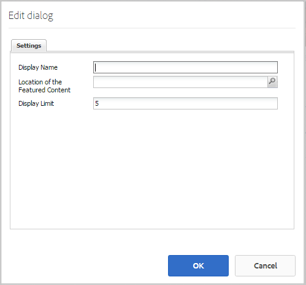

# 特色內容功能 {#featured-content-feature}

## 簡介 {#introduction}

特色內容功能為發佈環境中的登錄站點訪問者（社區成員）提供了一個區域，以突出顯示以下內容：

* [部落格](blog-feature.md)
* [日曆](calendar.md)
* [論壇](forum.md)
* [構思](ideation-feature.md)
* [QnA](working-with-qna.md)

一旦內容被標籤為特色，它將列在此元件中，這些內容可放置在特定的登錄頁或容易引起社區成員注意的區域中。

每個元件可能允許或不允許功能內容。

文檔的本節介紹：

* 將特色內容添加到社區網站。
* 的配置設定 `Featured Content` 元件。

## 將特色內容添加到頁面 {#adding-featured-content-to-a-page}

添加 `Featured Content` 在作者模式下對頁面的元件，使用元件瀏覽器查找

* `Communities / Featured Content`

並將其拖到應顯示特色內容的頁面上。

如需必要資訊，請訪問 [社區元件基礎](basics.md)。

當 [所需的客戶端庫](essentials-featured.md#essentials-for-client-side) 包括，這是 `Featured Content` 元件將出現：

## 配置特色內容 {#configuring-featured-content}

選取已放置的 `Featured Content` 要訪問和選擇的元件 `Configure` 表徵圖。

### 「設定」頁籤 {#settings-tab}

在 **[!UICONTROL 設定]** 頁籤，標識要實現的功能：

* **[!UICONTROL 顯示名稱]**

   特色內容清單的標題。 例如 `Featured Questions` 或 `Featured Ideas`。 預設值為 `Featured Content` 框。

* **[!UICONTROL 主要內容的位置]**

   *（必需）* 瀏覽到包含可能是功能的內容的頁面（該頁面的元件必須配置為允許特色內容）。 比如說， `/content/sites/engage/en/forum`。

* **[!UICONTROL 顯示限制]**

   要顯示的特色內容的最大數量。 預設值為5。

## 站點訪問者體驗 {#site-visitor-experience}

將內容標籤為特色內容的能力需要版主權限。

版主查看已發佈的內容時，他們可以訪問上下文中的審核標誌，其中包括新的 `Feature` 。

標籤為功能後，模型標誌將變為 `Unfeature`。

包含 `Featured Content` 元件，現在將包括此帖子。

`Read More` 是實際帖子的連結。

## 其他資訊 {#additional-information}

有關 [特色內容](essentials-featured.md) 頁面。

有關將內容標籤為特色的內容，請參閱 [調節用戶生成的內容](moderate-ugc.md)。
