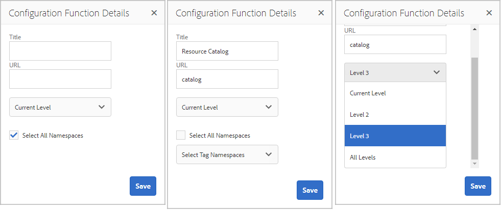

# 社群功能{#community-functions}

社群體驗預期的功能類型已廣為人知。 社群功能可做為社群功能。 基本上，這些頁面是預先連線的一或多個頁面，以實作社群功能，其需要的不只是在作者模式下將元件新增至頁面。 它們是用來定義社群網站範本結構的 [構成區塊](/help/communities/sites.md) ，從中建立社 [群網站](/help/communities/sites-console.md)。

在建立社群網站後，就可使用標準 [AEM製作模式，將內容新增至產生的頁面](/help/sites-authoring/editing-content.md)。 各種社群功能如社群功能主控台所示。

>[!NOTE]
>
>用於建立社區站點 [的控制台](/help/communities/sites-console.md)、社 [區站點模](/help/communities/sites.md)板、社區組模板 [,](/help/communities/tools-groups.md) 以及社區功能的控制台僅用於作者環境。

## 社群功能主控台 {#community-functions-console}

在作者環境中，要到達社群功能主控台

* 從全局導航：工 **具、社群、社群功能**

## 預建函式 {#pre-built-functions}

以下是AEM Communities所提供功能的簡短說明。 每個函式都包含一或多個AEM頁面，其中包含連線在功能中的Communities元件，可輕鬆整合在社群 [網站範本中](/help/communities/sites.md)。

社群網站範本提供社群網站的結構，包括登入、使用者設定檔、通知、訊息、網站選單、搜尋、主題和品牌功能。

### 標題和URL設定 {#title-and-url-settings}

**Title **和**URL **是所有社群函式的常用屬性。

當社群功能新增至社群網站範本或在修改社群網站 [結構](/help/communities/sites-console.md#modifying-site-properties) 時新增時，功能的對話方塊會開啟，以便設定標題和URL。

#### 設定功能詳細資料 {#configuration-function-details}

* **Title**(*必要*)出現在網站功能選單中的文字

* **URL**(必&#x200B;*要*)用於產生URI的名稱。 名稱必須符合AEM和JCR [所強加](/help/sites-developing/naming-conventions.md) 的命名慣例。

例如，使用依據「快速入門」教學課程 [建立的網站](/help/communities/getting-started.md) ，如果

* 標題=網頁
* URL =頁面

則頁面的URL為https://localhost:4503/content/sites/engage/en/**page**.html

頁面的功能表連結會顯示為：

### 活動資料流功能 {#activity-stream-function}

活動流函式是具有「活動流」元件 [的頁面](/help/communities/activities.md) ，其中選定了所有視圖（所有活動、用戶活動和以下活動）。 另請參 [閱開發人員的Activity Stream Essentials](/help/communities/essentials-activities.md) 。

新增至範本時，會開啟下列對話方塊：

#### 設定功能詳細資料 {#configuration-function-details-1}

* [標題和URL設定](#title-and-url-settings)
* **顯示「我的活動」視圖**&#x200B;如果選中此選項，「活動」頁面將包含一個頁籤，該頁籤根據當前成員在社區中生成的活動進行篩選。 已選取預設值。

* **顯示「所有活動」視圖**&#x200B;如果選中此選項，「活動」頁將包含一個頁籤，其中包含當前成員有權訪問的社區內生成的所有活動。 已選取預設值。

* **顯示「動態消息」視圖**&#x200B;如果選中，「活動」頁面會包含一個標籤，該標籤會根據當前成員正在跟蹤的活動來篩選活動。 已選取預設值。

### 指定任務功能 {#assignments-function}

指派功能是定義社群網站以進行啟用 [的基本功能](/help/communities/overview.md#enablement-community)。 它允許向社區成員分配支援資源。 另請參 [閱Assignments Essentials](/help/communities/essentials-assignments.md) for developers。

此函式是啟用附加元件 [的功能](/help/communities/enablement.md)。 啟用附加元件需要額外的授權才能用於生產環境。

新增至範本時，唯一的設定是「標題」 [和「URL設定」](#title-and-url-settings)。

### 部落格功能 {#blog-function}

部落格函式是具有 [Blog元件的頁面](/help/communities/blog-feature.md) ，其設定用於標籤、檔案上傳、追蹤、成員自行編輯、投票和協調。 另請參閱 [開發人員的Blog Essentials](/help/communities/blog-developer-basics.md) 。

新增至範本時，會開啟下列對話方塊：

* [標題和URL設定](#title-and-url-settings)
* **允許特權成**&#x200B;員如果選中此選項，則部落格僅允許特權成員通過允許選擇特權成員組 [來建立文章](/help/communities/users.md#privileged-members-group)。 如果未選中，則允許所有社區成員建立。 已取消選取預設值。

* **允許上傳檔案**&#x200B;如果選取此選項，部落格會包含成員上傳檔案的功能。 已選取預設值。

* **允許執行緒回**&#x200B;覆如果未選取，部落格會允許對文章的回覆（留言），但不允許對留言的回覆。 已選取預設值。

* **允許特色內**&#x200B;容如果選取此選項，部落格即被識別 [為特色內容](/help/communities/featured.md)。 已選取預設值。

### 日曆功能 {#calendar-function}

日曆函式是具有「日曆」元件 [的頁面](/help/communities/calendar.md) ，設定為允許標籤。 另請參閱 [開發人員的Calendar Essentials](/help/communities/calendar-basics-for-developers.md) 。

新增至範本時，會開啟下列對話方塊：

* 請參閱 [標題和URL設定](#title-and-url-settings)
* **允許釘選**&#x200B;如果選取，論壇允許將主題回覆釘選至留言清單的開頭。 已選取預設值。

* **允許特權成**&#x200B;員如果選中此選項，則部落格僅允許特權成員通過允許選擇特權成員組 [來建立文章](/help/communities/users.md#privileged-members-group)。 如果未選中，則允許所有社區成員建立。 已取消選取預設值。

* **允許上傳檔案**&#x200B;如果選取此選項，部落格會包含成員上傳檔案的功能。 已選取預設值。

* **允許執行緒回**&#x200B;覆如果未選取，部落格會允許對文章的回覆（留言），但不允許對留言的回覆。 已選取預設值。

* **允許特色內**&#x200B;容如果選取，其內容會識別為特 [色內容](/help/communities/featured.md)。 已選取預設值。

### 目錄功能 {#catalog-function}

目錄功能提供啟用社 [群成員瀏覽未指派給](/help/communities/overview.md#enablement-community) 他們的啟用資源的能力。 請參 [閱為開發人員標籤](/help/communities/tag-resources.md)[啟用資源和目錄基本工具](/help/communities/catalog-developer-essentials.md) 。

如果社群網站的屬性設為true，則所有目錄中會顯示社群網站的所有啟用 ` [Show in Catalog](/help/communities/resources.md)`資源和學習路徑。 若要明確包含資源和學習路徑，必須套用預 [先篩選](/help/communities/catalog-developer-essentials.md#pre-filters) 至目錄。

新增至範本時，此設定可讓您指定用於設定提供給網站訪客之標籤篩選的標籤命名空間：

* [標題和URL設定](#title-and-url-settings)
* **選擇所有名稱空**間選定的標籤名稱空間定義哪些標籤可由訪客選擇，以篩選目錄中列出的啟用資源清單。
如果選中此選項，則允許為社區站點使用的所有標籤名稱空間都可用。
如果取消選取，則可以選擇社區站點允許的一個或多個名稱空間。
已選取預設值。

### 特色內容功能 {#featured-content-function}

精選內容功能是具備「精選內容」元 [件的頁面](/help/communities/featured.md) ，可允許新增和刪除註解。

可以允許或按元件(請參閱 [Function](#blog-function)、 [Calendar Function](#calendar-function)、 [Forum Function](#forum-function)、 Ideation Function、A Function Qn blog)對內容進行功能化。

新增至範本時，唯一的設定是「標題」 [和「URL設定」](#title-and-url-settings)。

### 檔案庫功能 {#file-library-function}

檔案庫函式是具有「檔案庫」組 [件的頁面](/help/communities/file-library.md) ，該元件配置為允許添加和刪除注釋。

新增至範本時，唯一的設定是「標題」 [和「URL設定」](#title-and-url-settings)。

### 論壇功能 {#forum-function}

論壇功能是一個頁面，其中 [Forum元件已設定為標籤、檔案上傳](/help/communities/forum.md) 、追隨成員以進行自我編輯、投票和協調。

新增至範本時，會開啟下列對話方塊：

#### 設定功能詳細資料 {#configuration-function-details-2}

* [標題和URL設定](#title-and-url-settings)
* **允許釘選**&#x200B;如果選取，論壇允許將主題回覆釘選至留言清單的開頭。 已選取預設值。

* **允許特權成**&#x200B;員如果選中此選項，則論壇僅允許特權成員通過允許選擇特權成員 [組來發佈主題](/help/communities/users.md#privileged-members-group)。 如果未選取，則允許所有社群成員張貼。 已取消選取預設值。

* **允許上傳檔案**&#x200B;如果選取此選項，論壇將包含成員上傳檔案的功能。 已選取預設值。

* **允許線程化回**&#x200B;覆如果未選取，論壇會允許對主題的回覆，但不允許對這些回覆。 已選取預設值。

* **允許特色內**&#x200B;容如果選取，元件的內容會識別為特 [色內容](/help/communities/featured.md)。 已選取預設值。

### 群組函式 {#groups-function}

>[!CAUTION]
>
>群組功能必須*不是* *是網站結構* 或社群網站範本中的第一個也是唯一的功能。
>
>任何其他函式(例如頁 [面函式](#page-function))必須先包含並列出。

群組功能可讓社群成員在發佈環境中在社群網站內建立子社群。

視社 [群網站範本中包含](/help/communities/sites-console.md#groupmanagement) 「群組」功能時的設定而定 ，群組可以是公用或私用的，而且可設定一或多個社群群組範本，以在實際建立社群群組時（例如來自發佈環境）提供範本選擇。 社 [群群組範本](/help/communities/tools-groups.md) ，可指定為群組頁面（如論壇和日曆）建立哪些社群功能。

建立社區組時，會為新組動態建立成員組，可將成員分配或加入到該組。 如需詳細資訊，請參 [閱管理使用者和使用者群組](/help/communities/users.md)。

自Communities功 [能套件1](/help/communities/deploy-communities.md#latestfeaturepack)起，社群群組是使用 [Communities Sites的「群組」主控台在作者環境中建立的](/help/communities/groups.md)，啟用後可在發佈環境中建立。

新增至範本時，會開啟下列對話方塊：

* [標題和URL設定](#title-and-url-settings)
* **選擇組模板**(Group Templates)下拉清單，允許選擇一個或多個啟用的組模板，新社區組（在發佈環境中）的將來建立者可以從中選擇這些模板。

* **允許特權成**&#x200B;員如果選中此選項，則論壇僅允許特權成員通過允許選擇特權成員安 [全組來發佈主題](/help/communities/users.md#privileged-members-group)。 如果未選取，則允許所有社群成員張貼。 已取消選取預設值。

* **允許建立發佈**如果選定此選項，則授權的社區成員可以在發佈環境中建立組。 如果取消選取，則只能在作者環境中從「社群網站的群組」主控台建立新群組（子社群）。
已選取預設值。

### 創意力功能 {#ideation-function}

Ideation函式是具有一個Ideation元件 [的頁面](/help/communities/ideation-feature.md)。

新增至範本時，會開啟下列對話方塊，指定範本的預設標題和URL名稱，以及預設顯示設定：

* [標題和URL設定](#title-and-url-settings)
* **允許特權成**&#x200B;員如果選中此選項，則論壇僅允許特權成員通過允許選擇特權成員安 [全組來發佈主題](/help/communities/users.md#privileged-members-group)。 如果未選取，則允許所有社群成員張貼。 已取消選取預設值。

* **允許上傳檔**&#x200B;案如果選取此選項，其構想包含成員上傳檔案的功能。 已選取預設值。

* **允許線程化**&#x200B;回覆如果未選中，該構想允許對主題的回覆（注釋），但不允許對注釋的回覆。 已選取預設值。

* **允許特色內**&#x200B;容如果選取，其內容會識別為特 [色內容](/help/communities/featured.md)。 已選取預設值。

### 排行榜功能 {#leaderboard-function}

排行榜功能是包含一個「排行榜」組 [件的頁面](/help/communities/enabling-leaderboard.md)。

**注意**:在從包含Leederboard功能的社區模 *板建立社區站點* 後，Leederboard元件需要進一步配置。 指定Leaderboard元件的規 [則](/help/communities/enabling-leaderboard.md#rules-tab)，這取決於社 [區站點的計分和標章](/help/communities/implementing-scoring.md) 。

新增至範本時，會開啟下列對話方塊，指定範本的預設標題和URL名稱，以及預設顯示設定：

* [標題和URL設定](#title-and-url-settings)
* **顯示標章**如果選中，則排行榜中會包含標章圖示的欄。
已取消選取預設值。

* **顯示徽章名**稱如果選中此選項，則該徽章名稱的列將包括在排行榜中。
已取消選取預設值。

* **顯示頭像**如果選中此選項，成員的頭像影像將包含在排行榜中，位於其成員配置檔案的名稱連結旁邊。
已取消選取預設值。

### 頁面功能 {#page-function}

頁面功能會將空白頁面新增至社群網站，並將其連線至社群網站的功能：登入、選單、通知、訊息、主題和品牌。 內容會使用標準的AEM製作模 [式新增至頁面](/help/sites-authoring/editing-content.md)。

新增至範本時，唯一的設定是「標題」 [和「URL設定」](#title-and-url-settings)。

### QnA 功能 {#qna-function}

QnA函式是一個頁面，其中  QnA元件已配置為標籤、檔案上載、跟蹤成員以進行自我編輯、投票和調節。

將配置添加到模板時，該配置允許對特權成員進行限制：

* [標題和URL設定](#title-and-url-settings)
* **允許釘選**&#x200B;如果選取，論壇允許將主題回覆釘選至留言清單的開頭。 已選取預設值。

* **允許特權成**&#x200B;員如果選中此選項，QnA論壇僅允許特權成員通過允許選擇特權成員組 [發佈問題](/help/communities/users.md#privileged-members-group)。 如果未選取，則允許所有社群成員張貼。 已取消選取預設值。

* **允許上傳文**&#x200B;件如果選中此選項，QnA論壇將包括成員上傳檔案的能力。 已選取預設值。

* **允許線程化回**&#x200B;覆如果未選取，QnA論壇會允許對已張貼的問題留言（答案），但不允許回覆答案。 已選取預設值。

* **允許特色內**&#x200B;容如果選取，其內容會識別為特 [色內容](/help/communities/featured.md)。 已選取預設值。

## 建立社群功能 {#create-community-function}

選擇位於「社群功能」控制台頂部的圖 `Create Community Function` 示，即可建立社群功能。 您可以建立以相同AEM Blueprint為基礎的多個函式，然後以作者編輯模式開啟，進行唯一自訂。

### 社群功能名稱 {#community-function-name}

在「社群功能名稱」面板上，會設定名稱、說明，以及函式是啟用還是停用：

* **社群函式名**&#x200B;稱用於顯示和儲存的函式名稱

* **社區功能說明**&#x200B;顯示的功能說明

* **禁用／啟用**&#x200B;切換開關，控制是否可引用該函式

### AEM 藍圖 {#aem-blueprint}

在面 `AEM Blueprint` 板上，可以選擇作為社區功能的基礎實現的藍圖。

社群功能是包含一或多個頁面的迷你網站，已預先連線以加入社群網站，包括登入、使用者設定檔、通知、訊息、網站選單、搜尋、主題和品牌功能。 在建立函式後，就可以在作者編輯 [模式中開啟函式](#open-community-function) ，並自訂頁面或元件設定。

由於社群功能是作為Blueprint的 [即時副本實作](/help/sites-administering/msm.md#live-copies) ，因此，可以將對函式所做的變更推出，該函式會影響從社群網站範本 [，或是包含該函式的社群群群](/help/sites-administering/msm-livecopy.md#creatingablueprint) 組範本所建立的所有社群網站頁面。 您也可以將頁面與其父藍圖取消關聯，以進行頁面層級的修改。

另請參閱 [多站點管理器](/help/sites-administering/msm.md)。

### 縮圖 {#thumbnail}

在「縮圖」面板上，影像可能會上傳以顯示在「社群功 [能」主控台中](#community-functions-console)。

## 開啟社群功能 {#open-community-function}

選擇圖 `Open Community Function` 標可進入作者編輯模式，以編寫頁面內容並修改功能元件的配置。

### 設定元件 {#configuring-components}

社群功能會實作為AEM Blueprint的即時副本，詳細資訊會記錄在「多網站管 [理員」下](/help/sites-administering/msm.md)。

您不僅可以製作頁面內容，還可以設定元件。

如果在已建立的社區站點的頁面上配置元件，則可能需要取消繼 [承](/help/sites-administering/msm-livecopy.md#changing-live-copy-content) ，才能配置元件。 配置完成時，應重新建立繼承。

如需設定詳細資訊，請造 [訪作者的社群元件](/help/communities/author-communities.md) 。

## 編輯社群功能 {#edit-community-function}

選取圖 `Edit Community Function` 示，使用與建立社群函式相同的面板來編輯函 [數的屬性](#create-community-function)，包括啟用或停用函式。
