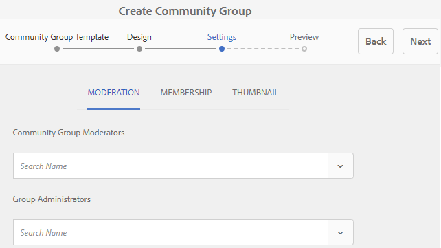

# 社群群組主控台{#community-groups-console}

當社群網站的範本結構包含群組功能時，「群組」控制台 [可讓您存](/help/communities/sites-console.md#step1) 取建 [立社群群組](/help/communities/functions.md#groups-function)。

* AEM Communities支援在其他群組內巢狀化群組。 當新組的結構包含 [組函式時](/help/communities/tools-groups.md) ，可進行組嵌套。
* 僅對於作者環境，有一個與站點建立嚮導類似的組建立嚮導。
* 在發佈環境中，成員是否可以建立組，在向社區站點結構或社區組結構添加組函式時可對其進行配置。

在包含的三個組模板中，只有模 `Reference Group` 板在其結構中包含組函式。

社群群組的不同面包括：

* **建立**:可在作者上建立新群組，也可在發佈時選擇性建立新群組
* **控制**:群組可以是開放或機密
* **巢狀**:群組可包含零或多個群組

<!-- This is a 404 on helpx. Please update or remove.
>[!NOTE]
>
>Community groups, created in the publish environment before the [existence of the Community Groups console](/help/communities/version-history.md#featurepack1fp1), will not be listed in the Community Groups console, and thus, are not modifiable using the console.-->

>[!NOTE]
>
>此組控制台僅能從Communities Sites控制台訪問，不要與管理成員組的成員 [組控制台](/help/communities/members.md) 混淆。
>
>成員組是在發佈環境中註冊的用戶組，可通過隧道服務從作者環境 [訪問](/help/communities/deploy-communities.md#tunnel-service-on-author)。

## 群組建立 {#group-creation}

要訪問組控制台：

* 在作者上，以管理員權限登入
* 從全域導覽：社 **群、網站**
* 選擇現有的社群站點資料夾以將其開啟
* 在資料夾中選擇社區站點的實例

   * 社群網站的結構必須包含群組功能
   * 這些螢幕擷取畫面來自「開始使用」教學課程(Getting Started tutorial), [當您在發佈時建立群組](/help/communities/published-site.md)

選擇「 **Groups」（組）資料夾** ，將其開啟。

開啟時，會顯示所有現有群組，不論是在作者或發佈上建立。

在此「群組」主控台中，可以編寫新群組。

* 選擇「 **建立群組** 」按鈕。

### 步驟1:社群群組範本 {#step-community-group-template}

* **社群群組標題**:群組的顯示標題。
標題會顯示在群組的發佈網站上。

* **社群群組說明**:群組的說明。
* **社群群組根**:群組的根路徑。
預設的根目錄是父網站，但根目錄可移至網站內的任何位置。 建議不要變更它。

* ****其他可用的社群群組語言功**&#x200B;能表：**使用下拉式清單來選取可用的社群群組語言。 功能表會顯示建立父社群網站的所有語言。 使用者可在這些語言中選擇，以在此單一步驟中建立多個地區設定的群組。 在相應社群網站的「群組」主控台中，以多種指定語言建立相同的群組。

* **社群群組名稱**:顯示在URL中的群組根頁面名稱

   * 在建立群組後，不易變更名稱，請連按兩下
   * 基本URL將顯示在 `Community Group Name`
   * 若為有效的URL，請附加&quot;。html&quot;
      *例如*, `https://localhost:4502/content/sites/mysight/en/mygroup.html`

* **社群群組範本功能表** :使用下拉式清單選擇可用的 [社群群組範本](/help/communities/tools.md)。

### 步驟2:設計 {#step-design}

#### COMMUNITY GROUP THEME {#community-group-theme}

此架構使 [用Twitter引導](https://twitterbootstrap.org/) ，為網站提供回應式、有彈性的設計。 可以選擇許多預載的引導主題之一來設定所選社區組模板的樣式，或者可以上載引導主題。

選取後，主題將會以不透明的藍色核取標籤覆蓋。

您可以選取與父網站主題不同的主題。

社群網站發佈後，您可以編輯 [屬性](#modifyinggroupproperties) ，並選取不同的主題。

#### COMMUNITY GROUP BRANDING {#community-group-branding}

社群網站品牌是顯示為每個頁面上方標題的影像。 可顯示不同於其他網站頁面之群組的橫幅。

影像的大小應與預期的頁面在瀏覽器中顯示的大小相同，高度應為120像素。

建立或選取影像時，請記住：

* 影像高度會裁切為120像素，從影像的上邊緣測量
* 影像會固定在瀏覽器視窗的左邊緣
* 影像沒有調整大小，因此當影像寬度為：

   * 小於瀏覽器寬度，影像將會水準重複
   * 大於瀏覽器的寬度時，影像會看起來被裁切

### 步驟3:設定 {#step-settings}

#### MODERATION {#moderation}

**社群群組版主**

依預設，會繼承父社群網站的協調者清單。

您可以新增群組專屬的協調者。 搜尋成員（從發佈環境）以新增成員為協調者

**群組管理員**

預設情況下，父社區站點管理員也是組的管理員。

但是，可以指派獨立的群組管理員。 群組管理員可以管理其群組（例如G1），並建立G1下巢狀的子群組。 他們可進一步為子群組指派不同的管理員。

因此，用戶U1可以是組G1中的管理員，也可以是其嵌套組G2中的常規用戶。

#### MEMBERSHIP {#membership}

成員資格設定允許選擇三種保護社區組的方法之一。

* **可選會籍**&#x200B;如果選取此選項，社群群組即為公用群組。 網站成員可以參與群組，並張貼而不需明確加入群組。 已選取預設值。

* **必要會籍**&#x200B;如果選取此選項，社群群組即為開放群組。 社群網站成員可以檢視群組的內容，但需要加入群組才能張貼內容。 成員通過選擇發佈環 `Join` 境中的按鈕加入。 未選擇預設值。

* **限制會籍**&#x200B;如果選取此選項，社群群組即為機密群組。 必須明確邀請社群成員。 已邀請的成員將輸入到搜索框中。 您稍後可以使用作者環境的「 [成員」和「群組」控制台](/help/communities/members.md) ，來新增成員。 未選擇預設值。

#### 縮圖 {#thumbnail}

縮圖是要在作者和發佈時針對群組顯示的影像。

群組影像的最佳大小為170 x 90像素，且支援的影像格式為（例如JPG或PNG）。

如果未新增影像，則會顯示預設影像。

### 步驟4:建立群組 {#step-create-group}

如果需要進行任何調整，請使用「上一步」按鈕進行調整。

一旦選 **取並啟動** 「建立」後，建立群組的程式便無法中斷。

當程式完成時，新子社群網站（群組）的資訊卡會顯示在「社群網站群組」主控台中，供作者新增頁面內容或管理員修改網站屬性。

>[!NOTE]
>
>群組會以所有語言建立，如步驟1所 [指定：社群群組範本](/help/communities/groups.md#step-community-group-template) ，位於各社群網站的社群群組主控台中，以其他可用社群群組語言提供。

## 作者群組內容 {#author-group-content}

群組的頁面內容可使用與任何其他AEM頁面相同的工具進行編寫。 若要開啟群組以進行製作，請選取將滑鼠指標暫留在群組卡片上時顯示的「開啟網站」圖示。

## 修改組屬性 {#modify-group-properties}

在社群群組建立程式中指定的現有子社群網站屬性，可透過選取將滑鼠指標暫留在群組卡片上時顯示的「編輯網站」圖示來修改：

下列屬性的詳細資料與「群組建立」區段中提供的 [說明相符](#group-creation) 。 任何巢狀群組都可以修改，不論是在發佈環境或作者環境中建立。

### 修改基本 {#modify-basic}

BASIC面板允許修改

* 社群群組標題
* 社群群組說明

不得修改社群群組名稱。

選擇不同的社群群組範本對現有社群群組網站不會有任何影響，因為範本和網站之間沒有任何連接。

可以改 [變子社區](#modify-structure) 的STRUCTURE。

### 修改結構 {#modify-structure}

STRUCTURE面板允許修改最初從作者或發佈環境建立子社區站點時選定的社區組模板建立的結構。 從面板，您可以

* 將其他社群功能拖放 [至網站結](/help/communities/functions.md) 構中
* 在網站結構中的社群功能例項上：

   * **`Gear icon`**
編輯設定，包括顯示標題和URL名稱*以及特權 [成員群組](/help/communities/users.md#privilegedmembersgroups)。

   * **`Trashcan icon`**
從網站結構移除（刪除）函式。

   * **`Grid icon`**
修改網站頂層導覽列中顯示的功能順序。

>[!CAUTION]
>
>*雖然顯示標題可以不產生副作用而變更，但不建議編輯屬於社群網站之社群函式的URL名稱。
例如，重新命名URL不會移動現有的UGC，因此會產生「遺失」UGC的效果。

>[!CAUTION]
群組函式必須*not*是網站結 *構中的第一個* ，也是唯一的函式。
任何其他函式(例如頁 [面函式](/help/communities/functions.md#page-function))必須先包含並列出。

#### 範例：將日曆函式添加到子社區（組）結構 {#example-adding-a-calendar-function-to-a-sub-community-group-structure}

### 修改設計 {#modify-design}

DESIGN面板允許修改主題：

* [社群群組主題](#community-group-theme)
* [社群群組品牌](#community-group-branding)

   * 捲動至面板底部以變更品牌影像

### 修改設定 {#modify-settings}

「設定」面板可讓您新增社群協調 [者](#moderation)。

### 修改會籍 {#modify-membership}

「 [MEMBERSHIP](#membership) 」面板僅供參考。 無論是選用、必要或受限制，都無法變更已建立的群組成員資格類型。

### 修改縮圖 {#modify-thumbnail}

THUMBNAIL [(縮圖](#thumbnail) )面板允許上傳影像，以在發佈環境以及作者環境的「社群網站」的「群組」主控台中，將社群群組呈現給網站訪客。

## 發佈群組 {#publish-the-group}

在新建立或修改社群群組後，您可以選取圖示來發佈（啟用）群 `Publish Site` 組。

成功發佈群組後，會出現訊息：

>[!CAUTION]
父社區站點和父組應已發佈。
社群網站和巢狀群組應以自上而下的方式發佈。

## 刪除群組 {#delete-the-group}

從社群群組主控台中刪除群組，方法是選取「刪除群組」圖示，此圖示會顯示在將滑鼠暫留在群組上。

這會移除與群組相關的所有項目，例如永久刪除群組的所有內容，並從系統中移除使用者成員資格。
