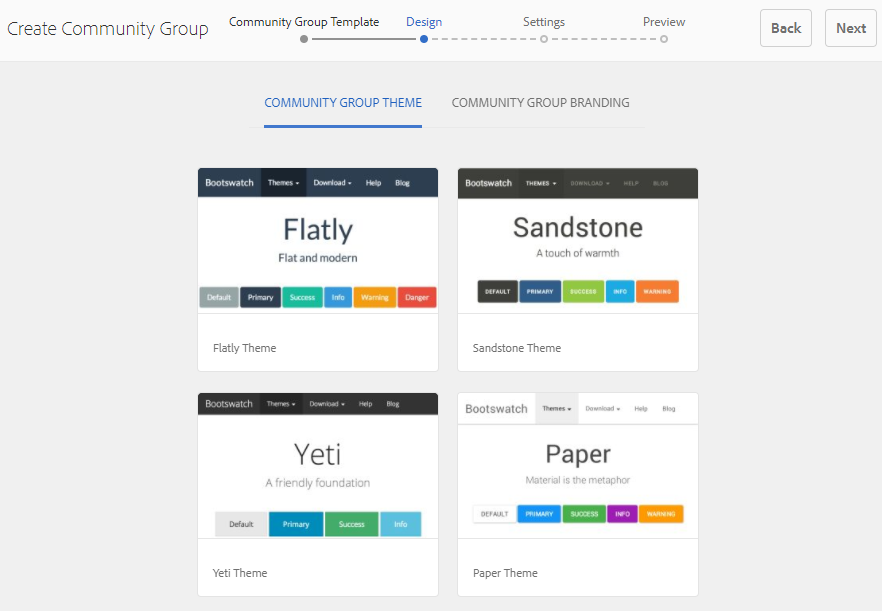

# 社群群組主控台 {#community-groups-console}

當社區站點的 [模板結構](/help/communities/sites-console.md#step1) 包括 [組函式](/help/communities/functions.md#groups-function)。

* AEM Communities支援在其他組內嵌套組。 在 [新組的結構](/help/communities/tools-groups.md) 包含groups函式。
* 僅對作者環境，存在與站點建立嚮導類似的組建立嚮導。
* 成員是否可以在發佈環境中建立組，在將組功能添加到社區站點結構或社區組結構時，可以配置該成員。

在包括的三個組模板中，僅 `Reference Group` 模板在其結構中包括組函式。

社區組的不同方面包括：

* **建立**:可以在作者上建立新組，也可以在發佈實例上建立新組（可選）。
* **控制項**:組可以是開放的或秘密的。
* **嵌套**:組可以包含零個或多個組。

<!-- This is a 404 on helpx. Please update or remove.
>[!NOTE]
>
>Community groups, created in the publish environment before the [existence of the Community Groups console](/help/communities/version-history.md#featurepack1fp1), will not be listed in the Community Groups console, and thus, are not modifiable using the console.
-->

>[!NOTE]
>
>此組控制台僅可從社區站點控制台訪問，不與成員混淆 [組控制台](/help/communities/members.md) 用於管理成員組。
>
>成員組是在發佈環境中註冊並使用 [隧道服務](/help/communities/deploy-communities.md#tunnel-service-on-author)。

## 群組建立 {#group-creation}

要訪問組控制台：

* 作者，使用管理員權限登錄。
* 從全局導航： **[!UICONTROL 社區]** > **[!UICONTROL 站點]**。
* 選擇要開啟的現有社區網站資料夾。
* 選擇資料夾中社區站點的實例。

   * 社區站點的結構必須包括組功能。
   * 這些螢幕截圖來自「入門」教程，其後 [在發佈時建立組](/help/communities/published-site.md)。

   

* 選擇 **組資料夾** 開啟它。

   開啟時，將顯示所有現有組（無論是在作者上建立還是在發佈上建立）。

   通過此「組」控制台，可以建立新組。

   

* 選擇 **建立組** 按鈕

### 步驟1:社區組模板 {#step-community-group-template}

* **社群群組標題**

   組的顯示標題。
該標題顯示在組的已發佈網站上。

* **社群群組說明**

   組的說明。

* **社群群組根**

   組的根路徑。
預設根是父站點，但根可以移動到網站中的任何位置。 不建議更改它。

* **其他可用的社區組語言** 菜單

   使用下拉清單選擇可用的社區組語言。 該菜單顯示建立父社區網站的所有語言。 用戶可以在這些語言中進行選擇，以在此步驟中在多個語言環境中建立組。 在各個社區站點的「組」控制台中以多種指定語言建立同一組。

* **社群群組名稱**

   顯示在URL中的組根頁的名稱。 避免使用下划線字元(_)和組名中的資源和配置等關鍵字。

   * 在建立組後，由於名稱不易更改，請按兩下該名稱。
   * 基本URL將顯示在 `Community Group Name`。
   * 對於有效的URL，請追加&quot;。html&quot;
      *例如*。 `https://localhost:4502/content/sites/mysight/en/mygroup.html`。

* **社區組模板** 菜單

   使用下拉框選擇可用 [社區組模板](/help/communities/tools.md)。

### 步驟2:設計 {#step-design}

### 社區組主題 {#community-group-theme}

框架使用 `Twitter Bootstrap` 為現場提供快速靈活的設計。 可以選擇多個預載的Bootstrap主題之一以對所選社區組模板進行樣式化，或者可以上載Bootstrap主題。

選中後，主題將用不透明的藍色複選標籤覆蓋。

可以選擇與父站點的主題不同的主題。

發佈社區網站後， [編輯屬性](#modifyinggroupproperties) 並選擇其他主題。

### 社區組品牌推廣 {#community-group-branding}

社區網站品牌推廣是顯示為每個頁面頂部標題的影像。 可以為組顯示與其他網站頁不同的標題。

影像的大小應與瀏覽器中頁面的預期顯示大小相同，高度應為120像素。

建立或選擇影像時，請牢記：

* 影像高度將從影像的上邊緣裁切到120個像素
* 影像被固定到瀏覽器窗口的左邊緣
* 影像沒有調整大小，因此當影像寬度為：

   * 小於瀏覽器的寬度，影像將水準重複。
   * 大於瀏覽器的寬度，影像將被裁剪。

### 第3步：設定 {#step-settings}

**審核**

**社群群組版主**

預設情況下，父社區站點的審閱者清單將繼承。

可以添加特定於組的審閱人。 搜索成員（從發佈環境）以將其添加為審閱人

**群組管理員**

預設情況下，父社區站點管理員也是組的管理員。

但是，可以分配獨立的組管理員。 組管理員可以管理其組（例如G1），並建立嵌套在G1下的子組。 他們可以為子組進一步分配不同的管理員。

因此，用戶U1可以是組G1中的管理員，也可以是嵌套組G2中的常規用戶。

**成員資格**

成員資格設定允許選擇三種保護社區組的方法之一。

* **可選成員資格**

   如果選中，則社區組為公共組。 站點成員可以參與組並發佈資訊，而無需明確加入組。 已選擇預設值。

* **必要的成員資格**

   如果選中，則社區組是開啟的組。 社區站點成員可以查看組的內容，但需要加入組以發佈內容。 通過選擇 `Join` 按鈕。 未選擇預設值。

* **限制的成員資格**

   如果選中，則社區組為機密組。 必須明確邀請社區成員。 在搜索框中輸入邀請的成員。 以後可以使用 [成員和組控制台](/help/communities/members.md) 作者的環境。 未選擇預設值。

**縮圖**

縮略圖是要在作者和發佈上顯示的組的影像。

組影像的最佳大小是170 x 90像素，支援的影像格式(如JPG或PNG)。

如果未添加影像，則顯示預設影像。

### 第4步：建立組 {#step-create-group}

如果需要任何調整，請使用 **後退** 按鈕來製作。

一次 **建立** 選中並啟動，則建立組的過程無法中斷。

進程完成後，新的子社區站點（組）的卡將顯示在「社區站點組」控制台中，作者可以從該控制台添加頁面內容，或管理員可以修改站點的屬性。

>[!NOTE]
>
>組以所有語言建立，如中指定 [步驟1:社區組模板](/help/communities/groups.md#step-community-group-template) 在各個社區站點的「社區組」控制台中，選擇「其他可用社區組語言」。

## 作者組內容 {#author-group-content}

可以使用與任何其他頁面相同的工具創作組的頁面AEM內容。 要開啟組以進行創作，請選擇在懸停在組卡上時顯示的「開啟站點」表徵圖。

## 修改組屬性 {#modify-group-properties}

在社區組建立過程中指定的現有子社區站點的屬性可以通過選擇「編輯站點」表徵圖來修改，該表徵圖在懸停在組卡上時顯示：

以下屬性的詳細資訊與中提供的說明匹配 [組建立](#group-creation) 的子菜單。 無論是在發佈環境還是作者環境中建立，都可以修改任何嵌套組。

### 修改基本 {#modify-basic}

BASIC面板允許修改

* 社群群組標題
* 社群群組說明

不能修改社區組名稱。

選擇其他社區組模板不會對現有社區組站點產生任何影響，因為模板和站點之間沒有任何連接。

相反， [結構](#modify-structure) 可以修改子社區。

### 修改結構 {#modify-structure}

「結構」(STRUCTURE)面板允許修改最初根據從作者或發佈環境建立子社區站點時選定的社區組模板建立的結構。 從面板，可以：

* 拖放附加 [社區功能](/help/communities/functions.md) 進入現場結構。
* 在站點結構中社區功能的實例上：

   * **`Gear icon`**
編輯設定，包括顯示標題、URL和 [特權成員組](/help/communities/users.md#privilegedmembersgroups)。

   * **`Trashcan icon`**
從站點結構中刪除（刪除）函式。

   * **`Grid icon`**
修改在站點的頂級導航欄中顯示的函式順序。

>[!CAUTION]
>
>雖然可以在不產生副作用的情況下更改顯示標題，但建議不要編輯屬於社區站點的社區函式的URL名稱。
>
>例如，更名URL不會移動現有UGC，因此會產生「丟失」UGC的效果。

>[!CAUTION]
>
>組函式必須 *不* 是 *第一，也是唯一* 的子菜單。
>
>任何其他函式，如 [頁面函式](/help/communities/functions.md#page-function)，必須先包括並列出。

**示例：向子社區（組）結構添加日曆函式**

### 修改設計 {#modify-design}

「設計」面板允許修改主題：

* [社群群組主題](#community-group-theme)
* [社群群組品牌](#community-group-branding)

   * 滾動到面板底部以更改品牌影像。

### 修改設定 {#modify-settings}

「設定」面板允許添加社區 [版主](#moderation)。

### 修改成員身份 {#modify-membership}

的 [成員資格](#membership) 面板僅供參考。 無論是可選的、必需的還是受限制的，都無法更改所建立的組成員身份類型。

### 修改縮略圖 {#modify-thumbnail}

的 [縮略圖](#thumbnail) 「面板」允許上載影像，以在發佈環境以及作者環境中的「社區站點的組」控制台中將社區組表示為站點訪問者。

## 發佈組 {#publish-the-group}

在新建立或修改社區組後，可以通過選擇 `Publish Site` 表徵圖

成功發佈組後，將顯示一條消息：

>[!CAUTION]
>
>父社區站點和父組應已發佈。
>
>社區網站和嵌套組應以自上而下的方式發佈。

## 刪除組 {#delete-the-group}

通過選擇「刪除組」表徵圖，從社區組控制台中刪除組，該表徵圖顯示在懸停在組上的滑鼠上。

這將刪除與組關聯的所有項目，例如，永久刪除組的所有內容並從系統中刪除用戶成員資格。
