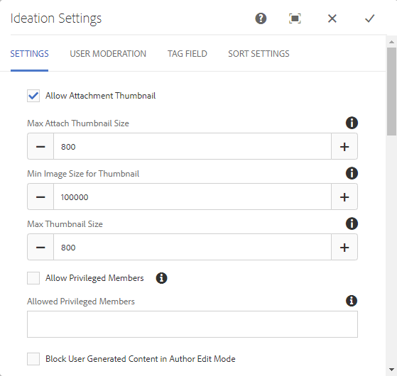

# 創意功能{#ideation-feature}

## 簡介 {#introduction}

識別功能提供發佈環境中登入網站訪客（社群成員）的區域，讓您：

* 建立想法以與社群分享
* 觀點與評論
* 遵循想法
* 對一個想法投了贊成票

本節說明

* 新增創意功能至AEM網站
* Ideation元件的配置設定

### 新增構想至頁面 {#adding-a-ideation-to-a-page}

若要在作 `Ideation` 者模式中將元件新增至頁面，請使用元件瀏覽器來尋找

* `Communities / Ideation`

並將它拖曳至應該出現構想的頁面上。

如需必要資訊，請造 [訪Communities Components Basics](/help/communities/basics.md)。

當包含 [所需的用戶端程式庫](/help/communities/ideation.md#essentials-for-client-side) ，元件的顯示 `Ideation`方式如下：

### 設定構想 {#configuring-an-ideation}

選擇要訪問 `Ideation` 的已放置元件，並選 `Configure` 擇開啟編輯對話框的表徵圖。

#### 「設定」頁籤 {#settings-tab}

在「**設定**」標籤下，指定構想和留言的設定：

* **允許附件縮圖**
* **附加縮圖最大尺寸**
* **最小縮圖影像大小**
* **最大縮圖尺寸**
* **允許有特殊權限的成員**
* **允許擁有特殊權限的成員**
* **封鎖使用者在作者編輯模式中產生的內容**
* **創意力標題**

* 構想的顯示標題。 預設為 `Ideation`。
* **創意力說明**

   要顯示為構想子標題的說明。 預設值為無說明。

* **每頁主題**

   定義每頁顯示的構想／貼文數。 預設值為10。

* **已審核**

   如果勾選，則張貼構想和留言必須經過核准，才能顯示在發佈網站上。 預設為未勾選。

* **已關閉**

   如果勾選，則會關閉構想論壇以取得新想法和註解。 預設為未勾選。

* **RTF 編輯器**

   如果勾選此選項，則可以使用標注輸入構想和注釋。 預設為未勾選。

* **允許標記**

   如果勾選，允許成員將標籤標籤新增至其貼文(請參 **閱「標籤欄位** 」標籤)。 預設為未勾選。

* **允許檔案上傳**

   如果勾選，允許將檔案附件新增至構想或註解。 預設為未勾選。

* **最大檔案大小**

   僅在勾選時 `Allow File Uploads` 相關。 此欄位將限制已上傳檔案的大小（以位元組為單位）。 預設值為104857600(10 Mb)。

* **允許的檔案類型**

   僅在勾選時 `Allow File Uploads` 相關。 以逗號分隔的副檔名清單，並以&quot;dot&quot;分隔。 例如：.jpg、.jpeg、.png、.doc、.docx、.pdf。 如果指定任何檔案類型，則不允許上傳未指定的檔案類型。 未指定預設值，因此允許** **所有檔案類型。

* **附加影像檔案最大大小**

   僅在勾選「允許檔案上傳」時相關。 上傳的影像檔案的位元組數上限。 預設值為2097152****(2 Mb)。

* **允許回覆**

   如果勾選，允許回覆張貼至構想的留言。 預設為未勾選。

* **允許投票**

   如果勾選，允許對構想的注釋進行投票。 預設為未勾選。

* **允許使用者刪除評論和主題**

   如果勾選，允許成員刪除其張貼的留言和構想。 預設為未勾選。

* **允許關注**

   如果勾選，請為構想貼文加入下列功能，讓會員得 [到](/help/communities/notifications.md) 新貼文的通知。 預設為未勾選。

* **允許電子郵件訂閱**

   如果勾選，允許會員透過電子郵件（訂閱）收到新貼文[的通](/help/communities/subscriptions.md)知。 需要 `Allow Following` 檢查並設定電 [子郵件](/help/communities/email.md)。 預設為未勾選。

* **允許投票**

   如果勾選，允許對構想的注釋進行投票。 預設為未勾選。

* **顯示徽章**

   如果勾選，則以成員的構想 [顯示](/help/communities/implementing-scoring.md) 「已獲得」和已指派的徽章。 預設為未勾選。

* **不在「清單」頁面上取得回覆**

* **允許主要內容**

   若勾選，此構想即可識別為特 [色內容](/help/communities/featured.md)。 預設為未勾選。

* **啟用提及功能**
* **最大提及數**
* **UI 提及模式**

#### 使用者協調標籤 {#user-moderation-tab}

在「**使用者協調**」標籤下，指定如何管理已張貼的想法和留言（使用者產生的內容）。 如需詳細資訊，請參閱 [協調使用者產生的內容](/help/communities/moderate-ugc.md)。

* **拒絕貼文**

   如果勾選，則可讓受信任的會員協調者拒絕貼文，並防止貼文出現在公開論壇。 預設為未勾選。

* **關閉／重新開啟主題**

   如果勾選，受信任的成員協調者可以關閉主題以進一步編輯和留言，也可以重新開啟主題。 預設為未勾選。

* **標籤貼文**

   如果勾選，允許成員將其他主題或注釋標籤為不適當。 預設為未勾選。

* **標籤原因清單**

   如果勾選，允許成員從下拉式清單中選擇其標籤主題或留言的不適當原因。 預設為未勾選。

* **自訂標幟原因**

   如果勾選，允許成員輸入自己將主題或留言標籤為不適當的原因。 預設為未勾選。

* **協調臨界值**

   輸入成員在通知協調者之前必須標籤主題或留言的次數。 預設值為1（一次）。

* **標幟限制**

   輸入主題或留言在公開檢視中隱藏前必須加以標幟的次數。 如果設為-1，則標籤的主題或留言永遠不會隱藏在公開檢視中。 否則，此數字必須大於或等於「協調臨界值」。 預設值為5。

#### 「標籤」欄位頁籤 {#tag-field-tab}

在「標 **記」欄位** (Tag field)標籤下，可套用的標籤（如果允許）會根據選擇的名稱空間加以限制。

* **允許的命名空間**

   如果已勾選 `Allow Tagging` 「設定」標籤下 **的選項** ，則相關。 可套用的標籤僅限於已勾選之命名空間類別中的標籤。 名稱空間清單包含「標準標籤」（預設命名空間）和「包含所有標籤」。 預設值未勾選，表示允許所有命名空間。

* **建議限制**

   輸入要作為建議顯示給發佈到論壇的成員的標籤數。 值**-**1表示無限制。 預設值為0。

#### 「排序設定」頁籤 {#sort-settings-tab}

在「**排序設定**」標籤下，指定張貼的留言在顯示時的排序方式。

* **排序方式**

   檢查所有允許的排序選擇： `Newest, Oldest, Last Updated, Most Viewed, Most Active, Most Followed and Most Liked`。 預設為 `Newest, Oldest, Last Updated`。

* **設為預設值**

   下拉式清單以選取其中一個核取的排序選項，以顯示為預設值。 預設為 `Newest`。

* **選取 Analytics 排序的時間選項**

   下拉式選取其中一個 `All, Last 24 Hours, Last 7 Days, Last 30 Days`。 預設為 `All`。

## 網站訪客體驗 {#site-visitor-experience}

### 創意 {#creating-idea}

與所有社群功能一樣，若未登入，網站訪客只能閱讀構想並檢視其他意見（透過留言和投票／按贊）。

一旦登入，會員就可能會建立新構想。

在提交構想之前，會員可儲存草稿。

通過選擇 `Save as Draft` 按鈕，將保存草稿。

在頁籤中查看保存的草 `My Drafts` 稿時，選擇 `Read More` 以重新進入編輯模式：

#### 提供意見回應 {#providing-feedback}

一旦發佈構想後，其他成員就可以登入、開啟構想( `Read More`)並像構想一樣，進而增加選票計數，並加上意見。

### 其他資訊 {#additional-information}

如需詳細資訊，請參閱開發 [人員的Ideation Essentials](/help/communities/ideation.md) 頁面。

如需協調已張貼主題和留言的資訊，請參 [閱協調使用者產生的內容](/help/communities/moderate-ugc.md)。

如需標籤已張貼的主題和留言，請參 [閱標籤使用者產生的內容](/help/communities/tag-ugc.md)。
