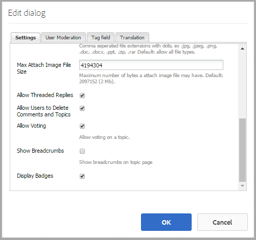

# 社區評分和徽章 {#communities-scoring-and-badges}

## 概觀 {#overview}

AEM Communities評分和徽章功能提供識別和獎勵社區成員的能力。

評分和徽章主要有：

* [分配徽章](#assign-and-revoke-badges) 確定成員在社區中的角色。

* [基本獎章](#enable-scoring) 鼓勵成員參與（建立的內容數量）。

* [高級獎章](/help/communities/advanced.md) 將成員標識為專家（建立的內容質量）。

**注釋** 授予徽章 [預設情況下未啟用](/help/communities/implementing-scoring.md#main-pars-text-237875536)。

>[!CAUTION]
>
>在CRXDE Lite中可見的實現結構在UI變為可用後可能會發生更改。

## 徽章 {#badges}

徽章放在成員名下，以指示其在社區中的角色或地位。 徽章可以顯示為影像或名稱。 當顯示為影像時，該名稱將作為輔助功能的替代文本包含。

預設情況下，徽章位於

* `/libs/settings/community/badging/images`

如果儲存在不同的位置，則每個人都應能夠訪問這些位置。

在UGC中，對徽章的分配和掙得，按規則加以區分。 當前，指定的徽章顯示為文本，而掙得的徽章顯示為影像。

### 徽章管理UI {#badge-management-ui}

社區 [徽章控制台](/help/communities/badges.md) 提供了添加自定義徽章的能力，這些徽章可在獲得（授予）成員或成員在社區中承擔特定角色（已分配）時顯示。

### 分配的徽章 {#assigned-badges}

管理員根據社區成員在社區中的角色將基於角色的徽章分配給社區成員。

已分配（和已喚醒）的徽章儲存在選定的 [SRP](/help/communities/srp.md) 無法直接訪問。 在GUI可用之前，分配基於角色的徽章的唯一方法是使用代碼或cURL進行分配。 有關cURL說明，請參閱標題為 [分配和撤消徽章](#assign-and-revoke-badges)。

發佈中包括三枚基於角色的徽章：

* **主持人**

   `/libs/settings/community/badging/images/moderator/jcr:content/moderator.png`

* **組管理器**

   `/libs/settings/community/badging/images/group-manager/jcr:content/group-manager.png`

* **特權成員**

   `/libs/settings/community/badging/images/privileged-member/jcr:content/privileged-member.png`

   

### 獎章 {#awarded-badges}

評分服務根據社區成員在社區中活動所適用的規則，向社區成員頒發獎勵徽章。

為了讓徽章成為活動的獎勵，必須做兩件事：

* 簽名必須為 [啟用](#enableforcomponent) 的子菜單。
* 評分和標籤規則必須 [應用](#applytopage) 到元件所在的頁面（或祖先）。

發行中包括三枚獎勵徽章：

* **金**

   `/libs/settings/community/badging/images/gold-badge/jcr:content/gold.png`

* **銀**

   `/libs/settings/community/badging/images/silver-badge/jcr:content/silver.png`

* **銅**

   `/libs/settings/community/badging/images/bronze-badge/jcr:content/bronze.png`

   

>[!NOTE]
>
>評分規則可配置為為標籤為不適當的帖子分配負分，從而影響得分值。 但是，一旦獲得徽章，將不會因記分點減少或記分規則更改而自動刪除它。
>
>獎章的吊銷，可以與被授予的徽章一樣。 查看 [分配和撤消徽章](#assign-and-revoke-badges) 的子菜單。 今後的改進將包括一個管理成員徽章的用戶介面。

### 自定義徽章 {#custom-badges}

可以使用 [徽章控制台](/help/communities/badges.md) 或在標籤規則中指定。

當從Bagds控制台安裝時，自定義徽標將自動複製到發佈環境。

## 啟用計分 {#enable-scoring}

預設情況下未啟用計分。 徽章的設定和授予評分和授予的基本步驟是：

* 確定收入點的規則([評分規則](#scoring-rules))。
* 對於每個計分規則累計的積分，分配 [徽章](#badges) ([標籤規則](#badging-rules))。

* [將評分和標籤規則應用於社區站點](#apply-rules-to-content)。
* [啟用社區功能的標籤](#enable-badges-for-component)。

查看 [快速Test](#quick-test) 部分，以使用論壇和評論的預設評分和標籤規則為社區站點啟用評分。

### 將規則應用於內容 {#apply-rules-to-content}

要啟用計分和徽章，請添加屬性 `scoringRules` 和 `badgingRules` 到站點內容樹中的任何節點。

如果站點已發佈，則在應用所有規則並啟用元件後，重新發佈站點。

適用於啟用標籤的元件的規則是當前節點或其祖先的規則。

如果節點的類型 `cq:Page` （推薦），然後使用CRXDE|Lite將屬性添加到 `jcr:content` 的下界。

| **屬性** | **類型** | **說明** |
|---|---|---|
| 標籤規則 | 字串 | 陣列清單 [標籤規則](#badging-rules) |
| 計分規則 | 字串 | 陣列清單 [評分規則](#scoring-rules) |

>[!NOTE]
>
>如果評分規則似乎對評分徽章沒有影響，請確保評分規則未被評分規則的scoringRules屬性阻止。 請參閱標題為 [簽名規則](#badging-rules)。

### 為元件啟用徽章 {#enable-badges-for-component}

評分和標籤規則僅對通過在中編輯元件配置而啟用標籤的元件實例有效 [創作模式](/help/communities/author-communities.md)。

布爾屬性， `allowBadges`，啟用/禁用元件實例的徽標顯示。 可在 [元件編輯對話框](/help/communities/author-communities.md) 對於論壇、QnA和注釋元件，通過標有 **顯示徽章**。

#### 示例：論壇元件實例的allowBagds {#example-allowbadges-for-forum-component-instance}



>[!NOTE]
>
>可以覆蓋任何元件以顯示徽章，例如，使用論壇、QnA和注釋中找到的HBS代碼。

## 評分規則 {#scoring-rules}

評分規則是評分標誌的基礎。

很簡單，每個評分規則都是一個或多個子規則的清單。 評分規則將應用於社區網站內容，以標識啟用徽章時應用的規則。

評分規則是繼承的，但不是加性的。 例如：

* 如果page2包含計分規則2，其祖先page1包含計分規則1。
* 對page2元件執行操作將同時調用rule1和rule2。
* 如果兩個規則都包含相同的子規則 `topic/verb`:

   * 只有規則2的子規則會影響分數。
   * 兩個子規則的分數不相加。

當存在多個計分規則時，對每個規則分別保持分數。

計分規則是類型的節點 `cq:Page` 具有屬性 `jcr:content` 指定定義子規則清單的節點。

分數儲存在SRP中。

>[!NOTE]
>
>最佳實踐：為每個計分規則指定唯一名稱。
>
>評分規則名稱應具有全局唯一性；他們不應該以同名結尾。
>
>一個 *不* 執行：
>
>/libs/settings/community/scoring/rules/site1/forums評分
>/libs/settings/community/scoring/rules/site2/forums評分

### 計分子規則 {#scoring-sub-rules}

評分子規則包含詳細描述參與社區的值的屬性。

每個計分子規則標識：

* 正在跟蹤哪些活動？
* 涉及哪些特定的社區功能？
* 分多少？

預設情況下，除非子規則指定內容所有者接收點( `forOwner`)。

每個子規則可以包括在一個或多個評分規則中。

子規則的名稱通常遵循使用 *主題* 。 *對象* 和 *動詞*。 例如：

* 成員注釋建立
* 成員接受投票

子規則是類型的節點 `cq:Page` 具有屬性 `jcr:content`指定 [動詞和主題](#topics-and-verbs) 。

<table>
 <tbody>
  <tr>
   <th>屬性</th>
   <th>類型</th>
   <th> 值 說明</th>
  </tr>
  <tr>
   <td><i><code>VERB</code></i></td>
   <td>長整數</td>
   <td>
    <ul>
     <li>要求；動詞與事件動作相對應</li>
     <li>至少有一個動詞屬性</li>
     <li>謂詞必須輸入全大寫</li>
     <li>可以有多個動詞屬性，但沒有重複項</li>
     <li>值是應用於此事件的分數</li>
     <li>值可以是正數或負數</li>
     <li>版本中支援的動詞清單位於 <a href="#topics-and-verbs">主題和動詞</a> 節</li>
    </ul> </td>
  </tr>
  <tr>
   <td><code>topics</code></td>
   <td>字串</td>
   <td>
    <ul>
     <li>可選；將子規則限制為由事件主題標識的社區元件</li>
     <li>如果指定：值是事件主題的多值字串</li>
     <li>發行版中的主題清單位於 <a href="#topics-and-verbs">主題和動詞</a> 節</li>
     <li>預設值是應用於與謂詞關聯的所有主題</li>
    </ul> </td>
  </tr>
  <tr>
   <td><code>forOwner</code></td>
   <td>布林值</td>
   <td>
    <ul>
     <li>可選；當成員根據自己擁有的內容執行操作時不相關</li>
     <li>如果為true，則將分數應用於所處理內容的所有者</li>
     <li>如果為false，則將分數應用於執行操作的成員</li>
     <li>預設為false</li>
    </ul> </td>
  </tr>
  <tr>
   <td><code>scoringType</code></td>
   <td>字串</td>
   <td>
    <ul>
     <li>可選；標識計分引擎</li>
     <li>如果為"basic"，則根據數量指定評分引擎
      <ul>
       <li>包含在發行版中</li>
      </ul> </li>
     <li>如果為「advanced」，則根據質量和數量指定評分引擎
      <ul>
       <li>需要 <a href="/help/communities/advanced.md">附加包</a></li>
      </ul> </li>
     <li>預設為"basic"</li>
    </ul> </td>
  </tr>
 </tbody>
</table>

### 包括計分規則和子規則 {#included-scoring-rules-and-sub-rules}

發行版中包含兩個評分規則 [論壇功能](/help/communities/functions.md#forum-function) （論壇功能的論壇和評論部分各一個）:

1. /libs/settings/community/scoring/rules/comments計分

   * 子規則[] = /libs/settings/community/scoring/rules/member-comment-create /libs/settings/community/scoring/rules/subrules/member-receive-vote /libs/settings/community/scoring/rules/mber-is-meber-merers-mer-mer-mer-mer-mer-s-der-dered

1. /libs/settings/community/scoring/rules/forums評分

   * 子規則[] = /libs/settings/community/scoring/rules/subrules/member-forum-create /libs/settings/community/scoring/rules/subrules/member-receive-vote /libs/settings/community/scoring/rules/sub-rules/mememeres-meres-mber-merers-d-merered-mer-s-s-dered-med-merered-mb-der-mb-thered

**附註:**

* 兩者 `rules` 和 `sub-rules` 節點的類型為cq:Page。

* `subRules` 是字串類型的屬性[] 規則 `jcr:content` 的下界。

* `sub-rules` 可以在各種評分規則之間共用。
* `rules` 應位於儲存庫位置中，並具有每個人的讀取權限。

   * 規則名稱必須唯一，而不管位置如何。

### 激活自定義計分規則 {#activating-custom-scoring-rules}

在作者環境中對評分規則或子規則所做的任何更改或添加都需要在發佈上安裝。

## 簽名規則 {#badging-rules}

標籤規則通過指定以下內容將記分規則連結到標籤：

* 評分規則
* 獲取特定徽章所需的分數

標籤規則是類型的節點 `cq:Page` 具有屬性 `jcr:content` 將評分規則與分數和徽章關聯的節點。

簽名規則包括強制性 `thresholds` 屬性，是映射到徽章的分數的有序清單。 分數必須按增加值排序。 例如：

* `1|/libs/settings/community/badging/images/bronze-badge/jcr:content/bronze.png`

   * 一枚銅牌以1分的成績獲獎。

* `60|/libs/settings/community/badging/images/silver-badge/jcr:content/silver.png`

   * 積分60分時，授予銀牌。

* `80|/libs/settings/community/badging/images/gold-badge/jcr:content/gold.png`

   * 金徽80分就亮了。

標籤規則與評分規則相配，這決定了積分的積累方式。 請參閱標題為 [將規則應用於內容](#apply-rules-to-content)。

的 `scoringRules` 標籤規則上的屬性只限制哪些評分規則可以與該特定標籤規則配對。

>[!NOTE]
>
>最佳做法：建立每個站點唯一的徽AEM章影像。


<table>
 <tbody>
  <tr>
   <th>屬性</th>
   <th>類型</th>
   <th>值 說明</th>
  </tr>
  <tr>
   <td>閾值</td>
   <td>字串</td>
   <td><em>（必需）</em> 「number|path」形式的多值字串
    <ul>
     <li>數字=分數</li>
     <li>| =竪線字元(U+007C)</li>
     <li>path =標籤映像資源的完整路徑</li>
    </ul> 必須對字串進行排序，以使數字值增加，並且數字和路徑之間不應出現空白。<br /> 示例項：<br /> <code>80|/libs/settings/community/badging/images/gold-badge/jcr:content/gold.png</code></td>
  </tr>
  <tr>
   <td>標籤類型</td>
   <td>字串</td>
   <td><em>（可選）</em> 將評分引擎標識為「basic」或「advanced」。 如果需要高級計分引擎，請參閱 <a href="/help/communities/advanced.md">高級評分和徽章</a>。 預設值為「basic」。</td>
  </tr>
  <tr>
   <td>計分規則</td>
   <td>字串</td>
   <td>(<em>可選</em>)多值字串，用於將標籤規則限制為由計分規則標識的計分事件</td>
  </tr>
 </tbody>
</table>

### 包括標籤規則 {#included-badging-rules}

發行版中包括與 [論壇和評論評分規則](#includedscoringrules)。

* `/libs/settings/community/badging/rules/comments-badging`

* `/libs/settings/community/badging/rules/forums-badging`

**附註:**

* `rules` 節點的類型為cq:Page。
* `rules` 應位於儲存庫位置中，並具有每個人的讀取權限。

   * 規則名稱必須唯一，不管位置如何。

### 激活自定義標籤規則 {#activating-custom-badging-rules}

在作者環境中對標籤規則或映像所做的任何更改或添加都需要在發佈上安裝。

## 分配和撤消徽章 {#assign-and-revoke-badges}

可以使用 [成員控制台](/help/communities/members.md#badges-tab) 或使用cURL命令以寫程式方式進行。

以下cURL命令顯示分配和撤消徽章的HTTP請求所需的內容。 基本格式為：

cURL -i -XPOST-H *標題* -u *簽名* -F *操作* -F *徽章* *成員配置檔案URL*

*標題* = &quot;Accept:application/json&quot;自定義標頭要傳遞到伺服器（必需）

*簽名* = administrator-id:password，例如：管理員：管理員

*操作* = &quot;:operation=social:assignBadge&quot;或&quot;:operation=social:deleteBadge&quot;

*徽章* = &quot;badgeContentPath=*標籤影像檔案*&quot;

*標籤影像檔案* =標籤影像檔案在儲存庫中的位置，例如：/libs/settings/community/badging/images/jovadator/jcr/content/moderator.png

*成員配置檔案URL* =發佈時成員配置檔案的終結點，例如：https://&lt;server>:&lt;port>/home/users/community/riley/profile.social.json

>[!NOTE]
>
>的 *成員配置檔案URL*:
>
>* 如果 [隧道服務](/help/communities/users.md#tunnel-service) 的子菜單。
>* 可能是一個模糊的隨機名稱 — 請參閱 [安全核對表](/help/sites-administering/security-checklist.md#verify-that-you-are-not-disclosing-personally-identifiable-information-in-the-users-home-path) 關於可授權ID。


### 範例： {#examples}

#### 分配版主徽章 {#assign-a-moderator-badge}

```shell
curl -i -X POST -H "Accept:application/json" -u admin:admin -F ":operation=social:assignBadge" -F "badgeContentPath=/libs/settings/community/badging/images/moderator/jcr:content/moderator.png" /home/users/community/updcs9DndLEI74DB9zsB/profile.social.json
```

#### 撤消分配的銀徽 {#revoke-an-assigned-silver-badge}

```shell
curl -i -X POST -H "Accept:application/json" -u admin:admin -F ":operation=social:deleteBadge" -F "badgeContentPath=/libs/settings/community/badging/images/silver/jcr:content/silver.png" /home/users/community/updcs9DndLEI74DB9zsB/profile.social.json
```

>[!NOTE]
>
>使用cURL來分配和撤消徽章適用於任何徽章影像，但是當分配徽章而不是獲得徽章時，它們被標籤為已分配徽章並相應地處理。

## 定制元件的評分和徽章 {#scoring-and-badges-for-custom-components}

可通過將為元件建立的事件主題與謂詞相關聯為自定義元件建立評分和標籤規則。

## 主題和動詞 {#topics-and-verbs}

當成員與社區功能交互時，會發送可觸發非同步偵聽器的事件，如通知和計分。

元件的SocialEvent實例將事件記錄為 `actions` 發生在 `topic`。 SocialEvent包括返回 `verb` 與操作關聯。 有 *n-1* 關係 `actions` 和 `verbs`。

對於交付的社區元件，下表描述了 `verbs` 定義 `topic` 可用於 [計分子規則](#scoring-sub-rules)。

>[!NOTE]
>
>一個新的布爾屬性， `allowBadges`，啟用/禁用元件實例的徽標顯示。 可在更新中配置 [元件編輯對話框](/help/communities/author-communities.md) 通過標有 **顯示徽章**。

**[日曆元件](/help/communities/calendar.md)**
社交事件 `topic`= com/adobe/cq/social/calendar

| **動詞** | **說明** |
|---|---|
| POST | 成員建立日曆事件 |
| 新增 | 日曆事件上的成員注釋 |
| 更新 | 已編輯成員的日曆事件或注釋 |
| 刪除 | 已刪除成員的日曆事件或注釋 |

**[注釋元件](/help/communities/comments.md)**
社交事件 `topic`= com/adobe/cq/social/comment

| **動詞** | **說明** |
|---|---|
| POST | 成員建立注釋 |
| 新增 | 成員回複評論 |
| 更新 | 已編輯成員的注釋 |
| 刪除 | 成員注釋已刪除 |

**[檔案庫元件](/help/communities/file-library.md)**
社交事件 `topic`= com/adobe/cq/social/fileLibrary

| **動詞** | **說明** |
|---|---|
| POST | 成員建立資料夾 |
| 附加 | 成員上載檔案 |
| 更新 | 成員更新資料夾或檔案 |
| 刪除 | 成員刪除資料夾或檔案 |

**[論壇元件](/help/communities/forum.md)**
社交事件 `topic`= com/adobe/cq/social/forum

| **動詞** | **說明** |
|---|---|
| POST | 成員建立論壇主題 |
| 新增 | 成員對論壇主題的答復 |
| 更新 | 已編輯成員的論壇主題或回復 |
| 刪除 | 成員的論壇主題或答復已被刪除 |

**[日記帳元件](/help/communities/blog-feature.md)**
社交事件 `topic`= com/adobe/cq/social/journal

| **動詞** | **說明** |
|---|---|
| POST | 成員建立部落格 |
| 新增 | 對部落格的成員評論 |
| 更新 | 編輯成員的部落格或評論 |
| 刪除 | 已刪除成員的部落格或評論 |

**[QnA元件](/help/communities/working-with-qna.md)**
社交事件 `topic` = com/adobe/cq/social/qna

| **動詞** | **說明** |
|---|---|
| POST | 成員建立QnA問題 |
| 新增 | 成員建立QnA答案 |
| 更新 | 編輯成員的QnA問題或答案 |
| 選擇 | 已選擇成員的答案 |
| 取消選擇 | 已取消選擇成員的答案 |
| 刪除 | 成員的QnA問題或答案已刪除 |

**[審閱元件](/help/communities/reviews.md)**
社交事件 `topic`= com/adobe/cq/social/review

| **動詞** | **說明** |
|---|---|
| POST | 成員建立審閱 |
| 更新 | 已編輯成員審閱 |
| 刪除 | 成員審閱已刪除 |

**[評級元件](/help/communities/rating.md)**
社交事件 `topic`= com/adobe/cq/social/tally/rating

| **動詞** | **說明** |
|---|---|
| 添加評級 | 已對成員的內容進行分級 |
| 刪除評級 | 成員的內容已降級 |

**[投票元件](/help/communities/voting.md)**
社交事件 `topic`= com/adobe/cq/social/tally/投票

| **動詞** | **說明** |
|---|---|
| 添加投票 | 成員的內容已被表決 |
| 刪除投票 | 成員的內容已被否決 |

**啟用裁決的元件**
社交事件 `topic`= com/adobe/cq/social/moderation

| **動詞** | **說明** |
|---|---|
| 拒絕 | 拒絕成員的內容 |
| 標誌不恰當 | 已標籤成員的內容 |
| 取消標籤為不適當 | 成員的內容已取消標籤 |
| 接受 | 成員的內容由版主批准 |
| 關閉 | 成員關閉編輯和回復注釋 |
| 開啟 | 成員重新開啟注釋 |

### 自定義元件事件 {#custom-component-events}

對於自定義元件，實例化SocialEvent以將元件的事件記錄為 `actions` 發生在 `topic`。

要支援評分，SocialEvent需要覆蓋該方法 `getVerb()` 以便 `verb` 返回 `action`。 的 `verb` 返回的操作可能是常用的(例如 `POST`)或專用於元件(例如 `ADD RATING`)。 有 *n-1* 關係 `actions` 和 `verbs`。

## 疑難排解 {#troubleshooting}

### 徽章未出現 {#badges-are-not-appearing}

如果已將評分和標籤規則應用到網站的內容，但沒有為任何活動提醒徽章，請確保已為該元件的實例啟用徽章。

請參閱 [為元件啟用徽章](#enable-badges-for-component)。

### 計分規則無效 {#scoring-rule-has-no-effect}

如果已對網站內容應用了評分和標籤規則，並且某些操作（而非其他操作）將授予徽章，請檢查標籤規則是否未限制它所應用的評分規則。

查看 `scoringRules` 物業 [簽名規則](#badging-rules)。

### 區分大小寫類型 {#case-sensitive-typo}

大多數屬性和值（尤其是動詞）都區分大小寫。 在計分子規則中使用動詞時，必須全部為大寫。

如果功能未按預期工作，請確保資料輸入正確。

## 快速Test {#quick-test}

可以使用 [入門教程](/help/communities/getting-started.md) （參與）站點：

* 訪問作者CRXDE Lite。
* 瀏覽到基頁：

   * /content/sites/engage/en/jcr：內容

* 添加badgingRules屬性：

   * **名稱**: `badgingRules`
   * **類型**: `String`
   * 選擇 **多**
   * 選擇 **添加**
   * 輸入 `/libs/settings/community/badging/rules/forums-badging`
   * 選取 **+**
   * 輸入 `/libs/settings/community/badging/rules/comments-badging`
   * 選擇 **確定**

* 添加scoringRules屬性：

   * **名稱**: `scoringRules`
   * **類型**: `String`
   * 選擇 **多**
   * 選擇 **添加**
   * 輸入 `/libs/settings/community/scoring/rules/forums-scoring`
   * 選取 **+**
   * 輸入 `/libs/settings/community/scoring/rules/comments-scoring`
   * 選擇 **確定**

* 選擇 **全部保存**。


接下來，確保論壇和注釋元件允許顯示徽章：

* 再次使用CRXDE Lite。
* 瀏覽到論壇元件

   * `/content/sites/engage/en/forum/jcr:content/content/primary/forum`

* 如有必要，請添加allowBagds布爾屬性，並確保其為true。

   * **名稱**: `allowBadges`
   * **類型**: `Boolean`
   * **值**: `true`


下一個， [重新發佈](/help/communities/sites-console.md#publishing-the-site) 社區網站。

終於，

* 瀏覽到發佈實例上的元件。
* 以社區成員身份登錄(例如：weston.mccall@dodgit.com / password)。
* 發佈新論壇主題。
* 必須刷新頁面才能顯示徽章。

   * 註銷並作為其他社區成員登錄(例如：aaron.mcdonald@mailinator.com/password)。

* 選擇論壇。

這應該為社區成員贏得一個銅牌徽章，可在其論壇帖子中看到，因為第一個論壇簽名規則的第一個閾值是1分。


## 其他資訊 {#additional-information}

有關 [評分和徽章要點](/help/communities/configure-scoring.md) 頁面。

有關高級計分引擎的資訊，請參閱 [高級評分和徽章](/help/communities/advanced.md)。

可配置的排行榜 [元件](/help/communities/enabling-leaderboard.md) 和 [函式](/help/communities/functions.md#leaderboard-function) 簡化了成員在社區站點上的顯示及其分數。
