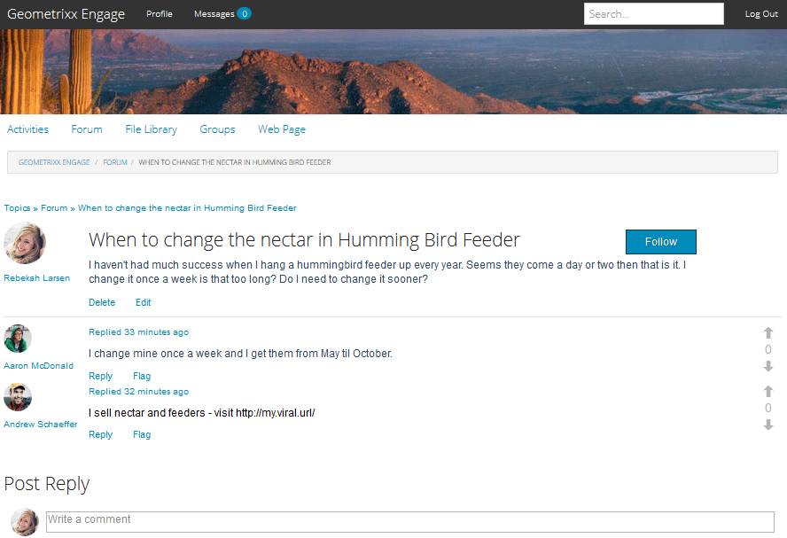

# 內文中稽核 {#in-context-moderation}

對於AEM Communities，管理員和受信任的社群成員可直接在發佈社群內容的頁面上執行稽核。

使用[仲裁主控台](moderation.md)時，針對內容顯示的資訊包含已發佈頁面的連結，以允許存取仲裁內容時可用的其他仲裁動作。

## 稽核動作 {#moderation-actions}

請造訪稽核概述，以取得[稽核動作](moderate-ugc.md#moderation-actions)的說明。

## 稽核UI {#moderation-ui}

在發佈執行個體上向版主顯示的UI包含在用於發佈和管理使用者產生的內容(UGC)的對話方塊中。 UI的元素由網站訪客的狀態決定，無論它們是……

1. 發佈內容的成員。
1. 信任的成員版主。
1. 管理員。
1. 已登入，但不是內容的管理員、版主或作者。
1. 未登入。

## 範例 {#example}

使用在[AEM Communities快速入門](getting-started.md)時建立的[Geometrixx參與](http://localhost:4503/content/sites/engage/en.html)網站，可以在論壇中設定執行緒，以體驗Publish環境中的各種協調活動。 請參閱下文。

建立網站時，將Aaron McDonald (`aaron.mcdonald@mailinator.com`)加入社群參與版主群組，即可識別為信任的社群成員。

Rebekah Larsen (`rebekah.larsen@trashymail.com`)可以使用[成員主控台](members.md)新增為community-engage-members群組的成員。

如需社群使用者群組的詳細資訊，請造訪[管理使用者和使用者群組](users.md)。

### 建立論壇帖子 {#create-the-forum-posts}

* 以Rebekah Larsen (rebekah.larsen@trashymail.com)登入

   * 選取論壇
   * 選取新的Post
   * 輸入主旨

     蜂鳴送鳥器何時變更花蜜

   * 輸入內文

     我每年都掛一隻蜂鳥餵食器，可不太成功。 他們好像來了一兩天，就是這樣。 我每週變更一次會太長嗎？ 我是否必須更早進行變更？

   * 選取Post
   * 選取登出

* 以Aaron McDonald (aaron.mcdonald@mailinator.com)登入

   * 選取論壇
   * 蜂鳥主題，請選取閱讀更多
   * 輸入Post回覆的註解

     我每週都會換一次衣服，從5月到10月都會收到衣服。

   * 選取回覆
   * 選取登出

* 以Andrew Schaeffer身分登入(andrew.schaeffer@trashymail.com)

   * 選取論壇
   * 蜂鳥主題，請選取閱讀更多
   * 輸入Post回覆的註解

     我銷售花蜜和飼料 — 請造訪https://my.viral.url/

   * 選取回覆
   * 選取登出

### 匿名網站訪客(#5) {#anonymous-site-visitor}

以下是未登入的網站訪客所看到的論壇檢視(5)。

匿名網站訪客僅可檢視論壇，但不得發佈任何內容，或執行任何稽核動作。

### 新成員(#4) {#new-member}

在作者上，以管理員身分登入，並使用[成員主控台](members.md)將Boyd Larsen (boyd.larsen@dodgit.com)新增為community-engage-members群組的新成員，然後登出。

在發佈時，以Boyd Larsen身分登入，並透過選取`Forum`然後選取`Read more`來存取此對話串，以發出蜂鳥貼文。

注意：

* 博伊德尚未參與論壇。
* Boyd無法刪除任何內容。
* Boyd已登入，可以回覆或標幟內容。

讓Boyd選取「標幟」以標幟Andrew張貼的內容。

登出

### 管理員(#3) {#administrator}

以管理員（管理員）身分登入，並選取「論壇」來存取對話串，然後選取貼文的「閱讀更多資訊」。

注意：

* 管理員可以標幟、刪除、編輯、拒絕、剪下、關閉、釘選、功能。
* 管理員可以選取「管理」以存取管理主控台。

選取管理功能表專案，以便您可以從Publish環境存取[稽核主控台](moderation.md)。

請注意，對於管理員而言，所有可稽核內容皆可見，而不僅僅是GeometrixxEngage社群網站的內容。

搜尋篩選是可切換開啟或關閉的側面板。

登出。

### 社群版主(#2) {#community-moderator}

以Aaron McDonald (`aaron.mcdonal@mailinator.com`) （社群版主）身分登入，並選取[論壇]，然後選取Hummingbird貼文的[閱讀更多]來存取對話串。

注意：

* Aaron可以回覆、刪除、編輯或拒絕自己的貼文。
* Aaron也可以標幟/允許、回覆、刪除、編輯、拒絕其他內容。
* Aaron可以剪下論壇主題，將其移至他主持的另一個論壇。
* Aaron可以選取「管理」來存取稽核主控台。

選取管理功能表專案，以便您可以從Publish環境存取[稽核主控台](moderation.md)。

請注意，對於社群版主，只會顯示來自GeometrixxEngage社群網站的可稽核內容。

請注意，社群版主的選項與管理員相同（影像已關閉搜尋側邊欄），但無法存取其他AEM主控台。

登出。

### 內容作者(#1) {#content-author}

以Rebekah Larsen (`rebekah.larsen@mailinator.com`) （啟動對話串的社群成員）身分登入，並選取[論壇]，然後選取Hummingbird貼文的[瞭解詳情]來存取對話串。

注意：

* Rebekah可以刪除或編輯自己的貼文。
* Rebekah也可以回覆或標幟其他內容。
* Rebekah無法存取稽核主控台。

