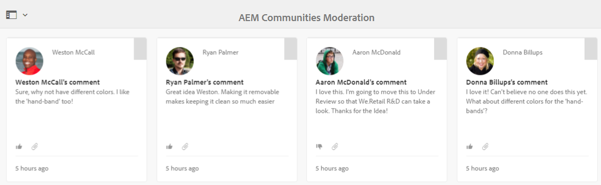

# 內容內協調 {#in-context-moderation}

若為AEM Communities，管理員和信任的社群成員可直接在發佈社群內容的發佈頁面上執行協調。

使用 [協調控制台](moderation.md)，則針對內容顯示的資訊包含已發佈頁面的連結，以允許存取在內文中協調時可用的其他協調動作。

## 協調動作 {#moderation-actions}

請造訪協調概觀，以取得 [協調動作](moderate-ugc.md#moderation-actions).

## 協調UI {#moderation-ui}

發佈例項上呈現給版主的UI包含在對話方塊中，以便發佈及管理使用者產生的內容(UGC)。 UI的元素由網站訪客的狀態決定 — 無論是否……

1. 發佈內容的成員。
1. 受信任的成員版主。
1. 管理員。
1. 登入，但不是管理員、版主或內容作者。
1. 未登錄。

## 範例 {#example}

使用 [Geometrixx參與](http://localhost:4503/content/sites/engage/en.html) 網站建立時 [開始使用AEM Communities](getting-started.md)，您可以在論壇中快速設定執行緒，在其上體驗發佈環境中的各種協調活動，如下所示。

Aaron McDonald(aaron.mcdonald@mailinator.com)在建立網站時，將他加入社群參與協調者團體，成為值得信賴的社群成員。

Rebekah Larsen(rebekah.larsen@trashymail.com)可使用 [成員控制台](members.md).

如需社群使用者群組的詳細資訊，請造訪 [管理使用者和使用者群組](users.md).

### 建立論壇貼文 {#create-the-forum-posts}

* 以Rebekah Larsen(rebekah.larsen@trashymail.com)的身份登錄

   * 選擇論壇
   * 選擇新貼文
   * 輸入主題

      蜂鳴餵鳥器的花蜜

   * 輸入正文文本

      我每年都在蜂鳥餵食器上掛燈，但並沒有取得什麼成功。 看來他們來了一兩天，就是這樣。 我每週換一次這麼長？ 我是否需要更快地改變？

   * 選擇貼文
   * 選擇註銷

* 以Aaron McDonald的身分登入(aaron.mcdonald@mailinator.com)

   * 選擇論壇
   * 對於Hummingbird主題，請選擇「更多內容」
   * 輸入帖子回復的評論

      我每週換一次，從5月到10月。

   * 選擇回復
   * 選擇註銷

* 以Andrew Schaeffer(andrew.schaeffer@trashymail.com)登入

   * 選擇論壇
   * 對於Hummingbird主題，請選擇「更多內容」
   * 輸入帖子回復的評論

      我銷售花蜜和飼料 — 請訪問https://my.viral.url/

   * 選擇回復
   * 選擇註銷

### 匿名網站訪客(#5) {#anonymous-site-visitor}

以下是未登入(5)的網站訪客所檢視的論壇檢視。

匿名網站訪客只能檢視論壇，但我不會張貼任何內容，也不會執行任何協調動作。

### 新成員(#4) {#new-member}

在作者上，以管理員身分登入，並使用 [成員控制台](members.md)，然後登出。

在發佈時，以Boyd Larsen身分登入，並透過選取 `Forum`，然後 `Read more` 為蜂鳥貼。

注意:

* 博伊德沒有參加論壇。
* 博伊德不能刪除任何內容。
* Boyd已登入，可回覆或標示內容。

讓Boyd選取Flag來標幟Andrew張貼的內容。

登出

### 管理員(#3) {#administrator}

以管理員（管理員）身分登入，並選取「論壇」 ，然後選取「閱讀更多」以取得貼文，以存取執行緒。

注意:

* 管理員可以標籤、刪除、編輯、拒絕、剪切、關閉、固定、功能。
* 管理員可選取「管理」以存取協調主控台。

選擇「管理」菜單項以訪問 [協調控制台](moderation.md) 從發佈環境。

請注意，對於管理員，所有可協調的內容都是可見的，而不只是來自Geometrixx參與社群網站的內容。

搜尋篩選器是切換開啟或關閉的側面板。

登出.

### 社群版主(#2) {#community-moderator}

以社區主持人Aaron McDonald(aaron.mcdonal@mailinator.com)的身份登錄，通過選擇論壇，然後為蜂鳥貼文選擇閱讀更多資訊來訪問線程。

注意:

* Aaron可以回覆、刪除、編輯或拒絕自己的貼文。
* Aaron還可以標籤/允許、回復、刪除、編輯、拒絕其他內容。
* Aaron可以剪下論壇話題，將其轉移到他他所溫和的論壇。
* Aaron可以選擇「管理」以訪問協調控制台。

選擇「管理」菜單項以訪問 [協調控制台](moderation.md) 從發佈環境。

請注意，對於社群版主，只會看到來自Geometrixx參與社群網站的可協調內容。

請注意，社群協調者有與管理員相同的選項（影像為已切換搜尋邊欄關閉），但無法存取其他AEM主控台。

登出.

### 內容作者(#1) {#content-author}

以Rebekah Larsen(rebekah.larsen@mailinator.com)的身份登錄，此人是社區成員，他啟動了線程，通過選擇「論壇」，然後選擇「閱讀更多資訊」來訪問線程。

注意:

* Rebekah可以刪除或編輯自己的貼文。
* Rebekah也可以回覆或標示其他內容。
* Rebekah無法訪問調節控制台。

