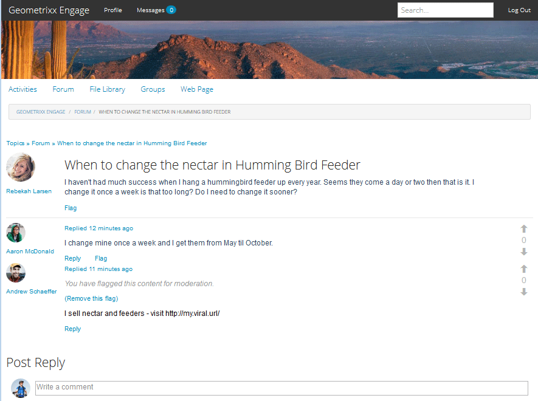

# 上下文審核 {#in-context-moderation}

對於AEM Communities，管理員和受信任的社區成員可以直接在發佈社區內容的頁面上執行審核。

使用 [調節控制台](moderation.md)，為內容顯示的資訊包括指向已發佈頁面的連結，以允許訪問當在上下文中調節時可用的附加調節動作。

## 審核操作 {#moderation-actions}

訪問審核概述以瞭解 [緩和操作](moderate-ugc.md#moderation-actions)。

## 審核UI {#moderation-ui}

在發佈實例上呈現給主持人的UI包含在用於發佈和管理用戶生成的內容(UGC)的對話框中。 UI的元素由站點訪問者的狀態確定 — 無論它們是……

1. 發佈內容的成員。
1. 受信任的成員版主。
1. 管理員。
1. 已登錄，但既不是管理員、版主，也不是內容的作者。
1. 未登錄。

## 範例 {#example}

使用 [Geometrixx](http://localhost:4503/content/sites/engage/en.html) 建立站點 [AEM Communities入門](getting-started.md)，可以在論壇中快速設定一個主題，以便在該論壇上體驗發佈環境中的各種審核活動，如下所示。

Aaron McDonald(aaron.mcdonald@mailinator.com)在建立網站時將他加入社區參與主持者小組，被確定為值得信賴的社區成員。

Rebekah Larsen(rebekah.larsen@trashymail.com)可以添加為社區參與成員組的成員， [成員控制台](members.md)。

有關社區用戶組的詳細資訊，請訪問 [管理用戶和用戶組](users.md)。

### 建立論壇帖子 {#create-the-forum-posts}

* 以麗貝卡·拉森(rebekah.larsen@trashymail.com)身份登錄

   * 選擇論壇
   * 選擇新帖子
   * 輸入主題

      何時更換蜂鳥餵食器的花蜜

   * 輸入正文文本

      我每年在蜂鳥餵食器上掛一次，但並沒有取得什麼成功。 看來他們來了一兩天就夠了。 我每週換一次，那麼長嗎？ 我需要更早改變嗎？

   * 選擇帖子
   * 選擇註銷

* 以Aaron McDonald(aaron.mcdonald@mailinator.com)身份登錄

   * 選擇論壇
   * 對於Hummingbird主題，選擇「更多」
   * 輸入帖子回復的注釋

      我每週換一次，從5月到10月。

   * 選擇答復
   * 選擇註銷

* 以Andrew Schaeffer(andrew.schaeffer@trashymail.com)身份登錄

   * 選擇論壇
   * 對於Hummingbird主題，選擇「更多」
   * 輸入帖子回復的注釋

      我銷售花蜜和飼料 — 請訪問https://my.viral.url/

   * 選擇答復
   * 選擇註銷

### 匿名站點訪問者(#5) {#anonymous-site-visitor}

以下是未登錄(5)的站點訪問者看到的論壇視圖。

匿名站點訪問者只能查看論壇，但我不發佈任何內容，也不執行任何審核操作。

### 新成員(#4) {#new-member}

在作者身份下，以管理員身份登錄，並使用 [成員控制台](members.md)，然後註銷。

在發佈時，以Boyd Larsen身份登錄，通過選擇 `Forum`，然後 `Read more` 蜂鳥哨所。

注意:

* 博伊德沒有參加論壇。
* 博伊德不能刪除任何內容。
* Boyd已登錄，可以回復或標籤內容。

讓Boyd選擇Flag來標籤Andrew發佈的內容。

登出

### 管理員(#3) {#administrator}

以管理員（管理員）身份登錄，通過選擇「論壇」，然後選擇「更多內容」以發佈帖子來訪問線程。

注意:

* 管理員可以標籤、刪除、編輯、拒絕、剪切、關閉、固定、功能。
* 管理員可以選擇「管理」以訪問審核控制台。

選擇「管理」菜單項以訪問 [調節控制台](moderation.md) 的子菜單。

請注意，對於管理員，所有可現代化內容都可見，而不只是「Geometrixx參與」社區站點中的內容。

搜索過濾器是切換開啟或關閉的側面板。

登出.

### 社區主持人(#2) {#community-moderator}

以社區主持人Aaron McDonald(aaron.mcdonal@mailinator.com)身份登錄，通過選擇「論壇」，然後為蜂鳥帖子閱讀更多內容來訪問該主題。

注意:

* Aaron可以回復、刪除、編輯或拒絕他自己的帖子。
* Aaron還可以標籤/允許、答復、刪除、編輯、拒絕其他內容。
* 亞倫可以剪掉論壇話題，把話題轉移到他所主持的另一個論壇。
* Aaron可以選擇「管理」以訪問審核控制台。

選擇「管理」菜單項以訪問 [調節控制台](moderation.md) 的子菜單。

請注意，對於社區版主持人，只有「Geometrixx參與」社區站點中的可調節內容可見。

請注意，社區主持人與管理員具有相同的選項（影像處於搜索邊欄切換關閉狀態），但無法訪問其AEM他控制台。

登出.

### 內容作者(#1) {#content-author}

以Rebekah Larsen(rebekah.larsen@mailinator.com)的身份登錄，此社區成員啟動了該主題，並通過選擇「論壇」，然後為蜂鳥帖子選擇「更多」來訪問該主題。

注意:

* 麗貝卡可以刪除或編輯她自己的帖子。
* Rebekah還可以回復或標籤其他內容。
* 麗貝卡無法訪問節制控制台。

