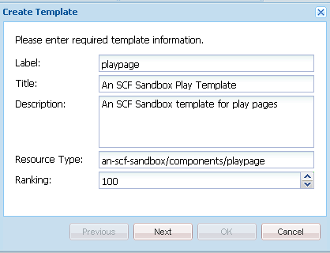

# 初始沙箱應用程式 {#initial-sandbox-application}

在本節中，您將建立下列專案：

* 用來在範例網站中建立內容頁面的&#x200B;**[範本](#createthepagetemplate)**。
* 用來呈現網站頁面的&#x200B;**[元件和指令碼](#create-the-template-s-rendering-component)**。

## 建立內容範本 {#create-the-content-template}

範本會定義新頁面的預設內容。 複雜的網站可能會使用數個範本來建立網站中不同型別的頁面。 此外，這組範本可能會成為用於將變更轉出到伺服器叢集的藍圖。

在本練習中，所有頁面都以一個簡單範本為基礎。

1. 在CRXDE Lite的總管窗格中：

   * 選取`/apps/an-scf-sandbox/templates`
   * **[!UICONTROL 建立]** > **[!UICONTROL 建立範本]**

1. 在[建立範本]對話方塊中，輸入下列值，然後按一下[下一步] ****：

   * 標籤： `playpage`
   * 標題： `An SCF Sandbox Play Template`
   * 描述： `An SCF Sandbox template for play pages`
   * 資源型別： `an-scf-sandbox/components/playpage`
   * 排名： &lt;保留為預設值>

   標籤會用於節點名稱。

   資源型別會顯示在`playpage`的`jcr:content`節點上，做為屬性`sling:resourceType`。 它會識別在瀏覽器要求時呈現內容的元件（資源）。

   在此案例中，使用`playpage`範本建立的所有頁面都由`an-scf-sandbox/components/playpage`元件轉譯。 依據慣例，元件的路徑為相對路徑，允許Sling先在`/apps`資料夾中搜尋資源，如果未找到，則在`/libs`資料夾中搜尋。

   

1. 如果使用複製/貼上，請確定Resource Type值沒有前置或後置空格。

   按一下「**[!UICONTROL 下一步]**」。

1. 「允許的路徑」是指使用此範本之頁面的路徑，因此範本會列在&#x200B;**[!UICONTROL 新增頁面]**&#x200B;對話方塊中。

   若要新增路徑，請按一下加號按鈕`+`，並在顯示的文字方塊中輸入`/content(/.&ast;)?`。 如果使用複製/貼上，請確定沒有前置或後置空格。

   注意：允許的路徑屬性值是&#x200B;*規則運算式*。 路徑符合運算式的內容頁面可以使用範本。 在此案例中，規則運算式符合&#x200B;**/content**&#x200B;資料夾及其所有子頁面的路徑。

   當作者在`/content`下建立頁面時，標題為「SCF沙箱頁面範本」的`playpage`範本會出現在可用範本清單中。

   從範本建立根頁面後，可以編輯屬性以將根路徑納入規則運算式中，藉此限制此網站對範本的存取。

   `/content/an-scf-sandbox(/.&ast;)?`

   

1. 按一下「**[!UICONTROL 下一步]**」。

   在&#x200B;**[!UICONTROL 允許的父項]**&#x200B;面板中按一下&#x200B;**[!UICONTROL 下一步]**。

   在&#x200B;**[!UICONTROL 允許的子項]**&#x200B;面板中按一下&#x200B;**[!UICONTROL 下一步]**。

   按一下&#x200B;**[!UICONTROL 「確定」]**。

1. 按一下「確定」並完成範本的建立後，請注意新`playpage`範本的「屬性」標籤值角落中顯示的紅色三角形。 這些紅色三角形表示尚未儲存的編輯。

   按一下「儲存全部」****，將新範本儲存至存放庫。

   

### 建立範本的演算元件 {#create-the-template-s-rendering-component}

建立定義內容並轉譯根據[播放頁面範本](#createthepagetemplate)建立之任何頁面的&#x200B;*元件*。

1. 在CRXDE Lite中，用滑鼠右鍵按一下&#x200B;**`/apps/an-scf-sandbox/components`**，然後按一下&#x200B;**[!UICONTROL 建立>元件]**。
1. 藉由將節點名稱（標籤）設定為&#x200B;*播放頁面*，元件的路徑為

   `/apps/an-scf-sandbox/components/playpage`

   與播放頁面範本的資源型別相對應（可選擇減去路徑的初始&#x200B;**`/apps/`**&#x200B;部分）。

   在&#x200B;**[!UICONTROL 建立元件]**&#x200B;對話方塊中，輸入下列屬性值：

   * 標籤： **播放頁面**
   * 標題： **SCF沙箱播放元件**
   * 說明： **這是轉譯SCF沙箱頁面內容的元件。**
   * 超級型別： *&lt;留白>*
   * 群組： *&lt;留白>*

   

1. 按一下「**[!UICONTROL 下一步]**」，直到對話方塊的「**[!UICONTROL 允許的子項]**」面板出現為止：

   * 按一下&#x200B;**[!UICONTROL 「確定」]**。
   * 按一下&#x200B;**[!UICONTROL 「儲存全部」]**。

1. 驗證元件的路徑與範本的resourceType相符。

   >[!CAUTION]
   >
   >播放頁面元件的路徑與播放頁面範本的`sling:resourceType`屬性之間的對應關係是網站正確運作的關鍵。

   
