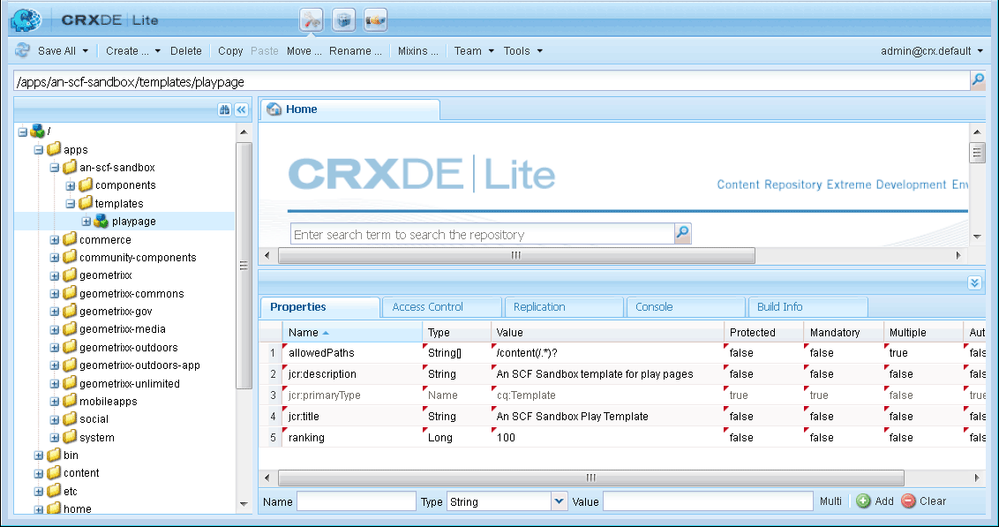

# 初始沙盒應用程式{#initial-sandbox-application}

在本節中，您將建立以下內容：

* **[template](#createthepagetemplate)**，將用於在範例網站中建立內容頁面。
* 用於呈現網站頁面的&#x200B;**[元件和指令碼](#create-the-template-s-rendering-component)**。

## 建立內容範本{#create-the-content-template}

範本會定義新頁面的預設內容。 複雜的網站可能會使用數個範本來建立網站中不同類型的頁面。 此外，該組模板可以成為用於將更改推廣到伺服器群集的藍圖。

在本練習中，所有頁面都以單一簡單範本為基礎。

1. 在CRXDE Lite的瀏覽器窗格中：

   * 選取 `/apps/an-scf-sandbox/templates`
   * **[!UICONTROL 建立]** >創 **[!UICONTROL 建模板]**

1. 在「建立範本」對話方塊中，輸入下列值，然後按一下「下一步」:****

   * 標籤: `playpage`
   * 標題: `An SCF Sandbox Play Template`
   * 說明: `An SCF Sandbox template for play pages`
   * 資源類型: `an-scf-sandbox/components/playpage`
   * 排名：&lt;leave as default>

   Label用於節點名稱。

   資源類型在`playpage`的jcr:content節點上顯示為屬性`sling:resourceType`。 它可識別當瀏覽器要求時轉譯內容的元件（資源）。

   在這種情況下，使用`playpage`模板建立的所有頁都由`an-scf-sandbox/components/playpage`元件呈現。 依慣例，元件的路徑是相對的，可讓Sling先在`/apps`資料夾中搜尋資源，若找不到，則在`/libs`資料夾中搜尋。

   

1. 如果使用複製／貼上，請確保「資源類型」值沒有前導或尾隨空格。

   按一下&#x200B;**[!UICONTROL 下一步]**。

1. 「允許的路徑」是指使用此範本的頁面路徑，如此範本便會列在&#x200B;**[!UICONTROL 新頁面]**&#x200B;對話方塊中。

   若要新增路徑，請按一下加號按鈕`+`，然後在出現的文字方塊中輸入`/content(/.&ast;)?`。 如果使用複製／貼上，請確定沒有前導或尾隨空格。

   注意：允許的路徑屬性的值是&#x200B;*規則運算式*。 路徑與運算式相符的內容頁面可以使用範本。 在這種情況下，規則運算式與&#x200B;**/content**&#x200B;資料夾及其所有子頁的路徑匹配。

   當作者在`/content`下方建立頁面時，`playpage`範本（標題為「SCF沙盒頁面範本」）會顯示在可用範本清單中。

   從範本建立根頁面後，可修改屬性以將根路徑包含在規則運算式中，以限制範本的存取權限至此網站。

   `/content/an-scf-sandbox(/.&ast;)?`

   

1. 按一下&#x200B;**[!UICONTROL 下一步]**。

   按一下&#x200B;**[!UICONTROL 允許父代]**&#x200B;面板中的&#x200B;**[!UICONTROL Next]**。

   在&#x200B;**[!UICONTROL 允許的子項]**&#x200B;面板中，按一下&#x200B;**[!UICONTROL Next]**。

   按一下&#x200B;**[!UICONTROL 「確定」]**。

1. 按一下「確定」(OK)並完成模板的建立後，您將注意到新`playpage`模板的「屬性」(Properties)頁籤值的拐角處顯示紅色三角形。 這些紅色三角形表示未保存的編輯。

   按一下&#x200B;**[!UICONTROL 保存所有]**&#x200B;將新模板保存到儲存庫。

   

### 建立模板的渲染元件{#create-the-template-s-rendering-component}

建立定義內容的&#x200B;*元件*，並轉譯任何根據[playpage範本](#createthepagetemplate)建立的頁面。

1. 在CRXDE Lite中，按一下右鍵&#x200B;**`/apps/an-scf-sandbox/components`** ，然後按一下&#x200B;**[!UICONTROL 建立>元件]**。
1. 將節點的名稱（標籤）設定為&#x200B;*playpage*，則元件的路徑為

   `/apps/an-scf-sandbox/components/playpage`

   與播放頁範本的「資源類型」（可選擇減去路徑的初始&#x200B;**`/apps/`**&#x200B;部分）相對應。

   在&#x200B;**[!UICONTROL 建立元件]**&#x200B;對話框中，鍵入以下屬性值：

   * 標籤：**playpage**
   * 標題：**SCF沙盒播放元件**
   * 說明：**這是轉換「SCF沙盒」頁面內容的元件。**
   * 超級類型：*&lt;leave blank>*
   * 群組：*&lt;leave blank>*

   

1. 按一下&#x200B;**[!UICONTROL Next]**&#x200B;直到出現對話框的&#x200B;**[!UICONTROL 允許的子代]**&#x200B;面板：

   * 按一下&#x200B;**[!UICONTROL 「確定」]**。
   * 按一下&#x200B;**[!UICONTROL 保存全部]**。

1. 驗證元件的路徑與模板的resourceType是否匹配。

   >[!CAUTION]
   >
   >playpage元件的路徑與playpage範本的sling:resourceType屬性之間的對應關係對網站的正確運作至關重要。

   