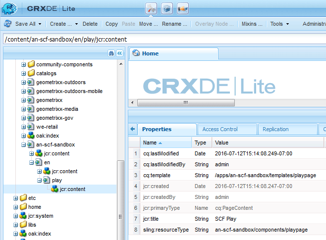

# 初始沙盒內容 {#initial-sandbox-content}

在本節中，您將建立以下所有使用 [頁面模板](initial-app.md#createthepagetemplate):

* SCF沙盒站點，它將重定向到首頁的英文版本。

   * SCF沙盒 — 站點的英文版本的首頁。

   * SCF播放 — 要播放的首頁的子頁。

雖然本教程不深入 [語言副本](../../help/sites-administering/tc-prep.md)，其設計為根頁可以通過HTML標題實現對用戶的首選語言的檢測，並重定向到該語言的適當首頁。 該慣例是使用雙字母國家代碼作為頁面的節點名稱，例如，英文為&quot;en&quot;，法文為&quot;fr&quot;，等等。

## 建立首頁 {#create-first-pages}

既然有 [頁面模板](initial-app.md#createthepagetemplate)，可以在/content目錄中建立網站的根頁。

1. 標準UI當前提供了建立站點的藍圖。 由於本教程正在建立一個簡單站點，因此經典UI非常有用。

   要切換到經典UI，請選擇全局導航並懸停在「項目」表徵圖的右側。 選擇 *切換到經典UI* 表徵圖：

   

   切換到經典UI的能力必須 [由管理員啟用](../../help/sites-administering/enable-classic-ui.md)。

1. 從 [「經典UI歡迎」頁](http://localhost:4502/welcome.html)選中 **[!UICONTROL 網站]**。

   

   或者，通過瀏覽到 [/siteadmin。](http://localhost:4502/siteadmin)

1. 在瀏覽器窗格中，選擇 **[!UICONTROL 網站]** 然後在工具欄中選擇 **[!UICONTROL 新建]** > **[!UICONTROL 新建頁面]**。

   在 **[!UICONTROL 建立頁]** 對話框，輸入以下內容：

   * 標題: `SCF Sandbox Site`
   * 名稱: `an-scf-sandbox`
   * 選擇 **[!UICONTROL SCF沙盒播放模板]**
   * 按一下 **[!UICONTROL 建立]**

   

1. 在瀏覽器窗格中，選擇剛建立的頁面， `/Websites/SCF Sandbox Site`，然後按一下 **[!UICONTROL 新建]** > **[!UICONTROL 新建頁面]**:

   * 標題: `SCF Sandbox`
   * 名稱: `en`
   * 選擇 **[!UICONTROL SCF沙盒播放模板]**
   * 按一下 **[!UICONTROL 建立]**

1. 在瀏覽器窗格中，選擇剛建立的頁面， `/Websites/SCF Sandbox Site/SCF Sandbox`，然後按一下 **[!UICONTROL 新建]** > **[!UICONTROL 新建頁面]**

   * 標題: `SCF Play`
   * 名稱: `play`
   * 選擇 **[!UICONTROL SCF沙盒播放模板]**
   * 按一下 **[!UICONTROL 建立]**

1. 這是網站現在在網站控制台中的顯示方式。 請注意，在瀏覽器窗格中選定項目的子頁將顯示在可以管理這些子頁的右窗格中。

   

   這是使用網站工具和模板建立的內容的儲存庫視圖：

   

## 添加設計路徑 {#add-the-design-path}

當 ` [/etc/designs/an-scf-sandbox](setup-website.md#setupthedesigntreeetcdesigns)` 是使用「工具」控制台的「設計」部分建立的，屬性為「

* `cq:template="/libs/wcm/core/templates/designpage"`

定義，它提供了在指令碼中使用引用設計資產的可選功能 `currentDesign.getPath()`。 例如

* `% String favIcon = currentDesign.getPath() + "/favicon.ico"; %`

   * 名稱: `cq:designPath`
   * 類型: `String`
   * 值: `/etc/designs/an-scf-sandbox`

* 按一下綠色 `[+] Add`

儲存庫應如下所示：

* 按一下 **[!UICONTROL 全部保存]**

在保存配置時遇到任何問題，請重新登錄並重新配置。

>[!NOTE]
>
>使用 `cq:designPath` 是可選的，與 [客戶端的使用](develop-app.md#includeclientlibsintemplate),SCF元件使用時必須使用 [客戶端](client-customize.md#clientlibs-for-scf) 管理他們的JS和CSS。
