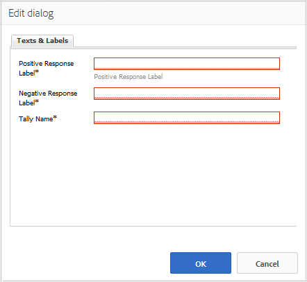

# 使用喜歡 {#using-liking}

的 `Liking` 元件是一種有用的工具，允許用戶對特定內容（如論壇內的評論）發表意見。 使用 `Liking` 的子菜單。

## 將喜歡添加到頁面 {#adding-liking-to-a-page}

添加 `Liking` 在作者模式下對頁面的元件，使用元件瀏覽器查找

* `Communities / Liking`

並將其拖到頁面上，如用戶喜歡的相對於功能的位置。

如需必要資訊，請訪問 [社區元件基礎](basics.md)。

當 [所需的客戶端庫](essentials-liking.md#essentials-for-client-side) 包括，這是 `Liking` 元件。

## 配置喜歡 {#configuring-liking}

選取已放置的 `Liking` 要訪問和選擇的元件 `Configure` 表徵圖。

在 **[!UICONTROL 文本和標籤]** 頁籤，指定用於記錄贊的屬性。

* **[!UICONTROL 正面回應標籤]**

   (*必需*)正響應的屬性名稱。

* **[!UICONTROL 負面回應標籤]**

   (*必需*)負響應的屬性名稱。

* **[!UICONTROL 記帳名稱]**

   (*必需*)此投票元件實例的內部、可識別屬性名稱。

## 站點訪問者體驗 {#site-visitor-experience}

### 成員 {#members}

成員可隨時更改其類型。

### 匿名 {#anonymous}

不支援匿名喜歡。 站點訪問者必須註冊（成為成員）並登錄以參與喜歡。

## 其他資訊 {#additional-information}

有關 [喜歡基本功能](essentials-liking.md) 頁面。
