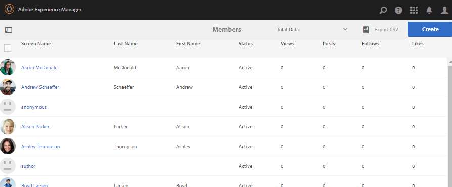

# 成員和群組管理主控台 {#members-groups-management-consoles}

## 總覽 {#overview}

AEM Communities功能通常會要求網站訪客在參與發佈環境的社群之前，必須先註冊及登入。 其使用者註冊只需存在於發佈環境中，通常稱為 *成員* 區分 *使用者* 註冊於製作環境中。

### 發佈時的成員（用戶） {#members-users-on-publish}

使用在中註冊的Communities Members and Groups控制台、成員和成員組 *發佈* 環境可從建立和管理 *作者* 環境。 只有在 [隧道服務](deploy-communities.md#tunnel-service-on-author) 啟用。

### 作者使用者 {#users-on-author}

用於管理 *作者* 環境，則必須使用平台的安全性主控台：

* 在全局導航中，選擇 **[!UICONTROL 工具]** > **[!UICONTROL 安全性]** > **[!UICONTROL 使用者]**.
* 在全局導航中，選擇 **[!UICONTROL 工具]** > **[!UICONTROL 安全性]** > **[!UICONTROL 群組]**.

>[!NOTE]
>
>在部署並啟用範例內容後，許多範例使用者同時存在於製作和發佈環境中。 這些使用者在執行時不會出現 [nosamplecontent runmode](../../help/sites-administering/production-ready.md).

## 成員控制台 {#members-console}

在製作環境中，若要進入「成員」主控台，以管理在發佈環境中註冊的成員：

* 在全局導航中，選擇 **[!UICONTROL 導覽]** > **[!UICONTROL 社群]** > **[!UICONTROL 成員]**

>[!CAUTION]
>
>如果 [隧道服務](deploy-communities.md#tunnel-service-on-author) 未啟用。

### 搜尋 {#search-features}

選取 `Members` 頁首，切換開啟搜尋端面板。

選取 `Members` 頁首，切換關閉搜尋端面板。

### 成員統計資訊 {#member-statistics}

顯示的欄 `Views`, `Posts`, `Follows` 和 `Likes` 當使用者為一或多個社群網站的成員時，就會更新Adobe Analytics [已啟用](sites-console.md#analytics).

### 匯出 CSV {#export-csv}

選取 `Export CSV` 連結會將所有成員下載為逗號分隔值的清單，以適合匯入至試算表。

欄標題為

`| Screen Name |Last Name |First Name |Status |Views |Posts |Follows |Likes |`

## 建立新成員 {#create-new-member}

選擇 `Create Member` 以便在發佈環境中建立使用者。

### 一般 — 成員詳細資訊 {#general-member-details}

大多數欄位是成員以後可以在其配置檔案中填寫的可選欄位。

* **[!UICONTROL ID]**

(*必填*)可授權ID是成員的登入ID。
依預設，ID會設為必要電子郵件地址的值。
*ID一經建立即無法修改*.

* **[!UICONTROL 電子郵件地址]**

(*必填*)成員的電子郵件地址。
成員在更新其配置檔案時可能更改其電子郵件地址。如果ID預設為電子郵件地址，則ID將 *not* 變更電子郵件地址時變更。

* **[!UICONTROL 密碼]**

   (*必填*)登入密碼。

* **[!UICONTROL 重新鍵入密碼]**

   (*必填*)重新輸入密碼以進行驗證。

* **[!UICONTROL 新增成員至網站]**

   (*可選*)從現有社區站點中選擇，以便將成員添加到社區站點的成員組。

* **[!UICONTROL 將成員新增至群組]**

   (*可選*)從現有成員組中選擇，以便將成員添加到該組。

* 選擇 **[!UICONTROL 儲存]**

### 一般 — 帳戶設定 {#general-account-settings}

在「帳戶設定」下，社區管理員可以：

* **[!UICONTROL 狀態]**
   * 禁止成員無法登錄，阻止他們查看頁面或參與需要登錄的活動。 他們仍可以匿名訪問開放的社區站點。

   * 未禁止A成員可完全訪問社區站點。

   預設為 `Not Banned`.

* **[!UICONTROL 貢獻限制]**

   如果勾選此選項，成員張貼內容的能力就會受限。
預設值取決於貢獻限制的設定。
請參閱 [會員供款限制](limits.md).

* **[!UICONTROL 變更密碼]**

   修改現有成員時出現的連結。 提供社區管理員重置成員密碼的功能。

### 一般 — 照片 {#general-photo}

若要為成員提供頭像，請從選擇 **[!UICONTROL 上傳影像]** 並選擇.jpg、.png、.tif或.gif類型的影像。 影像的優選大小為240 x 240像素，72 dpi。

### 常規 — 向站點添加成員 {#general-add-member-to-sites}

該成員可以添加到一個或多個社區站點的成員組。 首先，在文字方塊中輸入文字。

### 一般 — 向組添加成員 {#general-add-member-to-groups}

該成員可以添加到一個或多個成員組。 首先，在文字方塊中輸入文字。

### 徽章標籤 {#badges-tab}

此 `BADGES` 面板提供手動指派徽章以及撤銷徽章的功能。 徽章可用於指派的角色，以及通常獲得的徽章。

另請參閱 [計分和徽章](implementing-scoring.md).

* **[!UICONTROL 新增徽章]**
   * 開始鍵入以選擇 [可用徽章](badges.md). 選擇徽章後，選擇應在其上與成員的頭像一起顯示徽章的每個站點或所有站點。
   * 可選擇多個徽章和網站。
* **[!UICONTROL 移除徽章]**
   * 選取徽章旁的垃圾桶圖示以移除它。

## 群組主控台 {#groups-console}

「群組」主控台可從製作環境取得，可建立及管理在發佈環境中註冊的成員群組。 它對以下方面特別有用：
* [特權成員組](users.md#privilegedmembersgroups)
* 基於組的分配 [啟用資源](resources.md)

若要存取「群組」主控台：
* 在全局導航中，選擇 **[!UICONTROL 導覽]** > **[!UICONTROL 社群]** > **[!UICONTROL 群組]**.

>[!CAUTION]
>
>若 [隧道服務](deploy-communities.md#tunnel-service-on-author) 未啟用。

### 建立新群組 {#create-new-group}

選擇 `Add Group` 以在發佈環境中建立群組。

建立新發佈端成員組的必填欄位為：

* **[!UICONTROL ID]**

   (*必填*)群組唯一ID。

   *ID一經建立即無法修改。*

* **[!UICONTROL 名稱]**

   (*可選*)群組的顯示名稱。

   預設值為ID。

* **[!UICONTROL 說明]**

   (*可選*)群組用途和權限的說明。

* **[!UICONTROL 將成員新增至群組]**

   (*可選*)選取要納入為群組初始成員的發佈端成員。

* 選擇 **[!UICONTROL 儲存]**

## 授權管理員 {#authorized-administrators}

在Communities成員控制台中使用成員時，必須以具有適當權限的用戶身份登錄，並且要以 [隧道服務](deploy-communities.md#tunnel-service-on-author) 才能正確設定。

如果未登入為 `admin`，則登入的使用者必須是 `administrators` 使用者群組。

另請參閱 [製作上的復寫代理](deploy-communities.md#replication-agents-on-author).
