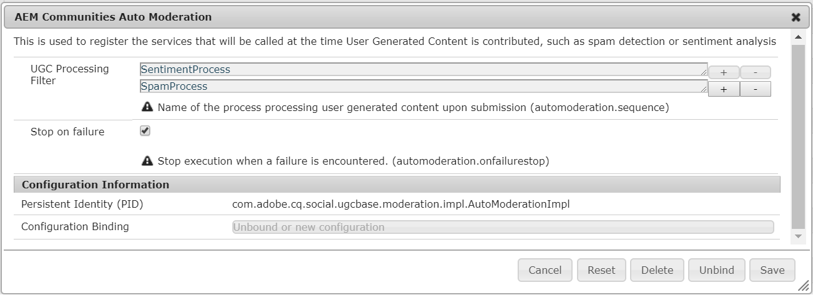

# 協調社群內容{#moderating-community-content}

## 概覽 {#overview}

當會員（登入網站訪客）透過與下列其中一個社群元件互動，從已發佈的社群網站張貼內容時，就會建立社群內容，也稱為使用者產生的內容(UGC):

* [部落格](/help/communities/blog-feature.md) :成員張貼部落格文章或留言
* [日曆](/help/communities/calendar.md) :成員張貼日曆事件或留言
* [注釋](/help/communities/comments.md) :成員張貼評論或回覆評論

* [論壇](/help/communities/forum.md) :成員發佈新主題或回覆主題
* [構想](/help/communities/ideation-feature.md) :會員張貼構想或留言
* [QnA](/help/communities/working-with-qna.md) :成員會建立問題或回答問題
* [評論](/help/communities/reviews.md) :成員在評分項目時張貼意見

UGC的協調有助於識別正面貢獻以及限制負面貢獻（例如垃圾訊息和辱罵性語言）。 UGC可從以下幾種環境協調： 

* [大量協調](/help/communities/moderation.md)主控台「協調」主控台可供公共環境中的 [管理員和社群協調者](/help/communities/users.md) ，以及作者環境中的管理員存取。 當社群內容儲存在共用商店時，就 [可能如此](/help/communities/working-with-srp.md)。

* [內容內容協調](/help/communities/in-context.md)發佈環境中的協調可由管理員和社群協調者直接在發佈內容的頁面上執行。

## 協調動作 {#moderation-actions}

可對發佈內容(UGC)執行的動作會視使用者身分和環境而有所不同。 下表使用下列術語，根據用戶身份描述各種角色：

* `Admin`
屬於社區管理員群 [組的使用者](/help/communities/users.md)

* `Moderator`
社群協調者 [群組的成員](/help/communities/users.md#publishenvironmentusersandgroups) (具有協 [調者權限](/help/communities/in-context.md#moderatorpermissions))

* `Creator`
發佈內容的使用者

* `Member`
不具特殊權限的登入使用者

* `Visitor`
匿名用戶

<table>
 <tbody>
  <tr>
   <td> </td>
   <td><strong>管理員</strong></td>
   <td><strong>版主</strong></td>
   <td><strong>產生器</strong></td>
   <td><strong>成員</strong></td>
   <td><strong>訪客</strong></td>
   <td><strong>事件觸發  (Event Triggered)</strong></td>
   <td><strong>預先協調</strong></td>
  </tr>
  <tr>
   <td><strong>編輯／刪  除</strong></td>
   <td>X</td>
   <td>X</td>
   <td>X</td>
   <td> </td>
   <td> </td>
   <td> </td>
   <td> </td>
  </tr>
  <tr>
   <td><strong>剪下</strong></td>
   <td>X</td>
   <td>X</td>
   <td> </td>
   <td> </td>
   <td> </td>
   <td> </td>
   <td> </td>
  </tr>
  <tr>
   <td><strong>拒絕</strong></td>
   <td>X</td>
   <td>X</td>
   <td> </td>
   <td> </td>
   <td> </td>
   <td>X</td>
   <td> </td>
  </tr>
  <tr>
   <td><strong>關閉／重新開啟 </strong></td>
   <td>X</td>
   <td>X</td>
   <td> </td>
   <td> </td>
   <td> </td>
   <td>X</td>
   <td>X  </td>
  </tr>
  <tr>
   <td><strong>標幟／取消標幟 </strong></td>
   <td>X</td>
   <td>X</td>
   <td> </td>
   <td>X</td>
   <td> </td>
   <td>X</td>
   <td> </td>
  </tr>
  <tr>
   <td><strong>允許</strong></td>
   <td>X</td>
   <td>X</td>
   <td> </td>
   <td> </td>
   <td> </td>
   <td>X</td>
   <td>X</td>
  </tr>
 </tbody>
</table>

### 編輯／刪除 {#edit-delete}

貼文製作完成後，創作者、管理員或社群協調者可以編輯或刪除貼文。

刪除UGC時，它將從儲存庫中刪除，並且可能無法恢復。

### 剪下 {#cut}

管理員或社區協調者可以將一個或多個論壇主題或QnA問題從一個位置移動到另一個位置。 這包括從一個社群網站到另一個社群網站，前提是相同成員在這兩個網站上都擁有協調權限。

選取「剪下」(Cut)動作，內容就會複製到剪貼簿。 多則貼文可以複製，並以群組的形式移至新位置。

在另一個位置，當剪貼簿中有內容時，「新貼文」旁會顯示「貼上」按鈕，其編號會識別將貼上的貼文數。 「貼上」按鈕包含清除剪貼簿而非貼上的選項。

 

### 拒絕 {#deny}

協調者可能不允許UGC在發佈的網站上保持可見。 對於管理員和社群協調者，貼文仍可使用，並加上垃圾訊息。

### 關閉／重新開啟 {#close-reopen}

「關閉」動作會在整個對話串流（論壇主題或初始留言）上運作，並包含所有後續的貼文或回覆。

關閉時，不僅無法再回覆，也不允許任何協調動作。

要執行任何操作，主題或注釋必須重新開啟。

管理員或社群協調者可以執行「關閉／重新開啟」動作。

### 標幟／取消標幟 {#flag-unflag}

標幟是任何登入會員（內容建立者除外）的一種方式，用以指出貼文內容有問題。 標幟後，會出現取消標幟圖示，允許相同成員取消標幟內容。

可設定內容內容協調，讓成員在標籤貼文時選擇原因。 可配置可選標籤原因清單，包括是否可以輸入自定義原因。 標幟原因會與UGC一起儲存，但原因不會觸發任何特定動作。 只有旗標數會觸發通知。 標幟內容會加上註解，如此協調者就可據此行事。

系統會追蹤所有標幟、標幟者和標幟原因，並在達到臨界值時傳送事件。 如果社群協調者允許UGC，則會封存這些標幟。 在允許和封存後，如果有後續的標籤，則會封存這些標籤，就像之前沒有標籤一樣。

### 允許 {#allow}

「允許」動作是UGC的選項，其已標幟、拒絕或未在預先協調的系統中核准。 「允許」動作會清除任何已標幟或拒絕／垃圾訊息狀態，並封存任何已標幟的資料。

## 常見協調概念 {#common-moderation-concepts}

### 預先協調 {#premoderation}

當UGC預先協調時，貼文在協調動作核准後，才會顯示在發佈的網站上。 在建立社群網 [站時](/help/communities/sites-console.md)，勾選此方 `[Content is Premoderated](/help/communities/sites-console.md#moderation)` 塊將啟用整個網站的預先協調。 將元件放在頁面上後，就可設定支援協調的元件，以使用其編輯對話方塊中的設定進行預先協調：

* [在「使](/help/communities/comments.md) 用者 [協](/help/communities/reviews.md)調」標 **簽上的留言和審核** ，勾選「 **預先協調」**
* [論壇](/help/communities/forum.md)、QnA、QnA [、Calendar Settings](/help/communities/ideation-feature.md)on [CheckHoraded(](/help/communities/working-with-qna.md)論壇、QnA)和日曆設 [定](/help/communities/calendar.md)******Tab**

### 垃圾訊息偵測 {#spam-detection}

垃圾訊息偵測是一種自動協調功能，可將提交的使用者產生的內容標示為垃圾訊息，以篩選不可取的部分。 啟用後，它會根據預先設定的垃圾訊息字詞集合，識別使用者產生的內容是否為垃圾訊息。 預設垃圾訊息字詞提供於

`/libs/settings/community/sites/moderation/spamdetector-conf/profiles/spam_words.txt`.

不過，若要自訂或延伸預設垃圾訊息字詞，請透過覆蓋，在/apps目錄中依預設垃圾訊息字詞的結構建立一組 [字詞](/help/communities/overlay-comments.md)。

使用者產生的包含垃圾訊息的貼文（跨所有內容類型，例如部落格、論壇和留言）在貼文上方標有「此貼文已分類為垃圾訊息」文字。

協調者可以看到此類貼文，並加上相同的標籤，以允許或拒絕在網站上顯示。 這些貼文的協調動作可以在內容內或透過大量協調UI來執行。

若要啟用垃圾訊息偵測引擎，請依照下列步驟進行：

1. 轉 [至/system/console/configMgr](https://localhost:4502/system/console/configMgr)，以開啟Web主控台。

1. 找到 **AEM Communities Auto Moderation** （AEM社群自動協調）設定並加以編輯。
1. 添加&quot;SpamProcess&quot;條目。

>[!NOTE]
>
>垃圾訊息偵測只會針對英文地區設定實作。

### 情緒 {#sentiment}

情緒是根據貼文(UGC)中顯示的正面和負[面關鍵字](#configuringwatchwords)（關注字詞）數目來計算。

情緒分析使用一組預先設定的規則，並計算UGC的情緒。 預設規則位於 `/libs/cq/workflow/components/workflow/social/sentiments/rules.`

規則產生的值從1（所有負面，無正面字詞）到10（所有正面，無負面字詞）。 情緒值5為中性情緒，且為預設值。

/libs元件中定義的規則包括：

* 規則1:如果沒有正面字詞且至少有一個負面字詞，請將值設為1
* 規則2:如果沒有否定字詞且至少有一個正字詞，請將值設為10
* 規則3:如果否定字詞多於正面字詞，請將值設為3
* 規則4:如果正面字詞多於負面字詞，請將值設為8

若要覆寫或新增規則，請依照預設規則的結構，在/apps目錄中建立一組規則。 編輯情緒設定，以識別規則的位置。

分析後，情緒會與UGC一起儲存。

在大量 [協調控制台](/help/communities/moderation.md)，可以根據情緒是否為負面、中性或正面來篩選和檢視UGC。

#### Watchwords {#watchwords}

AEM社群提供*watchword分析器*作為評估情緒的程式 [步驟](#sentiment)。 關注字詞對情緒值的貢獻是因為比較已張貼內容中使用的負面和正面關注字詞，以及禁止字詞。

#### 設定情緒和關注字詞 {#configure-sentiment-and-watchwords}

可自訂正面和負面監看字詞清單，因為可以是情緒規則。

預設的監視字詞清單可以作為節點的屬性在儲存庫中輸入，與預設值類似，或者通過使用字詞清單配置OSGi服務 `sentimentprocess.name`來覆蓋預設值。

也 **可修改sentimentprocess.name** ，以參考自訂情緒規則集的位置。

若要設定情緒和關注字詞：

* 在作者實例上
* 以管理員身分登入
* 開啟 [Web主控台](https://localhost:4502/system/console/configMgr)
* 定位 `sentimentprocess.name`
* 選擇要在編輯模式下開啟的配置

* **正面關注字**&#x200B;詞以逗號分隔的字詞清單，可產生覆寫預設值的正面情緒。 預設為空白清單。

* **負面關注字**&#x200B;詞以逗號分隔的字詞清單，會造成覆寫預設值的負面情緒。 預設為空白清單。

* **明確的監看位元組路徑**&#x200B;節點包含指定預設監看字的預設和屬 `positive` 性 `negative` 的節點的儲存庫位置。 預設為 `/libs/settings/community/watchwords/default`。

* **情緒規**&#x200B;則根據正面和負面關注字詞計算情緒之規則的儲存庫位置。 預設值 `/libs/cq/workflow/components/workflow/social/sentiments/rules` 為（不過，不再涉及任何工作流程）。

以下是預設監看字詞的自訂項目範例，當設 `Explicit Path to Watchwords Node` 為時 `/libs/settings/community/watchwords/default`。

### 協調者權限 {#moderator-permissions}

以下權限在指派給相同資源時統稱為 **`moderator permissions`** :

* `Read`
* **`Modify`**
* `Create`
* `Delete`
* `Replicate`

