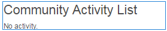

# 協調控制台{#moderation-console}

在AEM Communities中，管理員 [和社群協調者](/help/communities/moderate-ugc.md) （受信任的社群成員指派為協調者）可從作者和發佈環境大量協調社群內容。

管理員和社群協調者也可 [能會在發佈環境中執行](/help/communities/in-context.md) 「內容內容協調」。

所有社群網站 [的功能](/help/communities/sites-console.md) ，是 `Administration`可供具有管理權限登入的使用者使用的功能表項目。 此連 `Administration`結可讓您存取「協調」主控台。

管理員和社群協調者可從「協調控制台」存取其有權協調的所有使用者產生內容(UGC)。 如果允許協調多個網站，則可以檢視所有網站的貼文，或依所選社群網站進行篩選。

如需詳細資訊，請造 [訪管理使用者和使用者群組](/help/communities/users.md)。

協調控制台支援：

* 大量執行協調任務
* 搜索UGC
* 查看UGC詳細資訊
* 查看UGC作者詳細資訊

只有以管理員或具有成員的身分登入時，才 ` [moderator permissions](/help/communities/in-context.md#identifyingtrustedmembers)`能執行協調工作。

## 發佈環境存取 {#publish-environment-access}

從已發佈的社群網站存取「協調控制台」是透過「管理」連結，當社群協調者登入時，此連結會顯示。

選取「管理」連結後，會顯示「協調控制台」:

## 作者環境存取 {#author-environment-access}

在作者環境中，若要進入「協調」主控台

* 從全域導覽：導 **覽、社群、協調**

只有以管理員身分登入或以會員身分登入時，才 ` [moderator permissions](/help/communities/in-context.md#identifyingtrustedmembers)`能執行協調工作。 唯一顯示的社群內容是允許登入會員協調的社群內容。

>[!NOTE]
>
>只有當所選SRP實作一般商店時，發佈環境中的UGC才會在作者身上顯示。 例如，預設儲存空間為JSRP，對於作者和發佈而言，JSRP不是常用的儲存空間。 請參 [閱社群內容儲存](/help/communities/working-with-srp.md)。

## 協調控制台UI {#moderation-console-ui}

除了左側導覽邊欄（在作者上顯示，但在發佈上不顯示）外，協調UI有下列主要區域：

* **[頂端導覽列](#top-navigation-bar)**
* **[工具欄](#toolbar)**
* **[內容區域](#content-area)**

### 頂端導覽列 {#top-navigation-bar}

所有控制台的頂端導覽列都是常數。 如需詳細資訊，請參 [閱基本處理](/help/sites-authoring/basic-handling.md)。

### 工具列 {#toolbar}

位於頂端導覽列下方的工具列在左側提供下列切換開關：

* [篩選邊欄](/help/communities/moderation.md#filterrail)會開啟一個邊欄，允許您選擇要篩選內容的屬性。

位於頂端導覽列下方的工具列在左側提供下列切換開關：

[篩選邊欄](/help/communities/moderation.md#filterrail)會在選取「搜尋」時開啟邊欄，可供您選擇要篩選內容的屬性。

### 內容區域 {#content-area}

內容區域包含已張貼UGC的資訊：

* UGC發佈
* 成員名稱
* 成員頭像
* 貼文位置
* 發佈時間
* 貼文的回覆數
* [與貼文](/help/communities/moderate-ugc.md#sentiment) 關聯的情緒
* 如果批准，則顯示複選標籤
* 如果有附件，則會顯示回形針

>[!NOTE]
>
>內容區域具有無 *限捲動*，這表示您可繼續捲動，直到內容結束為止。 即使在捲動時，工具列仍會保持在內容區域上方的固定可見位置。

### 濾鏡邊欄 {#ootbfilters}

側面板圖示會開啟濾鏡邊欄。 顯示在內容區域左側的篩選邊欄提供不同的篩選，每個篩選器都對顯示在內容區域中的參考UGC有立即影響。

每個類別中的篩選器都 ****&#x200B;是OR組合在一起，而不同類別中的篩選器 ****&#x200B;是AND組合在一起。

例如，如果您同時勾選「 **問題** 」和「答案」 **，則您會看到內容是**「問題」***&#x200B;或&#x200B;*「答*****&#x200B;案」。

不過，如果您勾 **選「問題** 」和「待審」 **，則只會看到**「問題」**且「待審」的**&#x200B;內容 ****。

>[!NOTE]
>
>社群協調者可以在協調控制台UI上為預先定義的篩選建立書籤。 當這些篩選條件附加至URL結尾（作為查詢字串參數）時，協調者稍後可返回書籤化篩選條件，並共用這些連結。

當篩選邊欄開啟時，「搜尋」圖示會切換側面板關閉。 不過，若要關閉篩選邊欄並僅檢視使用者產生的內容，請按一下「搜尋」圖示並選取「僅限內容」選項。

#### 內容路徑 {#content-path}

「內容路徑」會限制置入指定內容存放庫之貼文所顯示的參考UGC。

#### 測試搜尋 {#text-search}

文字搜尋會限制對包含輸入文字之貼文顯示的參考UGC。

#### 網站 {#site}

網站會限制顯示給所選社群網站貼文的參考UGC。 如果未勾選任何網站，則會顯示所有UGC參照。

>[!NOTE]
>
>當管理員存取大量協調控制台時，會顯示UGC的所有參考，包括未使用網站建立精靈建立的網 [站](/help/communities/sites-console.md)，例如Geometrixx範例。
>
>當受信任的社群成員在發佈時存取大量協調控制台時，只會顯示對為該成員獲授權協調的社群網站所建立之UGC的參考，並可使用網站篩選器加以篩選。

#### 內容類型 {#content-type}

「內容類型」會限制所選資源類型的貼文所顯示的參考UGC。 可以選擇下列一種或多種類型。 如果未選中任何類型，則顯示所有類型。

* **評論**
* **論壇主題**
* **論壇回覆**
* **QnA 問題**
* **QnA 答案**
* **部落格文章**
* **部落格評論**
* **日曆事件**
* **行事曆評論**
* **檔案資料庫資料夾**
* **檔案資料庫文件**
* **創意**
* **創意力評論**

#### 其他內容類型 {#additional-content-types}

若要新增要篩選的其他資源：

* 在作者實例上
* 以管理員身分登入
* 開啟 [Web主控台](https://localhost:4502/system/console/configMgr)
* 定位 `AEM Communities Moderation Dashboard Filters`
* 選擇要在編輯模式下開啟的配置
* 輸入要篩選的元件的ResourceType

   * 例如，要篩選包含的投票元件，請輸入：
      `Voting=social/tally/components/hbs/voting`

* 選擇保存
* 重新整理社群——協調控制台

結果就是篩選群組下方的 `Voting`新可選 `Content Type` 篩選器。

選取該篩選器後，控制面板的內容將顯示與任何輸入的ResourceTypes相符的UGC。

#### 狀態 {#status}

狀態會限制所選狀態的貼文所顯示的參考UGC，這些貼文可能是「待審」、「已核准」、「拒絕」或「已關閉」中的一或多個，以及「部落格文章的草稿」或「已排程」，以及「QnA問題的已回答或未回答」。 如果未選取任何項目，則會顯示所有項目。

>[!NOTE]
>
>如果只選取「未回答」狀態，則協調者將會看到除回答問題之外的所有內容（適用於所有內容類型）。 因為在未回答的問題和其他內容（例如論壇主題、部落格文章或留言）中，不存在負責回答問題的屬性。

#### 標幟 {#flagging}

標幟會限制顯示給已標幟或隱藏之貼文的參考UGC。

一旦標籤某個內容，它會一直保持標籤狀態，直到您再次選取**標籤**按鈕，取消標籤該內容為止。 請注意，沒有標籤層級，例如重要或後續動作。

#### 成員 {#members}

成員限制由輸入的成員名稱發佈的UGC所顯示的引用UGC。

#### 發佈於前一 {#posted-in-the-last}

「在最後一個貼文中張貼」會限制在最後一小時、一天、一週、月或年內張貼的貼文所顯示的參考UGC。

#### 情緒 {#sentiment}

[情緒](/help/communities/moderate-ugc.md#sentiment) ，會限制顯示給情緒值為正面、負面或中性的貼文的參考UGC。

## 自訂篩選器 {#custom-filters}

除了篩選邊欄中的「現成」篩選 [器外](/help/communities/moderation.md#ootbfilters)，您還可以將中繼資料的其他自訂篩選器新增至協調UI。 開發人員可使用Github中的范常式式碼來擴充現有的協調UI篩選。

Github [上的範例專案](https://github.com/Adobe-Marketing-Cloud/aem-communities-extensions/tree/master/aem-communities-moderation-filter) ，會建置「標籤」篩選器，以根據特定標籤是否套用至使用者產生的內容來篩選UGC清單。 您可以遵循范常式式碼，並針對其他類似的UGC中繼資料欄位建立類似的篩選。

若要安裝「標籤」篩選器的範例：

1. 在「AEM Author」([https://[aem-author]:4502/crx/packmgr/index.jsp](https://aem65-communities-demo.corp.adobe.com:4502/crx/packmgr/index.jsp))例項和「AEM Publish」([https://[aem-publish]:4503/crx/packmgr/index.jsp](https://aem65-communities-demo.corp.adobe.com:4502/crx/packmgr/index.jsp))例項上開啟套件管理器。
1. 從Github程式碼 `com.adobe.social.sample.moderation.filter.ui.apps-1.0-SNAPSHOT.zip` 建立套件，並安裝並啟用相同的程式碼。
1. 在AEM Author( `https://[aem-author]:4502/system/console/bundles`)例項和AEM Publish()例項上開啟 `https://[aem-publish]:4503/system/console/bundles`bundles主控台。
1. 從Github建立 ` [com](https://sample-moderation-filter.com/).adobe.social.sample.moderation.filter.core-1.0-SNAPSHOT.jar` 套件，並安裝並啟用相同功能。
1. 前往「AEM作者」( **https://[aem-author]:4502/crx/de/index.jsp#/apps/social/moderation/facets** )和「AEM發佈」([https://[aem-publish]:4502/crx/de/index.jsp#/apps/social/moderation/facets](https://aem65-communities-demo.corp.adobe.com:4502/crx/de/index.jsp#/apps/social/moderation/facets))例項上的「/apps/moderation/facets」節點。
1. 新增具有權限 **的技術使用者社群——公用程式** - `jcr:read` 閱讀器。

要在現有的社群網站上公開自訂篩選器：

1. 編輯現 `Clientlibs` 有的協調頁面 `/content/we-retail/us/en/community/moderation/shell3/jcr:content/head/clientlibs.`

   * 新增類別 `cq.social.hbs.moderation.v2.`

1. 前往 `/content/we-retail/us/en/community/moderation/shell3/jcr:content/rails/searchWell/items/filters.`

   * 設為新元件 `sling:resourceType = social/moderation/v2/filters.`

1. 前往 `/content/we-retail/us/en/community/moderation/shell3/jcr:content/views/content/items/modcontainer`.

   * 設為新元件 `sling:resourceType = social/moderation/v2/modcontainer`。

## 協調動作 {#moderation-actions}

[在內容區域](/help/communities/moderate-ugc.md#moderation-actions) ，或在檢視內容詳細資訊時，可對一或多個選取項目執行協調動作。

若要大量協調貼文，請在內容區域中按一下貼文上的「選取(選取 )」圖示，該圖示會以滑鼠（案頭）暫留在貼文上，或在貼文上按住手指（行動裝置）。 執行此動作後，您就會進入多選模式，現在只要按一下後續的貼文，即可選取要大量協調的貼文。 使用工具列上顯示的按鈕，對選取的貼文執行協調動作。 所有動作都會提示您確認。

若要協調內容區域中的單一貼文，請將滑鼠（案頭）暫留在貼文上，或按住貼文（行動裝置）上的手指，讓按鈕出現在貼文上。 在單一內容詳細資料上作業時，只有刪除動作會提示確認。

### 協調多則貼文 {#moderating-multiple-posts}

按一下貼文上的圖示，進入 `Select` 大量選取模式：

要退出批量選擇模式，請選擇工具欄上的取消(x)表徵圖：

可對多則貼文執行的協調動作包括：

* 拒絕
* 刪除
* 關閉／重新開啟貼文

僅當選取多則貼文時，允許這些動作的圖示才會出現在工具列上。

### 協調單一貼文 {#moderating-a-single-post}

在單選模式中，您可以

* 通過選擇用戶名來查看用戶詳細資訊
* 選取貼文的連結，以檢視內容相關的貼文
* [回覆](#reply)
* [允許](#allow)
* [拒絕](#deny)
* [刪除](#delete)
* [關閉](#close)
* 檢視協 [調歷史記錄](#moderation-history)
* [檢視詳情](#viewdetails)

仲裁動作圖示位於卡片檢視上方的是貼文文字，下方是指出

* 如果有回覆，若有，則前面會有回覆數
* if已被標幟
* 如果已核准
* 發佈UGC的時間

#### 回覆 {#reply}

使用單一貼文時，如果UGC類型支援回覆且設定為允許回覆，就會出現「回覆」圖示。

#### 允許 {#allow}

使用單一貼文時，當貼文已標幟或拒絕時，「允許」圖示會出現。 如果已標幟，選取「允許」將會清除所有標幟。

#### 拒絕 {#deny}

**拒絕**協調動作僅適用於已協調的內容，除非在多選模式下，未協調的內容上不會顯示。

未協調的內容一律會獲得核准。

已協調的內容最初會進入「待定」狀態，之後可修改為已核准或拒絕。

離開待定狀態的內容永遠無法返回待定狀態。 標示為已核准或遭拒的內容可隨時變更為不同的狀態。

#### 刪除 {#delete}

在單一選取範圍或大量模式中，您可以選取項目並加以刪除。 刪除操作會產生確認對話框。 刪除後，這些項目會立即從內容區域中消失。 **刪除UGC後，它將從儲存庫中永久刪除，以後將無法檢索。**

#### 關閉 {#close}

使用單一貼文時，如果UGC類型支援防止該資源的進一步貼文，就會出現「關閉」圖示。

#### 審核歷史記錄 {#moderation-history}

使用單一貼文時，將滑鼠指標暫留在貼文上方時，會顯示「協調歷程記錄」圖示。 選取圖示將會顯示一個窗格，其中包含對UGC貼文所採取動作的記錄。

若要返回顯示多則UGC貼文的內容區域，請在檢視詳細資料窗格的右上角選取X。

例如：

#### 檢視詳細資料 {#view-detail}

使用單一貼文時，可以以詳細模式開啟UGC來檢視更多詳細資訊。

若要這麼做，請將滑鼠指標暫留在貼文上以顯示圖 `View Detail` 示，並選取它以顯示包含貼文詳細資訊的面板。

若要返回顯示多則UGC貼文的內容區域，請在檢視詳細資料窗格的右上角選取X。

例如：

