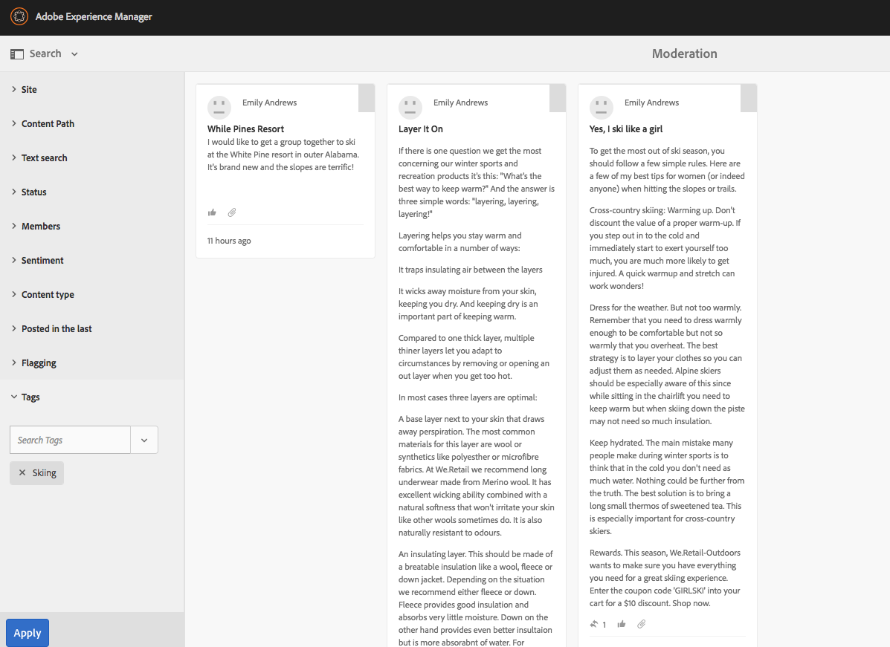

# 審核控制台 {#moderation-console}

在AEM Communities, [社區內容的調節](/help/communities/moderate-ugc.md) 管理員和社區審閱人（被指派為審閱人的受信任社區成員）在作者和發佈環境中都可能提供。

管理員和社區管理員也可以執行 [上下文內節制](/help/communities/in-context.md) 的子菜單。

所有功能 [社區站點](/help/communities/sites-console.md) 是 `Administration` 菜單項可供具有管理權限登錄的用戶使用。 的 `Administration` 連結提供對Moderation控制台的訪問。

從「審核」控制台，管理員和社區審核人員將有權訪問他們有權對其進行審核的所有用戶生成內容(UGC)。 如果允許對多個站點進行中調，則可以查看所有站點的帖子或按所選社區站點進行篩選。

有關詳細資訊，請訪問 [管理用戶和用戶組](/help/communities/users.md)。

「審核」控制台支援：

* 批量執行審核任務。
* 正在搜索UGC。
* 查看UGC詳細資訊。
* 查看UGC作者詳細資訊。

僅當以管理員或成員身份登錄時 ` [moderator permissions](/help/communities/in-context.md#identifyingtrustedmembers)`，可以執行緩和任務。

## 發佈環境訪問 {#publish-environment-access}

從已發佈的社區站點訪問「審核」控制台是通過「管理」連結，該連結在社區版主登錄時顯示。

通過選擇「管理」(Administration)連結，將顯示「審核」(Moderation)控制台：

## 作者環境訪問 {#author-environment-access}

在作者環境中，要訪問Moderation控制台

* 從全局導航中，選擇 **[!UICONTROL 社區]** > **[!UICONTROL 審核]**。

僅當以管理員或成員身份登錄時 [版權](/help/communities/in-context.md#identifyingtrustedmembers)，可以執行緩和任務。 顯示的唯一社區內容是允許登錄成員中間的內容。

>[!NOTE]
>
>只有在所選SRP實現公共儲存時，發佈環境中的UGC才對作者可見。 例如，預設情況下，儲存是JSRP，它不是作者和發佈的常用儲存。 請參閱 [社區內容儲存](/help/communities/working-with-srp.md)。

## 審核控制台UI {#moderation-console-ui}

除左導航欄（在作者上顯示，但在發佈上不顯示）外，審核UI有以下主要區域：

* **[頂部導航欄](#top-navigation-bar)**
* **[工具列](#toolbar)**
* **[內容區域](#content-area)**

### 頂部導航欄 {#top-navigation-bar}

所有控制台的頂部導航欄都保持不變。 有關詳細資訊，請參見 [基本處理](/help/sites-authoring/basic-handling.md)。

### 工具列 {#toolbar}

位於頂部導航欄下方的工具欄在左側提供以下切換開關：

* [濾軌](/help/communities/moderation.md#filterrail)
開啟一個滑軌，該滑軌允許選擇用於過濾內容的屬性。

位於頂部導航欄下方的工具欄在左側提供以下切換開關：

[濾軌](/help/communities/moderation.md#filterrail)
在選擇「搜索」時開啟一個導軌，該導軌允許選擇要過濾內容的屬性。

### 內容區域 {#content-area}

內容區域包含已發佈UGC的資訊：

* UGC已發佈
* 成員名稱
* 成員虛擬形象
* 帖子的位置。
* 發佈時。
* 對帖子的答複數。
* [情緒](/help/communities/moderate-ugc.md#sentiment) 與帖子關聯
* 如果批准，則顯示複選標籤。
* 如果有附件，則顯示回形針。

>[!NOTE]
> 
>內容區域具有 *無限滾動*，這意味著您可以繼續滾動，直到您到達內容的末尾。 即使在滾動時，工具欄仍位於內容區域上方的固定可見位置。

### 過濾導軌 {#ootbfilters}

側面板表徵圖開啟濾鏡導軌。 顯示在內容區域左側的過濾器導軌提供不同的過濾器，每個過濾器對出現在內容區域中的被引用的UGC具有直接影響。

每個類別中的篩選器 **或** d合在一起，不同類別的篩選器 **和**&#x200B;一起。

例如，如果同時檢查 **問題** 和 **答案**，您將看到 **問題** *或* 一個 **答案**。

但是，如果您 **問題** 和 **待定**，您只能看到 **問題** 和 **待定**。

>[!NOTE]
>
>社區審閱人可以將預定義的篩選器加入審核控制台UI的書籤。 當這些篩選器被附加到URL的末尾（作為查詢字串參數）時，審閱人可以稍後返回到已書籤的篩選器，並且還可以共用這些連結。

當濾鏡導軌開啟時，「搜索」表徵圖將切換側面板關閉。 但是，要關閉篩選器導軌並僅查看用戶生成的內容，請按一下「搜索」表徵圖並選擇「僅內容」選項。

#### 內容路徑 {#content-path}

內容路徑將顯示到指定內容儲存庫中的帖子的引用UGC限制。

#### 測試搜尋 {#text-search}

文本搜索將所引用的UGC限制為包含輸入文本的帖子。

#### 網站 {#site}

站點將所引用的UGC限制為發佈到所選社區站點。 如果未選中任何站點，則顯示對UGC的所有引用。

>[!NOTE]
>
>當管理員訪問批量審核控制台時，將顯示對UGC的所有引用，包括未使用 [站點建立嚮導](/help/communities/sites-console.md)，例如Geometrixx樣本。
>
>當受信任的社區成員在發佈時訪問批量審核控制台時，僅顯示對為該成員被授權進行中等處理的社區站點建立的UGC的引用，並且可以使用「站點」過濾器進行過濾。

#### 內容類型 {#content-type}

內容類型將所引用的UGC限制為所選資源類型的帖子。 可以選擇以下一種或多種類型。 如果未選擇任何類型，則顯示所有類型。

* **評論**
* **論壇主題**
* **論壇回覆**
* **QnA 問題**
* **QnA 答案**
* **部落格文章**
* **部落格評論**
* **日曆事件**
* **行事曆評論**
* **檔案資料庫資料夾**
* **檔案資料庫文件**
* **創意**
* **創意力評論**

#### 其他內容類型 {#additional-content-types}

要添加要篩選的其他資源，請執行以下操作：

* 以管理員身份登錄到作者實例。
* 開啟 [Web控制台](https://localhost:4502/system/console/configMgr)。
* 定位 `AEM Communities Moderation Dashboard Filters`。
* 選擇要在編輯模式下開啟的配置。
* 輸入要篩選的元件的ResourceType:

   * 例如，要篩選包含的投票元件，請輸入：

      `Voting=social/tally/components/hbs/voting`
   

* 選取儲存。
* 刷新「社區 — 審核」控制台。

結果是用於 `Voting` 下 `Content Type` 篩選器組。

選擇該篩選器後，儀表板的內容將顯示與輸入的任何ResourceTypes相匹配的UGC。

#### 狀態 {#status}

狀態將所引用的UGC限制為所選狀態的帖子，這些帖子可能是「待定」、「已批准」、「拒絕」或「已關閉」中的一個或多個，以及「部落格草稿」或「已計畫」，以及「QnA問題已答或未答」。 如果未選擇任何選項，則顯示所有選項。

>[!NOTE]
>
>如果僅選擇「未應答」狀態，則版主將看到除已回答問題外的所有內容（適用於所有內容類型）。 這是因為在未回答問題和其他內容（如論壇主題、部落格或評論）的情況下，不存在負責回答問題的屬性。

#### 標幟 {#flagging}

標籤將所引用的UGC限制為標籤或隱藏的帖子。

一條內容被標籤後，它將保持標籤，直到您通過選擇 **標誌** 按鈕。 請注意，不存在標籤級別，如重要或後續。

#### 成員 {#members}

成員將所引用的UGC顯示限制為由輸入的成員名稱過帳的UGC。

#### 發佈於前一 {#posted-in-the-last}

Posted In the Last（在最後一個中）將引用的UGC限制為在最後一小時、一天、周、月或年內發佈的帖子。

#### 情緒 {#sentiment}

[情緒](/help/communities/moderate-ugc.md#sentiment) 將引用的UGC顯示到情緒值為正、負或中性的帖子。

## 自定義篩選器 {#custom-filters}

除框外的濾鏡外， [過濾導軌](/help/communities/moderation.md#ootbfilters)，可以將元資料上的其他自定義篩選器添加到審核UI。 開發人員可以使用Github中的示例代碼來擴展現有的審核UI篩選器。

的 [示例項目](https://github.com/Adobe-Marketing-Cloud/aem-communities-extensions/tree/main/aem-communities-moderation-filter) 在Github上實現標籤過濾器，以根據特定標籤是否應用於用戶生成的內容來過濾UGC清單。 您可以遵循示例代碼，並為其他類似的UGC元資料欄位構建類似的篩選器。

要安裝「標籤」過濾器的示例：

1. 在AEM作者上開啟包管理器(`https://[aem-author]:4502/crx/packmgr/index.jsp`)實例和AEM發佈(`https://[aem-publish]:4503/crx/packmgr/index.jsp`)實例。
1. 生成包 `com.adobe.social.sample.moderation.filter.ui.apps-1.0-SNAPSHOT.zip` 從Github代碼中，安裝並啟用該代碼。
1. 在AEM作者上開啟捆綁控制台( `https://[aem-author]:4502/system/console/bundles`)實例和AEM發佈( `https://[aem-publish]:4503/system/console/bundles`)實例。
1. 生成包(`[com](https://sample-moderation-filter.com/).adobe.social.sample.moderation.filter.core-1.0-SNAPSHOT.jar`)，並安裝並啟用。
1. 轉到 **/apps/social/moderation/facets** AEM作者上的節點(`https://[aem-author]:4502/crx/de/index.jsp#/apps/social/moderation/facets`)和AEM發佈(`https://[aem-publish]:4502/crx/de/index.jsp#/apps/social/moderation/facets`)實例。
1. 添加技術用戶 **社區效用讀取器** 與 `jcr:read` 權限。

要公開現有社區站點上的自定義篩選器：

1. 編輯 `Clientlibs` 現有審核頁 `/content/we-retail/us/en/community/moderation/shell3/jcr:content/head/clientlibs.`

   * 添加新類別 `cq.social.hbs.moderation.v2.`

1. 前往 `/content/we-retail/us/en/community/moderation/shell3/jcr:content/rails/searchWell/items/filters.`

   * 設定為新元件 `sling:resourceType = social/moderation/v2/filters.`

1. 前往 `/content/we-retail/us/en/community/moderation/shell3/jcr:content/views/content/items/modcontainer`.

   * 設定為新元件 `sling:resourceType = social/moderation/v2/modcontainer`。

## 審核操作 {#moderation-actions}

[審核操作](/help/communities/moderate-ugc.md#moderation-actions) 可以在內容區域或查看內容詳細資訊時對一個或多個選項執行。

要批量調整帖子，請在內容區域中按一下選擇()表徵圖，該表徵圖顯示在滑鼠（案頭）懸停於其上，或按住手指（移動）。 通過此操作，您將進入多選模式，現在只需按一下這些帖子即可選擇要批量審核的後續帖子。 使用工具欄上顯示的按鈕對所選帖子執行審核操作。 所有操作都將提示確認。

要調整內容區域中的單個帖子，請用滑鼠（案頭）將滑鼠懸停在該帖子上，或按住帖子（移動）上的手指，使按鈕顯示在帖子上。 在單個內容詳細資訊上操作時，只有刪除操作會提示確認。

### 調整多個帖子 {#moderating-multiple-posts}

通過按一下 `Select` 表徵圖：

要退出批量選擇模式，請選擇工具欄上的「取消」(x)表徵圖：

可以對多個帖子執行的審核操作包括：

* 拒絕
* 刪除
* 關閉/重新開啟帖子

僅當選擇了多個帖子時，允許這些操作的表徵圖才會出現在工具欄上。

### 調整單個帖子 {#moderating-a-single-post}

在單選模式下，可以：

* 通過選擇用戶名查看用戶詳細資訊。
* 通過選擇帖子的連結查看帖子的上下文。
* [回覆](#reply)
* [允許](#allow)
* [拒絕](#deny)
* [刪除](#delete)
* [關閉](#close)
* 視圖 [審核歷史記錄](#moderation-history)
* [檢視詳情](#viewdetails)

在卡視圖上方顯示的審核操作表徵圖是帖子的文本，下面顯示的資料表示：

* 如果它有答復，如果有，則在答複數之前。
* 如果已標籤。
* 如果已經批准。
* UGC發佈時。

#### 回覆 {#reply}

使用單個帖子時，如果UGC類型支援回復並配置為允許回復，則將顯示「回復」表徵圖。

#### 允許 {#allow}

使用單個帖子時，當已標籤或拒絕該帖子時，將顯示「允許」表徵圖。 如果已標籤，則選擇「允許」將清除所有標誌。

#### 拒絕 {#deny}

的 **拒絕** 「審核」操作僅適用於已審核的內容，除非在多選模式下，否則不會顯示在未審核的內容上。

未審核的內容始終會被批准。

已審核的內容最初進入「待處理」狀態，稍後可修改為批准或拒絕。

離開掛起狀態的內容永遠不能返回到掛起狀態。 標籤為已批准或拒絕的內容可以隨時更改為其他狀態。

#### 刪除 {#delete}

在單個選取或批量模式下，可以選取項目並將其刪除。 刪除操作將導致確認對話框。 刪除後，這些項目會立即從內容區域消失。 **刪除UGC後，它將從儲存庫中永久刪除，以後無法檢索**。

#### 關閉 {#close}

使用單個帖子時，如果UGC類型支援阻止該資源進一步發佈的功能，則會顯示「關閉」表徵圖。

#### 審核歷史記錄 {#moderation-history}

使用單個帖子時，懸停在其上方時將顯示「審核歷史記錄」表徵圖。 選擇該表徵圖將顯示一個窗格，其中包含對UGC帖子所執行操作的歷史記錄。

要返回到多個UGC帖子的內容區顯示，請選擇視圖詳細資訊窗格右上角的X。

例如：

#### 檢視詳細資料 {#view-detail}

使用單個帖子時，可以通過以詳細模式開啟UGC來查看更多詳細資訊。

為此，請將滑鼠懸停在帖子上以顯示 `View Detail` 表徵圖，然後選擇它以顯示包含帖子詳細資訊的面板。

要返回到多個UGC帖子的內容區顯示，請選擇視圖詳細資訊窗格右上角的X。

例如：

