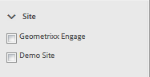
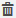

# 協調控制台 {#moderation-console}

在AEM Communities中，管理員和社群協調者（指派為協調者的受信任社群成員）可從製作和發佈環境中大量協調社群內容[。](/help/communities/moderate-ugc.md)

管理員和社群協調者也可以在發佈環境中執行[內文協調](/help/communities/in-context.md)。

所有[社群網站](/help/communities/sites-console.md)的功能是`Administration`功能表項目，可供具有管理權限登入的使用者使用。 `Administration`連結提供對協調控制台的存取。

從「協調」控制台，管理員和社群協調者將有權存取所有使用者產生的內容(UGC)，且他們有權協調這些內容。 如果允許協調多個網站，則可以檢視所有網站的貼文，或依所選社群網站進行篩選。

有關更多詳細資訊，請訪問[管理用戶和用戶組](/help/communities/users.md)。

「協調」控制台支援：

* 大量執行協調工作。
* 正在搜索UGC。
* 查看UGC詳細資訊。
* 檢視UGC作者詳細資訊。

只有以管理員或` [moderator permissions](/help/communities/in-context.md#identifyingtrustedmembers)`成員身分登入後，才可執行協調任務。

## 發佈環境存取 {#publish-environment-access}

從已發佈的社群網站存取「協調」主控台是透過管理連結，此連結會在社群協調者登入時顯示。

選取「管理」連結後，會顯示「協調」主控台：

## 製作環境存取 {#author-environment-access}

在製作環境中，若要進入「協調」主控台

* 在全域導覽中，選取&#x200B;**[!UICONTROL Communities]** > **[!UICONTROL Moderation]**。

只有以管理員身分登入，或以[協調者權限](/help/communities/in-context.md#identifyingtrustedmembers)的成員身分登入時，才能執行協調工作。 顯示的唯一社區內容是允許登錄的成員協調的社區內容。

>[!NOTE]
>
>只有當選擇的SRP實作通用商店時，發佈環境中的UGC才會顯示於作者。 例如，預設情況下，儲存為JSRP，這不是製作和發佈的常見存放區。 請參閱[社群內容儲存](/help/communities/working-with-srp.md)。

## 協調控制台UI {#moderation-console-ui}

除了左側導覽邊欄（顯示在作者上，但不顯示在發佈上）之外，協調UI有下列主要區域：

* **[頂端導覽列](#top-navigation-bar)**
* **[工具列](#toolbar)**
* **[內容區域](#content-area)**

### 頂端導覽列 {#top-navigation-bar}

所有主控台的頂端導覽列都為常數。 如需詳細資訊，請參閱[基本處理](/help/sites-authoring/basic-handling.md)。

### 工具列 {#toolbar}

工具列位於頂端導覽列下方，在左側提供下列切換開關：

* [篩](/help/communities/moderation.md#filterrail)
選欄會開啟邊欄，供您選擇要篩選內容的屬性。

工具列位於頂端導覽列下方，在左側提供下列切換開關：

[篩](/help/communities/moderation.md#filterrail)
選欄會在選取「搜尋」時開啟邊欄，供您選擇要篩選內容的屬性。

### 內容區域 {#content-area}

內容區域包含已發佈UGC的資訊：

* UGC已發佈
* 成員名稱
* 成員頭像
* 貼文的位置。
* 發佈時。
* 貼文的回覆次數。
*  與貼文相關聯的情緒
* 如果已核准，則會顯示核取記號。
* 如果有附件，則顯示回形針。

>[!NOTE]
> 
>內容區域具有&#x200B;*無限捲動*，這意味著它允許您繼續滾動，直到達到內容的結尾。 即使在捲動時，工具列仍停留在內容區域上方的固定可見位置。

### 篩選邊欄 {#ootbfilters}

側面板圖示會開啟篩選邊欄。 顯示在內容區域左側的篩選欄會提供不同的篩選器，每個篩選器都對顯示在內容區域中的參考UGC有立竿見影的效果。

每個類別中的篩選器是&#x200B;**OR**&#39;d，不同類別中的篩選器是&#x200B;**AND**&#39;d。

例如，如果您同時檢查&#x200B;**問題**&#x200B;和&#x200B;**答案**，您會看到內容為&#x200B;**問題** *或* **答案**。

但是，如果檢查&#x200B;**Question**&#x200B;和&#x200B;**Pending**，您將只看到&#x200B;**Question**&#x200B;且為&#x200B;**Pending**&#x200B;的內容。

>[!NOTE]
>
>社群協調者可在協調控制台UI上將預先定義的篩選器加入書籤。 當這些篩選器附加至URL的結尾時（作為查詢字串參數），協調者稍後可以返回已建立書籤的篩選器，也可以共用這些連結。

當篩選邊欄開啟時，「搜尋」圖示會切換側面板關閉。 不過，若要關閉篩選邊欄並僅檢視使用者產生的內容，請按一下「搜尋」圖示並選取「僅限內容」選項。

#### 內容路徑 {#content-path}

「內容路徑」會限制顯示給放置在指定內容存放庫之貼文的參考UGC。

#### 測試搜尋 {#text-search}

文字搜尋會限制對包含輸入文字之貼文顯示的參考UGC。

#### 網站 {#site}

網站會限制所選社群網站貼文所顯示的參考UGC。 如果未核取任何網站，則會顯示所有UGC的參考。

>[!NOTE]
>
>當管理員存取大量協調控制台時，會顯示對UGC的所有參考，包括未透過[網站建立精靈](/help/communities/sites-console.md)建立的網站，例如Geometrixx範例。
>
>當受信任的社群成員在發佈時存取大量協調主控台時，系統只會顯示針對該成員獲授權協調之社群網站所建立之UGC的參考，並可使用網站篩選器加以篩選。

#### 內容類型 {#content-type}

內容類型會限制所選資源類型之貼文所顯示的參考UGC。 可以選擇以下一種或多種類型。 如果未選取任何類型，則會顯示所有類型。

* **評論**
* **論壇主題**
* **論壇回覆**
* **QnA 問題**
* **QnA 答案**
* **部落格文章**
* **部落格評論**
* **日曆事件**
* **行事曆評論**
* **檔案資料庫資料夾**
* **檔案資料庫文件**
* **創意**
* **創意力評論**

#### 其他內容類型 {#additional-content-types}

若要新增要篩選的其他資源：

* 以管理員身分登入您的製作執行個體。
* 開啟[Web控制台](https://localhost:4502/system/console/configMgr)。
* 找到`AEM Communities Moderation Dashboard Filters`。
* 選取要在編輯模式中開啟的設定。
* 輸入要對其進行篩選的元件的ResourceType:

   * 例如，要篩選包含的投票元件，請輸入：

      `Voting=social/tally/components/hbs/voting`
   

* 選擇「保存」。
* 重新整理Communities — 協調主控台。

結果是`Content Type`篩選組下的`Voting`新的可選篩選器。

選取該篩選器時，控制面板的內容將顯示UGC，該UGC符合任何輸入的ResourceType。

#### 狀態 {#status}

狀態限制所引用的UGC顯示給選定狀態的帖子，這些帖子可能是「待定」、「已批准」、「拒絕」或「已關閉」中的一個或多個，以及「為部落格文章草稿」或「已排程」、「QnA問題已回答」或「未回答」中的一個。 如果未選取任何項目，則會顯示所有項目。

>[!NOTE]
>
>如果僅選擇「未應答」狀態，則版主將看到除已應答問題之外的所有內容（適用於所有內容類型）。 這是因為，在未回答的問題和其他內容（如論壇主題、部落格文章或評論）中，不存在負責「已答問題」的屬性。

#### 標幟 {#flagging}

標幟會限制所顯示的參考UGC會被標幟或隱藏的貼文。

標籤內容後，它會保持標籤狀態，直到您再次選擇&#x200B;**Flag**&#x200B;按鈕以取消該內容的標籤為止。 請注意，沒有標幟層級，例如重要或後續動作。

#### 成員 {#members}

成員限制所輸入的成員名稱所過帳的被引用的UGC顯示為UGC。

#### 發佈於前一 {#posted-in-the-last}

「在上次發佈」限制會將參考的UGC顯示於在最後一小時、一天、一週、一個月或一年內發佈的貼文。

#### 情緒 {#sentiment}

 情緒會以正面、負面或中性的情緒值，限制對貼文顯示的參考UGC。

## 自訂篩選器 {#custom-filters}

除了[篩選邊欄](/help/communities/moderation.md#ootbfilters)中的現成篩選器外，您也可以將其他中繼資料的自訂篩選器新增至協調UI。 開發人員可使用Github中的范常式式碼，以擴充現有的協調UI篩選條件。

Github上的[範例專案](https://github.com/Adobe-Marketing-Cloud/aem-communities-extensions/tree/main/aem-communities-moderation-filter)會實作「標籤」篩選，以根據特定標籤是否套用至使用者產生的內容來篩選UGC清單。 您可以遵循范常式式碼，並為其他類似的UGC中繼資料欄位建立類似的篩選器。

若要安裝標籤篩選器的範例：

1. 在AEM Author(`https://[aem-author]:4502/crx/packmgr/index.jsp`)例項和AEM Publish(`https://[aem-publish]:4503/crx/packmgr/index.jsp`)例項上開啟套件管理器。
1. 從Github程式碼建立套件`com.adobe.social.sample.moderation.filter.ui.apps-1.0-SNAPSHOT.zip`，然後安裝並啟用相同的套件。
1. 在AEM Author(`https://[aem-author]:4502/system/console/bundles`)例項和AEM Publish(`https://[aem-publish]:4503/system/console/bundles`)例項上開啟套件組合主控台。
1. 從Github建置套件(`[com](https://sample-moderation-filter.com/).adobe.social.sample.moderation.filter.core-1.0-SNAPSHOT.jar`)，並安裝並啟用相同的套件。
1. 前往AEM Author(`https://[aem-author]:4502/crx/de/index.jsp#/apps/social/moderation/facets`)和AEM Publish(`https://[aem-publish]:4502/crx/de/index.jsp#/apps/social/moderation/facets`)例項上的&#x200B;**/apps/social/moderation/facets**&#x200B;節點。
1. 新增具有`jcr:read`權限的技術使用者&#x200B;**communities-utility-reader**。

要公開現有社群網站上的自訂篩選器：

1. 編輯現有協調頁面`/content/we-retail/us/en/community/moderation/shell3/jcr:content/head/clientlibs.`的`Clientlibs`

   * 添加新類別`cq.social.hbs.moderation.v2.`

1. 前往 `/content/we-retail/us/en/community/moderation/shell3/jcr:content/rails/searchWell/items/filters.`

   * 設為新元件`sling:resourceType = social/moderation/v2/filters.`

1. 前往 `/content/we-retail/us/en/community/moderation/shell3/jcr:content/views/content/items/modcontainer`.

   * 設為新元件`sling:resourceType = social/moderation/v2/modcontainer`。

## 協調動作 {#moderation-actions}

[在內](/help/communities/moderate-ugc.md#moderation-actions) 容區域中進行的一或多個選取項目，或在檢視內容詳細資料時，可執行協調動作掃描。

若要大量協調貼文，在內容區域中按一下貼文上的「選取」()圖示，該圖示會以滑鼠（案頭）將游標暫留在貼文上，或按住貼文上的手指（行動裝置）。 這樣，您就會進入多選模式，現在只要按一下，即可選取要大量協調的後續貼文。 使用工具列上顯示的按鈕，對選取的貼文執行協調動作。 所有動作都會提示進行確認。

若要協調內容區域中的單一貼文，請用滑鼠（案頭）將滑鼠移到貼文上，或按住貼文（行動）上的手指，使貼文上顯示按鈕。 對單一內容詳細資料執行作業時，只有刪除動作會提示進行確認。

### 協調多個貼文 {#moderating-multiple-posts}

按一下貼文上的`Select`圖示，進入大量選取模式：

若要退出大量選取模式，請選取工具列上的取消(x)圖示：

可對多則貼文執行的協調動作為：

* 拒絕
* 刪除
* 關閉/重新開啟貼文

只有選取多個貼文時，工具列才會顯示允許這些動作的圖示。

### 協調單一貼文 {#moderating-a-single-post}

在單選模式中，可以：

* 通過選擇用戶名查看用戶詳細資訊。
* 選取貼文的連結，即可在內容中檢視貼文。
* [回覆](#reply)
* [允許](#allow)
* [拒絕](#deny)
* [刪除](#delete)
* [關閉](#close)
* 檢視[協調歷史記錄](#moderation-history)
* [檢視詳情](#viewdetails)

仲裁動作圖示上方的卡片檢視上顯示的是貼文的文字，下方則是指出：

* 如果它有答復，如果有，則前面加上答複數。
* 如果已標籤。
* 如果已核准。
* UGC發佈時。

#### 回覆 {#reply}

處理單一貼文時，如果UGC類型支援回覆，且設定為允許回覆，則會顯示回覆圖示。

#### 允許 {#allow}

使用單一貼文時，當貼文遭到標籤或拒絕時，「允許」圖示會出現。 如果已標籤，選取「允許」將會清除所有標幟。

#### 拒絕 {#deny}

**拒絕**&#x200B;協調動作僅適用於已協調的內容，除非在多選模式中，否則不會出現在未協調的內容上。

未協調的內容一律會獲核准。

經協調的內容最初進入「待定」狀態，之後可修改為核准或拒絕。

離開擱置狀態的內容永遠無法傳回擱置狀態。 標示為已核准或拒絕的內容可隨時變更為不同狀態。

#### 刪除 {#delete}

在單一選取或大量模式中，您可以選取項目並加以刪除。 刪除動作會產生確認對話方塊。 刪除後，這些項目會立即從內容區域中消失。 **UGC一旦刪除，就會從存放庫中永久移除，之後將無法擷取**。

#### 關閉 {#close}

使用單一貼文時，如果UGC類型支援防止該資源進一步貼文的功能，則會顯示「關閉」圖示。

#### 審核歷史記錄 {#moderation-history}

處理單一貼文時，將滑鼠游標暫留在該貼文上時，會顯示「協調歷程記錄」圖示。 選取圖示會顯示一個窗格，其中包含針對UGC貼文所採取動作的歷史記錄。

若要返回顯示多個UGC貼文的內容區域，請在檢視詳細資料窗格右上角選取X。

例如：

#### 檢視詳細資料 {#view-detail}

使用單一貼文時，可以以詳細模式開啟UGC來檢視更多詳細資訊。

若要這麼做，請將滑鼠指標暫留在貼文上以顯示`View Detail`圖示，並選取該圖示以顯示包含貼文詳細資料的面板。

若要返回顯示多個UGC貼文的內容區域，請在檢視詳細資料窗格右上角選取X。

例如：

