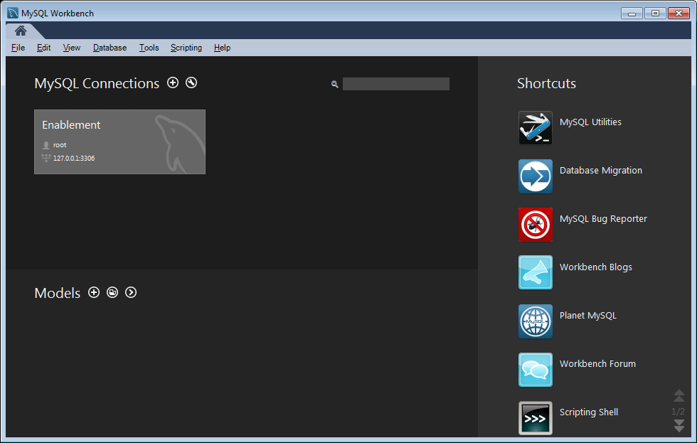

# 啟用功能的MySQL配置 {#mysql-configuration-for-enablement-features}

MySQL是關係資料庫，主要用於SCORM追蹤和報告啟用資源的資料。 其中包括追蹤視訊暫停/繼續等其他功能的表格。

這些說明說明如何連接到MySQL Server、建立啟用資料庫以及將初始資料填充到資料庫。

## 要求 {#requirements}

在配置MySQL for Communities啟用功能之前，請務必

* 安裝 [MySQL Server](https://dev.mysql.com/downloads/mysql/) 社區伺服器5.6版：
   * SCORM不支援5.7版。
   * 可能與製作AEM例項相同。
* 在所有AEM執行個體上，安裝 [MySQL的JDBC驅動程式](deploy-communities.md#jdbc-driver-for-mysql).
* 安裝 [MySQL Workbench](https://dev.mysql.com/downloads/tools/workbench/).
* 在所有AEM執行個體上，安裝 [SCORM套件](enablement.md#scorm).

## 安裝MySQL {#installing-mysql}

MySQL應按照目標作業系統的說明下載並安裝。

### 小寫表名 {#lower-case-table-names}

由於SQL不區分大小寫，因此對於區分大小寫的作業系統，必須包含一個設定來將所有表名都小寫。

例如，要指定Linux OS上所有小寫表名：

* 編輯檔案 `/etc/my.cnf`
* 在 `[mysqld]` 區段，新增下列行： `lower_case_table_names = 1`

### UTF8字元集 {#utf-character-set}

若要提供更好的多語言支援，必須使用UTF8字元集。

將MySQL更改為以UTF8作為其字元集：
* mysql >設定名稱&#39;utf8&#39;;

將MySQL資料庫更改為預設UTF8:
* 編輯檔案 `/etc/my.cnf`
* 在 `[client]` 部分，添加： `default-character-set=utf8`
* 在 `[mysqld]` 部分，添加： `character-set-server=utf8`

## 安裝MySQL Workbench {#installing-mysql-workbench}

MySQL Workbench提供了用於執行SQL指令碼的UI，這些指令碼安裝架構和初始資料。

MySQL Workbench應按照目標作業系統的說明下載並安裝。

## 啟用連線 {#enablement-connection}

MySQL Workbench首次啟動時（除非已用於其他用途），它將不會顯示任何連線：

### 新連接設定 {#new-connection-settings}

1. 選取右側的「+」圖示 `MySQL Connections`.
1. 在對話方塊中 `Setup New Connection`，輸入適合您的平台以進行示範的值，同一伺服器上為author AEM例項和MySQL :
   * 連接名： `Enablement`
   * 連接方法： `Standard (TCP/IP)`
   * 主機名： `127.0.0.1`
   * 使用者名稱: `root`
   * 密碼: `no password by default`
   * 預設架構： `leave blank`
1. 選擇 `Test Connection` 驗證與正在運行的MySQL服務的連接。

**附註**:
* 預設埠為 `3306`.
* 此 `Connection Name` 已輸入為 `datasource` 名稱 [JDBC OSGi配置](#configure-jdbc-connections).

#### 成功連接 {#successful-connection}

#### 新啟用連線 {#new-enablement-connection}

## 資料庫設定 {#database-setup}

開啟新的啟用連線時，請注意有測試結構和預設使用者帳戶。

### 獲取SQL指令碼 {#obtain-sql-scripts}

SQL指令碼是使用製作執行個體上的CRXDE Lite來取得。 此 [SCORM套件](deploy-communities.md#scorm) 必須安裝：

1. 瀏覽至CRXDE Lite:
   * 例如， [http://localhost:4502/crx/de](http://localhost:4502/crx/de)
1. 展開 `/libs/social/config/scorm/` 資料夾
1. 下載 `database_scormengine.sql`
1. 下載 `database_scorm_integration.sql`

下載架構的方法之一是：

* 選取 `jcr:content` sql檔案的節點。
* 請注意 `jcr:data` 屬性是檢視連結。
* 選取檢視連結，將資料儲存至本機檔案。

### 建立SCORM資料庫 {#create-scorm-database}

要建立的啟用SCORM資料庫是：

* 名稱: `ScormEngineDB`
* 從指令碼建立：
   * 結構描述: `database_scormengine.sql`
   * 資料： `database_scorm_integration.sql`
請依照下列步驟操作(
[open](#step-open-sql-file), [execute](#step-execute-sql-script))來安裝每個 [SQL指令碼](#obtain-sql-scripts) . [重新整理](#refresh) 以查看指令碼執行的結果。

安裝資料之前，請務必安裝架構。

>[!CAUTION]
>
>如果資料庫名稱已更改，請務必在中正確指定：
>
>* [JDBC配置](#configure-jdbc-connections)
>* [SCORM配置](#configure-scorm)

#### 步驟1:開啟SQL檔案 {#step-open-sql-file}

在MySQL Workbench中

* 從「檔案」(File)下拉菜單中
* 選取 `Open SQL Script ...`
* 按此順序，選擇以下選項之一：
   1. `database_scormengine.sql`
   1. `database_scorm_integration.sql`

#### 步驟2:執行SQL指令碼 {#step-execute-sql-script}

在「工作台」視窗中，針對在步驟1中開啟的檔案選取 `lightening (flash) icon` 來執行指令碼。

請注意，執行 `database_scormengine.sql` 建立SCORM資料庫的指令碼可能需要一分鐘才能完成。

#### 重新整理 {#refresh}

執行指令碼後，必須重新整理 `SCHEMAS` 區段 `Navigator` 以查看新資料庫。 使用「結構」右側的刷新表徵圖：

#### 結果：scorginedb {#result-scormenginedb}

安裝和重新整理結構描述後， `scormenginedb` 將會顯示。

## 配置JDBC連接 {#configure-jdbc-connections}

針對 **Day Commons JDBC連接池** 配置MySQL JDBC驅動程式。

所有發佈和製作AEM例項都應指向相同的MySQL伺服器。

當MySQL在與AEM不同的伺服器上運行時，必須在JDBC連接器中指定伺服器主機名來取代「localhost」(它將填充 [ScormEngine](#configurescormengineservice) 設定)。

* 在每個製作和發佈AEM例項上
* 以管理員權限登錄
* 存取 [Web主控台](../../help/sites-deploying/configuring-osgi.md)
   * 例如， [http://localhost:4502/system/console/configMgr](http://localhost:4502/system/console/configMgr)
* 找出 `Day Commons JDBC Connections Pool`
* 選取 `+` 建立新配置的表徵圖

   

* 輸入下列值：
   * **[!UICONTROL JDBC驅動程式類]**: `com.mysql.jdbc.Driver`
   * **DBC連接URIJ**: `jdbc:mysql://localhost:3306/aem63reporting` 如果MySQL伺服器與&#39;this&#39; AEM伺服器不同，請指定伺服器來取代localhost。
   * **[!UICONTROL 使用者名稱]**:為MySQL Server輸入配置的用戶名（如果不是「root」），則為root。
   * **[!UICONTROL 密碼]**:如果未為MySQL設定密碼，則清除此欄位，否則，請為MySQL用戶名輸入配置的密碼。
   * **[!UICONTROL 資料源名稱]**:為 [MySQL連接](#new-connection-settings)，例如「啟用」。
* 選取&#x200B;**[!UICONTROL 儲存]**。

## 配置Scorm {#configure-scorm}

### AEM Communities ScormEngine服務 {#aem-communities-scormengine-service}

針對 **AEM Communities ScormEngine服務** 配置SCORM以供啟用社區使用MySQL伺服器。

此設定會顯示於 [SCORM套件](deploy-communities.md#scorm-package) 已安裝。

所有發佈和製作實例都指向同一個MySQL伺服器。

當MySQL在與AEM不同的伺服器上運行時，必須在ScormEngine服務中指定伺服器主機名，以取代「localhost」，該「localhost」通常從 [JDBC連接](#configure-jdbc-connections) 設定。

* 在每個製作和發佈AEM例項上
* 以管理員權限登錄
* 存取 [Web主控台](../../help/sites-deploying/configuring-osgi.md)
   * 例如， [http://localhost:4502/system/console/configMgr](http://localhost:4502/system/console/configMgr)
* 找出 `AEM Communities ScormEngine Service`
* 選取編輯圖示

   

* 確認下列參數值與 [JDBC連接](#configurejdbcconnectionspool) 設定：
   * **[!UICONTROL JDBC連接URI]**: `jdbc:mysql://localhost:3306/ScormEngineDB` *ScormEngineDB* 是SQL指令碼中的預設資料庫名稱
   * **[!UICONTROL 使用者名稱]**:為MySQL Server輸入配置的用戶名（如果不是「root」），則為root
   * **[!UICONTROL 密碼]**:如果未為MySQL設定密碼，則清除此欄位，否則，請為MySQL用戶名輸入配置的密碼
* 關於下列參數：
   * **[!UICONTROL Scorm用戶密碼]**:不編輯

      僅供內部使用：供AEM Communities使用的特殊服務使用者與scorm引擎通訊。
* 選擇 **[!UICONTROL 儲存]**

### AdobeGranite CSRF篩選器 {#adobe-granite-csrf-filter}

為確保啟用課程在所有瀏覽器中皆可正常運作，必須將Mozilla新增為CSRF篩選器未勾選的使用者代理。

* 以管理員權限登入AEM發佈執行個體。
* 存取 [Web主控台](../../help/sites-deploying/configuring-osgi.md)
   * 例如， [http://localhost:4503/system/console/configMgr](http://localhost:4503/system/console/configMgr)
* 找出 `Adobe Granite CSRF Filter`.
* 選取編輯圖示。

   

* 選取 `[+]` 表徵圖添加安全用戶代理。
* 輸入 `Mozilla/*`.
* 選取&#x200B;**[!UICONTROL 儲存]**。
