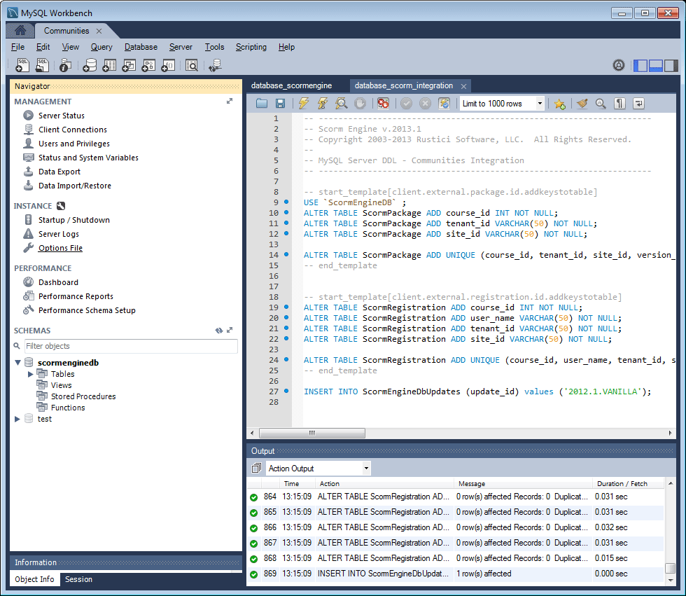

# MySQL啟用功能配置 {#mysql-configuration-for-enablement-features}

MySQL是關係型資料庫，主要用於SCORM追蹤和報告資料，以利啟用資源。 包含其他功能的表格，例如追蹤視訊暫停／繼續。

這些說明說明如何連接到MySQL伺服器、建立啟用資料庫，以及使用初始資料填充資料庫。

## 需求 {#requirements}

在配置MySQL for Communities啟用功能之前，請務必

* 安 [裝MySQL Server](https://dev.mysql.com/downloads/mysql/) Community Server 5.6版
   * SCORM不支援5.7版
   * 可能與作者AEM例項相同的伺服器
* 在所有AEM例項上，安裝MySQL的正式 [JDBC驅動程式](deploy-communities.md#jdbc-driver-for-mysql)
* 安裝 [MySQL工作台](https://dev.mysql.com/downloads/tools/workbench/)
* 在所有AEM例項上，安裝 [SCORM套件](enablement.md#scorm)

## 安裝MySQL {#installing-mysql}

MySQL應按照目標OS的說明下載並安裝。

### 小寫表名 {#lower-case-table-names}

由於SQL不區分大小寫，因此對於區分大小寫的作業系統，必須包含將所有表名都小寫的設定。

例如，要在Linux OS上指定所有小寫表名：

* 編輯檔案 `/etc/my.cnf`
* 在區 `[mysqld]` 段中，新增下列行：
   `lower_case_table_names = 1`

### UTF8字元集 {#utf-character-set}

為提供更佳的多語言支援，必須使用UTF8字元集。

將MySQL更改為以UTF8作為其字元集：
* mysql> SET NAMES &#39;utf8&#39;;

將MySQL資料庫變更為預設為UTF8:
* 編輯檔案 `/etc/my.cnf`
* 在區 `[client]` 段中，新增下列行：
   `default-character-set=utf8`
* 在區 `[mysqld]` 段中，新增下列行：
   `character-set-server=utf8`

## 安裝MySQL Workbench {#installing-mysql-workbench}

MySQL Workbench提供了一個UI，用於執行安裝模式和初始資料的SQL指令碼。

MySQL Workbench應按照目標OS的說明下載並安裝。

## 啟用連線 {#enablement-connection}

當MySQL工作台首次啟動時（除非已用於其他用途），它將不顯示任何連接：

### 新連線設定 {#new-connection-settings}

1. 選擇右側的「+」表徵圖 `MySQL Connections`。
1. 在對話方 `Setup New Connection`塊中，輸入適合您平台以進行展示的值，作者AEM例項和MySQL位於同一伺服器上：
   * 連接名稱： `Enablement`
   * 連接方法： `Standard (TCP/IP)`
   * Hostname: `127.0.0.1`
   * 使用者名稱: `root`
   * 密碼: `no password by default`
   * 預設方案： `leave blank`
1. 選 `Test Connection` 擇以驗證到正在運行的MySQL服務的連接

**附註**:

* 預設埠為 `3306`
* 在 `Connection Name` JDBC OSGi配置中輸 `datasource` 入所選 [的名稱](#configure-jdbc-connections)

#### 成功連接 {#successful-connection}

#### 新啟用連線 {#new-enablement-connection}

## 資料庫設定 {#database-setup}

開啟新的啟用連線時，請注意有測試架構和預設使用者帳戶。

### 獲取SQL指令碼 {#obtain-sql-scripts}

SQL指令碼是使用作者實例上的CRXDE Lite獲得的。 必 [須安裝SCORM](deploy-communities.md#scorm) 包：

1. 瀏覽至CRXDE Lite
   * 例如， [http://localhost:4502/crx/de](http://localhost:4502/crx/de)
1. 展開資料 `/libs/social/config/scorm/` 夾
1. 下載 `database_scormengine.sql`
1. 下載 `database_scorm_integration.sql`

下載架構的方法之一是

* 為sql文 `jcr:content`件選擇節點
* 請注意，屬性的 `jcr:data`值是檢視連結
* 選取檢視連結，將資料儲存至本機檔案

### 建立SCORM資料庫 {#create-scorm-database}

要建立的啟用SCORM資料庫是：

* 名稱: `ScormEngineDB`
* 從指令碼建立：
   * 結構描述: `database_scormengine.sql`
   * 資料：請依 `database_scorm_integration.sql`照下列步驟([開啟](#step-open-sql-file)，執 [行](#step-execute-sql-script))安裝每 [個SQL指令碼](#obtain-sql-scripts) 。 [必要時](#refresh) ，請重新整理以查看指令碼執行的結果。

請務必先安裝架構，然後再安裝資料。

>[!CAUTION]
>
>如果資料庫名稱已更改，請務必在
>
>* [JDBC配置](#configure-jdbc-connections)
>* [SCORM設定](#configure-scorm)
>

#### 步驟1:開啟SQL檔案 {#step-open-sql-file}

在MySQL工作台中

* 從「檔案」下拉菜單
* 選取 `Open SQL Script ...`
* 按此順序，選擇以下選項之一：
   1. `database_scormengine.sql`
   1. `database_scorm_integration.sql`

#### 步驟2:執行SQL指令碼 {#step-execute-sql-script}

在步驟1中開啟之檔案的「工作台」視窗中，選取要 `lightening (flash) icon` 執行指令碼的檔案。

請注意，執行腳 `database_scormengine.sql` 本以建立SCORM資料庫可能需要一分鐘的時間。

#### 重新整理 {#refresh}

執行指令碼後，必須刷新該 `SCHEMAS`部分才 `Navigator` 能查看新資料庫。 使用「方案」右側的刷新表徵圖：

#### 結果：scormenginedb {#result-scormenginedb}

在安裝和刷新SCHEMAS後，將顯示**`scormenginedb`**。

## 配置JDBC連接 {#configure-jdbc-connections}

Day Commons JDBC連接池的OSGi **配置** ，配置MySQL JDBC驅動程式。

所有發佈和作者AEM例項都應指向相同的MySQL伺服器。

當MySQL在與AEM不同的伺服器上執行時，必須在JDBC連接器中指定伺服器主機名稱，以取代&#39;localhost&#39;(這會填入  ScormEngine組態)。

* 在每個作者上並發佈AEM例項
* 以管理員權限登入
* 存取網 [路主控台](../../help/sites-deploying/configuring-osgi.md)
   * 例如， [http://localhost:4502/system/console/configMgr](http://localhost:4502/system/console/configMgr)
* 找到 `Day Commons JDBC Connections Pool`
* 選擇 `+` 表徵圖以建立新配置

* 輸入下列值：
   * **[!UICONTROL JDBC驅動程式類]**: `com.mysql.jdbc.Driver`
   * **DBC連接URIJ **:`jdbc:mysql://localhost:3306/aem63reporting`如果MySQL伺服器與&#39;this&#39; AEM伺服器不相同，請指定伺服器來取代localhost
   * **[!UICONTROL 使用者名稱]**:為MySQL伺服器輸入已配置的Root用戶名（如果不是「root」）
   * **[!UICONTROL 密碼]**:如果未為MySQL設定口令，請清除此欄位，否則，請輸入MySQL用戶名的配置口令
   * **[!UICONTROL 資料來源名稱]**:為 [MySQL連接輸入的名稱](#new-connection-settings)，例如「啟用」
* 選擇保 **[!UICONTROL 存]**

## 設定Scorm {#configure-scorm}

### AEM Communities ScormEngine服務 {#aem-communities-scormengine-service}

AEM Communities ScormEngine服務的OSGi設定 **** ，會針對啟用社群使用MySQL伺服器來設定SCORM。

安裝 [SCORM包時](deploy-communities.md#scorm-package) ，此配置存在。

所有發佈和作者實例都指向同一個MySQL伺服器。

當MySQL在與AEM不同的伺服器上執行時，必須在ScormEngine服務中指定伺服器主機名稱，而ScormEngine服務通常會從  JDBC連線設定中填入。

* 在每個作者上並發佈AEM例項
* 以管理員權限登入
* 存取網 [路主控台](../../help/sites-deploying/configuring-osgi.md)
   * 例如， [http://localhost:4502/system/console/configMgr](http://localhost:4502/system/console/configMgr)
* 找到 `AEM Communities ScormEngine Service`
* 選取編輯圖示
   
* 驗證以下參數值是否與 [JDBC連接配置一致](#configurejdbcconnectionspool) :
   * **[!UICONTROL JDBC連接URI]**: `jdbc:mysql://localhost:3306/ScormEngineDB` ScormEngineDB ** 是SQL指令碼中的預設資料庫名
   * **[!UICONTROL 使用者名稱]**:為MySQL伺服器輸入已配置的Root用戶名（如果不是「root」）
   * **[!UICONTROL 密碼]**:如果未為MySQL設定口令，請清除此欄位，否則，請輸入MySQL用戶名的配置口令
* 關於下列參數：
   * **[!UICONTROL Scorm使用者密碼]**:不要編輯

      僅供內部使用。 AEM Communities使用的特殊服務使用者可與Scorm引擎通訊。
* 選擇保 **[!UICONTROL 存]**

### Adobe Granite CSRF濾鏡 {#adobe-granite-csrf-filter}

為確保啟用課程在所有瀏覽器中都能正常運作，必須將Mozilla新增為未經CSRF篩選器勾選的使用者代理。

* 在每個發佈AEM例項上
* 以管理員權限登入
* 存取網 [路主控台](../../help/sites-deploying/configuring-osgi.md)
   * 例如， [http://localhost:4503/system/console/configMgr](http://localhost:4503/system/console/configMgr)
* 尋找 `Adobe Granite CSRF Filter`
* 選取編輯圖示
   
* 選擇要 `[+]` 添加安全用戶代理的表徵圖
* Enter `Mozilla/*`
* 選擇保 **[!UICONTROL 存]**

