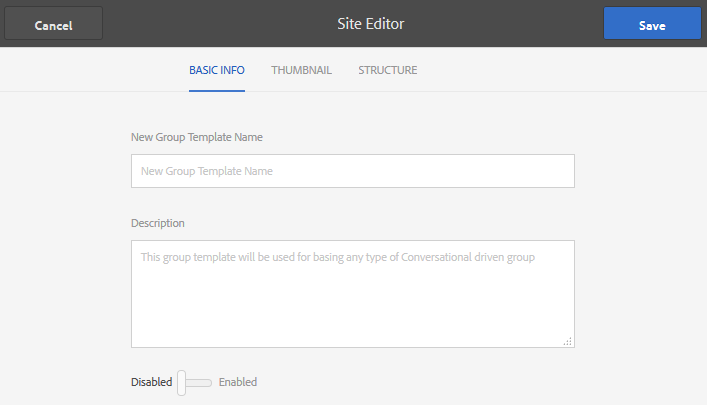

# 編寫巢狀群組{#authoring-nested-groups}

## 在作者上建立群組 {#creating-groups-on-author}

在AEM Author例項上，從全域導覽：

* 選擇**社群、網站。**
* 選擇 **Engage資料夾** ，將其開啟。
* 選取「快速入門教 **學課程英文版** 」網站的資訊卡。

   * 選取卡片影像。
   * 不 *要選* 取圖示。

其結果是可觸及「群 [組」主控台](/help/communities/groups.md):

群組函式將顯示為建立群組例項的資料夾。 選擇「群組」檔案夾以開啟它。 在發佈時建立的群組可見。

## Create Main Arts Group {#create-main-arts-group}

可以建立此組，因為參與的站點結構包括組功能。 網站中函式的設定預設為允 `Reference Template` 許選取任何啟用的群組範本。 因此，為此新群組選擇的範本為 `Reference Group`。

這些控制台與Communities Sites控制台類似。

* 選擇 **建立群組。**
* **社群群組範本**:

   * 社群群組標題：藝術。
   * 社群群組說明：不同藝術團體的父項團體。
   * 社群群組根：保 *留為預設值。*
   * 其他可用社群群組語言：使用下拉式功能表來選取可用的社群群組語言。 功能表會顯示建立父社群網站的所有語言。 使用者可在這些語言中選擇，以在此單一步驟中建立多個地區設定的群組。 在相應社群網站的「群組」主控台中，以多種指定語言建立相同的群組。
   * 社群群組名稱：藝術。
   * 範本：下拉式選擇 `Reference Group.`
   * `Select Next.`

使用下列設定，繼續檢視其他面板：

* **設計**

   * 變更設計或允許預設父網站的設計。
   * 選擇 **下一步。**

* **設定**

   * **審核**

      * 留空（繼承自父站點）。
   * **成員資格**

      * use default `Optional Membership.`
   * **縮圖**

      * `*optional.*`
   * `Select Next.`

* 選擇 **建立。**

### 藝術群組中的巢狀群組 {#nesting-groups-within-arts-group}

資料 `groups` 夾現在包含兩個群組（重新整理頁面）。

#### 發佈群組 {#publish-group}

在建立群組內巢狀的群 `arts`組之前，將滑鼠指標暫留在 `arts` 卡片上，並選取發佈圖示以進行發佈。

等候確認群組已發佈。

群 `arts` 組也應包含資料夾，但 `groups` 是資料夾是空的，而且可在其中建立新群組。 導覽至藝術群組資料夾並建立3個巢狀群組，每個群組具有不同的成員資格設定：

1. 視覺化

   * 標題: `Visual Arts`
   * 名稱: `visual`
   * 範本: `Reference Group`
   * 會籍：選擇 `Optional Membership`公用群組，開啟給所有成員

1. 聽覺

   * 標題: `Auditory Arts`
   * 名稱: `auditory`
   * 範本: `Reference Group`
   * 會籍：選 `Required Membership`擇開放群組，供成員加入

1. 歷史

   * 標題: `Art History`
   * 名稱: `history`
   * 範本: `Reference Group`
   * 會籍：選 `Restricted Membership`取僅對受邀會員可見的機密群組(例如，邀請 [示範使用者](/help/communities/tutorials.md#demo-users) ) `emily.andrews@mailinator.com`

重新整理頁面，查看所有三個巢狀群組（子社群）。

要從「社群站點」控制台導航到嵌套組，請執行以下操作：

* 選擇「參與」資料夾
* 選擇快速入門教學課程卡
* 選擇組資料夾
* 選擇藝術卡
* 選擇組資料夾

## 發佈群組 {#publishing-groups}

發佈主社群網站後：

* 個別發佈群組

   * 等候確認群組已發佈

* 在發佈巢狀內嵌的任何群組之前，先發佈父群組

   * 所有群組都必須以自上而下的方式發佈。

## 發佈體驗 {#experience-on-publish}

登入時，您可能會體驗不同的群組，例如與 [用於](/help/communities/tutorials.md#demo-users)

* 圖稿／歷史記錄組成員：emily.andrews@mailinator.com/密碼

   * 受限制的（機密）群組（藝術／歷史）可見
   * 可以看到可選（公用）群組
   * 可以加入受限制（開啟）的群組

* 群組管理員：aaron.mcdonald@mailinator.com/密碼

   * 可以看到可選（公用）群組
   * 可以加入受限制（開啟）的群組
   * 看不到受限制（機密）群組

訪問作者 [上的「社區成員」和](/help/communities/members.md) 「組」控制台，將其他用戶添加到與社區組對應的各種成員組。

