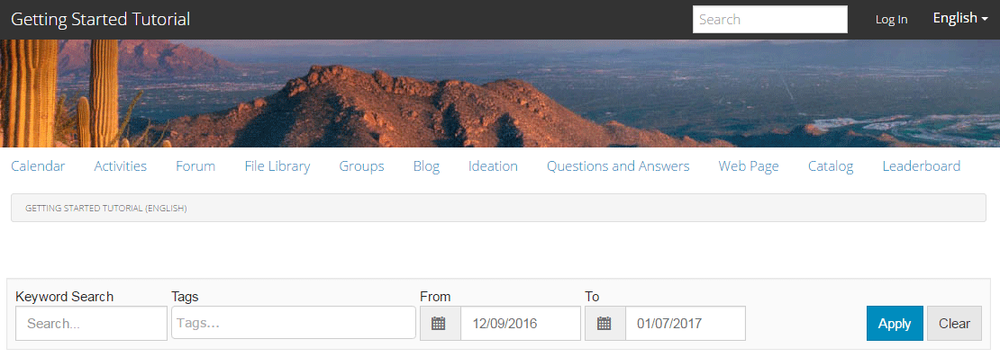

# 體驗已發佈的網站 {#experience-the-published-site}

## 在發佈時瀏覽到新站點 {#browse-to-new-site-on-publish}

現在新建立的社群網站已發佈完畢，請瀏覽至建立網站時顯示的URL，但在發佈伺服器上，例如：

* 作者URL = https://localhost:4502/content/sites/engage/en.html
* 發佈URL = https://localhost:4503/content/sites/engage/en.html

為了盡可能避免使用者對哪個成員在製作和發佈上登入的混淆，建議對每個例項使用不同的瀏覽器。

首次到達已發佈的網站時，網站訪客通常尚未登入，且為匿名。

`https://localhost:4503/content/sites/engage/en.html {#http-localhost-content-sites-engage-en-html}`

## 匿名網站訪客 {#anonymous-site-visitor}

匿名網站訪客在UI中看到下列內容：

* 網站標題（快速入門教學課程）
* 無個人資料連結
* 無消息連結
* 無通知連結
* 搜尋欄位
* 登入連結
* 品牌橫幅
* 「參考站點模板」中包含的元件的菜單連結。

如果您選取各種連結，您會發現這些連結處於唯讀模式。

### 在JCR上防止匿名訪問 {#prevent-anonymous-access-on-jcr}

已知限制會透過jcr內容和json向匿名訪客公開社群網站內容，不過 **允許匿名訪問** 已針對網站內容停用。 不過，您可以使用Sling限制來控制此行為，作為因應措施。

若要保護您的社群網站內容，不讓匿名使用者透過jcr內容和json存取，請遵循下列步驟：

1. 在AEM Author例項上，前往https://主機名稱：port/editor.html/content/site/sitename.html。

   >[!NOTE]
   >
   >請勿前往本地化網站。

1. 前往 **頁面屬性**.

   

1. 前往 **進階** 標籤。

1. 啟用 **驗證需求**.

   

1. 新增登入頁面的路徑。 例如， **/content/....../GetStarted**.
1. 發佈頁面。

## 受信任的社區成員 {#trusted-community-member}

此體驗假設 [阿隆·麥當諾](/help/communities/tutorials.md#demo-users) 已指派 [社群管理員和版主](/help/communities/create-site.md#roles). 否則，返回製作環境以 [修改站點設定](/help/communities/sites-console.md#modifying-site-properties) 選擇阿隆·麥當諾擔任社區經理和主持人。

在右上角選取 `Log in`，並使用使用者名稱(aaron.mcdonald@mailinator.com)和密碼（密碼）進行登入。 請注意使用Twitter或Facebook憑證登入的功能。

以註冊的社群成員身份登錄後，請注意以下菜單項，以點擊並瀏覽您的社群站點：

* **設定檔** 選項可讓您檢視和編輯您的設定檔。
* [訊息](/help/communities/configure-messaging.md) 選項會將您導向至直接傳訊區段，您可以在此：

   1. 檢視您收到的直接訊息（收件匣）、已傳送（已傳送項目）和已刪除（清除）。
   1. 撰寫新的直接訊息以傳送至個人和群組。

* [通知](/help/communities/notifications.md) 選項會將您導向通知區段，您可在此檢視感興趣的事件並編輯通知設定。
* [管理](/help/communities/published-site.md#moderationlink) 如果您有協調權限，會將您導向至「AEM Communities協調頁面」。

請注意，「日曆」頁面是首頁，因為選擇的「參考網站範本」會先包含「日曆」函式，接著是「活動資料流」函式、「論壇」函式等。 此結構可從 [網站範本](/help/communities/sites.md#edit-site-template) 主控台或修改製作環境中的網站屬性時：

>[!NOTE]
>
>如需Communities元件和功能的詳細資訊，請造訪：
>
>* [Communities元件](/help/communities/author-communities.md) （適用於作者）
>* [元件、功能和功能要點](/help/communities/essentials.md) （適用於開發人員）

### 論壇連結 {#forum-link}

通過選擇「論壇」連結查看基本論壇功能。

成員可以發佈新主題或關注主題。

網站訪客可檢視貼文，並以各種方式加以排序。

### 群組連結 {#groups-link}

由於Aaron是組管理員，因此選擇「組」連結將允許Aaron通過選擇組模板、影像、組是開啟還是秘密以及邀請成員來建立新的社區組。

這是在發佈環境中建立群組的範例。

群組也可在製作環境中建立，並在製作環境的社群網站內管理([社群群組主控台](/help/communities/groups.md))。 體驗 [建立作者群組](/help/communities/nested-groups.md) 是本教學課程的下一個。

建立參考群組：

1. 選擇 **新組**
1. **設定標籤**

   * 群組名稱 : `Sports`
   * 說明 : `A parent group for various sporting groups`.
   * 群組 URL 名稱 : `sports`
   * 選擇 `Open Group` （允許任何社區成員加入）

1. **範本索引標籤**

   * 選擇 `Reference Group` （在其結構中包含組函式以允許嵌套組）

1. 選擇 **建立群組**

   

建立新群組後， **選擇新的「運動」組** 以在其中建立兩個群組（巢狀）。 由於網站結構不能以群組功能開頭，因此在開啟「運動」群組後，必須選取「群組」連結：

第二組連結，開頭為 `Blog`，屬於目前選取的群組， `Sports` 群組。 選取「運動」 `Groups` 連結，則可在「運動」群組內巢狀內嵌兩個群組。

例如，新增兩個 `new groups`.

* 已確認 `Baseball`

   * 將其設為 `Open Group` （必要會籍）。
   * 在「模板」頁簽上，選擇 `Conversational Group`.

* 已確認 `Gymnastics`

   * 將其設定變更為 `Member Only Group` （限製成員資格）。
   * 在「模板」頁簽上，選擇 `Conversational Group`.

**注意**:

* 在顯示兩個群組之前，可能需要重新整理頁面。
* 此範本可 *not* 包含群組函式，因此將無法進一步巢狀群組。
* 在作者上， [群組主控台](/help/communities/groups.md) 提供第三種選擇 — a `Public Group` （可選成員資格）。

建立兩個群組後，請選取「棒球」群組、一個開啟的群組，並注意其連結：

`Discussions` `What's New` `Members`

群組的連結會顯示在主要網站的連結下方，並產生下列顯示結果：

在作者上 — 具有管理權限，導覽至 [Communities群組主控台](/help/communities/members.md) 然後把韋斯頓·麥考爾 `Community Engage Gymnastics <uid> Members` 群組。

繼續發佈，登出Aaron McDonald，並以匿名網站訪客的身分檢視運動群組：

* 從首頁
* 選擇 `Groups` 連結
* 選擇 `Sports` 連結
* 選取「運動」 `Groups` 連結

只有棒球群組會顯示。

以Weston McCall(weston.mccall@dodgit.com /密碼)登入，並導覽至相同位置。 注意韋斯頓能 `Join` 開啟 `Baseball` 群組與 `enter or Leave` 私人 `Gymnastics` 群組。

### 網頁連結 {#web-page-link}

通過選擇「網頁」連結查看網站中包含的基本網頁。 標準AEM製作工具可用來在製作環境中將內容新增至此頁面。

例如，前往 **作者** 例項，開啟 `engage` 檔案夾 [Communities Sites主控台](/help/communities/sites-console.md)，請選取 **開啟網站** 圖示以進入作者編輯模式。 然後選取預覽模式以選取 `Web Page` 連結，然後選取「編輯」模式以新增「標題」和「文字」元件。 最後，只重新發佈頁面或整個網站。

### 協調連結 {#moderationlink}

當社群成員擁有協調權限時，將會顯示「協調」連結，並選取該連結時，將會顯示已張貼的社群內容，並允許其顯示 [已審核](/help/communities/moderate-ugc.md) 與 [協調控制台](/help/communities/moderation.md) 在製作環境中。

使用瀏覽器的返回按鈕返回已發佈的網站。 發佈環境中無法從全域導覽存取大部分的主控台。

## 自註冊 {#self-registration}

登出後，可以建立新的使用者註冊。

* 選取 `Log In`
* 選取 `Sign up for a new account`

依預設，電子郵件地址為登入ID。 如果取消勾選，訪客可以輸入自己的登入id（使用者名稱）。 使用者名稱在發佈環境中必須是唯一的。

指定用戶名、電子郵件和密碼後，選擇 `Sign Up` 會建立使用者並讓他們簽署。

登入後，顯示的第一頁為 `Profile` 頁面，供他們個人化。

如果成員忘記了其登錄ID，則可以使用其電子郵件地址進行恢復。

