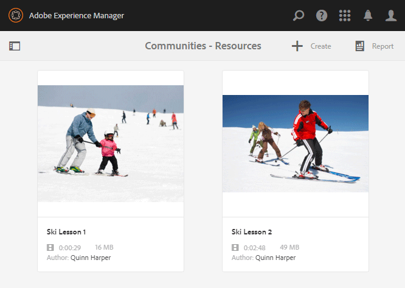

# 建立並分配啟用資源{#create-and-assign-enablement-resources}

## 添加啟用資源{#add-an-enablement-resource}

若要將啟用資源新增至新社群網站：

* 以系統管理員身分登入製作執行個體：
   * 例如， [http://localhost:4502/](http://localhost:4503/)
* 在全局導航中，選擇&#x200B;**[!UICONTROL Communities]** > **[!UICONTROL Resources]**

   

   
* 選擇要向其添加啟用資源的社區站點：
   * 選擇&#x200B;**[!UICONTROL 啟用教程]**。
* 從菜單中，選擇&#x200B;**[!UICONTROL Create]**。
* 選擇&#x200B;**[!UICONTROL 資源]**。

### 基本資訊 {#basic-info}

填寫資源的基本資訊：

* **[!UICONTROL 網站名稱]**

   設定為所選社區站點的名稱：啟用教學課程

* **[!UICONTROL 資源名稱(&amp;A);]**

   滑雪課程1

* **[!UICONTROL 標記]**

   教學課程：運動/滑雪

* **[!UICONTROL 在目錄中顯示]**

   將其設為&#x200B;**On**。

* **[!UICONTROL 說明]**

   在雪上滑行，初學者可以。

* **[!UICONTROL 新增影像]**

   添加影像以在其「分配」視圖中將資源表示給成員。

   

* 選擇&#x200B;**[!UICONTROL Next]**

### 新增內容 {#add-content}

雖然看起來好像可以選取多個資源，但僅允許一個資源。

選取右上角的`'+' icon`，以透過識別來源來開始選擇資源的程式。

上傳資源。 如果視訊資源，請上傳自訂影像以在視訊開始播放前顯示，或允許從視訊產生縮圖（可能需要幾分鐘時間 — 不需要等候）。

* 選擇&#x200B;**[!UICONTROL Next]**。

### 設定 {#settings}

* **[!UICONTROL 社會化設定]**

   保留預設設定，讓使用者在體驗上留下註解並評分啟用資源。

* **[!UICONTROL 到期日期]**

   *（可選）* 可以選擇完成分配的日期。

* **[!UICONTROL 資原作者]**

   *（選用）* 留空。

* **[!UICONTROL 資源聯繫人(&amp;A);]**

   *（必要）* 使用下拉菜單選擇成 `Quinn Harper`員。

* **[!UICONTROL 資源專家]**

   *（選用）* 留空。

   **注意**:如果用戶或組不可見，請檢查它們是否已添加到組中， `Community Enable Members` 並保 ** 存發佈實例。

   

* 選擇&#x200B;**[!UICONTROL Next]**

### 指定任務 {#assignments}

* **[!UICONTROL 新增被指定者]**

   保留未設定，因為此啟用資源將新增至學習路徑。 如果將學習者指派給個別輔助資源，以及包含輔助資源的學習路徑，則會將學習者指派給輔助資源兩次。

   

* 選擇&#x200B;**[!UICONTROL 建立]**

   

成功建立資源將返回到資源控制台，並選擇新建立的資源。 在此主控台中，可發佈、新增使用者及變更其他設定。

若要上傳新版本的啟用資源，建議您建立新資源，然後從舊版中取消註冊成員，並在新版本中註冊成員。

### 發佈資源{#publish-the-resource}

登記者必須先發佈，才能看到已分配的資源：

* 選取世界`Publish`圖示

已以成功訊息確認啟動：

## 添加第二個啟用資源{#add-a-second-enablement-resource}

重複上述步驟，建立並發佈第二個相關啟用資源，從中建立學習路徑。

**** 發佈第二個資源。

返回「啟用教學課程」的「資源」清單。

*提示：如果兩個資源都不可見，請重新整理頁面。*

## 添加學習路徑{#add-a-learning-path}

學習路徑是培訓資源的邏輯分組，構成課程。

* 在資源控制台中，選擇`+ Create`
* 選擇&#x200B;**[!UICONTROL 學習路徑]**

新增&#x200B;**[!UICONTROL 基本資訊]**:

* **[!UICONTROL 學習路徑名稱]**

   滑雪課

* **[!UICONTROL 標記]**

   教學課程：滑雪

* **[!UICONTROL 在目錄中顯示]**

   不選中

* **[!UICONTROL 上傳影像]**

   在資源控制台中表示學習路徑。

   

* 選擇&#x200B;**[!UICONTROL Next]**。

跳過下一個面板，因為沒有要添加的先決條件學習路徑。

* 選擇&#x200B;**[!UICONTROL Next]**

在「新增資源」面板上：

* 選擇`+ Add Resources`以選擇要添加到學習路徑的2個滑雪課程資源。

   注意：只能選取&#x200B;**已發佈**&#x200B;資源。

>[!NOTE]
>
>您只能選擇與學習路徑位於同一級別的可用資源。 例如，對於在組中建立的學習路徑，只有組級別資源可用；對於在社區站點中建立的學習路徑，該站點中的資源可用於添加到學習路徑。

* 選擇&#x200B;**[!UICONTROL Submit]**。

   

   

* 選擇&#x200B;**[!UICONTROL Next]**

   

* **[!UICONTROL 新增被指定者]**

   使用下拉菜單選擇`Community Ski Class`組，該組應包括成員`Riley Taylor`和`Sidney Croft.`

* **[!UICONTROL 學習路徑聯繫人(&amp;A);]**

   *（必要）* 使用下拉菜單選擇成 `Quinn Harper`員。

* 選擇 **[!UICONTROL 建立]**。

   

成功建立學習路徑將返回資源控制台，並選擇新建立的學習路徑。 在此主控台中，可發佈、新增使用者及變更其他設定。

**** 發佈學習路徑。
